# Моя чудесная девочка: Папина книга о самом главном

*Эта книга создана для того, чтобы папа читал её вместе со своей 5-летней дочкой. В ней собраны самые важные истины, которые формируют сердце ребёнка: о Божьей любви, о её уникальности, о доброте, о семье, о теле, о друзьях, о выборе добра — и о том, что папа всегда рядом.*

*Читай по одной главе за вечер. Сначала картинка, потом текст. После главы — один разговор и короткая молитва.*

## Содержание

- [Содержание](#содержание)
- [Вступление: Время для нас двоих](#вступление-время-для-нас-двоих)
- [Глава 1. Ты — Божье чудо](#1)
- [Глава 2. Бог любит тебя всегда](#2)
- [Глава 3. Библия — письмо от Бога](#3)
- [Глава 4. Иисус — Друг и Спаситель](#4)
- [Глава 5. Как разговаривать с Невидимым Царём?](#5)
- [Глава 6. Что значит быть христианином?](#6)
- [Глава 7. Церковь — большая Божья семья](#7)
- [Глава 8. Православный храм](#8)
- [Глава 9. Наша протестантская дорога](#9)
- [Глава 10. Рай, надежда и Добрый Пастырь](#10)
- [Глава 11. Праздники веры](#11)
- [Глава 12. Мир, который Бог нам доверил](#12)
- [Глава 13. Твоё тело — Божий подарок](#13)
- [Глава 14. Чистим зубки — как маленькие солдаты](#14)
- [Глава 15. Волосы: нежность и порядок](#15)
- [Глава 16. Ногти и чистые ручки](#16)
- [Глава 17. Как стоит одеваться](#17)
- [Глава 18. Настоящая красота: дочь Царя](#18)
- [Глава 19. Косметика: всё в своё время](#19)
- [Глава 20. Правило купальника](#20)
- [Глава 21. Ты растёшь — и это хорошо](#21)
- [Глава 22. Как появляются детки](#22)
- [Глава 23. Мама](#23)
- [Глава 24. Папина любовь](#24)
- [Глава 25. Мама и папа — команда](#25)
- [Глава 26. Послушание — это доверие](#26)
- [Глава 27. Бабушки и дедушки](#27)
- [Глава 28. Семья и род](#28)
- [Глава 29. Брак — красивый завет](#29)
- [Глава 30. Уборка — мир в доме](#30)
- [Глава 31. Готовим вместе](#31)
- [Глава 32. Детский сад](#32)
- [Глава 33. Друзья и сверстники](#33)
- [Глава 34. Подруги](#34)
- [Глава 35. Мальчики](#35)
- [Глава 36. Почему одни могут обижать](#36)
- [Глава 37. Слова-колючки: брань и оскорбления](#37)
- [Глава 38. Прощение](#38)
- [Глава 39. Как вести себя в обществе](#39)
- [Глава 40. Готовимся к школе](#40)
- [Глава 41. Учёба — исследование Божьего мира](#41)
- [Глава 42. Выбор пути: маленькие шаги](#42)
- [Глава 43. Телефон — не хозяин дома](#43)
- [Глава 44. Мультики — еда для глаз и сердца](#44)
- [Глава 45. Что стоит смотреть — а что нет](#45)
- [Глава 46. Модные игрушки и «хочу-как-все»](#46)
- [Глава 47. Песни и ценности](#47)
- [Глава 48. Эмоции — погода в сердце](#48)
- [Глава 49. Когда страшно](#49)
- [Глава 50. Искушения: развилка на дороге](#50)
- [Глава 51. Доброе сердечко и плоды Духа](#51)
- [Глава 52. Какой быть девочкой — и потом женщиной](#52)
- [Глава 53. Сотворение](#53)
- [Глава 54. Адам и Ева](#54)
- [Глава 55. Ной](#55)
- [Глава 56. Иосиф прощает](#56)
- [Глава 57. Давид и Голиаф](#57)
- [Глава 58. Даниил](#58)
- [Глава 59. Рождество](#59)
- [Глава 60. Иисус и дети](#60)
- [Глава 61. Добрый самарянин](#61)
- [Глава 62. Буря утихла](#62)
- [Глава 63. Крест и воскресение](#63)
- [Глава 64. Сон — тоже Божий подарок](#64)
- [Глава 65. Еда без капризов и «спасибо» за стол](#65)
- [Глава 66. Деньги: «хочу» и «нужно»](#66)
- [Глава 67. Правда и ложь](#67)
- [Глава 68. Зависть и сравнение](#68)
- [Глава 69. Хвастовство и скромность](#69)
- [Глава 70. Терпение и ожидание](#70)
- [Глава 71. Щедрость и помощь нуждающимся](#71)
- [Глава 72. Труд и лень](#72)
- [Глава 73. Благодарность как привычка](#73)
- [Глава 74. Незнакомцы и безопасные взрослые](#74)
- [Глава 75. Что делать, если потерялась](#75)
- [Глава 76. Врач, уколы и боль](#76)
- [Глава 77. Гроза и непогода](#77)
- [Глава 78. Братья, сёстры и ревность](#78)
- [Глава 79. Гости и гостеприимство](#79)
- [Глава 80. Воспитатели и уважение](#80)
- [Глава 81. Каждый человек — ценный](#81)
- [Глава 82. Святой Дух — Помощник рядом](#82)
- [Глава 83. Ангелы — Божьи слуги](#83)
- [Глава 84. Крещение: я принадлежу Иисусу](#84)
- [Глава 85. Монетка от сердца](#85)
- [Глава 86. Рассказывать друзьям об Иисусе](#86)
- [Глава 87. Когда близкие с Иисусом](#87)
- [Глава 88. Скука: что делать без экрана](#88)
- [Глава 89. Вода: пить и быть осторожной](#89)
- [Глава 90. Петь Богу от сердца](#90)
- [Глава 91. Рукоделие и творчество — радость, не идеал](#91)
- [Глава 92. Умение проигрывать](#92)
- [Глава 93. Огонь, розетки и горячее](#93)
- [Глава 94. Лекарства — не конфеты](#94)
- [Глава 95. Библейский стих на неделю](#95)
- [Глава 96. Острые предметы: ножницы и ножи](#96)
- [Глава 97. Пожарная сирена и тревога дома](#97)
- [Глава 98. Как мириться после ссоры](#98)
- [Глава 99. «Мне нужно побыть одной»](#99)
- [Глава 100. Священники](#100)
- [Глава 101. Пастор](#101)
- [Глава 102. Причастие](#102)
- [Глава 103. Домашняя группа](#103)
- [Глава 104. Смысл жизни](#104)
- [Глава 105. Христианские встречи взрослых](#105)
- [Глава 106. Подставить другую щёку](#106)
- [Глава 107. Библейские девочки: Эсфирь и Мария](#107)
- [Глава 108. «Я сама!» и принять помощь](#108)
- [Глава 109. Правила в машине: ремень](#109)
- [Глава 110. Незнакомые ягоды и грибы](#110)
- [Глава 111. Если идёт кровь из коленки](#111)
- [Глава 112. Добро не только напоказ](#112)
- [Глава 113. Уметь сказать: «мне страшно»](#113)
- [Глава 114. Благодарить за замечание без обиды](#114)
- [Глава 115. Если потерялся телефон родителей](#115)
- [Глава 116. Не отходить от семьи на парковке](#116)
- [Глава 117. Осторожность с лестницей, скользким полом, льдом](#117)
- [Глава 118. Как мягко сказать: «я сейчас занята»](#118)
- [Глава 119. Как вернуть чужую вещь, если случайно испортила](#119)
- [Глава 120. Как дружить, если вы разные по характеру](#120)
- [Глава 121. Как слушать Библию, когда устала](#121)
- [Глава 122. Почему Бог любит нас не за идеальность](#122)
- [Глава 123. Радость быть маленькой сейчас](#123)
- [Глава 124. Красота послушного и свободного сердца](#124)
- [Глава 125. Как расти в мудрости, а не только в возрасте](#125)
- [Глава 126. Благословение на ночь](#126)
- [Глава 127. Когда мама или папа уходят и возвращаются](#127)
- [Глава 128. Можно ли не обниматься?](#128)
- [Глава 129. Туалет, стыд и чистота](#129)
- [Глава 130. Как просить прощения по-настоящему](#130)
- [Глава 131. Когда тебя хвалят](#131)
- [Глава 132. Когда другой лучше умеет](#132)
- [Глава 133. Делиться и ждать своей очереди](#133)
- [Глава 134. Бережность к вещам](#134)
- [Глава 135. Когда что-то не получилось](#135)
- [Глава 136. Как говорить «можно мне?»](#136)
- [Глава 137. Маленькая тишина](#137)
- [Глава 138. Воскресенье — особенный день](#138)
- [Глава 139. Когда дома младший ребёнок или малыш](#139)
- [Глава 140. Помогать без команды](#140)
- [Глава 141. Почему нельзя брать без спроса](#141)
- [Глава 142. Секреты хорошие и плохие](#142)
- [Глава 143. Когда взрослый неправ](#143)
- [Глава 144. Как выбирать игру](#144)
- [Глава 145. Добрые слова дома](#145)
- [Глава 146. Бог слышит даже короткую молитву](#146)
- [Глава 147. Когда я злюсь на маму или папу](#147)
- [Глава 148. Книги, Библия и святые вещи](#148)
- [Глава 149. Моя комната — маленькое царство порядка](#149)
- [Глава 150. Когда хочется командовать всеми](#150)
- [Глава 151. Слёзы — это не стыдно](#151)
- [Глава 152. Когда планы поменялись](#152)
- [Глава 153. Как принимать подарки](#153)
- [Глава 154. Когда тебе сказали «нет»](#154)
- [Глава 155. Двери, окна и лифт](#155)
- [Глава 156. Переход через дорогу](#156)
- [Глава 157. Когда в комнате слишком шумно](#157)
- [Глава 158. Фантазия и правда](#158)
- [Глава 159. Фото и видео: можно попросить не снимать](#159)
- [Глава 160. Бережность к животным и растениям](#160)
- [Глава 161. Когда болеешь дома](#161)
- [Глава 162. Утренние сборы без войны](#162)
- [Глава 163. «Купи!» и витрины в магазине](#163)

## Вступление: Время для нас двоих

*(Папа обнимает дочку и читает)*

Привет, моя принцесса! Знаешь, какое моё самое любимое время дня? Это когда мы с тобой вот так сидим вместе.
Я хочу рассказать тебе один секрет. Очень-очень важный секрет. На свете есть много разных книг: про принцесс, про животных, про волшебные страны… Но эта книга — особенная. Она про тебя, про меня и про нашего Небесного Царя — Бога, который нас очень любит.

Мы поговорим о Боге и Иисусе, о маме и бабушке, о садике и друзьях, о зубках и храбром сердечке, о мультиках и добрых словах. Если какая-то глава покажется трудной — мы просто обнимемся и вернёмся к ней завтра.

Устраивайся поудобнее, мы начинаем наше маленькое путешествие!

---

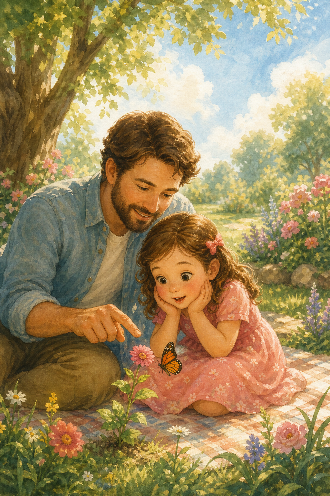

## Глава 1. Ты — Божье чудо

*(Папа показывает на дочку)*

Посмотри на свои маленькие ручки. Посмотри на свои ножки. Знаешь ли ты, кто их придумал?
Бог! Он великий Творец. Он создал огромное солнце, пушистые облака, высоких жирафов и маленьких бабочек. Но самое Его прекрасное творение — это ТЫ.

Когда Бог создавал тебя, Он улыбался. Он выбрал цвет твоих глаз, форму твоего носика и твой звонкий смех. В целом мире, на всей огромной планете, нет больше такой девочки, как ты. Ты — Его драгоценность.

**📖 Стих из Библии:**
13. Ибо Ты устроил внутренности мои и соткал меня во чреве матери моей. 14. Славлю Тебя, потому что я дивно устроен. Дивны дела Твои, и душа моя вполне сознает это.
Псалом 138:13-14 (Синодальный перевод)

**🗣 Поговорим:**
*Папа:* Как ты думаешь, что Богу больше всего нравится в тебе? Твоя улыбка? Твои добрые глазки?
*(Дать дочке ответить)*

**🙏 Наша молитва:**
«Дорогой Бог, спасибо Тебе за то, что Ты создал меня такой особенной. Спасибо за мои глазки, ручки и за то, что Ты меня очень любишь. Аминь.»

---

## Глава 2. Бог любит тебя всегда

*(Папа говорит мягко и уверенно)*

Божья любовь не заканчивается, когда ты капризничаешь. Не уменьшается, когда ты ошиблась. Не покупается «хорошим поведением», как конфетка в магазине.

Бог любит тебя утром и вечером, в садике и дома, когда весело и когда грустно. Как я люблю тебя даже в трудный день — только Его любовь ещё сильнее и совершеннее.
Ты никогда не бываешь «лишней» для Бога. Никогда.

**📖 Стих из Библии:**
3. Издали явился мне Господь и сказал: любовью вечною Я возлюбил тебя и потому простер к тебе благоволение.
Иеремия 31:3 (Синодальный перевод)

**🗣 Поговорим:**
*Папа:* Когда тебе особенно нужно вспомнить, что Бог тебя любит?
*(Дать дочке ответить)*

**🙏 Наша молитва:**
«Бог, спасибо, что Ты любишь меня всегда — даже когда мне трудно. Помоги мне чувствовать Твою любовь каждый день. Аминь.»

---

## Глава 3. Библия — письмо от Бога

*(Папа показывает Библию или детскую Библию с картинками)*

Представь: тебе пришло письмо от самого главного Царя! Только это письмо — особенное. Оно называется **Библия**.

В Библии Бог рассказывает, кто Он такой, как Он спасает людей и как жить мудро и радостно. Мы читаем её не чтобы «набрать баллов», а чтобы узнать Его сердце.

Детская Библия с картинками — тоже настоящая помощь. Через истории Бог говорит даже самым маленьким. Это письмо — для нашей семьи.

**📖 Стих из Библии:**
16. Все Писание богодухновенно и полезно для научения, для обличения, для исправления, для наставления в праведности, 17. да будет совершен Божий человек, ко всякому доброму делу приготовлен.
2 Тимофею 3:16-17 (Синодальный перевод)

**🗣 Поговорим:**
*Папа:* Какая библейская история тебе больше всего нравится?
*(Дать дочке ответить)*

**🙏 Наша молитва:**
«Господь, спасибо за Твою книгу. Научи нас любить Библию и понимать Твои слова. Аминь.»

---

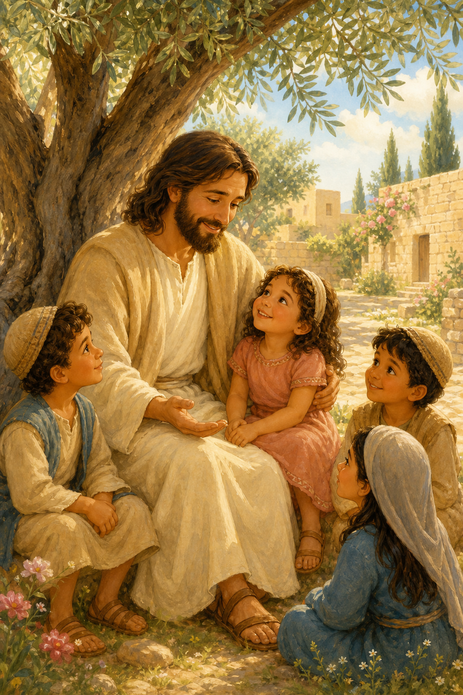

## Глава 4. Иисус — Друг и Спаситель

*(Папа говорит с теплом)*

Иисус — Сын Божий. Он пришёл на землю, жил среди людей, исцелял больных, учил добру и обнимал детей. Он — твой лучший Друг.

Иногда мы делаем плохое: обижаем, врём, жадничаем. Это называется **грех** — когда мы идём мимо добра. Но Иисус умер на кресте и воскрес, чтобы простить нас и вернуть к Богу.

С Иисусом можно говорить обо всём. Он не смеётся над твоими слезами. Он рядом.

**📖 Стих из Библии:**
12. Сия есть заповедь Моя, да любите друг друга, как Я возлюбил вас. 13. Нет больше той любви, как если кто положит душу свою за друзей своих.
Иоанна 15:12-13 (Синодальный перевод)

**🗣 Поговорим:**
*Папа:* Как ты думаешь, Иисус рад, когда ты приходишь к Нему?
*(Дать дочке ответить)*

**🙏 Наша молитва:**
«Иисус, спасибо, что Ты мой Друг и Спаситель. Спасибо, что Ты прощаешь и любишь меня. Аминь.»

---

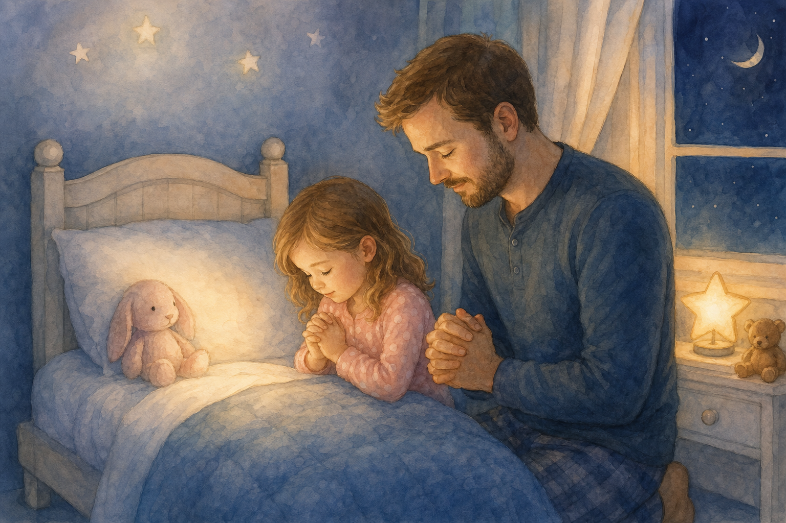

## Глава 5. Как разговаривать с Невидимым Царём?

*(Папа улыбается)*

Иногда мы думаем: «Если Бог на Небесах, как же Он меня услышит? У меня ведь нет такого длинного телефона!»
Но Богу не нужен телефон. Он слышит даже то, о чём ты думаешь про себя. Разговор с Богом называется **молитвой**.

Ты можешь разговаривать с Ним где угодно: когда играешь в игрушки, когда идёшь по улице за ручку со мной, и, конечно, вечером перед сном. Ему можно сказать: «Спасибо», «Прости», «Помоги», «Благослови маму и папу».

Молитва не обязана быть длинной. Бог слышит и шёпот, и два слова «Иисус, помоги», и честное «я отвлеклась, но снова здесь». Иногда ответ приходит не сразу, но Бог всё равно внимательно слушает, потому что ты — Его любимая дочка.

**📖 Стих из Библии:**
6. Не заботьтесь ни о чем, но всегда в молитве и прошении с благодарением открывайте свои желания пред Богом, 7. и мир Божий, который превыше всякого ума, соблюдет сердца ваши и помышления ваши во Христе Иисусе.
Филиппийцам 4:6-7 (Синодальный перевод)

**🗣 Поговорим:**
*Папа:* О чём бы ты хотела рассказать Богу прямо сейчас?
*(Дать дочке ответить)*

**🙏 Наша молитва:**
«Господь, спасибо, что Ты всегда рядом. Спасибо, что я могу рассказывать Тебе всё-всё на свете, и Ты всегда меня слышишь. Аминь.»

---

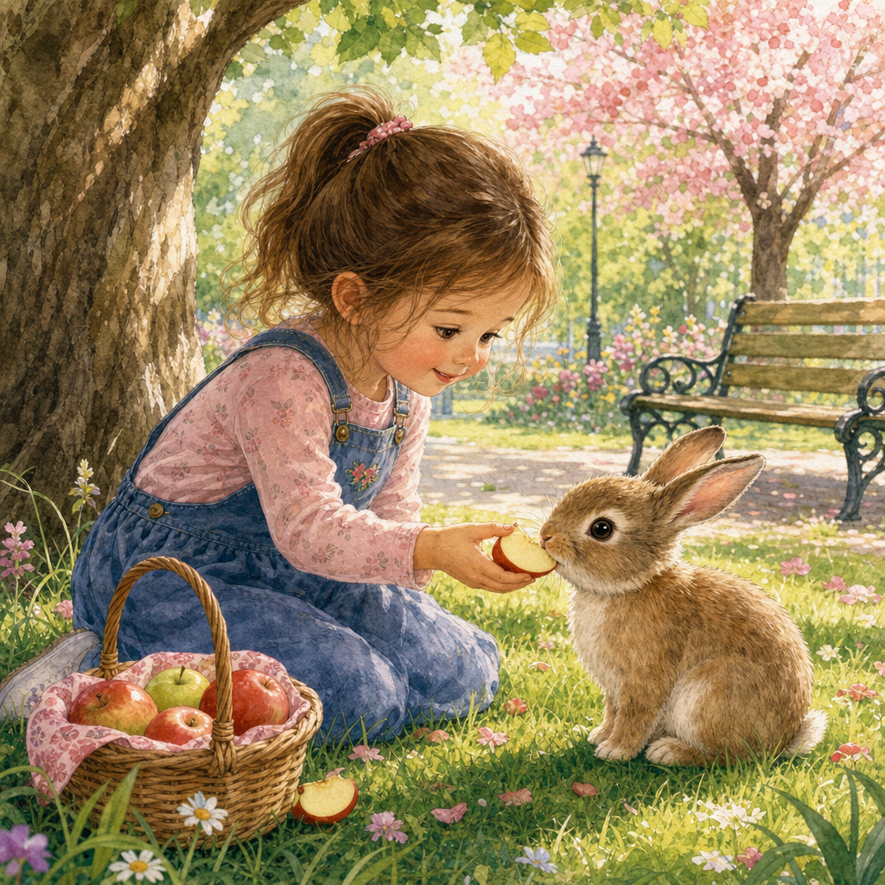

## Глава 6. Что значит быть христианином?

*(Папа объясняет просто)*

Христианин — это человек, который доверяет Иисусу и учится жить, как Он учит: любить Бога и людей.

Это не только «ходить в здание по воскресеньям». Это доброта дома, честность в игре, прощение после ссоры, забота о том, кому трудно.

Ты уже можешь быть маленькой последовательницей Иисуса — своими шажками, своей улыбкой, своим «спасибо» и «прости».

**📖 Стих из Библии:**
12. А тем, которые приняли Его, верующим во имя Его, дал власть быть чадами Божиими, 13. которые ни от крови, ни от хотения плоти, ни от хотения мужа, но от Бога родились.
Иоанна 1:12-13 (Синодальный перевод)

**🗣 Поговорим:**
*Папа:* Какой добрый поступок ты можешь сделать завтра?
*(Дать дочке ответить)*

**🙏 Наша молитва:**
«Иисус, научи меня быть Твоей девочкой каждый день — дома, в садике и в игре. Аминь.»

---

## Глава 7. Церковь — большая Божья семья

*(Папа вспоминает воскресное утро)*

Церковь — это не стены и не стулья. Это люди, которые любят Иисуса. Мы вместе молимся, поём, учимся и поддерживаем друг друга.

В церкви есть место и для маленьких: слушать историю, рисовать, петь, обнимать друзей по вере. Ты нужна в Божьей семье. Там тебя любят не за оценки — а потому что ты Божья дочка.

**📖 Стих из Библии:**
24. Будем внимательны друг ко другу, поощряя к любви и добрым делам; 25. не будем оставлять собрания своего, как есть у некоторых обычай; но будем увещевать друг друга, и тем более, чем более усматриваете приближение дня оного.
Евреям 10:24-25 (Синодальный перевод)

**🗣 Поговорим:**
*Папа:* Что тебе нравится в церкви больше всего?
*(Дать дочке ответить)*

**🙏 Наша молитва:**
«Господь, спасибо за Твою церковь. Помоги мне радоваться Божьей семье и быть доброй к людям. Аминь.»

---

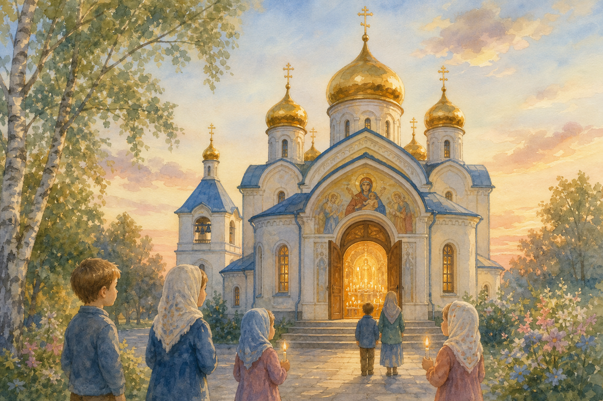

## Глава 8. Православный храм

*(Папа говорит уважительно)*

Иногда мы видим красивый храм с куполами, свечами и тихим пением. Это православный храм. Люди приходят туда молиться Богу, стоят благоговейно, иногда зажигают свечи.

Если мы зайдём в гости в такой дом молитвы — говорим тихо, не бегаем, уважаем чужой праздник. Христиане могут молиться по-разному. Но Иисус один. И любовь к Богу важнее внешней формы.

Мы радуемся, когда люди ищут Бога искренне.

**📖 Стих из Библии:**
23. Но настанет время и настало уже, когда истинные поклонники будут поклоняться Отцу в духе и истине, ибо таких поклонников Отец ищет Себе. 24. Бог есть дух, и поклоняющиеся Ему должны поклоняться в духе и истине.
Иоанна 4:23-24 (Синодальный перевод)

**🗣 Поговорим:**
*Папа:* Почему важно вести себя тихо и уважительно в чужом доме молитвы?
*(Дать дочке ответить)*

**🙏 Наша молитва:**
«Господь Иисус, научи нас уважать тех, кто ищет Тебя, даже если их богослужение выглядит иначе. Аминь.»

---

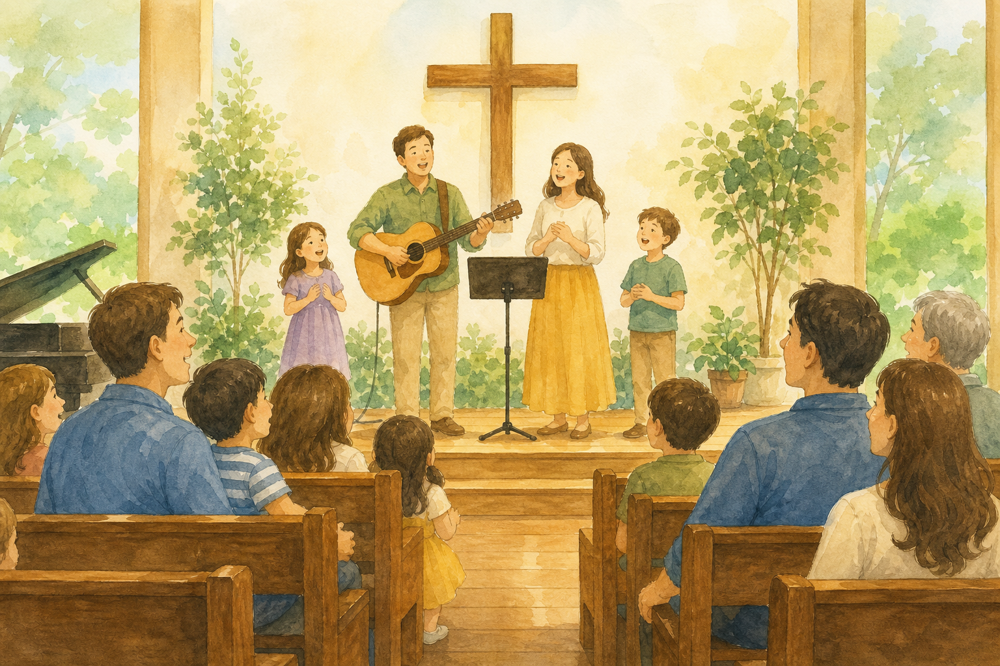

## Глава 9. Наша протестантская дорога

*(Папа про нашу церковь)*

Мы с тобой идём по протестантской христианской дороге. Часто у нас простое собрание: песни, проповедь из Библии, молитва своими словами, тёплое общение.

Мы особенно ценим Библию как главный ориентир, личную веру в Иисуса и жизнь церкви как семьи. Мы не «против» других христиан. Мы в первую очередь христиане — и рады всякой искренней любви ко Христу.

**📖 Стих из Библии:**
42. И они постоянно пребывали в учении Апостолов, в общении и преломлении хлеба и в молитвах.
Деяния 2:42 (Синодальный перевод)

**🗣 Поговорим:**
*Папа:* Что ты замечаешь в нашем собрании: песни, истории, друзей?
*(Дать дочке ответить)*

**🙏 Наша молитва:**
«Иисус, спасибо за нашу церковь. Помоги нам любить Тебя, Библию и людей. Аминь.»

---

## Глава 10. Рай, надежда и Добрый Пастырь

*(Папа говорит спокойно, без страшилок)*

**Рай** — это быть с Богом в вечной радости, где нет боли и зла.
Иногда взрослые говорят и про **ад** — жизнь без Бога, без Его света. Мы не пугаем тебя страшными картинками. Мы говорим о **надежде**.

Иисус — Добрый Пастырь. Он зовёт нас к Себе. Бог хочет, чтобы люди были с Ним. Если тебе вдруг станет тревожно — держись за руку Иисуса в молитве. Он ведёт к свету.

**📖 Стих из Библии:**
3. И услышал я громкий голос с неба, говорящий: се, скиния Бога с человеками, и Он будет обитать с ними; они будут Его народом, и Сам Бог с ними будет Богом их. 4. И отрет Бог всякую слезу с очей их, и смерти не будет уже; ни плача, ни вопля, ни болезни уже не будет, ибо прежнее прошло.
Откровение 21:3-4 (Синодальный перевод)

**🗣 Поговорим:**
*Папа:* Что тебе помогает, когда немного тревожно?
*(Дать дочке ответить)*

**🙏 Наша молитва:**
«Иисус, Ты мой Добрый Пастырь. Веди меня к Своему свету и наполни сердце надеждой. Аминь.»

---

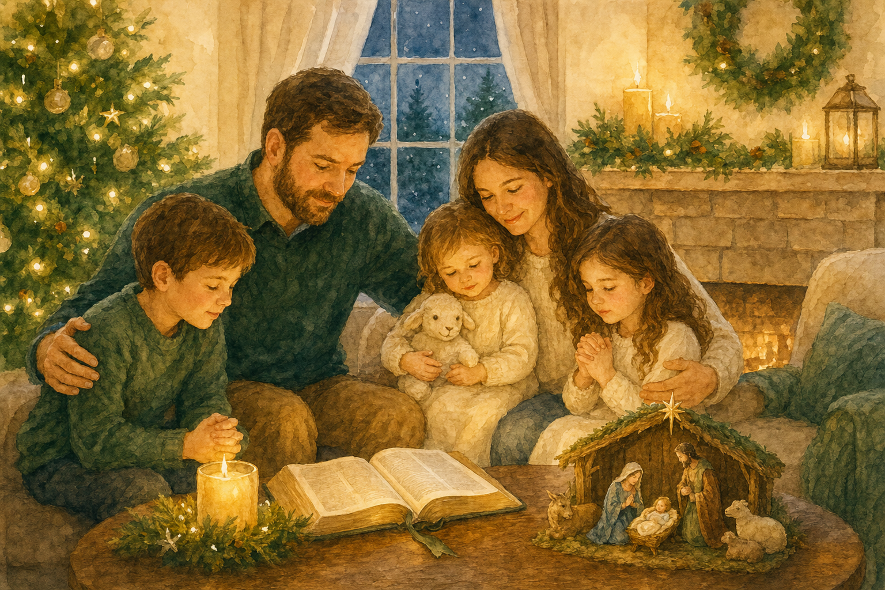

## Глава 11. Праздники веры

*(Папа вспоминает Рождество и Пасху)*

**Рождество** — мы радуемся: Иисус родился! Бог дал миру самый лучший подарок.
**Пасха** — мы радуемся ещё сильнее: Иисус воскрес! Смерть и зло не победили Его.

Праздник — не только торт и красивое платье. Это благодарность Богу и добро к людям: открытка бабушке, угощение, песня вместе, тёплое «я тебя люблю».

**📖 Стих из Библии:**
3. Ибо я первоначально преподал вам, что и сам принял, то есть, что Христос умер за грехи наши, по Писанию, 4. и что Он погребен был, и что воскрес в третий день, по Писанию,
1 Коринфянам 15:3-4 (Синодальный перевод)

**🗣 Поговорим:**
*Папа:* Какой праздник тебе больше всего нравится и почему?
*(Дать дочке ответить)*

**🙏 Наша молитва:**
«Господь, спасибо за Рождество и Пасху. Научи нас радоваться Тебе и делиться радостью. Аминь.»

---

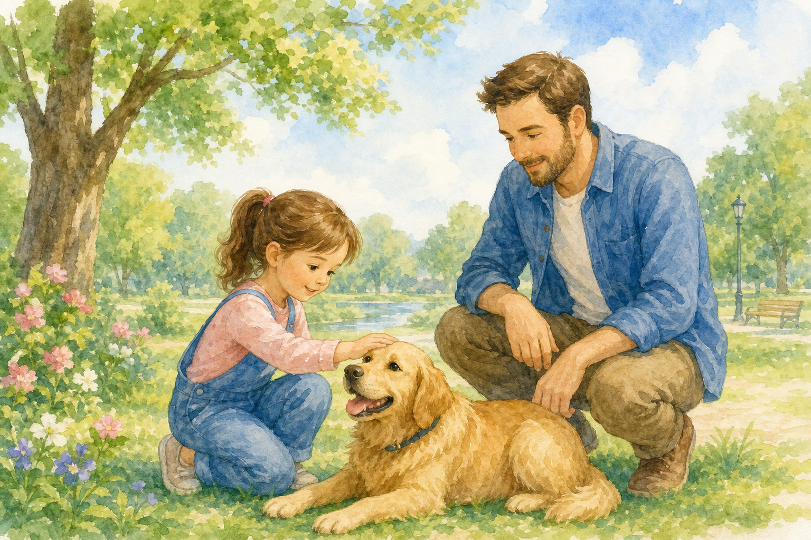

## Глава 12. Мир, который Бог нам доверил

*(Папа и дочка смотрят в окно воображением)*

Бог создал красивый мир и попросил людей о нём заботиться. Не мусорить, беречь воду, быть добрыми к животным, помогать людям.

Маленькая девочка тоже может: убрать фантик, полить цветок, накормить кошку, сказать «спасибо» за еду. Животных любим мудро: не мучаем, не тянем за хвост и не лезем к незнакомой собаке без взрослого. Это тоже служение Богу — руками и глазами, которые замечают красоту.

**📖 Стих из Библии:**
1. Господня - земля и что наполняет ее, вселенная и все живущее в ней, 2. ибо Он основал ее на морях и на реках утвердил ее.
Псалом 23:1-2 (Синодальный перевод)

**🗣 Поговорим:**
*Папа:* Какую одну заботу о мире ты возьмёшь на этой неделе?
*(Дать дочке ответить)*

**🙏 Наша молитва:**
«Творец, спасибо за Твой прекрасный мир. Научи меня беречь его с любовью. Аминь.»

---

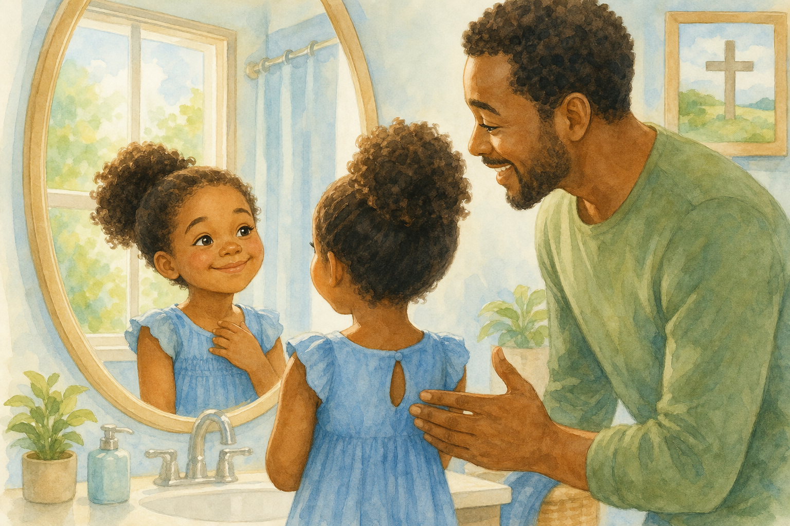

## Глава 13. Твоё тело — Божий подарок

*(Папа говорит бережно)*

У тебя есть глаза, чтобы видеть добро. Уши — чтобы слышать. Ноги — чтобы бегать. Руки — чтобы обнимать и помогать. Животик — чтобы чувствовать сытость. Сердце — чтобы любить.

Тело ценно. Мы бережём его: едим, спим, двигаемся, моем, лечимся, когда нужно. Бережём глазки и ушки, сидим ровно, гуляем, пьём воду и говорим взрослым, если что-то болит. Никто не имеет права стыдить твоё тело. Бог не ошибся, когда создавал тебя.

**📖 Стих из Библии:**
19. Не знаете ли, что тела ваши суть храм живущего в вас Святаго Духа, Которого имеете вы от Бога, и вы не свои? 20. Ибо вы куплены дорогою ценою. Посему прославляйте Бога и в телах ваших и в душах ваших, которые суть Божии.
1 Коринфянам 6:19-20 (Синодальный перевод)

**🗣 Поговорим:**
*Папа:* Что тебе особенно нравится в своём теле — что оно умеет делать?
*(Дать дочке ответить)*

**🙏 Наша молитва:**
«Бог, спасибо за моё тело. Помоги мне беречь его и радоваться Твоему дару. Аминь.»

---

## Глава 14. Чистим зубки — как маленькие солдаты

*(Папа изображает весёлую чистку)*

Утром и вечером наши зубки идут «на службу»! Мы чистим их около двух минут. Можно петь песенку или смотреть песочные часы.

Зачем? Чтобы зубки были сильными, дыхание свежим, а улыбка радостной. Это не наказание — это забота о Божьем подарке. Если иногда лень — я рядом. Вместе легче!

**📖 Стих из Библии:**
31. Итак, едите ли, пьете ли, или иное что делаете, все делайте в славу Божию.
1 Коринфянам 10:31 (Синодальный перевод)

**🗣 Поговорим:**
*Папа:* Какую песенку мы можем петь, пока чистим зубки?
*(Дать дочке ответить или вместе придумать)*

**🙏 Наша молитва:**
«Господь, спасибо за мои зубки. Научи меня заботиться о них с радостью. Аминь.»

---

## Глава 15. Волосы: нежность и порядок

*(Папа аккуратно касается волос дочки, если ей комфортно)*

Волосы расчёсываем аккуратно, моем, когда нужно, не тянем сильно. Если запутались — просим помощи, не рвём.

Чистые волосы — про заботу, а не про «быть самой красивой в группе». Бог смотрит на сердце — и одновременно радуется, когда мы бережём себя.

**📖 Стих из Библии:**
31. Итак, едите ли, пьете ли, или иное что делаете, все делайте в славу Божию.
1 Коринфянам 10:31 (Синодальный перевод)

**🗣 Поговорим:**
*Папа:* Кто обычно помогает тебе с волосами — и чем я могу помочь?
*(Дать дочке ответить)*

**🙏 Наша молитва:**
«Бог, спасибо за заботу близких. Научи меня быть аккуратной и терпеливой. Аминь.»

---

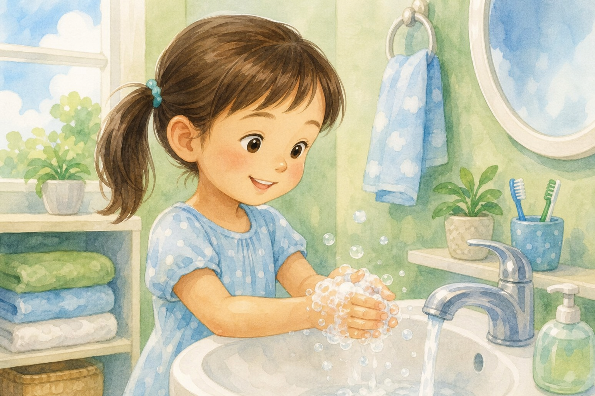

## Глава 16. Ногти и чистые ручки

*(Папа показывает свои руки и руки дочки)*

Ногти коротко и чисто — так меньше микробов. Руки моем: после улицы, туалета, перед едой. И туалетные привычки — не повод для стыда, а обычная забота о теле: попросить бумагу, смыть, помыть руки, сказать взрослому, если нужна помощь.

Это простое «служение» своему телу. Ты уже почти большая — можешь делать это почти сама. Я только напомню с любовью: «Мыло, вода — и ручки как новые!»

**📖 Стих из Библии:**
31. Итак, едите ли, пьете ли, или иное что делаете, все делайте в славу Божию.
1 Коринфянам 10:31 (Синодальный перевод)

**🗣 Поговорим:**
*Папа:* Когда важно мыть руки? Давай вспомним вместе три раза.
*(Дать дочке ответить)*

**🙏 Наша молитва:**
«Господь, помоги мне помнить о чистоте и беречь здоровье. Аминь.»

---

## Глава 17. Как стоит одеваться

*(Папа помогает выбрать наряд словами)*

Одеваемся по погоде: холодно или тепло. По месту: площадка, садик, церковь, праздник. Чисто и удобно.

Одежда помогает уважать себя и других. Не обязательно «самая модная». Важны скромность, аккуратность и радость. Ты прекрасна и в простом платьице — если сердце светлое.

**📖 Стих из Библии:**
30. Миловидность обманчива и красота суетна; но жена, боящаяся Господа, достойна хвалы.
Притчи 31:30 (Синодальный перевод)

**🗣 Поговорим:**
*Папа:* Что надеть в церковь? А на площадку?
*(Дать дочке ответить)*

**🙏 Наша молитва:**
«Господь, научи меня одеваться мудро и с уважением к себе и людям. Аминь.»

---

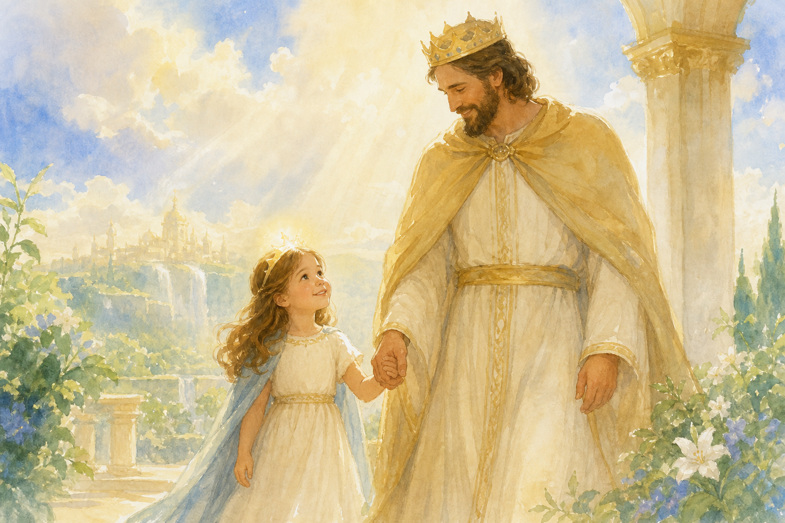

## Глава 18. Настоящая красота: дочь Царя

*(Папа смотрит дочке в глаза)*

Настоящая красота — доброта, чистота сердца, смелость сказать правду, умение пожалеть. Внешность тоже дар — но она не главный экзамен жизни. Ты не просто «красивая девочка» и не кукла для оценки. Ты — любимая дочь Небесного Царя.

Твой голос, твои вопросы, твой смех, твоя улыбка — не ошибка. Можно быть милой и умной, нежной и смелой одновременно. Вот это — сияние.

**📖 Стих из Библии:**
30. Миловидность обманчива и красота суетна; но жена, боящаяся Господа, достойна хвалы.
Притчи 31:30 (Синодальный перевод)

**🗣 Поговорим:**
*Папа:* Кого ты считаешь красивым человеком — и почему?
*(Дать дочке ответить)*

**🙏 Наша молитва:**
«Иисус, сделай моё сердце красивым — добрым, честным и светлым. Аминь.»

---

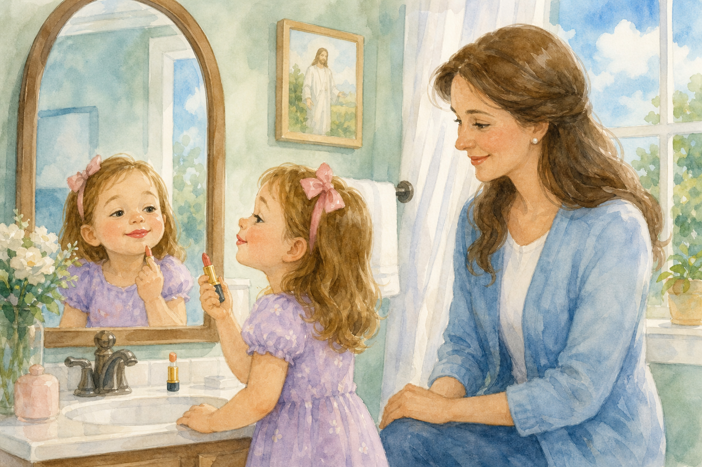

## Глава 19. Косметика: всё в своё время

*(Папа объясняет спокойно)*

Косметика — в основном для взрослых. Сейчас твоя кожа прекрасна сама. Иногда можно поиграть «в праздник» с разрешения родителей — и смыть.

Мы не делаем из косметики «секрет» и не стыдим. Просто говорим: всё в своё время. Сейчас важнее сон, улыбка, чистые ручки и доброе сердце.

**📖 Стих из Библии:**
30. Миловидность обманчива и красота суетна; но жена, боящаяся Господа, достойна хвалы.
Притчи 31:30 (Синодальный перевод)

**🗣 Поговорим:**
*Папа:* Что делает тебя красивой без всякой косметики?
*(Дать дочке ответить)*

**🙏 Наша молитва:**
«Бог, спасибо, что я прекрасна такой, какая есть. Научи меня ждать своего времени. Аминь.»

---

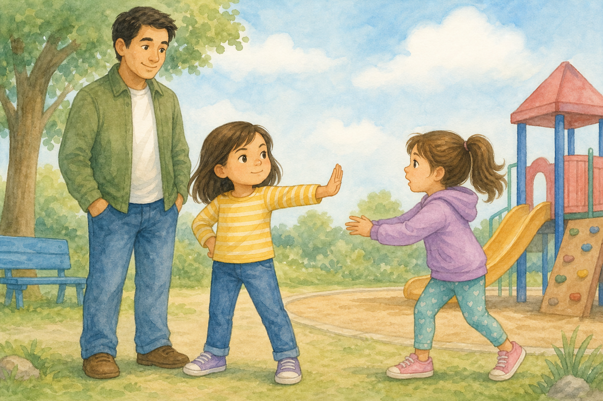

## Глава 20. Правило купальника

*(Папа говорит очень спокойно и серьёзно, без страха)*

Места под купальником — **личные**. Никто не должен их трогать, фотографировать или просить показать — ни чужой взрослый, ни другой ребёнок.

Если неприятно или страшно:
1. Громко скажи **«Нет!»**
2. **Уйди**
3. Сразу **расскажи** маме, папе или другому безопасному взрослому.

Ты не виновата, если кто-то ведёт себя плохо. Я и мама всегда на твоей стороне. Это правило — как ремень безопасности: чтобы ты была в безопасности.

Есть ещё правило секретов: добрый секрет скоро становится радостным сюрпризом, а опасный секрет нельзя хранить от мамы и папы. И если кто-то просит открыть дверь, обняться через силу или «никому не говорить» о неприятном — сразу иди к своим взрослым.

**📖 Стих из Библии:**
19. Не знаете ли, что тела ваши суть храм живущего в вас Святаго Духа, Которого имеете вы от Бога, и вы не свои? 20. Ибо вы куплены дорогою ценою. Посему прославляйте Бога и в телах ваших и в душах ваших, которые суть Божии.
1 Коринфянам 6:19-20 (Синодальный перевод)

**🗣 Поговорим:**
*Папа:* Кому из взрослых ты можешь рассказать, если станет неприятно?
*(Дать дочке ответить; папа называет 2–3 безопасных взрослых)*

**🙏 Наша молитва:**
«Господь, храни моё тело. Дай мне смелость сказать «нет» и сразу рассказать своим. Аминь.»

---

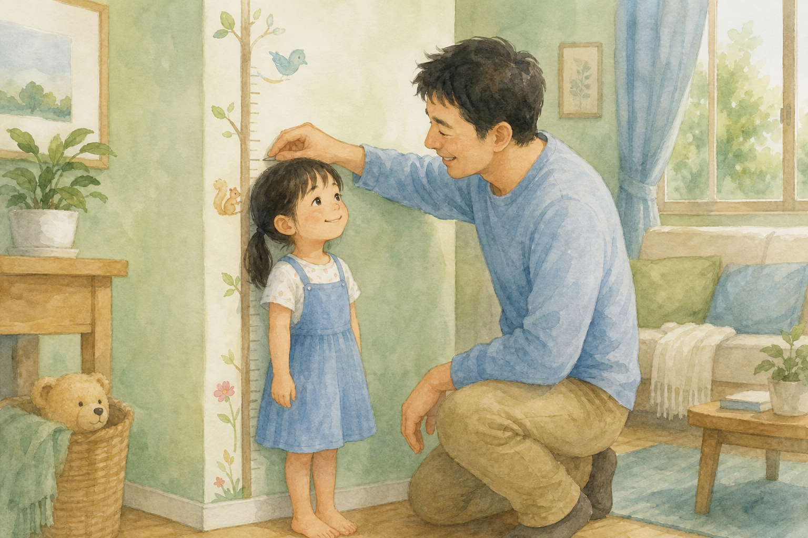

## Глава 21. Ты растёшь — и это хорошо

*(Папа показывает, как дочка выросла)*

Сейчас важно знать только это: ты растёшь. Тело будет меняться по возрасту — это нормально и хорошо. Подробности про «взрослые изменения» будут позже, спокойно, без стыда, когда придёт время.

Если увидишь что-то непонятное или услышишь от детей странное — **сразу спроси меня или маму**. Лучше спросить у своих, чем гадать. И не надо торопить взрослость: у пяти лет тоже есть свои подарки — игры, вопросы, объятия и радость быть маленькой сегодня.

**📖 Стих из Библии:**
51. И Он пошел с ними и пришел в Назарет; и был в повиновении у них. И Матерь Его сохраняла все слова сии в сердце Своем. 52. Иисус же преуспевал в премудрости и возрасте и в любви у Бога и человеков.
Луки 2:51-52 (Синодальный перевод)

**🗣 Поговорим:**
*Папа:* Чему ты уже научилась за этот год, чего раньше не умела?
*(Дать дочке ответить)*

**🙏 Наша молитва:**
«Бог, спасибо, что я расту. Помоги мне расти мудро и без страха. Аминь.»

---

## Глава 22. Как появляются детки

*(Папа говорит честно и тепло, по-детски)*

Бог дарит жизнь. У мамы в животике есть особое место — там малыш растёт, пока не родится. Мама и папа любят друг друга особой супружеской любовью; в браке эта любовь участвует в появлении детей — и это свято и хорошо.

Сейчас достаточно знать: ребёнка **ждут, любят и берегут**. Если будут новые вопросы — спрашивай. Мы ответим правду по возрасту, без стыда.

**📖 Стих из Библии:**
3. Вот наследие от Господа: дети; награда от Него - плод чрева.
Псалом 126:3 (Синодальный перевод)

**🗣 Поговорим:**
*Папа:* Что нужно маленькому малышу, когда он появляется?
*(Дать дочке ответить)*

**🙏 Наша молитва:**
«Бог, спасибо за дар жизни. Научи нашу семью беречь и любить друг друга. Аминь.»

---

## Глава 23. Мама

*(Папа говорит с благодарностью о маме)*

Мама заботится, учит, иногда устаёт, часто молится за тебя сердцем. Уважение к маме — это слушаться, говорить ласково, помогать, говорить «спасибо» и «я люблю тебя».

Если мама попросила — это не «вредность», а забота или порядок в доме. Хочешь сделать сюрприз? Рисунок или помощь без просьбы — настоящее сокровище.

**📖 Стих из Библии:**
28. Встают дети и ублажают ее, - муж, и хвалит ее:
Притчи 31:28 (Синодальный перевод)

**🗣 Поговорим:**
*Папа:* Что доброе мы можем сделать для мамы завтра?
*(Дать дочке ответить)*

**🙏 Наша молитва:**
«Господь, благослови мою маму. Научи меня любить её словами и делами. Аминь.»

---

## Глава 24. Папина любовь

*(Папа обнимает дочку)*

Я твой земной папа, и я люблю тебя больше всего на свете. Я люблю с тобой играть, люблю носить тебя на руках, люблю смотреть, как ты спишь.

Если ты упадёшь и разобьёшь коленку — я подую, и всё пройдёт. Если тебе приснится страшный сон — я приду и обниму тебя. Я всегда буду тебя защищать.

Но знаешь что? Наш Небесный Отец любит тебя **ещё сильнее**! Мои руки сильные, но Его руки держат весь мир. Моя любовь большая, но Его любовь — бесконечная.

Запомни на всю жизнь, моя родная: что бы ни случилось — у тебя всегда есть два Папы, которые тебя безумно любят. Я — твой папа на земле, и Бог — твой Папа на Небесах.

**📖 Стих из Библии:**
13. Как отец милует сынов, так милует Господь боящихся Его.
Псалом 102:13 (Синодальный перевод)

**🗣 Поговорим:**
*Папа:* Давай обнимемся так крепко-крепко, как только можем! Чувствуешь, как я тебя люблю?
*(Крепко обнять дочку)*

**🙏 Наша молитва:**
«Небесный Отец, спасибо Тебе за моего земного папу. Спасибо, что мы есть друг у друга. Благослови нашу семью, чтобы в нашем доме всегда жила Твоя любовь. Аминь.»

---

## Глава 25. Мама и папа — команда

*(Папа объясняет спокойно)*

Мама и папа — команда. Мы несём ответственность перед Богом за твою безопасность и воспитание. Иногда мы советуемся без тебя — это нормально.

Если родители спорят — это **не твоя вина**. Взрослые тоже учатся мириться. Ты можешь помолиться: «Господи, дай маме и папе мир.» Твоя молитва важна.

**📖 Стих из Библии:**
1. Дети, повинуйтесь своим родителям в Господе, ибо сего требует справедливость. 2. Почитай отца твоего и мать, это первая заповедь с обетованием: 3. да будет тебе благо, и будешь долголетен на земле.
Ефесянам 6:1-3 (Синодальный перевод)

**🗣 Поговорим:**
*Папа:* Как ты думаешь, чем мама и папа помогают друг другу?
*(Дать дочке ответить)*

**🙏 Наша молитва:**
«Господь, дай нашей семье мир, уважение и умение мириться. Аминь.»

---

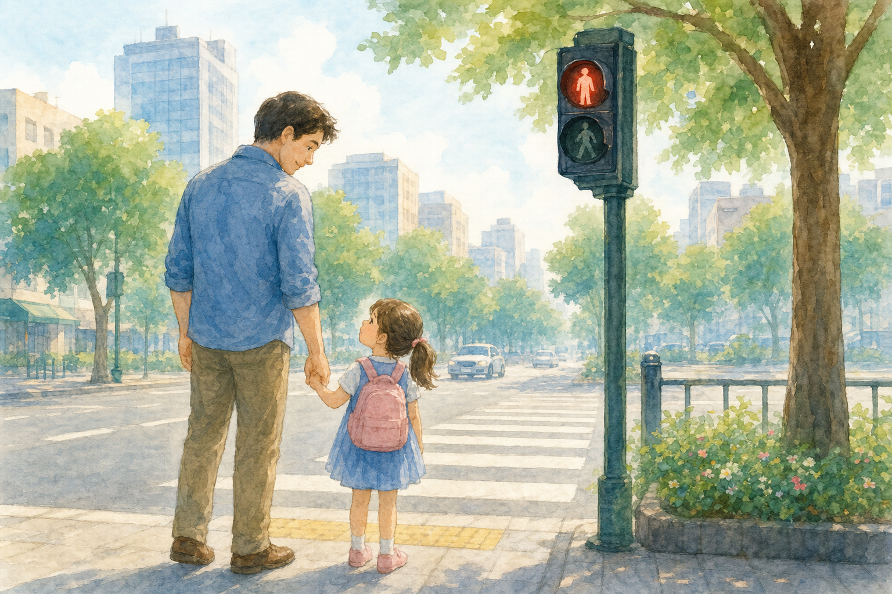

## Глава 26. Послушание — это доверие

*(Папа берёт дочку за руку)*

Послушание — не рабство и не страх. Это **доверие**: «Мои родители хотят мне добра».

Иногда «нельзя» у дороги спасает от боли. Иногда «сейчас» учит терпению. Послушание Богу и родителям растит мудрое сердце. Сильная девочка умеет остановиться, когда её зовут к безопасности.

**📖 Стих из Библии:**
1. Дети, повинуйтесь своим родителям в Господе, ибо сего требует справедливость. 2. Почитай отца твоего и мать, это первая заповедь с обетованием: 3. да будет тебе благо, и будешь долголетен на земле.
Ефесянам 6:1-3 (Синодальный перевод)

**🗣 Поговорим:**
*Папа:* Вспомни случай, когда послушание тебе помогло.
*(Дать дочке ответить)*

**🙏 Наша молитва:**
«Господь, научи меня слушаться с любовью и доверием. Аминь.»

---

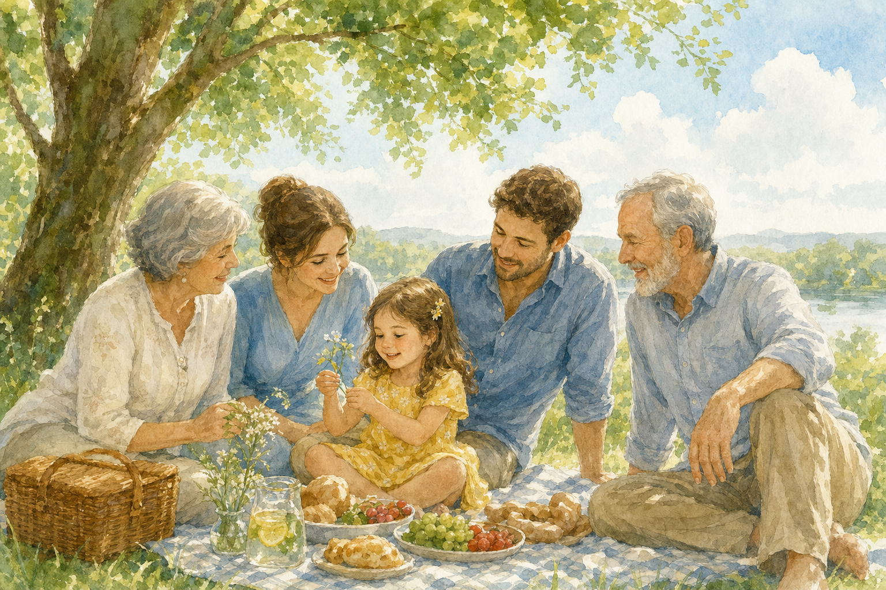

## Глава 27. Бабушки и дедушки

*(Папа вспоминает старших с теплом)*

Бабушки и дедушки — сокровище нашего рода. Они видели больше жизни. Часто молились за семью ещё до твоего рождения.

Мы говорим уважительно, обнимаем, слушаем истории, помогаем нести сумку, звоним «просто так». Их любовь — как тёплый плед.

**📖 Стих из Библии:**
6. Венец стариков - сыновья сыновей, и слава детей - родители их.
Притчи 17:6 (Синодальный перевод)

**🗣 Поговорим:**
*Папа:* Какая история бабушки или дедушки тебе больше всего нравится?
*(Дать дочке ответить)*

**🙏 Наша молитва:**
«Господь, благослови моих бабушек и дедушек. Научи меня уважать старших. Аминь.»

---

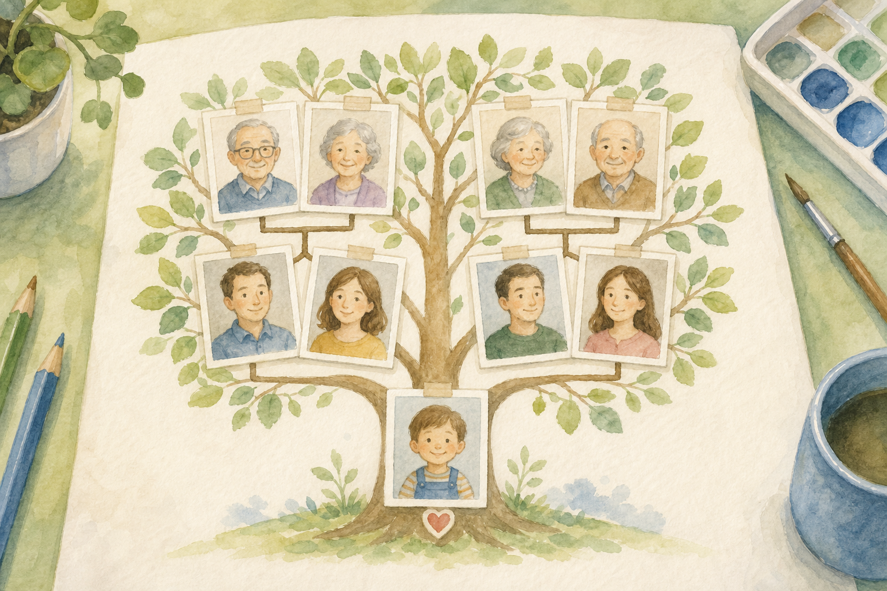

## Глава 28. Семья и род

*(Папа рисует пальцем дерево в воздухе)*

Ты — часть рода. Есть те, кого ты знаешь, и те, кого уже нет на земле. Мы благодарим Бога за добро, которое нам передали. Мы учимся не повторять плохое.

Семья — место, где учат любви, прощению, труду и вере. Ты не одна. Ты — веточка на большом дереве, которое поливает Бог.

**📖 Стих из Библии:**
12. Почитай отца твоего и мать твою, чтобы продлились дни твои на земле, которую Господь, Бог твой, дает тебе.
Исход 20:12 (Синодальный перевод)

**🗣 Поговорим:**
*Папа:* Давай назовём людей нашего «дерева»: ты, мама, папа… Кто ещё?
*(Вместе перечислить)*

**🙏 Наша молитва:**
«Бог, спасибо за наш род. Помоги нам передавать добро следующим. Аминь.»

---

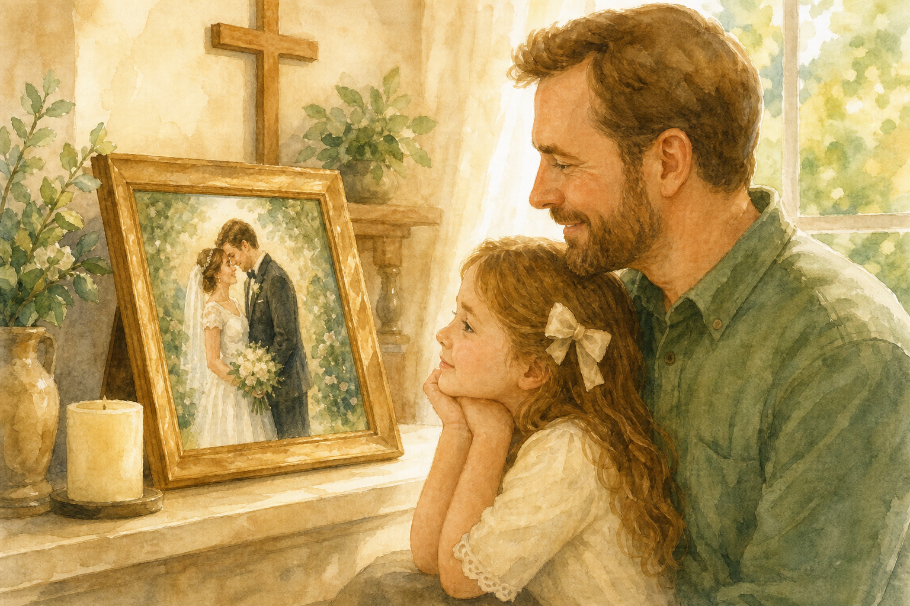

## Глава 29. Брак — красивый завет

*(Папа показывает или вспоминает свадебное фото)*

Брак — завет мужчины и женщины перед Богом: любить, быть верными, заботиться, прощать. Это не просто «игра в принцесс», а серьёзный и красивый путь.

В 5 лет мы не готовим свадьбу и не ищем жениха. Сейчас время детства, игры, дружбы и веры. Мы учим уважению, верности в мелочах и тому, что любовь — это дела, а не только слова. Я и мама учимся этому каждый день.

**📖 Стих из Библии:**
24. Потому оставит человек отца своего и мать свою и прилепится к жене своей; и будут одна плоть.
Бытие 2:24 (Синодальный перевод)

**🗣 Поговорим:**
*Папа:* Какие добрые дела показывают любовь в семье?
*(Дать дочке ответить)*

**🙏 Наша молитва:**
«Господь, благослови брак мамы и папы. Научи нашу семью верности и нежности. Аминь.»

---

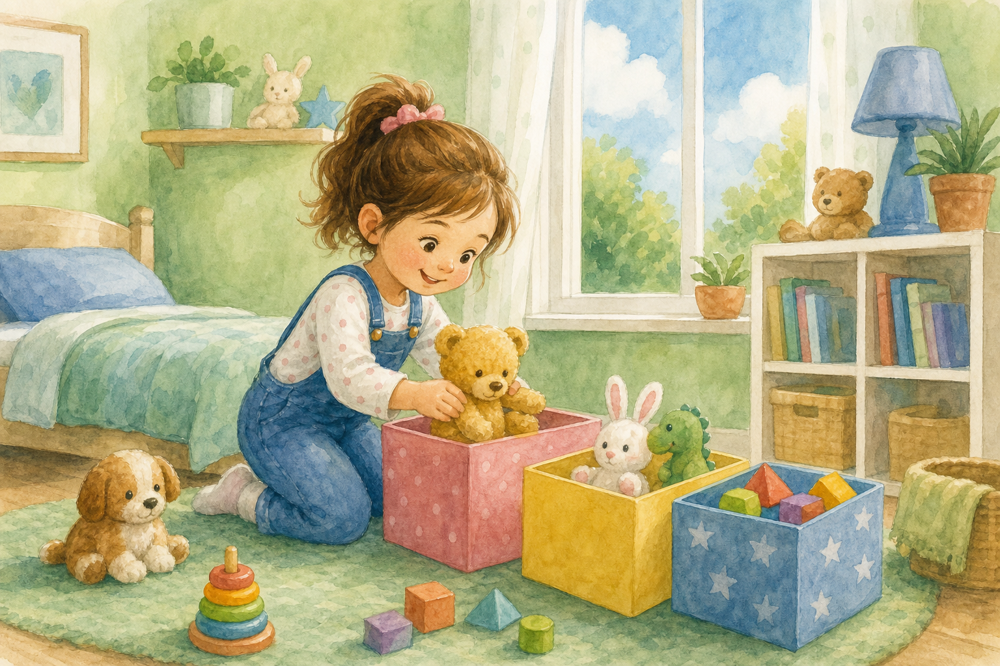

## Глава 30. Уборка — мир в доме

*(Папа предлагает игру)*

Уборка — забота о ближних. Когда вещи на месте, дома спокойнее, и мама с папой меньше устают.

Ты уже можешь: собрать игрушки, положить одежду в корзину, протереть стол, помочь заправить кровать, вернуть взятое на место. Аккуратность — не страх перед каждой крошкой, а спокойная забота. Хочешь игру? «Коробка за 3 минуты» — и мы команда!

**📖 Стих из Библии:**
23. И все, что делаете, делайте от души, как для Господа, а не для человеков, 24. зная, что в воздаяние от Господа получите наследие, ибо вы служите Господу Христу.
Колоссянам 3:23-24 (Синодальный перевод)

**🗣 Поговорим:**
*Папа:* Какую одну зону дома ты возьмёшь «под свою заботу»?
*(Дать дочке ответить)*

**🙏 Наша молитва:**
«Господь, научи меня трудиться с радостью и заботиться о нашем доме. Аминь.»

---

## Глава 31. Готовим вместе

*(Папа зовёт на кухню словами)*

Еда — Божий дар. Готовка учит благодарности и труду. В 5 лет безопасно можно: мыть овощи, рвать зелень, мешать тесто, сервировать стол, класть салфетки.

Нож, плита, кипяток — только со мной или с мамой. «Помощница на кухне» — почётное звание! Вместе вкуснее.

**📖 Стих из Библии:**
31. Итак, едите ли, пьете ли, или иное что делаете, все делайте в славу Божию.
1 Коринфянам 10:31 (Синодальный перевод)

**🗣 Поговорим:**
*Папа:* Какое блюдо хочешь научиться готовить вместе?
*(Дать дочке ответить)*

**🙏 Наша молитва:**
«Бог, спасибо за еду и за руки, которые готовят. Научи нас быть благодарными. Аминь.»

---

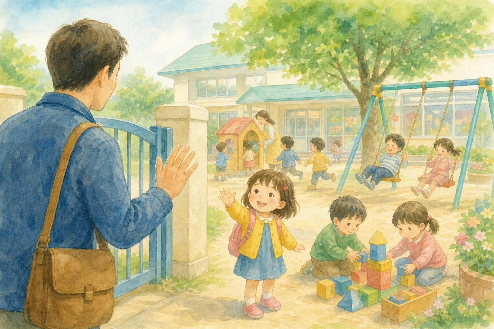

## Глава 32. Детский сад

*(Папа вспоминает утро у садика)*

В садике ты учишься жить среди людей: ждать очередь, просить игрушку словами, слушать воспитателя, дружить, мириться, иногда скучать по дому.

Скучать — нормально. Я и мама возвращаемся. Бог с тобой и в садике. Если трудно — скажи воспитателю и дома расскажи мне. Мы на твоей стороне.

**📖 Стих из Библии:**
8. Наконец, братия мои, что только истинно, что честно, что справедливо, что чисто, что любезно, что достославно, что только добродетель и похвала, о том помышляйте.
Филиппийцам 4:8 (Синодальный перевод)

**🗣 Поговорим:**
*Папа:* Что сегодня было самым хорошим в садике? А что трудным?
*(Дать дочке ответить)*

**🙏 Наша молитва:**
«Иисус, будь со мной в садике. Дай мне смелость, доброту и спокойствие. Аминь.»

---

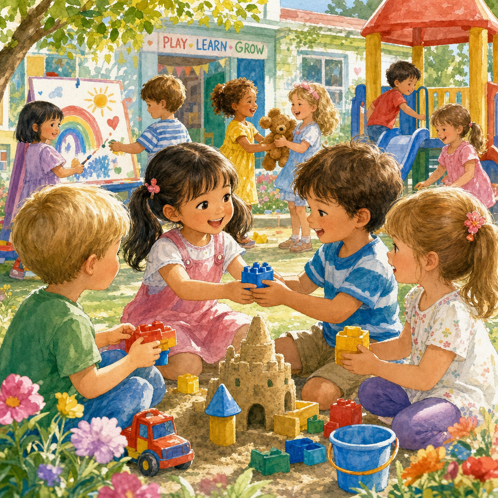

## Глава 33. Друзья и сверстники

*(Папа улыбается)*

Дружить — значит играть честно, делиться, не обзывать, радоваться чужой радости. Можно сказать: «Давай вместе?» или «Мне это неприятно».

Не обязательно дружить со всеми одинаково близко. Но ко всем — уважение. Иногда друг сегодня не хочет играть; иногда тихого ребёнка надо заметить первым; иногда кто-то ошибся, и над ним нельзя смеяться. Настоящий друг не тащит в плохое.

**📖 Стих из Библии:**
17. Друг любит во всякое время и, как брат, явится во время несчастья.
Притчи 17:17 (Синодальный перевод)

**🗣 Поговорим:**
*Папа:* Какое качество тебе нравится в настоящем друге?
*(Дать дочке ответить)*

**🙏 Наша молитва:**
«Господь, пошли мне добрых друзей и научи самой быть хорошей подругой. Аминь.»

---

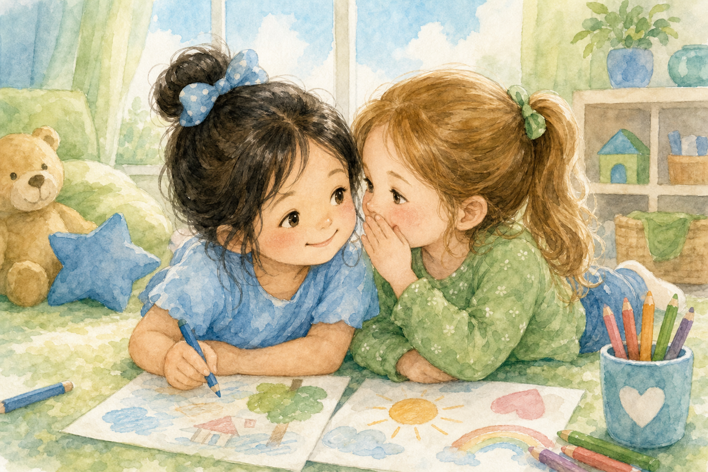

## Глава 34. Подруги

*(Папа говорит по-секрету тепло)*

Подруга — сокровище. С ней весело и спокойно. Хорошая подруга не учит плохому секрету «против мамы», не заставляет делать вредное.

Если подруга обидела — можно сказать о боли и простить. Если снова и снова причиняет зло — расскажи взрослым: иногда нужна помощь. Хорошая дружба не говорит: «только со мной и ни с кем больше». Ты имеешь право на безопасную дружбу.

**📖 Стих из Библии:**
17. Друг любит во всякое время и, как брат, явится во время несчастья.
Притчи 17:17 (Синодальный перевод)

**🗣 Поговорим:**
*Папа:* Что делает подругу настоящей подругой?
*(Дать дочке ответить)*

**🙏 Наша молитва:**
«Иисус, научи меня выбирать добрую дружбу и самой быть верной. Аминь.»

---

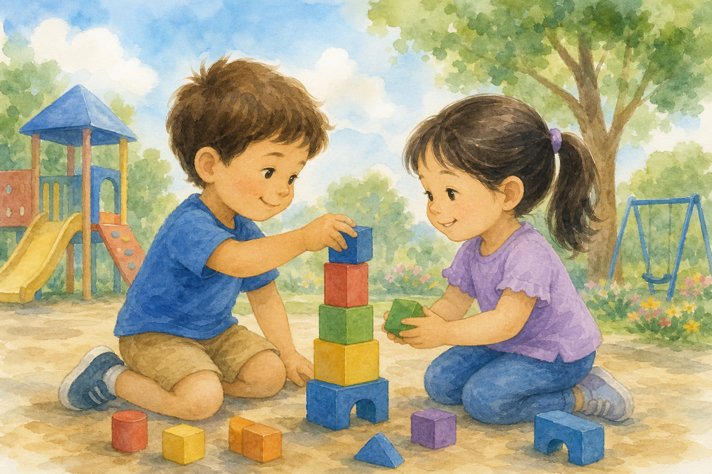

## Глава 35. Мальчики

*(Папа спокойно и ясно)*

Мальчики и девочки одинаково ценны перед Богом. Можно дружить, играть, учиться вместе.

Уважение и границы важны всегда: не бьём, не дразним, не лезем в личное. В 5 лет дружба — это дружба, без взрослых «романтических» игр. Просто добро и уважение.

**📖 Стих из Библии:**
17. Друг любит во всякое время и, как брат, явится во время несчастья.
Притчи 17:17 (Синодальный перевод)

**🗣 Поговорим:**
*Папа:* Как можно вежливо играть вместе с мальчиками?
*(Дать дочке ответить)*

**🙏 Наша молитва:**
«Бог, научи меня уважать и мальчиков, и девочек — всех Твоих детей. Аминь.»

---

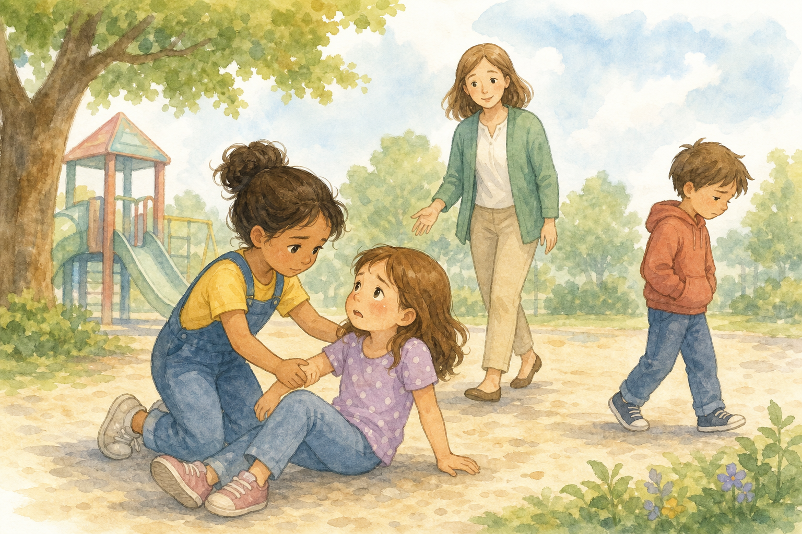

## Глава 36. Почему одни могут обижать

*(Папа говорит серьёзно, но без злости)*

Иногда ребёнок обижает, потому что не умеет словами сказать о злости, ревнует, сам был обижен, хочет власти в игре — или просто ещё учится быть человеком.

Это **не оправдание**. Плохой поступок остаётся плохим. Но понимание помогает не ненавидеть человека.

Что делать тебе:
1. Громко: «Так нельзя / мне больно!»
2. Отойти.
3. Позвать взрослого.
4. Не мстить ещё сильнее. Если опасно — защищаться и звать на помощь.

**📖 Стих из Библии:**
21. Не будь побежден злом, но побеждай зло добром.
Римлянам 12:21 (Синодальный перевод)

**🗣 Поговорим:**
*Папа:* Что ты сделаешь, если тебя толкнули или обозвали?
*(Дать дочке ответить)*

**🙏 Наша молитва:**
«Господь, дай мне смелость защищать себя словами и звать на помощь. Аминь.»

---

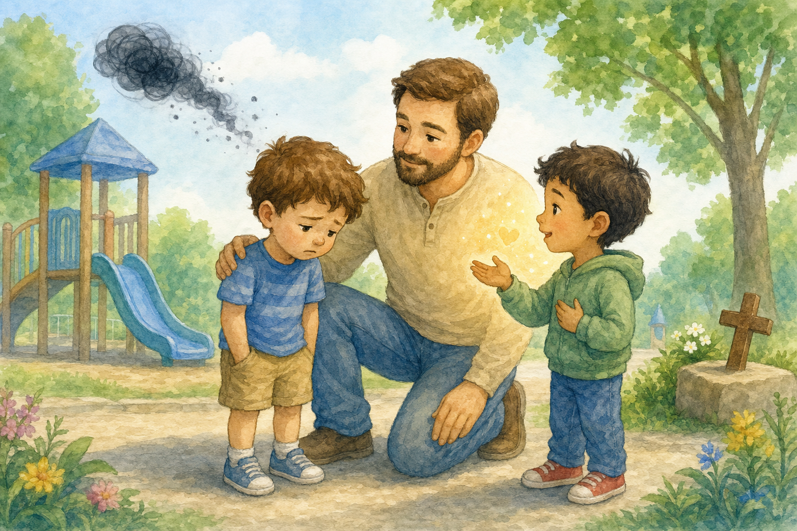

## Глава 37. Слова-колючки: брань и оскорбления

*(Папа говорит живо, как сказку)*

Представь: слова бывают как **подушечки** — мягкие, тёплые. А бывают как **колючки** — царапают сердце.

**Оскорбление** — когда специально говорят гадость, чтобы другому стало стыдно или страшно: обзывают, дразнят за имя, за внешность, за ошибку.

А **нецензурная брань** — это грязные слова, которые взрослые не говорят в семье, в церкви и в садике. Это как грязь с улицы: можно случайно наступить — но нельзя размазывать по дому и по людям.

Если услышала — не повторяй «на пробу». Скажи: «Так говорить не буду». Отойди. Расскажи мне. Если уже сказала — «Прости», и иди дальше с чистым сердцем.

Сильный человек умеет говорить ясно **без грязи**.

**📖 Стих из Библии:**
29. Никакое гнилое слово да не исходит из уст ваших, а только доброе для назидания в вере, дабы оно доставляло благодать слушающим.
Ефесянам 4:29 (Синодальный перевод)

**🗣 Поговорим:**
*Папа:* Какие слова делают тебе тепло? А какие колют?
*(Дать дочке ответить)*
*Игра:* назовите вместе пять «слов-подушечек» (спасибо, давай дружить, ты сможешь, прости, я с тобой).

**🙏 Наша молитва:**
«Господь Иисус, научи мой рот говорить доброе. Аминь.»

---

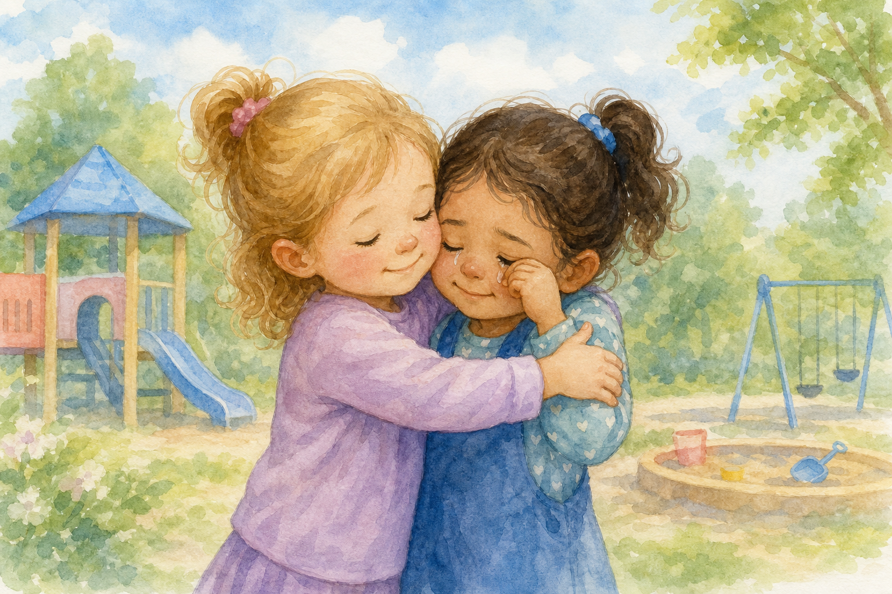

## Глава 38. Прощение

*(Папа говорит мягко)*

Прощение — отпустить желание мстить. Это не значит: «делай со мной что хочешь». Границы остаются. Если нужно — взрослые защищают.

Обида говорит: «Мне было больно». Её можно назвать словами, а не носить как камень. Если плохо поступила ты — честное «прости» лучше пряток и оправданий. Иисус учит прощать, потому что нас тоже прощают. Прощение освобождает сердце — как открытое окошко после духоты.

**📖 Стих из Библии:**
31. Всякое раздражение и ярость, и гнев, и крик, и злоречие со всякою злобою да будут удалены от вас; 32. но будьте друг ко другу добры, сострадательны, прощайте друг друга, как и Бог во Христе простил вас.
Ефесянам 4:31-32 (Синодальный перевод)

**🗣 Поговорим:**
*Папа:* Кому сегодня можно сказать доброе «прости» или принять чужое «прости»?
*(Дать дочке ответить)*

**🙏 Наша молитва:**
«Иисус, помоги мне прощать. И защити меня. Аминь.»

---

## Глава 39. Как вести себя в обществе

*(Папа идёт с дочкой в воображаемый автобус)*

В магазине, автобусе, поликлинике, гостях мы говорим «здравствуйте», «спасибо», «пожалуйста». Не орём без нужды. Не трогаем чужое. Ждём очередь. Не перебиваем. Уважаем тишину других. Помогаем, если можем.

Вежливость — практическая любовь к ближнему. Так маленькая девочка светит Иисусом даже в очереди к кассе.

**📖 Стих из Библии:**
12. Итак во всем, как хотите, чтобы с вами поступали люди, так поступайте и вы с ними, ибо в этом закон и пророки.
Матфея 7:12 (Синодальный перевод)

**🗣 Поговорим:**
*Папа:* Какое вежливое слово тебе легче всего говорить? А какое хочешь потренировать?
*(Дать дочке ответить)*

**🙏 Наша молитва:**
«Господь, научи меня быть вежливой и внимательной к людям. Аминь.»

---

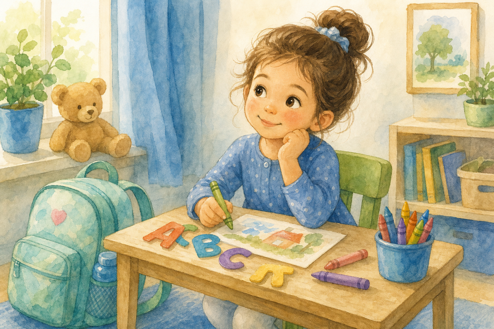

## Глава 40. Готовимся к школе

*(Папа показывает воображаемый рюкзак)*

До школы важно не только «знать все буквы». Важнее: слушать 10–15 минут, доводить дело до конца, просить помощь, спокойно сидеть часть времени, радоваться новому.

Давай иногда играть в «школу» дома: звонок, задание, переменка, похвала за старание. Ты справишься — шаг за шагом.

**📖 Стих из Библии:**
31. Итак, едите ли, пьете ли, или иное что делаете, все делайте в славу Божию.
1 Коринфянам 10:31 (Синодальный перевод)

**🗣 Поговорим:**
*Папа:* Во что из «школьного» тебе уже интересно играть?
*(Дать дочке ответить)*

**🙏 Наша молитва:**
«Бог, готовь моё сердце к учёбе: дай терпение, радость и смелость спрашивать. Аминь.»

---

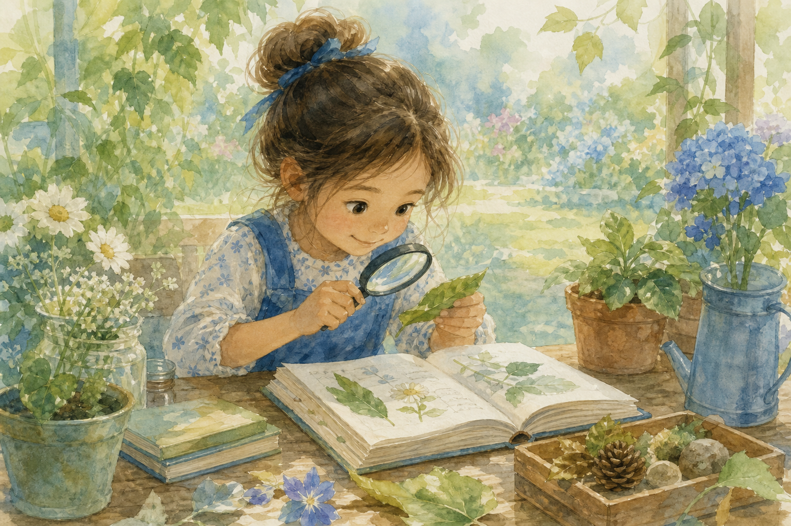

## Глава 41. Учёба — исследование Божьего мира

*(Папа с восхищением)*

Учёба — не ради страха перед оценкой. Это способ лучше понимать мир, который создал Бог, и однажды помогать людям.

Любопытство — дар. Вопросы — хорошо. «Я не знаю» — честное начало учёбы, а не стыд. Ошибки — часть пути. Бог видит старание, не только результат. Ошибаться можно. Врать про ошибку — не нужно.

**📖 Стих из Библии:**
5. Надейся на Господа всем сердцем твоим, и не полагайся на разум твой. 6. Во всех путях твоих познавай Его, и Он направит стези твои.
Притчи 3:5-6 (Синодальный перевод)

**🗣 Поговорим:**
*Папа:* О чём тебе сейчас больше всего хочется узнать?
*(Дать дочке ответить)*

**🙏 Наша молитва:**
«Творец, спасибо за ум и любопытство. Научи меня учиться с радостью. Аминь.»

---

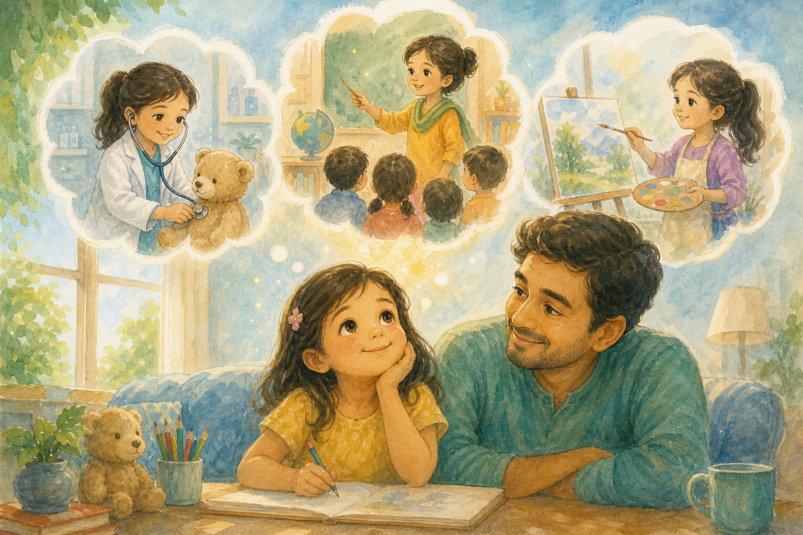

## Глава 42. Выбор пути: маленькие шаги

*(Папа мечтает вместе с дочкой)*

В 5 лет мы не выбираем профессию навсегда. Мы учимся любить труд, пробовать разное, замечать, что получается с радостью, служить людям.

Бог даёт дары. Путь откроется шаг за шагом. Сегодня твой «путь» — быть доброй дочкой, подругой и ученицей маленьких чудес.

**📖 Стих из Библии:**
5. Надейся на Господа всем сердцем твоим, и не полагайся на разум твой. 6. Во всех путях твоих познавай Его, и Он направит стези твои.
Притчи 3:5-6 (Синодальный перевод)

**🗣 Поговорим:**
*Папа:* Кем ты сегодня поиграешь в мечте: врачом, учителем, художником…?
*(Дать дочке ответить)*

**🙏 Наша молитва:**
«Господь, покажи мне мои дары и научи использовать их для любви к людям. Аминь.»

---

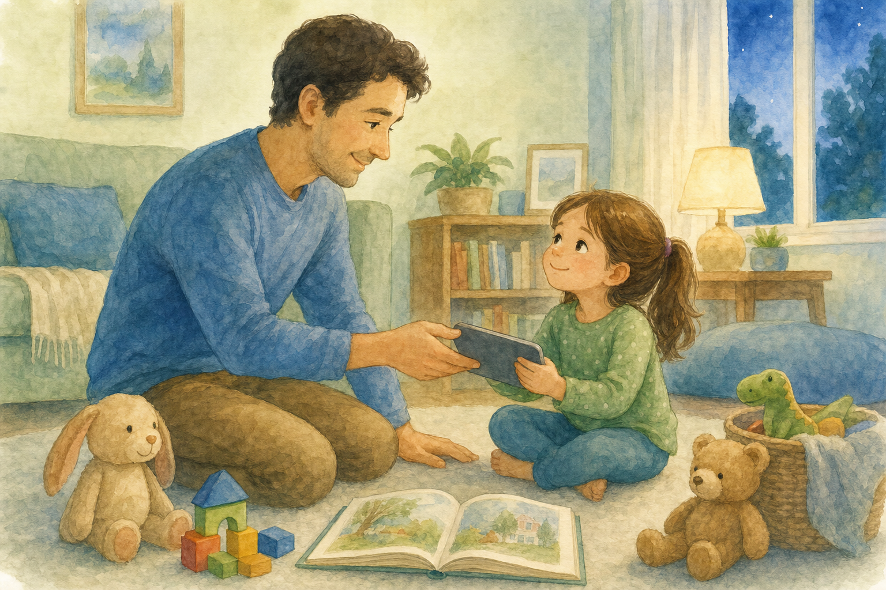

## Глава 43. Телефон — не хозяин дома

*(Папа мягко, но твёрдо)*

Телефон — как волшебное окошко. В нём можно позвонить бабушке, посмотреть добрую картинку, узнать погоду.

Но окошко бывает жадным: тянет глаза снова и снова. Тогда забываются объятия, книга, двор и сон.

В нашей семье телефон — инструмент, а не игрушка на весь день. Смотрим вместе или с разрешения. Есть время без экрана. Ночью телефон «спит» далеко от кроватки. Короткие ролики и чужие фото особенно быстро тянут сердце в «ещё один» и «у всех лучше». В интернет и чужие телефоны не пишем без родителей, чужой Wi‑Fi и чужие устройства не трогаем без разрешения. Если капризничаешь из‑за экрана — окошку пора отдохнуть.

**📖 Стих из Библии:**
12. Все мне позволительно, но не все полезно; все мне позволительно, но ничто не должно обладать мною.
1 Коринфянам 6:12 (Синодальный перевод)

**🗣 Поговорим:**
*Папа:* Что тебе нравится делать больше, чем телефон?
*(Дать дочке ответить)*

**🙏 Наша молитва:**
«Господь, научи меня не отдавать сердце экрану. Дай радость живой жизни. Аминь.»

---

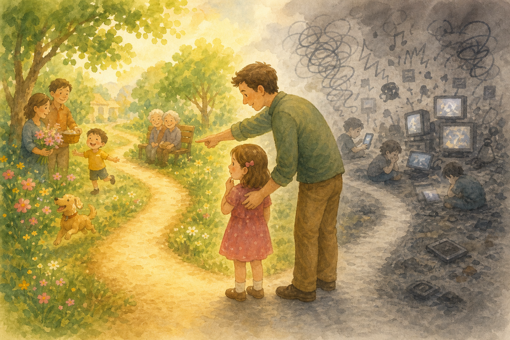

## Глава 44. Мультики — еда для глаз и сердца

*(Папа сравнивает с едой)*

Мультик — как еда. Бывает полезная тарелка. Бывает сладкая вата: вкусно, но потом кружится голова. А бывает испорченная еда — её лучше не брать.

Мультики учат. Даже когда кажется, что «просто смешно». Они показывают, как говорить, как злиться, кого слушаться, что считать «крутым». Поэтому мы выбираем мультики как друзей для сердца.

**📖 Стих из Библии:**
12. Все мне позволительно, но не все полезно; все мне позволительно, но ничто не должно обладать мною.
1 Коринфянам 6:12 (Синодальный перевод)

**🗣 Поговорим:**
*Папа:* Какой герой из мультика тебе нравится? Чему он учит?
*(Дать дочке ответить)*

**🙏 Наша молитва:**
«Иисус, помоги мне выбирать истории, которые делают сердце добрее. Аминь.»

---

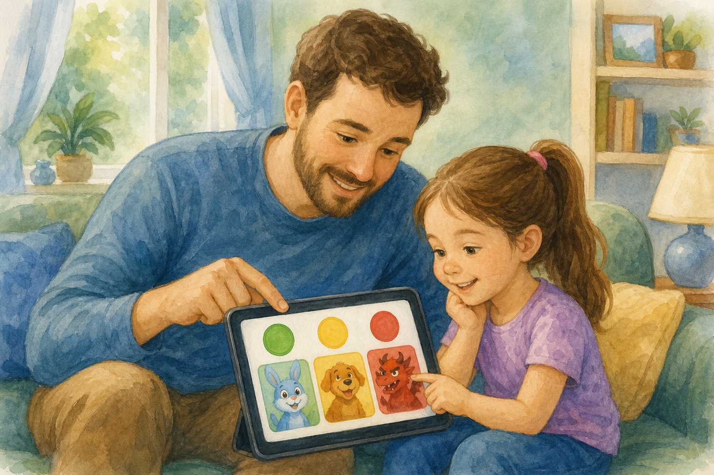

## Глава 45. Что стоит смотреть — а что нет

*(Папа рисует светофор словами)*

**Зелёный свет:** добро побеждает без злорадства; герои просят прощения и помогают; спокойный темп; после просмотра хочется обнять и поиграть.

**Жёлтый свет:** много шума или драки — спроси взрослых: «Нам это надо?»

**Красный свет:** грязные слова; насмешки над телом, верой, семьёй; страх и жестокость «ради смеха»; бесконечные короткие ролики подряд; всё, после чего снятся страхи или хочется повторять плохое.

Спросить — умно. Тайком смотреть запретное — опасно для сердца.

**📖 Стих из Библии:**
8. Наконец, братия мои, что только истинно, что честно, что справедливо, что чисто, что любезно, что достославно, что только добродетель и похвала, о том помышляйте.
Филиппийцам 4:8 (Синодальный перевод)

**🗣 Поговорим:**
*Папа:* Давай проверим один мультик светофором: зелёный, жёлтый или красный?
*(Обсудить вместе)*

**🙏 Наша молитва:**
«Господь, дай нам мудрость выбирать, что смотреть. Аминь.»

---

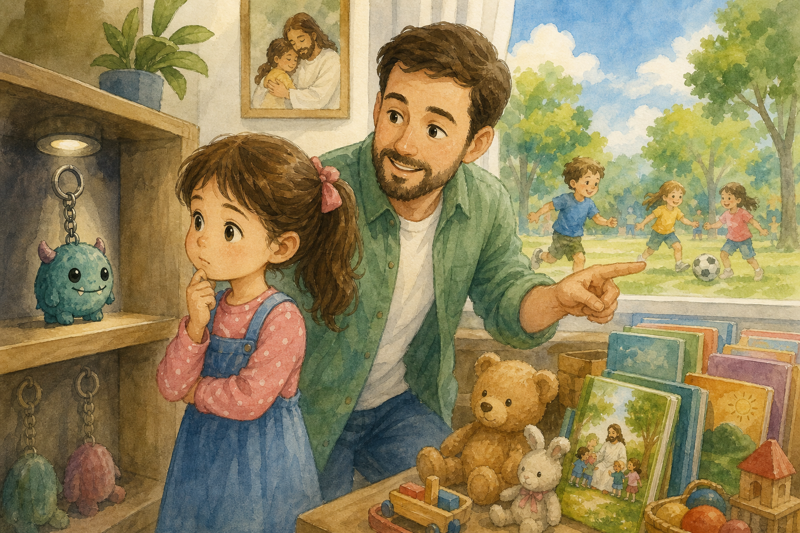

## Глава 46. Модные игрушки и «хочу-как-все»

*(Папа объясняет просто и твёрдо)*

Иногда все вдруг говорят об одной игрушке: «У всех есть! Купи и мне!» Бывают милые вещи, бывают странные модные игрушки, бывают коллекции, за которыми все гонятся.

Почему такая гонка опасна для сердца?
1. Игрушка становится почти божком — думают о ней чаще, чем о Боге и людях.
2. Учит жадности: «ещё одну… и редкую…»
3. Учит зависти: «без неё я хуже».
4. Пустая гонка: мода уйдёт, а Иисус останется.
5. Вокруг моды бывают ссоры, обман и шум — плохой плод.
6. Нам ближе добро и тепло, а не культ любой вещи.

Мы не говорим: «Ты плохая, если тебе понравилась игрушка». Мы говорим: **не пускай моду на трон сердца.** Можно иметь игрушки. Нельзя, чтобы игрушка командовала капризами.

Если спросят подруги: «У меня другие любимые игрушки. Мне важнее играть вместе».

**📖 Стих из Библии:**
23. Больше всего хранимого храни сердце твое, потому что из него источники жизни.
Притчи 4:23 (Синодальный перевод)

**🗣 Поговорим:**
*Папа:* Какая твоя игрушка правда радует — без сравнения с другими?
*(Дать дочке ответить)*

**🙏 Наша молитва:**
«Господи, научи меня радоваться простому и не делать кумиров. Аминь.»

---

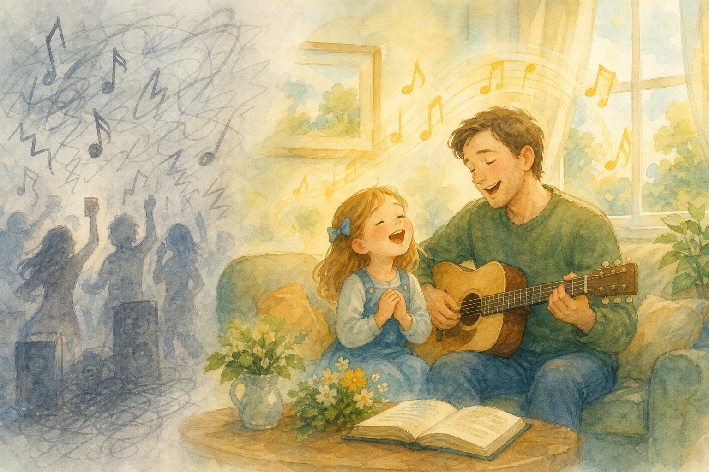

## Глава 47. Песни и ценности

*(Папа говорит о музыке)*

Песня — как сок. Пьёшь — и он попадает внутрь. В разных песнях мотив бывает красивым, но внутрь иногда кладут плохие ценности: хвастовство, грубость, «делай что хочешь», злость, пустую жизнь без Бога — только лайки и вещи.

Уши слышат ритм — а сердце незаметно учится словам.

Слушаем с родителями. Спрашиваем: «О чём эта песня?» Если слова плохие — выключаем, даже если «всем нравится». Дома растим добрый плейлист: христианские детские песни, семейные мелодии. Петь вместе — сильнее чужой колонки.

Проверка: смогли бы мы спеть это Иисусу без стыда? Если нет — песня не наша.

**📖 Стих из Библии:**
8. Наконец, братия мои, что только истинно, что честно, что справедливо, что чисто, что любезно, что достославно, что только добродетель и похвала, о том помышляйте.
Филиппийцам 4:8 (Синодальный перевод)

**🗣 Поговорим:**
*Папа:* Какая добрая песня тебе нравится петь вместе?
*(Дать дочке ответить; можно напеть куплет)*

**🙏 Наша молитва:**
«Господь, наполни мои уши и сердце тем, что чисто и истинно. Аминь.»

---

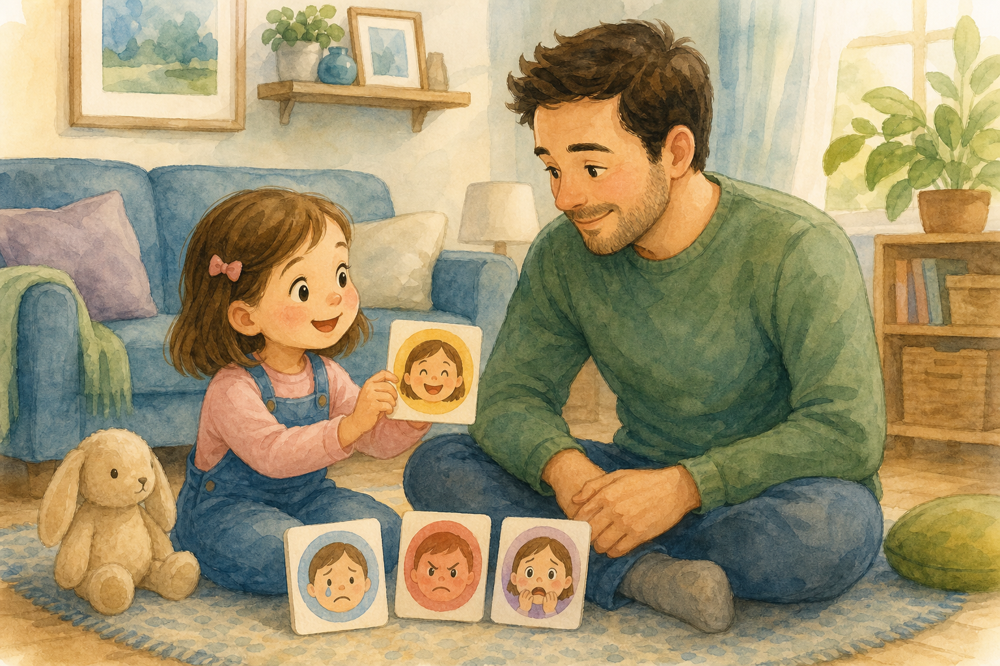

## Глава 48. Эмоции — погода в сердце

*(Папа показывает лица: радость, грусть, злость)*

Все эмоции **нормальны**. Радость, грусть, злость, страх, стыд, восторг — как погода в сердце. Слёзы не слабость, грусть не плохость, а страх не делает тебя трусишкой.

Важно не запретить чувство, а выбрать поступок. Можно топнуть ножкой на коврике и сказать: «Я злюсь!» Нельзя бить и ломать назло. Чувства — гости. Поступки — наш выбор.

**📖 Стих из Библии:**
6. Не заботьтесь ни о чем, но всегда в молитве и прошении с благодарением открывайте свои желания пред Богом, 7. и мир Божий, который превыше всякого ума, соблюдет сердца ваши и помышления ваши во Христе Иисусе.
Филиппийцам 4:6-7 (Синодальный перевод)

**🗣 Поговорим:**
*Папа:* Какое чувство у тебя сейчас? Где оно в теле?
*(Дать дочке ответить)*

**🙏 Наша молитва:**
«Иисус, помоги мне понимать свои чувства и поступать по-доброму. Аминь.»

---

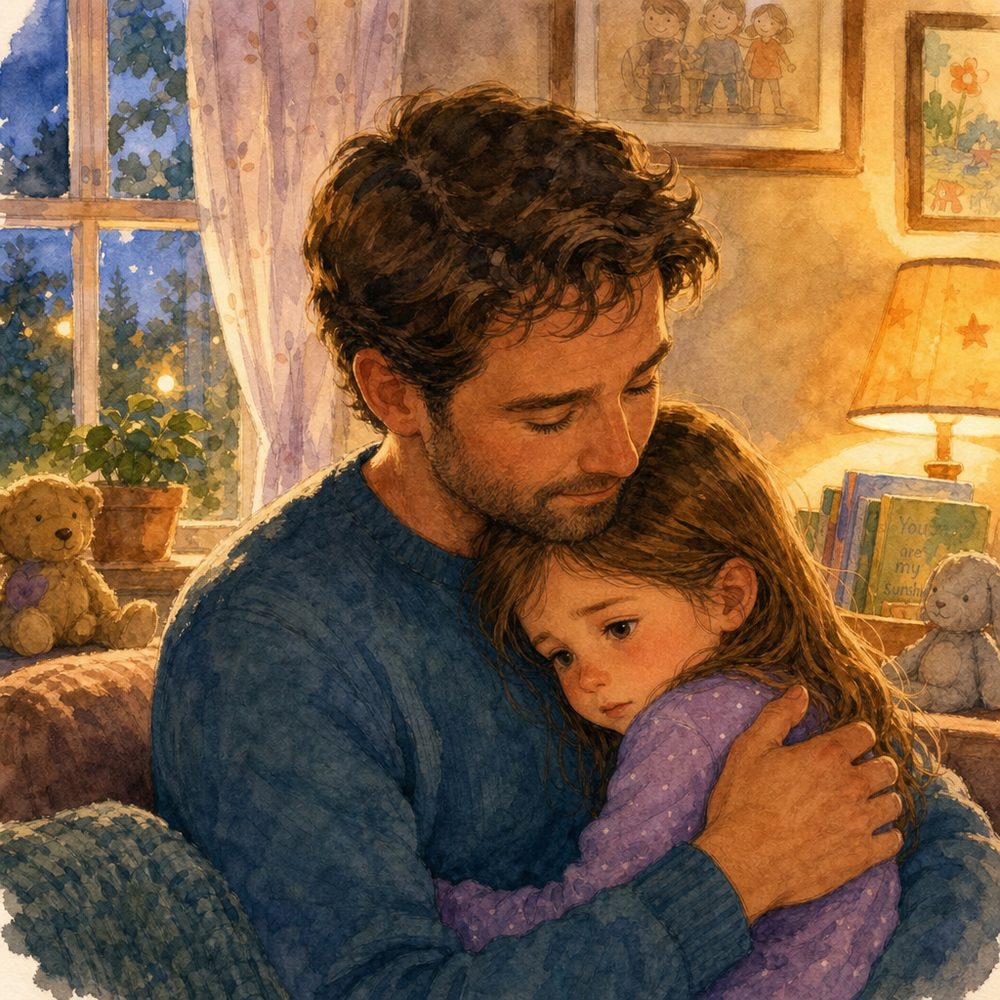

## Глава 49. Когда страшно

*(Папа обнимает)*

Страх темноты, собак, громкости, разлуки, «монстров» бывает у многих детей. Это не стыдно.

Помогает: ночник, объятие, правда вместо страшилки, молитва, медленный вдох и длинный выдох, моё присутствие. Иисус — Добрый Пастырь. Он с тобой, когда страшно.

**📖 Стих из Библии:**
4. Когда я в страхе, на Тебя я уповаю. 5. В Боге восхвалю я слово Его; на Бога уповаю, не боюсь; что сделает мне плоть?
Псалом 55:4-5 (Синодальный перевод)

**🗣 Поговорим:**
*Папа:* Что тебе помогает, когда немного страшно?
*(Дать дочке ответить)*

**🙏 Наша молитва:**
«Иисус, я боюсь. Будь со мной. Аминь.»

---

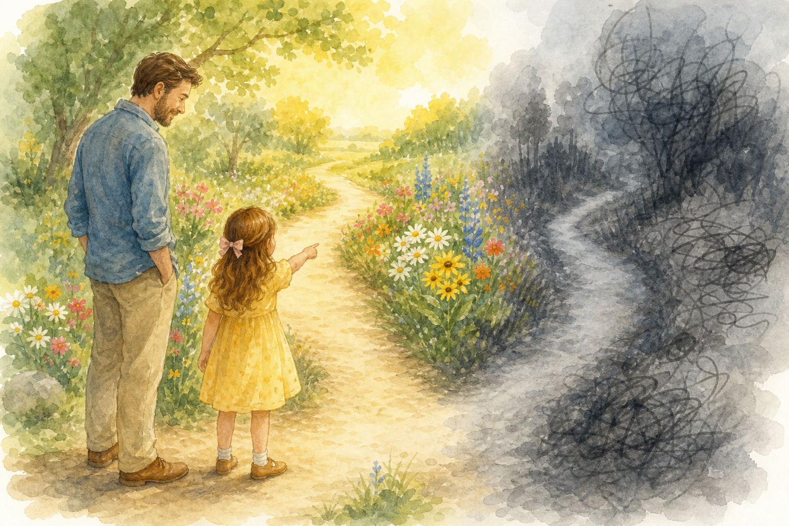

## Глава 50. Искушения: развилка на дороге

*(Папа рисует две дорожки)*

Искушение — тяга сделать неправильное, когда кажется: «Никто не увидит». Взять чужое. Солгать. Повторить грязное слово.

Помогают: пауза, молитва «помоги», честность, уйти, позвать взрослого. Даже Иисус был искушаем — и сказал «нет» плохому. Мы можем учиться у Него.

**📖 Стих из Библии:**
13. Вас постигло искушение не иное, как человеческое; и верен Бог, Который не попустит вам быть искушаемыми сверх сил, но при искушении даст и облегчение, так чтобы вы могли перенести.
1 Коринфянам 10:13 (Синодальный перевод)

**🗣 Поговорим:**
*Папа:* Что ты можешь сказать себе на развилке: «стоп, подумаю»?
*(Дать дочке ответить)*

**🙏 Наша молитва:**
«Иисус, помоги мне выбирать добро, даже когда трудно. Аминь.»

---

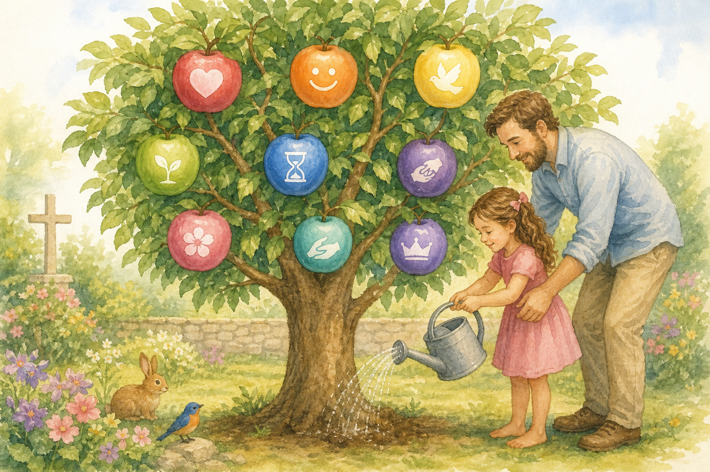

## Глава 51. Доброе сердечко и плоды Духа

*(Папа перечисляет фрукты характера)*

Бог подарил тебе сердечко и хочет, чтобы оно было добрым. Что значит быть доброй? Делиться, пожалеть того, кто плачет, слушаться маму и папу.

Иногда хочется топнуть: «Моё! Не дам!» Тогда просим Иисуса: «Помоги сердечку снова стать добрым».

А ещё Бог растит в нас прекрасные плоды: любовь, радость, мир, терпение, доброту, милосердие, верность, кротость, воздержание. Каждый день можно выбрать один «плод» и поискать, где его проявить.

И помни волшебное слово **«Прости»**: облачко обиды улетает — и снова светит солнышко!

**📖 Стих из Библии:**
22. Плод же духа: любовь, радость, мир, долготерпение, благость, милосердие, вера, 23. кротость, воздержание. На таковых нет закона.
Галатам 5:22-23 (Синодальный перевод)

**🗣 Поговорим:**
*Папа:* Кому мы сегодня можем сделать что-то доброе?
*(Дать дочке ответить)*

**🙏 Наша молитва:**
«Иисус, помоги мне иметь такое же доброе сердце, как у Тебя. Научи меня делиться, любить и вовремя говорить «прости». Аминь.»

---

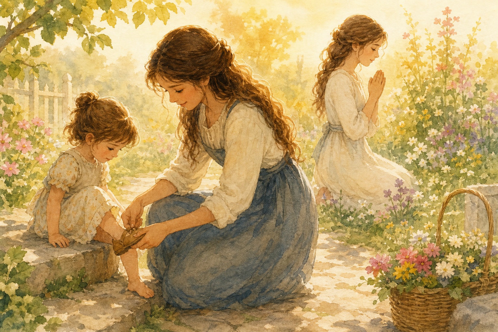

## Глава 52. Какой быть девочкой — и потом женщиной

*(Папа говорит с уважением и мечтой)*

Христианская женственность — не только платье. Это вера в Иисуса, мудрость и честность, доброта и смелость, чистота сердца и уважение к телу, умение трудиться и дружить, готовность служить — дома, в церкви, людям.

Ты уже учишься этому маленькими шагами. Ты не должна быть «идеальной куклой». Ты призвана быть живой дочерью Божьей.

**📖 Стих из Библии:**
30. Миловидность обманчива и красота суетна; но жена, боящаяся Господа, достойна хвалы.
Притчи 31:30 (Синодальный перевод)

**🗣 Поговорим:**
*Папа:* Какое качество настоящей женщины-христианки тебе уже хочется расти в себе?
*(Дать дочке ответить)*

**🙏 Наша молитва:**
«Господь, расти во мне веру, мудрость, доброту и смелость. Аминь.»

---

## Глава 53. Сотворение

*(Папа говорит тихо, почти шёпотом — как будто вместе смотрят на чудо)*

Представь: сначала было темно и тихо. А потом Бог сказал — и засиял свет! Он сделал небо, море и сушу. Зелёную травку. Солнце днём и луну ночью. Рыбок, птичек, зверей… И ещё Он сделал людей — особенных, похожих на Себя сердцем: чтобы любить, радоваться и дружить с Ним.

Бог посмотрел на всё, что создал, и сказал: «Это хорошо!» А самое-самое чудесное в этом мире — что ты тоже Его творение. Твои глазки, твой смех, твоя ладошка в моей — всё это придумал Бог с любовью.

**📖 Стих из Библии:**
1. В начале сотворил Бог небо и землю. 2. Земля же была безвидна и пуста, и тьма над бездною, и Дух Божий носился над водою. 3. И сказал Бог: да будет свет. И стал свет.
Бытие 1:1-3 (Синодальный перевод)

**🗣 Поговорим:**
*Папа:* Что в Божьем мире тебе кажется самым чудесным?
*(Дать дочке ответить)*

**🙏 Наша молитва:**
«Дорогой Творец, спасибо за Твой прекрасный мир и за то, что Ты создал меня. Аминь.»

---

## Глава 54. Адам и Ева

*(Папа говорит мягко, без страшилок)*

Первых людей звали Адам и Ева. Бог поселил их в красивом саду. Там было всё нужное — и Сам Бог был рядом, как самый добрый Друг.

У Бога было одно важное правило: одно дерево трогать нельзя. Но Адам и Ева не послушались. Им стало грустно и стыдно. Так в мир вошли боль и непослушание.

Но знаешь самое главное? Бог не бросил их. Он уже тогда готовил спасение — дорогу обратно к Себе. Позже этой дорогой стал Иисус. Даже когда мы ошибаемся, Бог зовёт нас к прощению и любви.

**📖 Стих из Библии:**
16. И заповедал Господь Бог человеку, говоря: от всякого дерева в саду ты будешь есть, 17. а от дерева познания добра и зла, не ешь от него; ибо в день, в который ты вкусишь от него, смертью умрешь.
Бытие 2:16-17 (Синодальный перевод)

**🗣 Поговорим:**
*Папа:* Почему важно слушаться Бога — даже когда очень хочется по-своему?
*(Дать дочке ответить)*

**🙏 Наша молитва:**
«Господь, научи меня слушаться Тебя. Спасибо, что Ты не оставляешь меня. Аминь.»

---

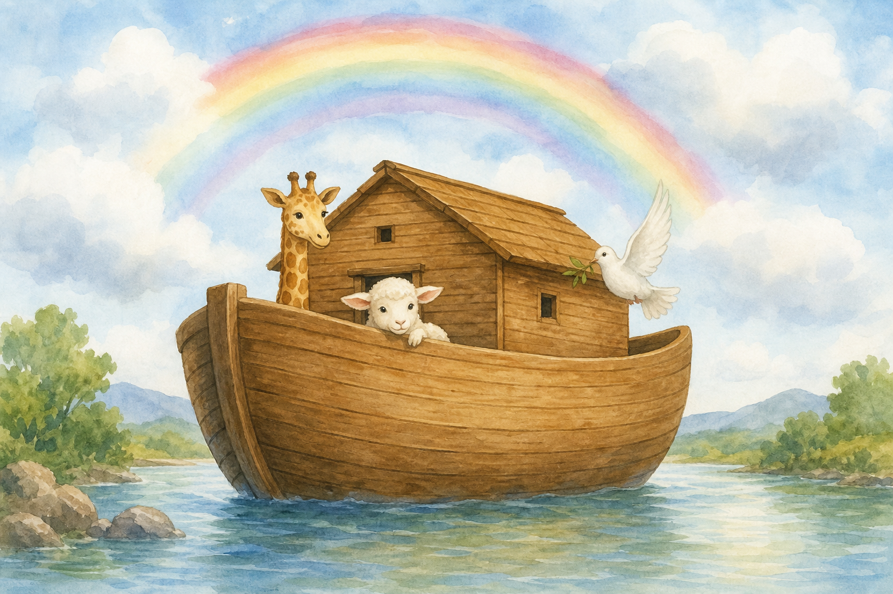

## Глава 55. Ной

*(Папа показывает на радугу пальцем в воздухе)*

Жил человек по имени Ной. Он любил Бога и доверял Ему. Однажды Бог сказал Ною построить большой корабль — ковчег. Ной слушался, хотя это было непросто.

Бог сохранил Ноя, его семью и животных. А потом на небе появилась радуга — знак Божьего обещания. Бог сказал: «Я помню Своё слово».

Когда тебе бывает трудно, вспомни Ноя: доверять Богу — значит идти шаг за шагом, а Он держит Свои обещания. Радуга напоминает: Бог верен.

**📖 Стих из Библии:**
12. И сказал Бог: вот знамение завета, который Я поставляю между Мною и между вами и между всякою душею живою, которая с вами, в роды навсегда: 13. Я полагаю радугу Мою в облаке, чтоб она была знамением завета между Мною и между землею.
Бытие 9:12-13 (Синодальный перевод)

**🗣 Поговорим:**
*Папа:* Как ты сегодня можешь довериться Богу — в чём одном маленьком деле?
*(Дать дочке ответить)*

**🙏 Наша молитва:**
«Бог, спасибо, что Ты держишь обещания. Помоги мне доверять Тебе, как Ной. Аминь.»

---

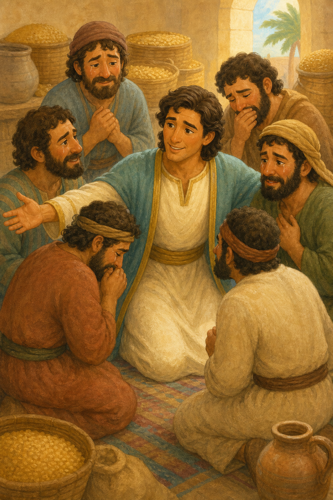

## Глава 56. Иосиф прощает

*(Папа говорит тепло, глядя в глаза)*

У Иосифа было много братьев. Однажды они поступили с ним очень плохо — и Иосифу стало тяжело. Прошло много времени. Бог был с Иосифом и помог ему вырасти мудрым и сильным.

Потом братья снова встретились с Иосифом. Он мог бы ответить злом… Но он простил. Он даже заплакал от любви и сказал: «Не бойтесь. Бог обернул плохое к добру».

Прощать не всегда легко. Но Бог помогает нашему сердцу отпускать обиду — как помог Иосифу.

**📖 Стих из Библии:**
19. И сказал Иосиф: не бойтесь, ибо я боюсь Бога; 20. вот, вы умышляли против меня зло; но Бог обратил это в добро, чтобы сделать то, что теперь есть: сохранить жизнь великому числу людей;
Бытие 50:19-20 (Синодальный перевод)

**🗣 Поговорим:**
*Папа:* Кому бывает трудно прощать — и Кто может помочь нашему сердцу?
*(Дать дочке ответить)*

**🙏 Наша молитва:**
«Иисус, научи меня прощать, как Иосиф. Сделай моё сердце мягким. Аминь.»

---

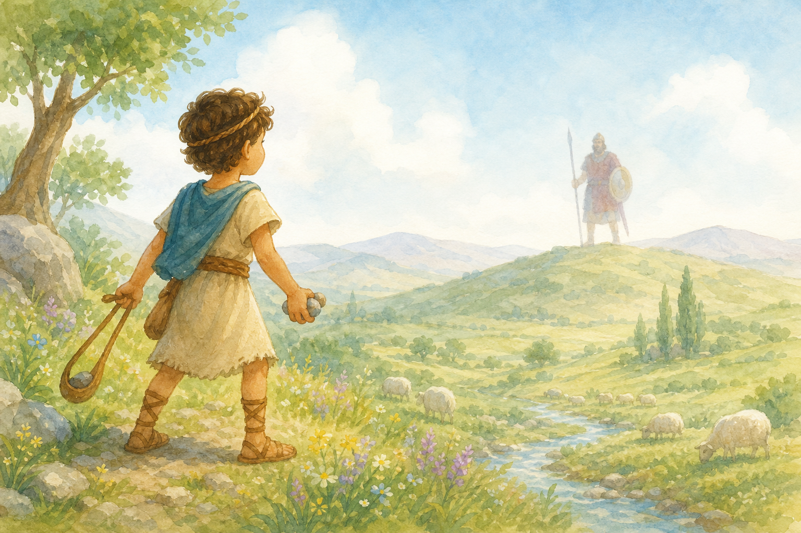

## Глава 57. Давид и Голиаф

*(Папа говорит бодро, но спокойно)*

Давид был ещё мальчиком. Он пас овечек и любил Бога. А однажды всему народу стало страшно из‑за огромного сильного врага — Голиафа.

Давид не был самым большим. У него не было тяжёлых доспехов. Но у него было другое: он верил, что Бог сильнее любого страха. Давид вышел смело — и Бог помог ему победить.

Смелость — это не «я сама всё могу». Смелость — это «я с Богом». И маленькая девочка тоже может быть храброй: сказать правду, подойти к новой подруге, попросить прощения.

**📖 Стих из Библии:**
47. И узнает весь этот сонм, что не мечом и копьем спасает Господь, ибо это война Господа, и Он предаст вас в руки наши.
1 Царств 17:47 (Синодальный перевод)

**🗣 Поговорим:**
*Папа:* В чём тебе сегодня нужна смелость — и как Бог может помочь?
*(Дать дочке ответить)*

**🙏 Наша молитва:**
«Бог, помоги мне быть смелой с Тобой, как Давид. Аминь.»

---

## Глава 58. Даниил

*(Папа складывает руки, как будто вместе молятся)*

Даниил жил в далёкой стране. Там были правила, которые мешали молиться Богу. Но Даниил всё равно открывал окно и тихо говорил с Господом — утром, днём и вечером. Он не прятал свою любовь к Богу.

Людям это не понравилось, и Даниила бросили туда, где были львы. Но Бог послал ангела и закрыл пасти львам. Даниил остался цел — потому что Бог услышал его молитву.

Когда тебе тревожно или одиноко, ты тоже можешь молиться. Бог слышит даже шёпот.

**📖 Стих из Библии:**
21. Тогда Даниил сказал царю: царь! во веки живи! 22. Бог мой послал Ангела Своего и заградил пасть львам, и они не повредили мне, потому что я оказался пред Ним чист, да и пред тобою, царь, я не сделал преступления.
Даниил 6:21-22 (Синодальный перевод)

**🗣 Поговорим:**
*Папа:* Когда тебе особенно помогает молитва?
*(Дать дочке ответить)*

**🙏 Наша молитва:**
«Бог, будь со мной, когда страшно. Спасибо, что Ты слышишь меня, как Даниила. Аминь.»

---

## Глава 59. Рождество

*(Папа улыбается, как будто рассказывает о самом лучшем подарке)*

Давным-давно в маленьком городе Вифлееме родился Младенец. Его положили в ясли — туда, где обычно лежит корм для животных. Не во дворец. Не под золотую крышу. А совсем просто.

Но это был не обычный малыш. Это был Иисус — Сын Божий! Ангелы пели пастухам: «Не бойтесь! Сегодня родился Спаситель!» Звезда светила на небе. Мудрецы пришли поклониться.

Рождество — праздник самого лучшего подарка: Бог дал миру Иисуса. А Иисус пришёл, чтобы быть с нами и спасти нас.

**📖 Стих из Библии:**
10. И сказал им Ангел: не бойтесь; я возвещаю вам великую радость, которая будет всем людям: 11. ибо ныне родился вам в городе Давидовом Спаситель, Который есть Христос Господь;
Луки 2:10-11 (Синодальный перевод)

**🗣 Поговорим:**
*Папа:* Почему рождение Иисуса — лучший подарок на свете?
*(Дать дочке ответить)*

**🙏 Наша молитва:**
«Спасибо, Бог, за Иисуса! Наполни наше Рождество радостью о Нём. Аминь.»

---

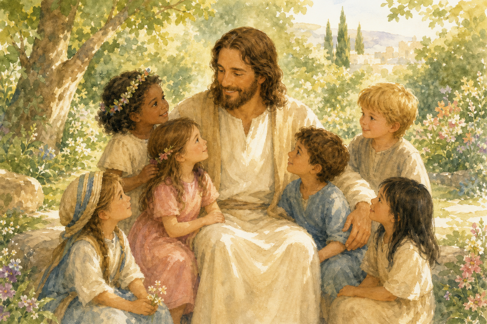

## Глава 60. Иисус и дети

*(Папа садится ближе, будто Иисус рядом)*

Однажды родители привели детей к Иисусу. А взрослые ученики сказали: «Не мешайте Учителю! Он занят!» Им казалось, что дети — «не сейчас», «потом», «не так важно».

Но Иисус расстроился из‑за этого. Он сказал: «Пусть дети приходят ко Мне! Не мешайте им». И Он обнял малышей, положил на них руки и благословил.

Ты для Иисуса не «помеха». Ты желанная. Он рад, когда ты молишься, поёшь, спрашиваешь, обнимаешь папу и думаешь о Нём. Можно просто прийти к Нему сердцем — прямо сейчас.

**📖 Стих из Библии:**
13. Тогда приведены были к Нему дети, чтобы Он возложил на них руки и помолился; ученики же возбраняли им. 14. Но Иисус сказал: пустите детей и не препятствуйте им приходить ко Мне, ибо таковых есть Царство Небесное.
Матфея 19:13-14 (Синодальный перевод)

**🗣 Поговорим:**
*Папа:* Что бы ты сказала Иисусу, если бы сидела рядом с Ним?
*(Дать дочке ответить)*

**🙏 Наша молитва:**
«Иисус, я прихожу к Тебе. Спасибо, что Ты любишь детей — и меня. Аминь.»

---

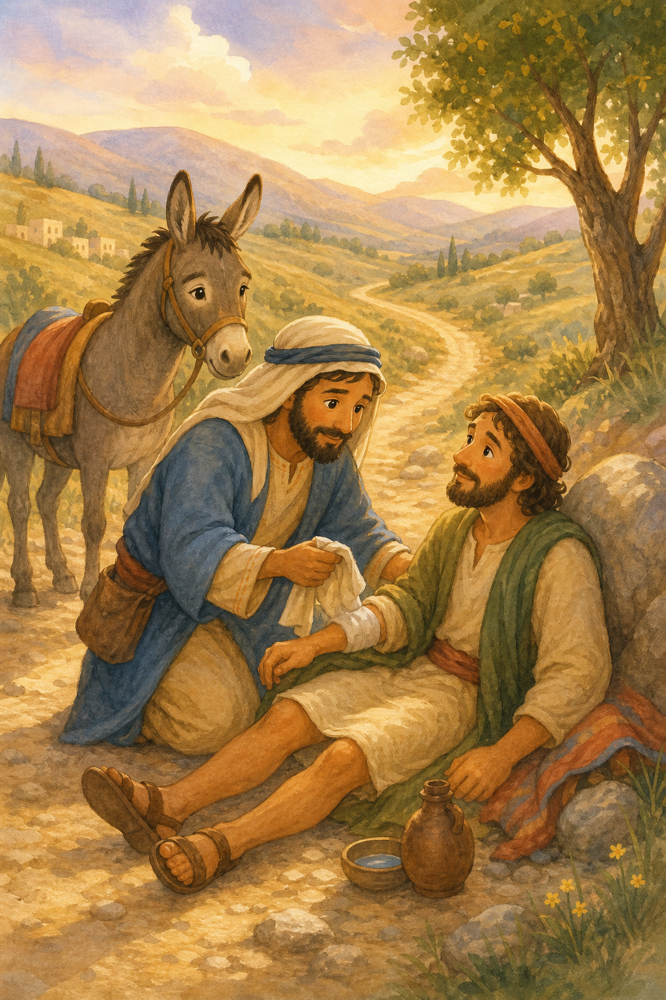

## Глава 61. Добрый самарянин

*(Папа говорит просто, почти как сказку о добре)*

Иисус рассказал историю. Один человек шёл по дороге и попал в беду: ему было больно и одиноко. Мимо прошли люди, которые могли помочь… но прошли мимо.

А потом подошёл самарянин — человек из другого народа, с которым обычно не дружили. Он остановился. Перевязал раны. Посадил на своего осла. Отвёз в гостиницу и заплатил за заботу.

Иисус спросил: «Кто был настоящим ближним?» Тот, кто помог. Доброта — это не слова «я хорошая», а руки, которые останавливаются рядом с нуждающимся.

**📖 Стих из Библии:**
36. Кто из этих троих, думаешь ты, был ближний попавшемуся разбойникам? 37. Он сказал: оказавший ему милость. Тогда Иисус сказал ему: иди, и ты поступай так же.
Луки 10:36-37 (Синодальный перевод)

**🗣 Поговорим:**
*Папа:* Кому ты можешь помочь на этой неделе — даже совсем чуть-чуть?
*(Дать дочке ответить)*

**🙏 Наша молитва:**
«Иисус, сделай меня добрым другом. Научи замечать, кому нужна помощь. Аминь.»

---

## Глава 62. Буря утихла

*(Папа говорит спокойно, как будто гладит волны ладонью)*

Ученики плыли в лодке. Вдруг поднялась сильная буря: ветер, волны, страх. А Иисус… спал. Ученики закричали: «Учитель, мы гибнем!»

Иисус встал и сказал морю: «Тихо! Перестань!» И стало тихо. Совсем. Ученики удивились: «Кто же Это такой, что даже ветер и вода слушаются Его?»

Иногда «буря» бывает не на море, а в сердце: обида, страх перед садиком, тревожный сон. Иисус может успокоить и это. Можно сказать Ему: «Иисус, будь со мной» — и держаться за Его руку.

**📖 Стих из Библии:**
39. И, встав, Он запретил ветру и сказал морю: умолкни, перестань. И ветер утих, и сделалась великая тишина. 40. И сказал им: что вы так боязливы? как у вас нет веры? 41. И убоялись страхом великим и говорили между собою: кто же Сей, что и ветер и море повинуются Ему?
Марка 4:39-41 (Синодальный перевод)

**🗣 Поговорим:**
*Папа:* О какой «буре» в сердце ты можешь попросить Иисуса сегодня?
*(Дать дочке ответить)*

**🙏 Наша молитва:**
«Иисус, успокой моё сердце. Ты сильнее любой бури. Аминь.»

---

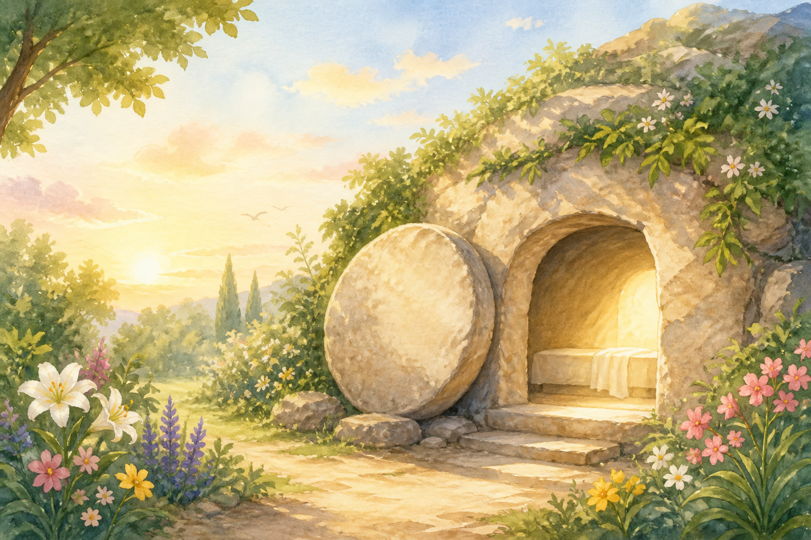

## Глава 63. Крест и воскресение

*(Папа говорит тихо и радостно — без страшных подробностей)*

Иисус очень любит людей. Он пришёл спасти нас от греха — от всего, что отделяет нас от Бога. Он отдал Свою жизнь на кресте: это было самое большое «я люблю тебя» в мире.

Но история не закончилась грустью. На третий день гробница оказалась пустой! Иисус воскрес — Он живой! Ангелы сказали женщинам: «Его здесь нет. Он воскрес!»

Поэтому Пасха — праздник радости. Зло и смерть не победили Иисуса. Он победил — и зовёт нас жить с Ним.

**📖 Стих из Библии:**
3. Ибо я первоначально преподал вам, что и сам принял, то есть, что Христос умер за грехи наши, по Писанию, 4. и что Он погребен был, и что воскрес в третий день, по Писанию,
1 Коринфянам 15:3-4 (Синодальный перевод)

**🗣 Поговорим:**
*Папа:* Почему Пасха — праздник радости, а не грусти?
*(Дать дочке ответить)*

**🙏 Наша молитва:**
«Иисус, спасибо, что Ты умер за нас и воскрес! Ты живой — и я радуюсь. Аминь.»

---

## Глава 64. Сон — тоже Божий подарок

*(Папа говорит тише, почти шёпотом)*

Знаешь, даже сильным людям нужен сон. Сон — не наказание и не «скука». Это Божий подарок: тело отдыхает, сердце успокаивается, мозг складывает день по полочкам.

Когда мы ложимся вовремя, завтра легче быть доброй и внимательной. Ночник, объятие, молитва — и глазки отдыхают. Если спишь в гостях или дома шумит малыш, можно сказать взрослым, что тебе нужна помощь и тишина. Я рядом.

**📖 Стих из Библии:**
9. Спокойно ложусь я и сплю, ибо Ты, Господи, един даешь мне жить в безопасности.
Псалом 4:9 (Синодальный перевод)

**🗣 Поговорим:**
*Папа:* Что тебе помогает быстрее заснуть?
*(Дать дочке ответить)*

**🙏 Наша молитва:**
«Господь, благослови мой сон. Храни меня ночью. Аминь.»

---

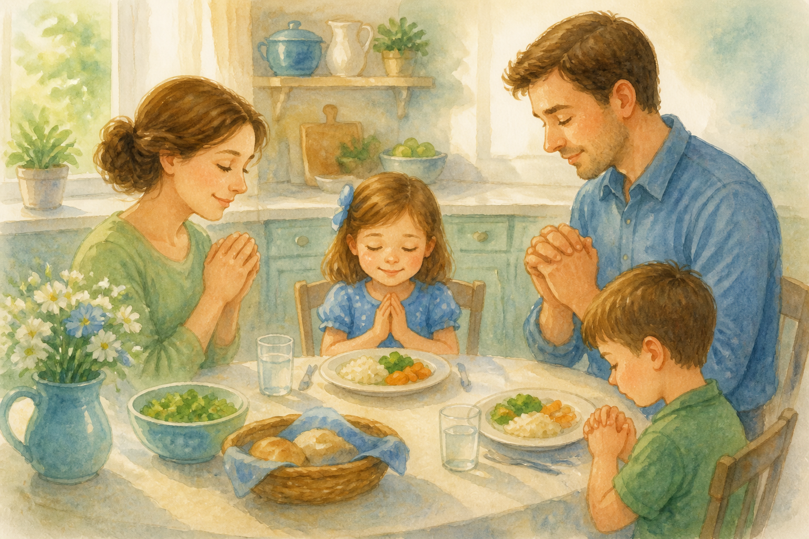

## Глава 65. Еда без капризов и «спасибо» за стол

*(Папа гладит воображаемую тарелку)*

Еда — забота Бога через руки мамы, папы, бабушки. Не всегда на столе то, что «самая-самая хотелка». Иногда — суп. Иногда — каша.

Мы учимся пробовать, говорить «спасибо» и не превращать стол в битву. Перед едой можно коротко поблагодарить Бога: «Спасибо за еду и за руки, которые готовили». Капризы делают обед горьким. Благодарность — вкусным даже простому блюду.

**📖 Стих из Библии:**
31. Итак, едите ли, пьете ли, или иное что делаете, все делайте в славу Божию.
1 Коринфянам 10:31 (Синодальный перевод)

**🗣 Поговорим:**
*Папа:* За какую еду сегодня скажем «спасибо»?
*(Дать дочке ответить)*

**🙏 Наша молитва:**
«Бог, спасибо за еду и за руки, которые готовят. Научи меня быть благодарной. Аминь.»

---

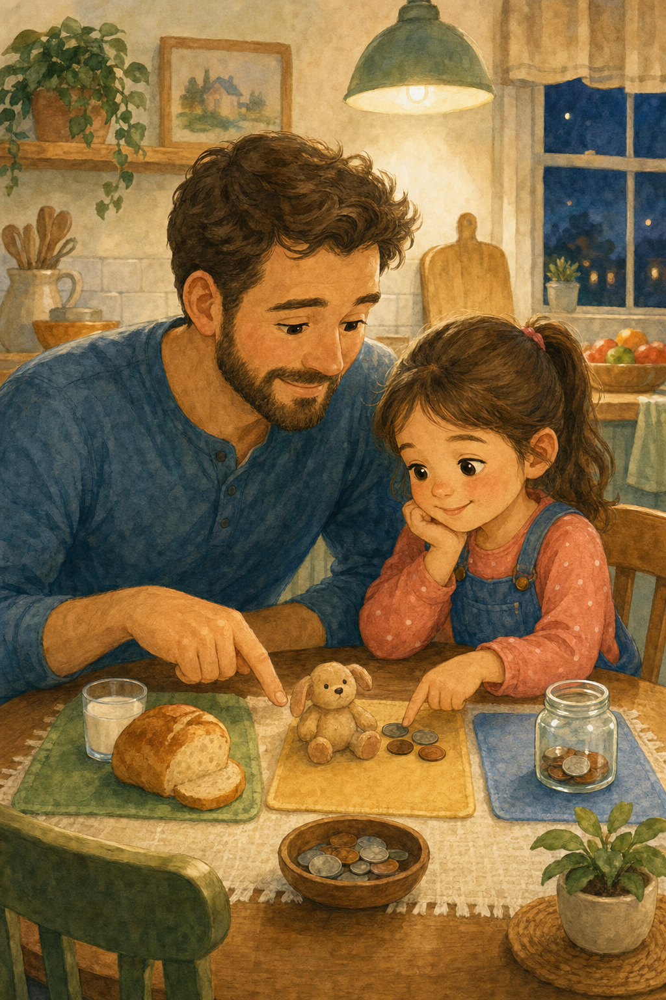

## Глава 66. Деньги: «хочу» и «нужно»

*(Папа показывает две ладошки)*

В одной ладошке — «хочу»: игрушка, конфетка, модная вещица. В другой — «нужно»: еда, дом, помощь людям, подарки с любовью.

Деньги — инструмент, не царь. Мы не кланяемся витрине. Мы спрашиваем: «Это нужно? Это мудро? Это доброе?» Иногда ответ: «Не сейчас». И это тоже любовь.

**📖 Стих из Библии:**
6. Великое приобретение - быть благочестивым и довольным. 7. Ибо мы ничего не принесли в мир; явно, что ничего не можем и вынести из него. 8. Имея пропитание и одежду, будем довольны тем.
1 Тимофею 6:6-8 (Синодальный перевод)

**🗣 Поговорим:**
*Папа:* Вспомни, когда «не сейчас» оказалось правильным.
*(Дать дочке ответить)*

**🙏 Наша молитва:**
«Господь, научи меня мудрости: отличать «хочу» от «нужно». Аминь.»

---

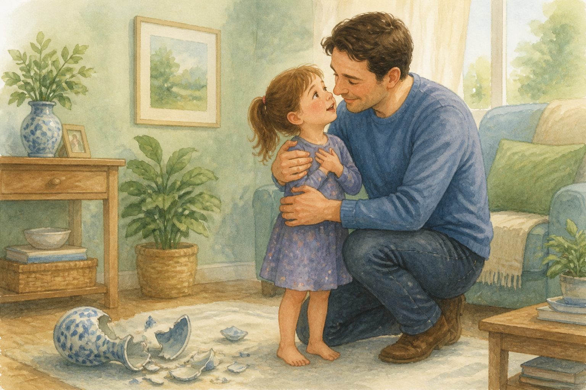

## Глава 67. Правда и ложь

*(Папа смотрит прямо и тепло)*

Правда — как чистый свет. Ложь — как тень, в которой потом страшно самой.

Иногда врут от страха: «Вдруг накажут». В нашей семье безопаснее сказать правду. Ошибку можно исправить. Ложь запутывает ещё сильнее. Бог любит правду — и помогает быть смелой говорить её мягко. Если ты передумала — скажи честно. Если обещала — доведи до конца или попроси помощи. Если случилось важное или опасное — расскажи взрослому, даже если страшно.

**📖 Стих из Библии:**
25. Посему, отвергнув ложь, говорите истину каждый ближнему своему, потому что мы члены друг другу.
Ефесянам 4:25 (Синодальный перевод)

**🗣 Поговорим:**
*Папа:* Почему правду иногда говорить трудно — и кто может помочь?
*(Дать дочке ответить)*

**🙏 Наша молитва:**
«Иисус, научи меня правде без страха и злости. Аминь.»

---

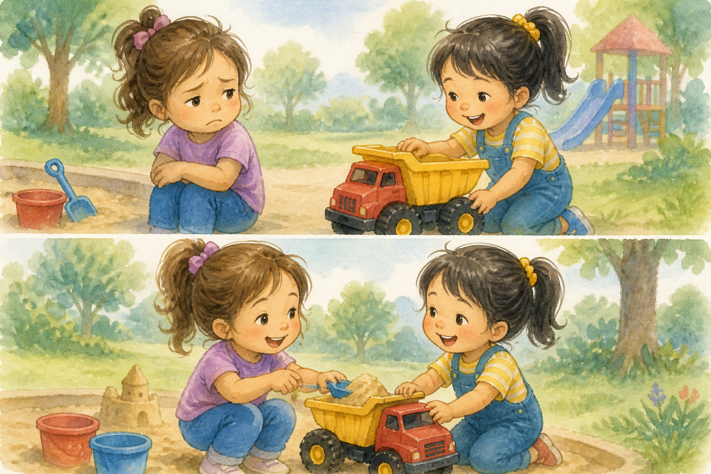

## Глава 68. Зависть и сравнение

*(Папа мягко качает головой)*

Зависть шепчет: «У неё лучше — значит, я хуже». Это ядовитый шёпот. Он крадёт радость.

Ты не должна быть копией подруги. У тебя свой путь, свои дары, своя красота. Зависть может прийти к игрушке, платью, вниманию, спокойствию, лёгкой учёбе или красивой фотографии. Можно порадоваться за другую и сказать: «Как здорово у тебя!» — а себе: «Спасибо, Бог, и за меня».

**📖 Стих из Библии:**
30. Кроткое сердце - жизнь для тела, а зависть - гниль для костей.
Притчи 14:30 (Синодальный перевод)

**🗣 Поговорим:**
*Папа:* Что у тебя есть такого, за что можно сказать «спасибо» без сравнения?
*(Дать дочке ответить)*

**🙏 Наша молитва:**
«Бог, избавь меня от зависти. Научи радоваться за других и за себя. Аминь.»

---

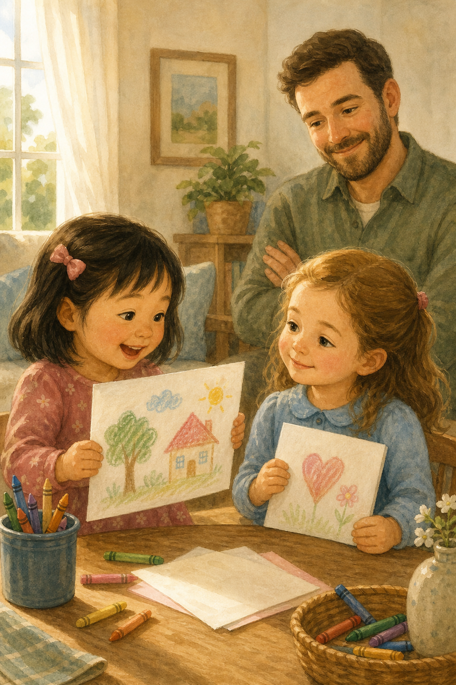

## Глава 69. Хвастовство и скромность

*(Папа улыбается)*

Хвастовство кричит: «Смотрите, какая я!» Скромность говорит: «Спасибо Богу» — и делится радостью без унижения других.

Можно гордиться старанием. Нельзя топтать чужое сердце. Настоящая сила не орёт громче всех.

**📖 Стих из Библии:**
2. Пусть хвалит тебя другой, а не уста твои, - чужой, а не язык твой.
Притчи 27:2 (Синодальный перевод)

**🗣 Поговорим:**
*Папа:* Как можно рассказать о своей радости, не хвастаясь?
*(Дать дочке ответить)*

**🙏 Наша молитва:**
«Господь, научи меня скромности и тёплой радости. Аминь.»

---

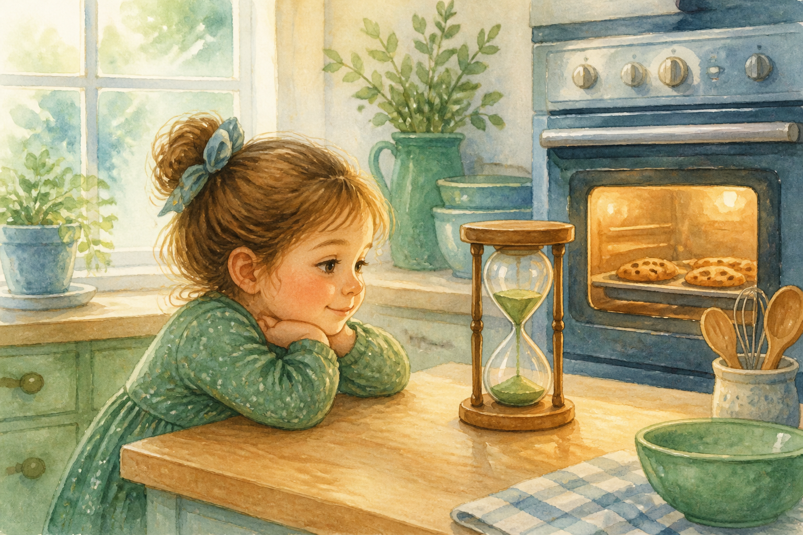

## Глава 70. Терпение и ожидание

*(Папа медленно считает до трёх)*

Ждать очередь, ждать день рождения, ждать маму с работы — трудно! Терпение — мышца сердца. Она растёт, когда мы не топаем каждую секунду.

Можно сказать: «Мне трудно ждать» — и подышать, помолиться, найти тихое дело. Бог тоже часто учит нас ждать с любовью.

**📖 Стих из Библии:**
7. Итак, братия, будьте долготерпеливы до пришествия Господня. Вот, земледелец ждет драгоценного плода от земли и для него терпит долго, пока получит дождь ранний и поздний. 8. Долготерпите и вы, укрепите сердца ваши, потому что пришествие Господне приближается.
Иакова 5:7-8 (Синодальный перевод)

**🗣 Поговорим:**
*Папа:* Что тебе ждать труднее всего?
*(Дать дочке ответить)*

**🙏 Наша молитва:**
«Иисус, научи меня терпению. Помоги ждать спокойно. Аминь.»

---

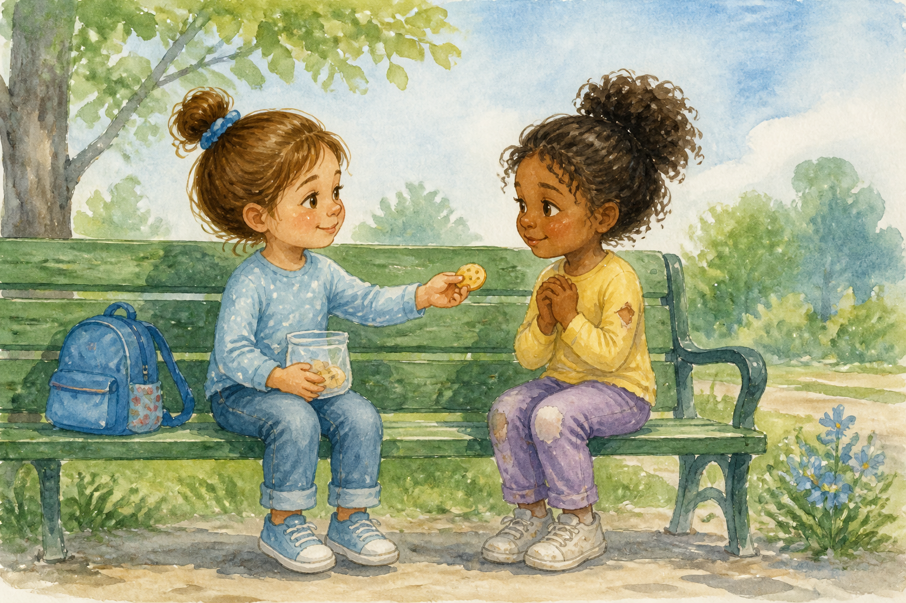

## Глава 71. Щедрость и помощь нуждающимся

*(Папа показывает жест «отдать»)*

Щедрость — когда сердце открывает кулачок: делится игрушкой, печеньем, временем, монеткой для нуждающихся.

Мы помогаем не чтобы «казаться хорошими», а потому что Бог щедр к нам. Бог любит и бедных, и богатых, а ценность человека не измеряется витриной. Маленькая девочка тоже может быть Божьими руками — очень маленькими, но настоящими.

**📖 Стих из Библии:**
6. При сем скажу: кто сеет скупо, тот скупо и пожнет; а кто сеет щедро, тот щедро и пожнет. 7. Каждый уделяй по расположению сердца, не с огорчением и не с принуждением; ибо доброхотно дающего любит Бог.
2 Коринфянам 9:6-7 (Синодальный перевод)

**🗣 Поговорим:**
*Папа:* Чем ты можешь поделиться на этой неделе?
*(Дать дочке ответить)*

**🙏 Наша молитва:**
«Господь, сделай моё сердце щедрым. Аминь.»

---

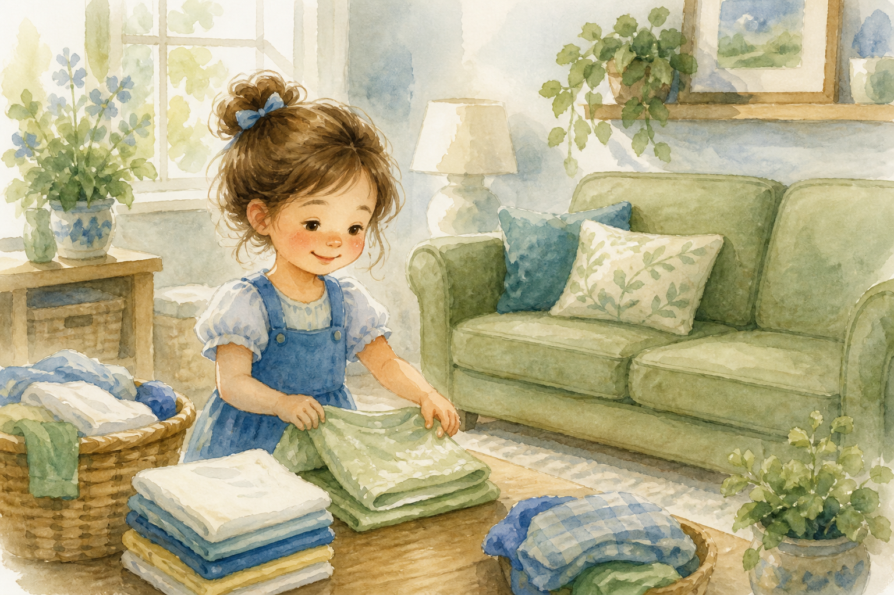

## Глава 72. Труд и лень

*(Папа потягивается, потом бодро встаёт)*

Лень шепчет: «Пусть другие». Труд говорит: «Я помогу». После труда бывает приятная усталость и радость: «Я смогла!»

Мы не рабы дел. Но мы и не принцессы на диване без заботы. Бог даёт руки для добрых дел — дома, в садике, в церкви.

**📖 Стих из Библии:**
23. И все, что делаете, делайте от души, как для Господа, а не для человеков, 24. зная, что в воздаяние от Господа получите наследие, ибо вы служите Господу Христу.
Колоссянам 3:23-24 (Синодальный перевод)

**🗣 Поговорим:**
*Папа:* Какое маленькое дело ты сделаешь сегодня без каприза?
*(Дать дочке ответить)*

**🙏 Наша молитва:**
«Бог, научи меня трудиться с радостью и не лениться. Аминь.»

---

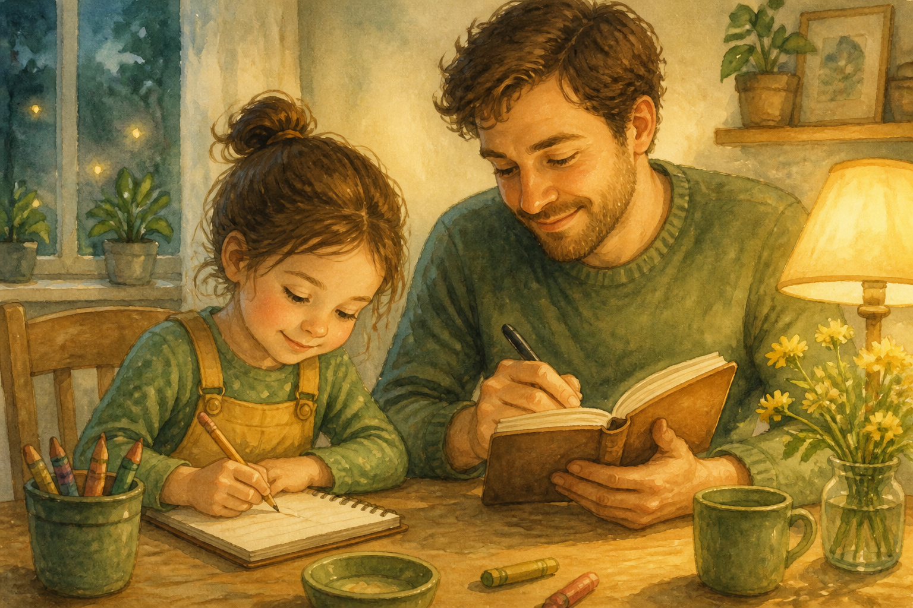

## Глава 73. Благодарность как привычка

*(Папа перечисляет на пальцах)*

Благодарность — очки, через которые мир становится светлее. «Спасибо» за еду, за объятие, за обычный день, за врача, учителя, воспитателя, за Иисуса.

Каждый вечер можно находить три «спасибо». Даже в трудный день найдётся хотя бы одно. Это тренировка радостного сердца.

**📖 Стих из Библии:**
16. Всегда радуйтесь. 17. Непрестанно молитесь. 18. За все благодарите: ибо такова о вас воля Божия во Христе Иисусе.
1 Фессалоникийцам 5:16-18 (Синодальный перевод)

**🗣 Поговорим:**
*Папа:* Назови три «спасибо» за сегодняшний день.
*(Дать дочке ответить)*

**🙏 Наша молитва:**
«Бог, спасибо Тебе за всё доброе. Научи меня замечать Твои дары. Аминь.»

---

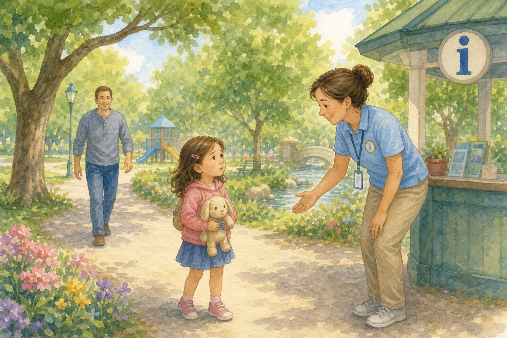

## Глава 74. Незнакомцы и безопасные взрослые

*(Папа говорит спокойно и серьёзно)*

Не каждый улыбчивый взрослый — безопасный. Правило: не уходим с незнакомцами, не садимся в чужую машину, не берём конфеты, деньги и «секретные» подарки. Не рассказываем чужим адрес, код двери и дорогу домой. В лифт с незнакомыми не заходим, дверь дома без взрослых не открываем, окна и балкон одной не открываем.

**Безопасные взрослые** — мама, папа, бабушка, дедушка, воспитатель, охранник или продавец на рабочем месте, тот, кого назвали родители. Если кто-то пугает или зовёт «посекрету» — громко зови меня, маму или безопасного взрослого.

**📖 Стих из Библии:**
3. Благоразумный видит беду, и укрывается; а неопытные идут вперед, и наказываются.
Притчи 22:3 (Синодальный перевод)

**🗣 Поговорим:**
*Папа:* Назови двух-трёх своих безопасных взрослых.
*(Дать дочке ответить)*

**🙏 Наша молитва:**
«Господь, храни меня. Дай смелость звать на помощь. Аминь.»

---

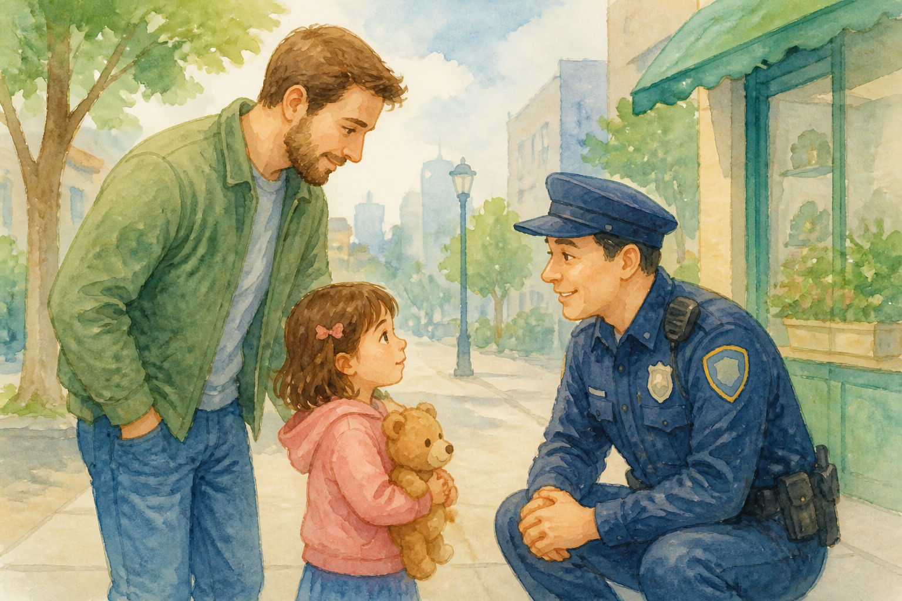

## Глава 75. Что делать, если потерялась

*(Папа отрабатывает план, как тренировку)*

Если вдруг потерялась в магазине, торговом центре, парке, на празднике или в транспорте:
1. Остановись на месте, если это безопасно, или подойди к кассе, охране, водителю, сотруднику станции, маме с детьми.
2. Громко зови: «Папа! Мама!»
3. Скажи: «Я потерялась. Помогите позвать моих родителей».
4. Не уходи с незнакомцем «помочь искать» и не выбегай куда попало.

Мы всегда будем искать тебя. Ты очень важна.

**📖 Стих из Библии:**
7. Господь сохранит тебя от всякого зла; сохранит душу твою Господь. 8. Господь будет охранять выхождение твое и вхождение твое отныне и вовек.
Псалом 120:7-8 (Синодальный перевод)

**🗣 Поговорим:**
*Папа:* Давай повторим план вместе: остановиться — позвать — подойти к кому?
*(Дать дочке ответить)*

**🙏 Наша молитва:**
«Иисус, если мне страшно, будь со мной и помоги найти своих. Аминь.»

---

## Глава 76. Врач, уколы и боль

*(Папа берёт дочку за руку)*

Врач помогает телу быть здоровым. Иногда неприятно: горло смотрят, укол делают, лекарство горькое, аллергия пугает. Боль бывает — но она не навсегда, и ты не одна.

Можно плакать. Можно сжать мою руку. Можно молиться: «Иисус, помоги». Храбрость — не «не чувствовать», а идти через трудное с поддержкой.

**📖 Стих из Библии:**
7. Все заботы ваши возложите на Него, ибо Он печется о вас.
1 Петра 5:7 (Синодальный перевод)

**🗣 Поговорим:**
*Папа:* Что тебе помогает у врача?
*(Дать дочке ответить)*

**🙏 Наша молитва:**
«Иисус, будь со мной у врача. Дай спокойствие и исцеление. Аминь.»

---

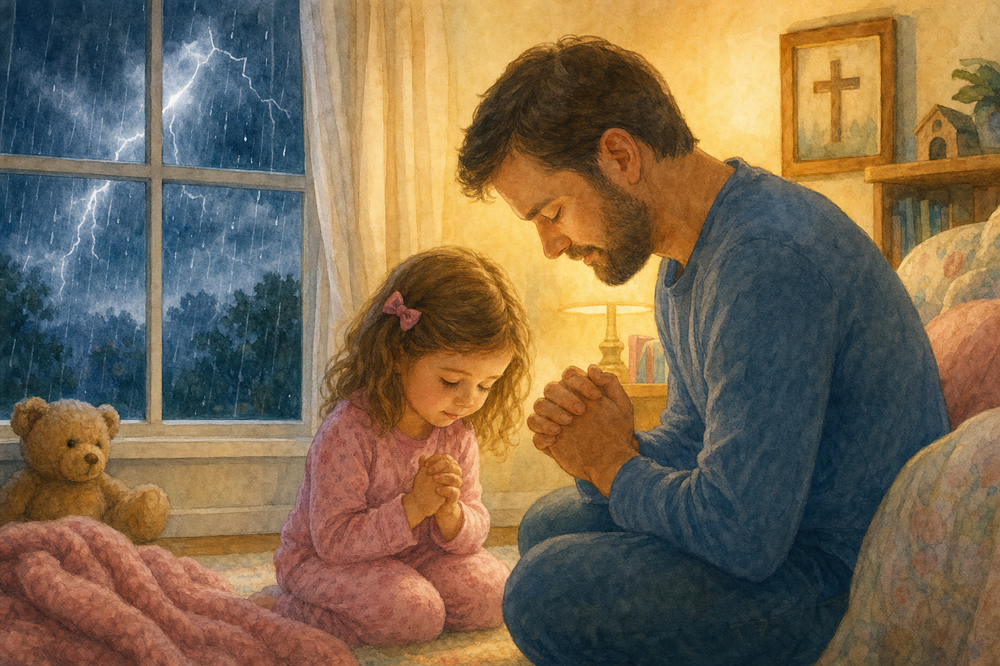

## Глава 77. Гроза и непогода

*(Папа изображает гром далеко-далеко)*

Гром бывает громким. Молния — яркой. Это сила природы, которую создал Бог. Дом, родители и молитва — твоя тихая гавань.

Можно сказать: «Мне страшно» — и держаться за руку. Бог сильнее страха. Буря проходит. Утро приходит.

**📖 Стих из Библии:**
4. Когда я в страхе, на Тебя я уповаю.
Псалом 55:4 (Синодальный перевод)

**🗣 Поговорим:**
*Папа:* Что тебе помогает, когда гремит гром?
*(Дать дочке ответить)*

**🙏 Наша молитва:**
«Бог, Ты сильнее бури. Успокой моё сердце. Аминь.»

---

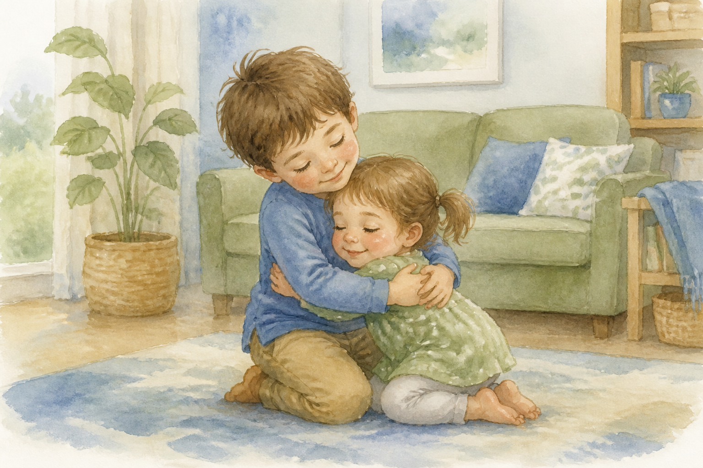

## Глава 78. Братья, сёстры и ревность

*(Папа говорит очень понимающе)*

Если есть брат или сестра — иногда хочется кричать: «Это моё! А меня меньше любят!» Если ты одна — иногда тоже бывает ревность к друзьям или малышам в гостях.

Ревность болит. Но любовь родителей не как торт, который кончается. Божья любовь тоже не делится по крошкам. Можно сказать о боли словами, заботиться о младших и слабых в игре, уважать сон малыша — и учиться радоваться вместе.

**📖 Стих из Библии:**
12. Почитай отца твоего и мать твою, чтобы продлились дни твои на земле, которую Господь, Бог твой, дает тебе.
Исход 20:12 (Синодальный перевод)

**🗣 Поговорим:**
*Папа:* Когда тебе бывает ревниво — и что бы ты хотела услышать?
*(Дать дочке ответить)*

**🙏 Наша молитва:**
«Господь, исцели мою ревность. Научи делить любовь. Аминь.»

---

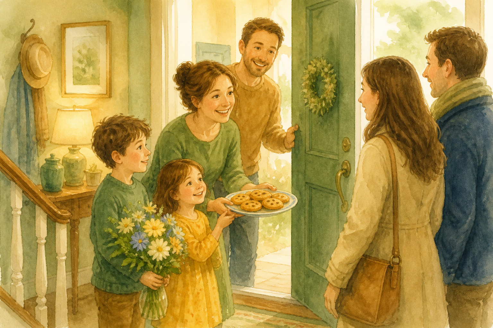

## Глава 79. Гости и гостеприимство

*(Папа распахивает воображаемую дверь)*

Гостеприимство — тёплое «заходите!» Угостить, показать игрушку, сказать «здравствуйте», не хватать всё со стола первым.

Гость — не враг и не хозяин твоего сердца. В церкви могут быть гости из другой страны, с другим языком и привычками. Мы делимся домом и вниманием, потому что Бог сначала принял нас.

**📖 Стих из Библии:**
12. Итак во всем, как хотите, чтобы с вами поступали люди, так поступайте и вы с ними, ибо в этом закон и пророки.
Матфея 7:12 (Синодальный перевод)

**🗣 Поговорим:**
*Папа:* Как можно обрадовать гостя?
*(Дать дочке ответить)*

**🙏 Наша молитва:**
«Иисус, научи меня тёплому гостеприимству. Аминь.»

---

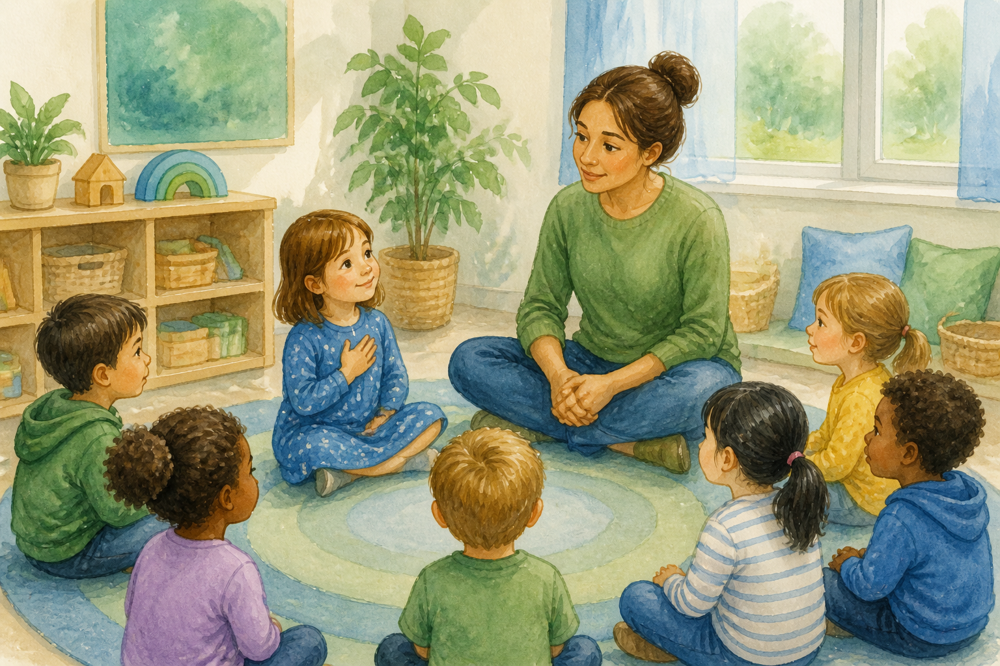

## Глава 80. Воспитатели и уважение

*(Папа кивает с уважением)*

Воспитатель и учитель помогают расти. Мы говорим уважительно, слушаем правила группы и благодарим за обычную заботу.

Уважение — не слепой страх. Если кто-то поступает плохо или тебе опасно — ты всё равно рассказываешь мне и маме. Взрослые тоже бывают разными. Твоя безопасность важнее «молчаливой вежливости».

**📖 Стих из Библии:**
12. Итак во всем, как хотите, чтобы с вами поступали люди, так поступайте и вы с ними, ибо в этом закон и пророки.
Матфея 7:12 (Синодальный перевод)

**🗣 Поговорим:**
*Папа:* Чем хороший воспитатель похож на доброго помощника?
*(Дать дочке ответить)*

**🙏 Наша молитва:**
«Господь, благослови моих воспитателей. Дай мне уважение и смелость говорить правду. Аминь.»

---

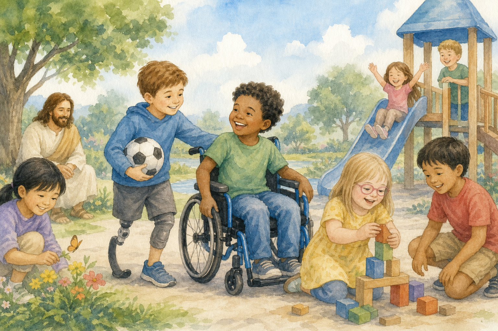

## Глава 81. Каждый человек — ценный

*(Папа говорит медленно и важно)*

Некоторые дети ходят иначе, слышат иначе, учатся иначе. Кто-то в коляске. Кто-то говорит медленнее.

Это не повод смеяться. Каждый человек — Божье творение с достоинством. Стыд не должен прятать человека в угол, а чужая бедность или богатство не делает его лучше или хуже. Мы дружим, помогаем, не пялимся грубо, не обзываем. Иисус любит всех детей.

**📖 Стих из Библии:**
34. Петр отверз уста и сказал: истинно познаю, что Бог нелицеприятен, 35. но во всяком народе боящийся Его и поступающий по правде приятен Ему.
Деяния 10:34-35 (Синодальный перевод)

**🗣 Поговорим:**
*Папа:* Как можно быть доброй подругой тому, кто не похож на тебя?
*(Дать дочке ответить)*

**🙏 Наша молитва:**
«Иисус, научи меня видеть ценность каждого человека. Аминь.»

---

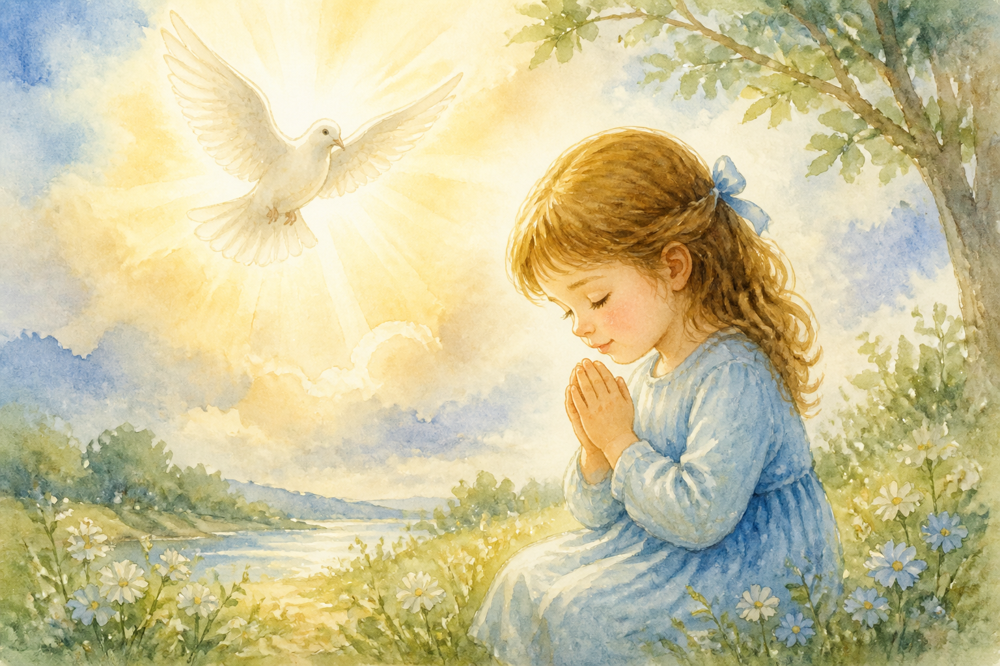

## Глава 82. Святой Дух — Помощник рядом

*(Папа говорит просто и тепло)*

Бог — Отец, Сын Иисус и Святой Дух. Святой Дух — Помощник. Он помогает помнить доброе, утешает, учит, даёт силы сказать «нет» плохому.

Ты не видишь ветер — но чувствуешь. Так и Дух Божий действует мягко и сильно. Совесть может тихо подсказать: «остановись, скажи правду, попроси прощения». Можно молиться: «Святой Дух, помоги мне».

**📖 Стих из Библии:**
26. Утешитель же, Дух Святый, Которого пошлет Отец во имя Мое, научит вас всему и напомнит вам все, что Я говорил вам. 27. Мир оставляю вам, мир Мой даю вам; не так, как мир дает, Я даю вам. Да не смущается сердце ваше и да не устрашается.
Иоанна 14:26-27 (Синодальный перевод)

**🗣 Поговорим:**
*Папа:* В чём тебе сегодня нужна помощь Помощника?
*(Дать дочке ответить)*

**🙏 Наша молитва:**
«Святой Дух, будь моим Помощником. Научи меня добру. Аминь.»

---

## Глава 83. Ангелы — Божьи слуги

*(Папа говорит спокойно, без сказки-ужастика)*

Ангелы — Божьи слуги. Они не волшебные феи из мультика и не персонажи для игры в суеверия. Бог может посылать защиту и помощь.

Главное — не ангелы, а Бог. Мы молимся Богу, доверяем Иисусу. Ангелы радуются, когда человек идёт путём добра.

**📖 Стих из Библии:**
11. Ибо Ангелам Своим заповедает о тебе - охранять тебя на всех путях твоих: 12. на руках понесут тебя, да не преткнешься о камень ногою твоею;
Псалом 90:11-12 (Синодальный перевод)

**🗣 Поговорим:**
*Папа:* Кому мы доверяем в первую очередь — ангелам или Богу?
*(Дать дочке ответить)*

**🙏 Наша молитва:**
«Бог, спасибо за Твою защиту. Научи меня доверять Тебе. Аминь.»

---

## Глава 84. Крещение: я принадлежу Иисусу

*(Папа говорит торжественно и просто)*

Крещение — особый знак, что человек принадлежит Иисусу и Божьей семье. В разных церквях это делают по-разному: кого-то крестят маленьким, кого-то — когда уже верит сам и понимает.

Сейчас тебе важно знать: Иисус зовёт тебя к Себе. Ты можешь сказать Ему: «Я хочу быть Твоей». А когда крестят друга, брата или сестру, мы радуемся: ещё один человек говорит Иисусу «да». Про детали крещения в нашей семье мы поговорим с мамой и пастором спокойно.

**📖 Стих из Библии:**
38. Петр же сказал им: покайтесь, и да крестится каждый из вас во имя Иисуса Христа для прощения грехов; и получите дар Святаго Духа. 39. Ибо вам принадлежит обетование и детям вашим и всем дальним, кого ни призовет Господь Бог наш.
Деяния 2:38-39 (Синодальный перевод)

**🗣 Поговорим:**
*Папа:* Что значит для тебя «принадлежать Иисусу»?
*(Дать дочке ответить)*

**🙏 Наша молитва:**
«Иисус, я хочу быть Твоей. Веди меня. Аминь.»

---

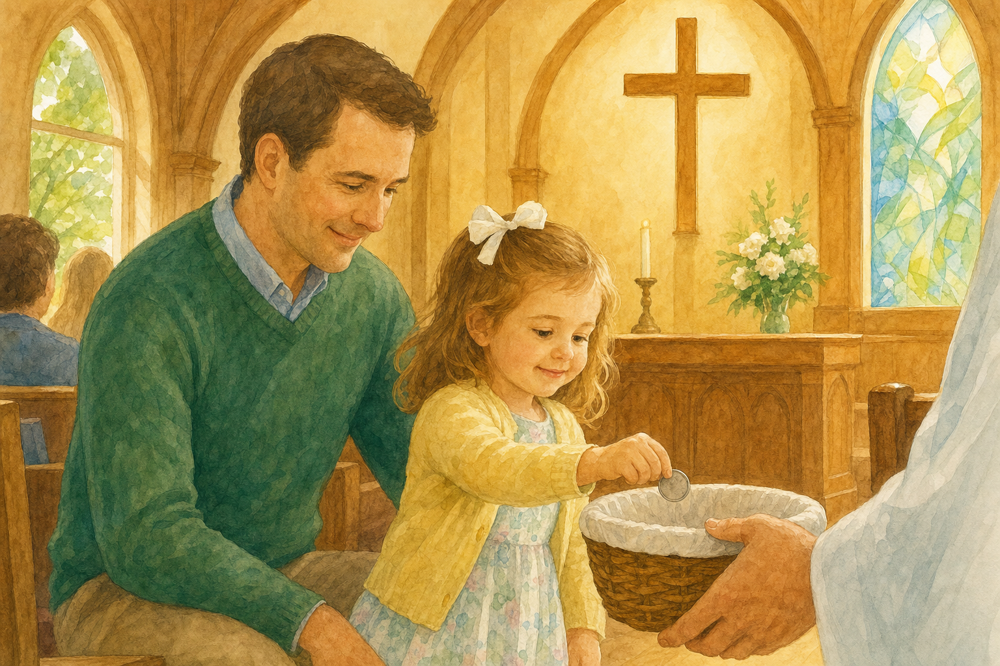

## Глава 85. Монетка от сердца

*(Папа кладёт воображаемую монетку)*

В церкви люди приносят пожертвование — часть того, что Бог дал. Это не «плата за билет». Это благодарность и забота о деле Божьем и о нуждающихся.

Даже маленькая монетка от сердца важна. Когда вырастешь, услышишь слово «десятина» — часть того, что Бог дал, возвращают Ему с благодарностью. Сейчас главное простое: Бог смотрит не на размер монеты — на сердце.

**📖 Стих из Библии:**
6. При сем скажу: кто сеет скупо, тот скупо и пожнет; а кто сеет щедро, тот щедро и пожнет. 7. Каждый уделяй по расположению сердца, не с огорчением и не с принуждением; ибо доброхотно дающего любит Бог.
2 Коринфянам 9:6-7 (Синодальный перевод)

**🗣 Поговорим:**
*Папа:* Почему важно давать с радостью, а не с обидой?
*(Дать дочке ответить)*

**🙏 Наша молитва:**
«Господь, научи меня давать с благодарным сердцем. Аминь.»

---

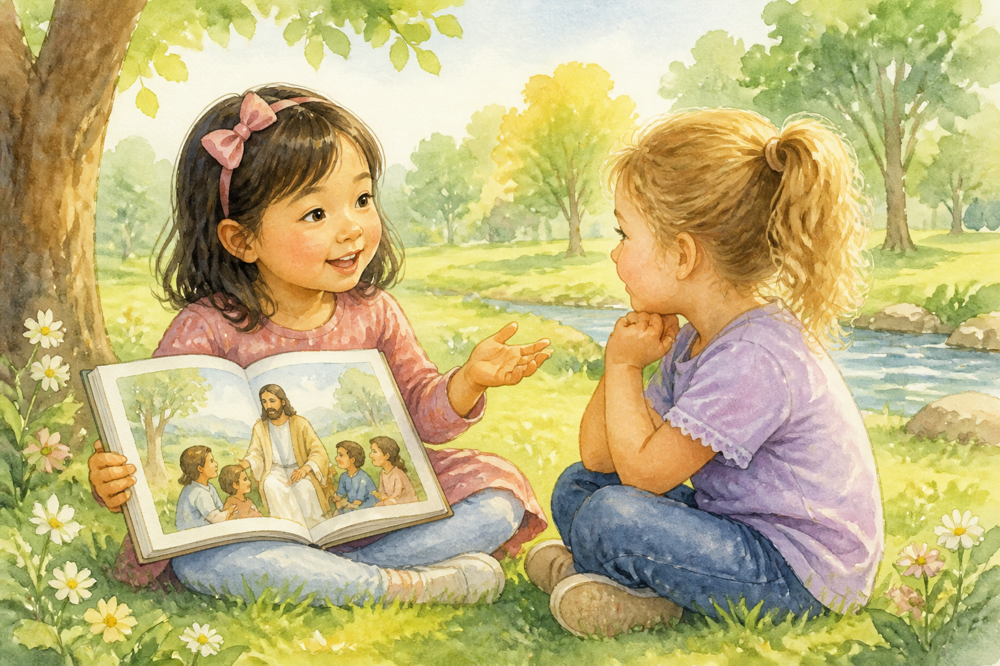

## Глава 86. Рассказывать друзьям об Иисусе

*(Папа шепчет, как секрет радости)*

Если у тебя есть вкусная ягода — хочется поделиться. Если есть Иисус — тоже можно делиться: «Он меня любит. Он помогает. Он прощает».

Мы не спорим грубо и не давим. Мы светим. Можно пригласить в церковь, нарисовать открытку, рассказать историю, помочь тому, кому трудно. Мечты служить людям начинаются с маленькой доброты сегодня. Миссионер — даже пятилетка со светлым сердцем.

**📖 Стих из Библии:**
19. Итак идите, научите все народы, крестя их во имя Отца и Сына и Святаго Духа, 20. уча их соблюдать все, что Я повелел вам; и се, Я с вами во все дни до скончания века. Аминь.
Матфея 28:19-20 (Синодальный перевод)

**🗣 Поговорим:**
*Папа:* Кому из друзей ты могла бы сказать что-то доброе об Иисусе?
*(Дать дочке ответить)*

**🙏 Наша молитва:**
«Иисус, помоги мне смело и ласково рассказывать о Тебе. Аминь.»

---

## Глава 87. Когда близкие с Иисусом

*(Папа обнимает, говорит очень нежно)*

Иногда кто-то из близких умирает — и становится очень грустно. Можно плакать. Иисус тоже плакал с друзьями.

Для тех, кто с Иисусом, смерть — не конец: они с Богом. Мы помним, любим, благодарим за жизнь этого человека и держимся надежды. Если грустно — скажи мне. Мы вместе.

**📖 Стих из Библии:**
15. А я и дом мой будем служить Господу.
Иисус Навин 24:15 (Синодальный перевод)

**🗣 Поговорим:**
*Папа:* Кого из близких ты хочешь поблагодарить в молитве?
*(Дать дочке ответить)*

**🙏 Наша молитва:**
«Иисус, утешь нас. Спасибо за надежду Небес. Аминь.»

---

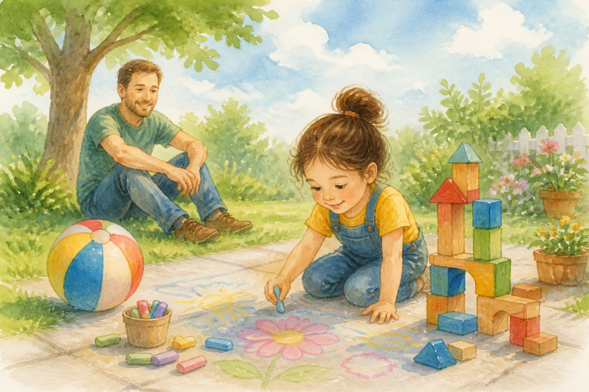

## Глава 88. Скука: что делать без экрана

*(Папа разводит руками — и вдруг оживляется)*

Скука — не враг. Иногда она как пустая страница: можно нарисовать что угодно! Построить из подушек дом. Найти жучка. Слепить. Спеть. Помочь на кухне. Посмотреть в окно на облака.

Экран кричит: «Скучно? Нажми!» А мы учимся: скука проходит, если дать рукам и фантазии работу. Бог дал тебе ум и игрушки мира — даже палочки и камешки.

**📖 Стих из Библии:**
11. Остановитесь и познайте, что Я - Бог: буду превознесен в народах, превознесен на земле.
Псалом 45:11 (Синодальный перевод)

**🗣 Поговорим:**
*Папа:* Что интересное можно сделать без телефона прямо сейчас?
*(Дать дочке ответить)*

**🙏 Наша молитва:**
«Творец, спасибо за фантазию. Научи меня играть и творить без экрана. Аминь.»

---

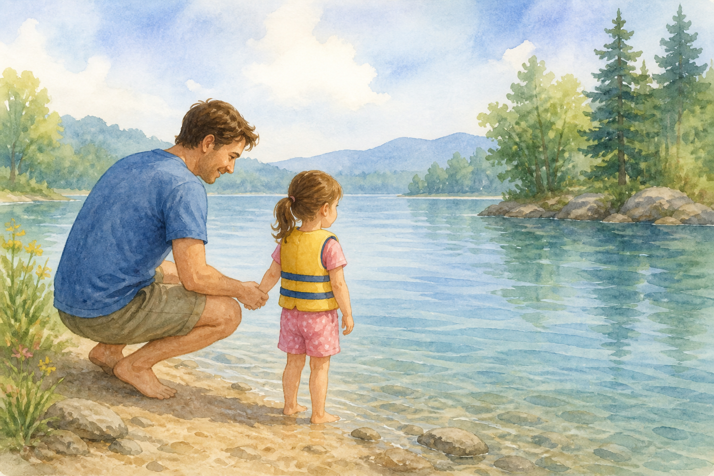

## Глава 89. Вода: пить и быть осторожной

*(Папа показывает глоток — и «стоп» у края)*

Вода — чудо: она утоляет жажду, помогает расти, в ней плещутся рыбки. Пей достаточно — телу нужна водичка.

А у моря, озера, ванны и бассейна — правило: только со взрослым. Не заплываем туда, где глубоко и страшно. Вода друг, когда рядом мудрость. Я учу тебя плавать и осторожности — потому что люблю.

**📖 Стих из Библии:**
3. Благоразумный видит беду, и укрывается; а неопытные идут вперед, и наказываются.
Притчи 22:3 (Синодальный перевод)

**🗣 Поговорим:**
*Папа:* Какие правила у воды мы запомним вместе?
*(Дать дочке ответить)*

**🙏 Наша молитва:**
«Бог, спасибо за воду. Научи меня пить и быть осторожной. Аминь.»

---

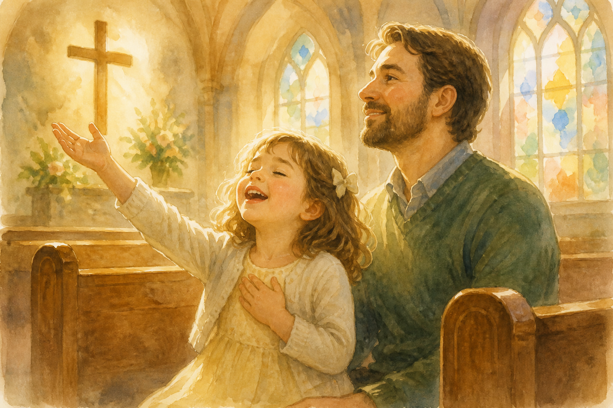

## Глава 90. Петь Богу от сердца

*(Папа тихо запевает)*

Поклонение и прославление — не концерт и не только «стоять ровно». Это сказать Богу: «Ты большой! Ты хороший! Я Тебя люблю!» Можно петь громко, можно тихо. Можно хлопать. Можно просто слушать и улыбаться.

Богу важнее сердце, чем идеальные ноты. Если промазала звук — не беда. Главное — кому ты поёшь.

**📖 Стих из Библии:**
6. Все дышащее да хвалит Господа! Аллилуия.
Псалом 150:6 (Синодальный перевод)

**🗣 Поговорим:**
*Папа:* Какую песню о Боге тебе нравится петь?
*(Дать дочке ответить)*

**🙏 Наша молитва:**
«Бог, принимай мою песню. Научи меня любить Тебя голосом и сердцем. Аминь.»

---

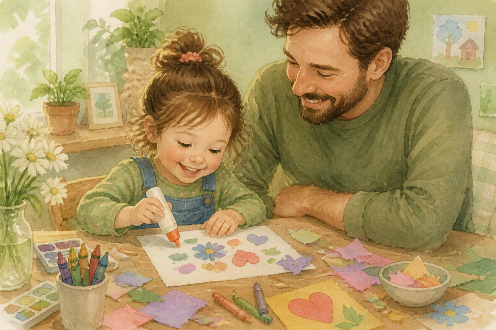

## Глава 91. Рукоделие и творчество — радость, не идеал

*(Папа радуется кривой, но искренней поделке)*

Клеить, рисовать, шить, лепить — это радость рук! Не экзамен на «самую ровную аппликацию в мире». Если хвостик у зайца кривой — зато зайчик твой и живой.

Сравнение и «надо идеально» крадут веселье. Можно расстелить клеёнку, испачкать пальцы краской, потом вместе убрать. Бог Творец радуется, когда ты творишь с любовью. Давай иногда творить просто так — для улыбки.

**📖 Стих из Библии:**
8. Наконец, братия мои, что только истинно, что честно, что справедливо, что чисто, что любезно, что достославно, что только добродетель и похвала, о том помышляйте.
Филиппийцам 4:8 (Синодальный перевод)

**🗣 Поговорим:**
*Папа:* Что тебе хочется сделать руками на этой неделе?
*(Дать дочке ответить)*

**🙏 Наша молитва:**
«Творец, спасибо за руки и фантазию. Научи меня радоваться творчеству без страха ошибки. Аминь.»

---

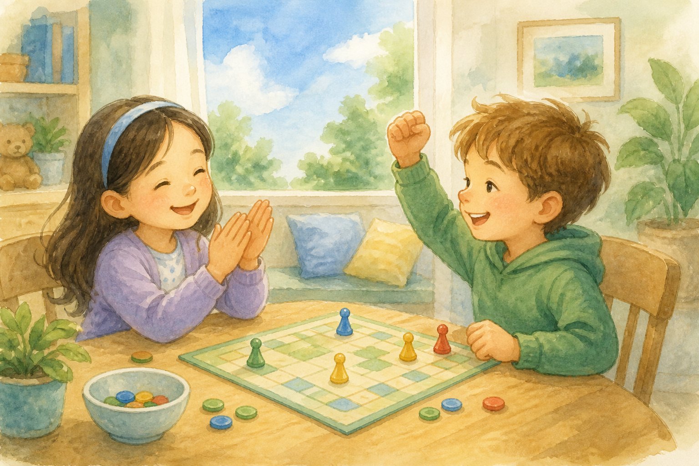

## Глава 92. Умение проигрывать

*(Папа хлопает победителю — и обнимает проигравшую)*

В игре кто‑то выигрывает, кто‑то нет. Проигрывать обидно — можно вздохнуть. Нельзя ломать игру, кричать «нечестно всегда!» и портить радость другим.

Храбрая девочка говорит: «Молодец! Ещё партию?» Проигрыш — учитель, не враг. Он учит терпению. Радоваться чужой победе тоже тренировка сердца. А завтра ты можешь выиграть — и тогда тоже будешь доброй.

**📖 Стих из Библии:**
8. Наконец, братия мои, что только истинно, что честно, что справедливо, что чисто, что любезно, что достославно, что только добродетель и похвала, о том помышляйте.
Филиппийцам 4:8 (Синодальный перевод)

**🗣 Поговорим:**
*Папа:* Что сказать, когда проиграла, но хочешь остаться доброй?
*(Дать дочке ответить)*

**🙏 Наша молитва:**
«Иисус, научи меня проигрывать с миром в сердце. Аминь.»

---

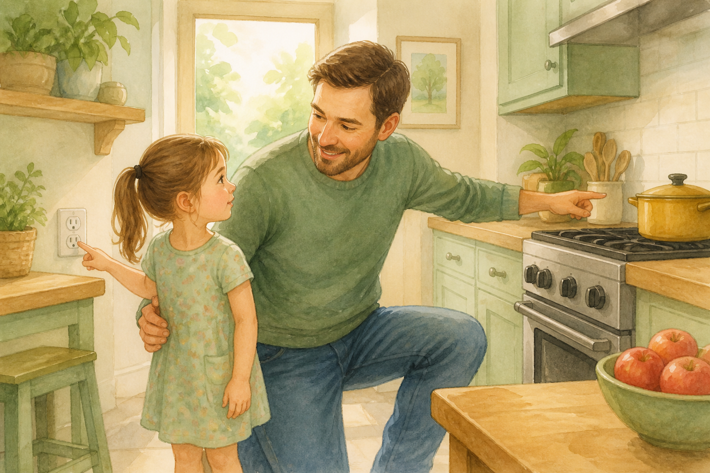

## Глава 93. Огонь, розетки и горячее

*(Папа показывает «стоп» ладонью)*

Огонь красивый — и опасный. Плита, чайник, свеча, розетка — это не игрушки. Правило: не трогаем сами. Если нужно — только со мной или с мамой.

Горячее обжигает быстро. Розетка — не дырочки для палочек. Если видишь опасность — отойди и позови взрослого. Умная осторожность — тоже храбрость.

**📖 Стих из Библии:**
8. Наконец, братия мои, что только истинно, что честно, что справедливо, что чисто, что любезно, что достославно, что только добродетель и похвала, о том помышляйте.
Филиппийцам 4:8 (Синодальный перевод)

**🗣 Поговорим:**
*Папа:* Что из «горячего и электрического» мы никогда не трогаем одни?
*(Дать дочке ответить)*

**🙏 Наша молитва:**
«Господь, храни меня. Научи осторожности дома. Аминь.»

---

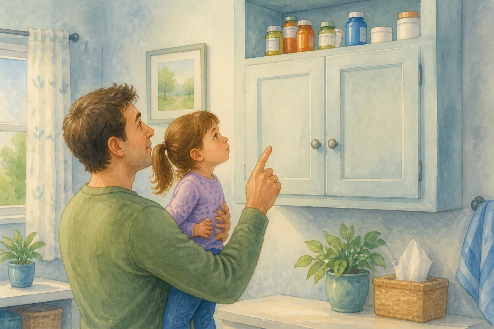

## Глава 94. Лекарства — не конфеты

*(Папа качает головой у полки)*

Лекарства бывают сладкими на вкус — но это не конфеты. Их даёт только мама, папа или врач. Самой из шкафчика не берём. И другу «полечиться» не угощаем.

Если нашла таблетку на полу — не в рот. Позови взрослого. Так мы бережём тело, которое дал Бог.

**📖 Стих из Библии:**
3. Благоразумный видит беду, и укрывается; а неопытные идут вперед, и наказываются.
Притчи 22:3 (Синодальный перевод)

**🗣 Поговорим:**
*Папа:* Что делать, если увидела лекарство без взрослых?
*(Дать дочке ответить)*

**🙏 Наша молитва:**
«Бог, научи меня слушаться в заботе о здоровье. Аминь.»

---

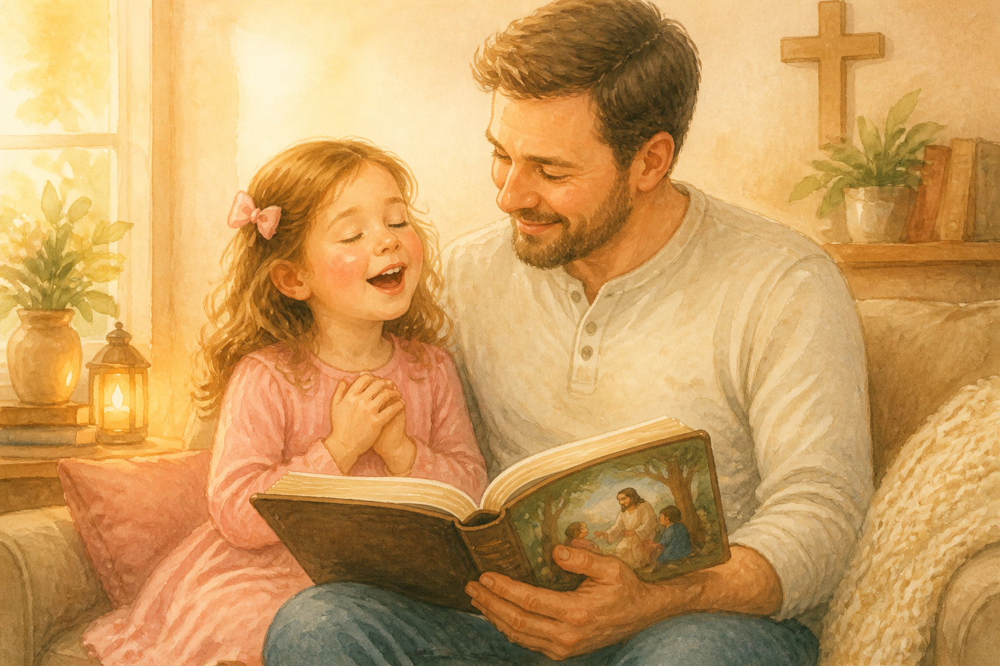

## Глава 95. Библейский стих на неделю

*(Папа открывает детскую Библию)*

Каждую неделю можно взять **одну короткую** Божью фразу — как витаминку для сердца. Например: «Бог есть любовь» или «Не бойся, Я с тобой».

Мы повторяем её утром, в дороге, перед сном — играючи, не как экзамен. Слово Божье селится в память и потом помогает в трудный день.

**📖 Стих из Библии:**
11. В сердце моем сокрыл я слово Твое, чтобы не грешить пред Тобою.
Псалом 118:11 (Синодальный перевод)

**🗣 Поговорим:**
*Папа:* Какой короткий стих хочешь учить на эту неделю?
*(Дать дочке ответить)*

**🙏 Наша молитва:**
«Господь, посели Своё слово в моём сердце. Аминь.»

---

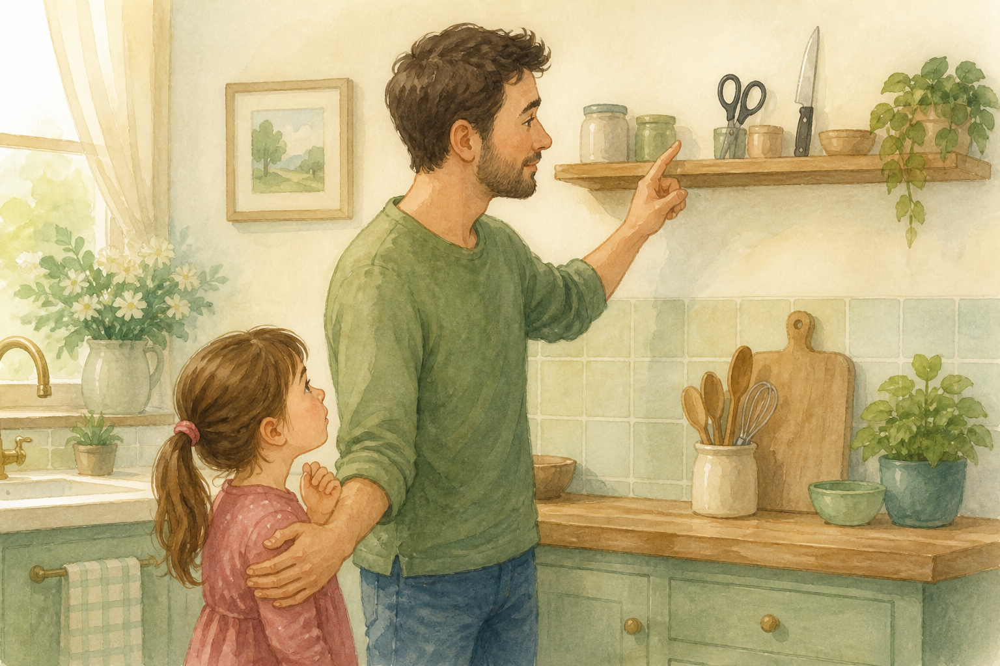

## Глава 96. Острые предметы: ножницы и ножи

*(Папа показывает «стоп» у ножниц)*

Ножницы и ножи — помощники взрослых, не игрушки. Они острые. Мы не берём их сами, не машем, не «просто потрогать».

Если нужно вырезать — только со мной или с мамой, медленно и внимательно. Увидел острый предмет на полу — не поднимай к лицу, позови взрослого. Осторожность бережёт пальчики.

**📖 Стих из Библии:**
3. Благоразумный видит беду, и укрывается; а неопытные идут вперед, и наказываются.
Притчи 22:3 (Синодальный перевод)

**🗣 Поговорим:**
*Папа:* Что делать, если увидел нож или ножницы без взрослых?
*(Дать дочке ответить)*

**🙏 Наша молитва:**
«Господь, научи меня осторожности с острым. Аминь.»

---

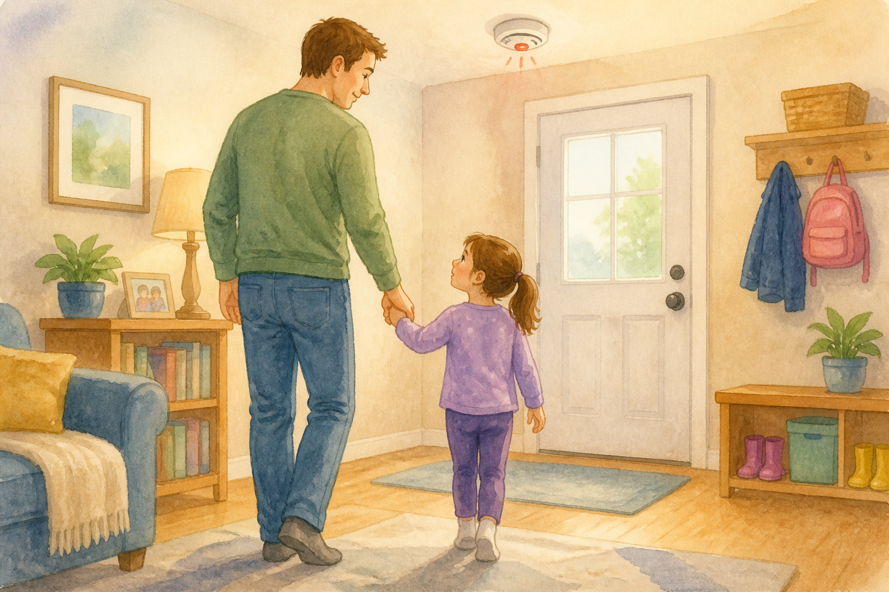

## Глава 97. Пожарная сирена и тревога дома

*(Папа говорит очень спокойно)*

Иногда пищит датчик или воет сирена. Это громко — можно испугаться. Мы не бегаем как курочки. Мы делаем простое:

1. Идём к взрослому.
2. Если дым/опасно — вместе к выходу, низко, без лифта если сказали взрослые.
3. Не прячемся в шкаф.
4. На улице ждём на месте сбора.

Тренировка — не страшилка. Это умная забота. Я с тобой.

**📖 Стих из Библии:**
3. Благоразумный видит беду, и укрывается; а неопытные идут вперед, и наказываются.
Притчи 22:3 (Синодальный перевод)

**🗣 Поговорим:**
*Папа:* Какой первый шаг, если услышала громкую тревогу дома?
*(Дать дочке ответить)*

**🙏 Наша молитва:**
«Иисус, когда громко и страшно — будь рядом и дай спокойствие. Аминь.»

---

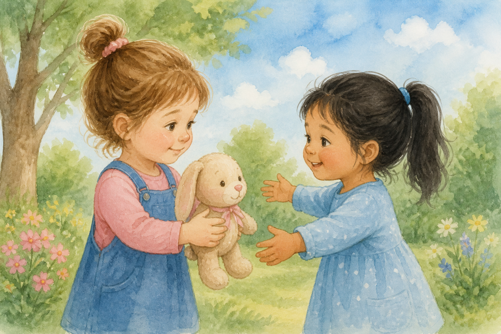

## Глава 98. Как мириться после ссоры

*(Папа считает шаги на пальцах)*

После ссоры мир возвращается шагами:
1. Остыть (подышать).
2. Сказать, что больно, без крика.
3. Искреннее «прости».
4. Принять «прости» другого.
5. Иногда — исправить дело (поднять игрушку, обнять).

Мириться — не «кто победил». Мириться — снова выбрать любовь. Иисус любит мир.

**📖 Стих из Библии:**
17. Никому не воздавайте злом за зло, но пекитесь о добром перед всеми человеками. 18. Если возможно с вашей стороны, будьте в мире со всеми людьми.
Римлянам 12:17-18 (Синодальный перевод)

**🗣 Поговорим:**
*Папа:* Какой шаг мира тебе даётся труднее всего?
*(Дать дочке ответить)*

**🙏 Наша молитва:**
«Иисус, научи меня мириться быстро и искренне. Аминь.»

---

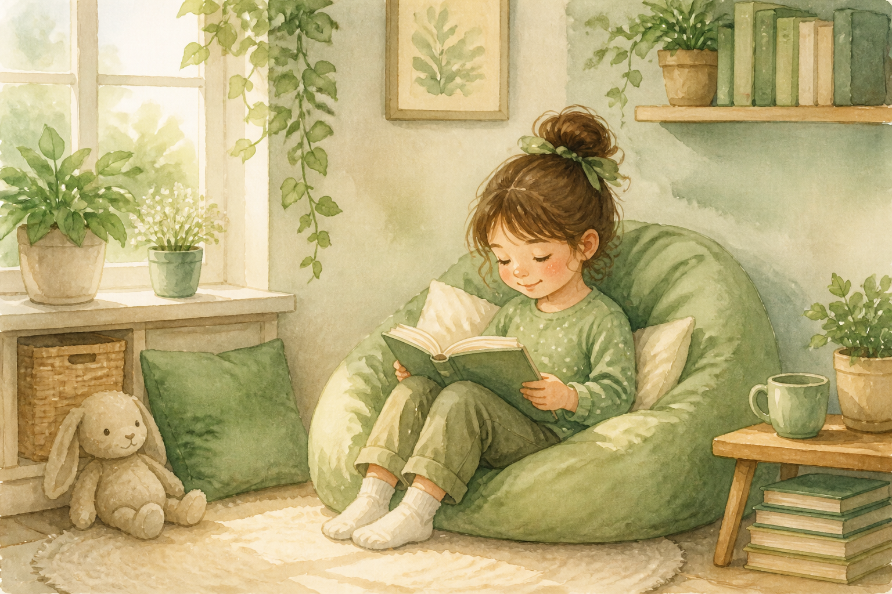

## Глава 99. «Мне нужно побыть одной»

*(Папа уважительно отходит на шаг)*

Иногда сердце полное шума: хочется тишины, уголка, книжки. Можно сказать: «Мне нужно побыть одной немного» — это не злость и не отвержение семьи.

Уважай и чужое «побыть одной». Потом можно вернуться с объятием. Уединение — отдых, не стена навсегда.

**📖 Стих из Библии:**
11. Остановитесь и познайте, что Я - Бог: буду превознесен в народах, превознесен на земле.
Псалом 45:11 (Синодальный перевод)

**🗣 Поговорим:**
*Папа:* Где тебе хорошо побыть одной спокойно?
*(Дать дочке ответить)*

**🙏 Наша молитва:**
«Господь, научи меня отдыхать в тишине и возвращаться с любовью. Аминь.»

---

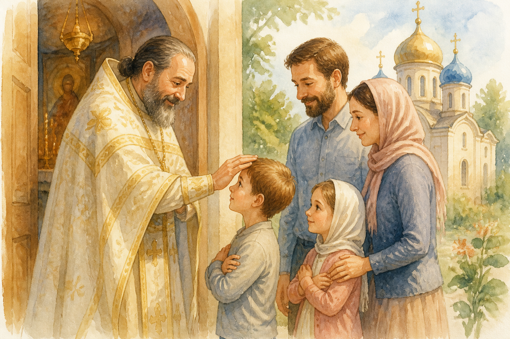

## Глава 100. Священники

*(Папа говорит уважительно и просто)*

В православном храме ты можешь увидеть **священника**. Он в особой одежде, молится, служит, благословляет людей, помогает им идти к Богу.

Священник — не «волшебник». Он человек, который служит Богу и людям. Мы относимся к нему с уважением — как к тому, кто посвятил жизнь церкви. А самый главный Священник для нас — Иисус: Он привёл нас к Отцу.

**📖 Стих из Библии:**
17. Повинуйтесь наставникам вашим и будьте покорны, ибо они неусыпно пекутся о душах ваших, как обязанные дать отчет;
Евреям 13:17 (Синодальный перевод)

**🗣 Поговорим:**
*Папа:* Почему важно уважать тех, кто служит в храме?
*(Дать дочке ответить)*

**🙏 Наша молитва:**
«Господь, научи меня уважать служителей и помнить, что Ты главный. Аминь.»

---

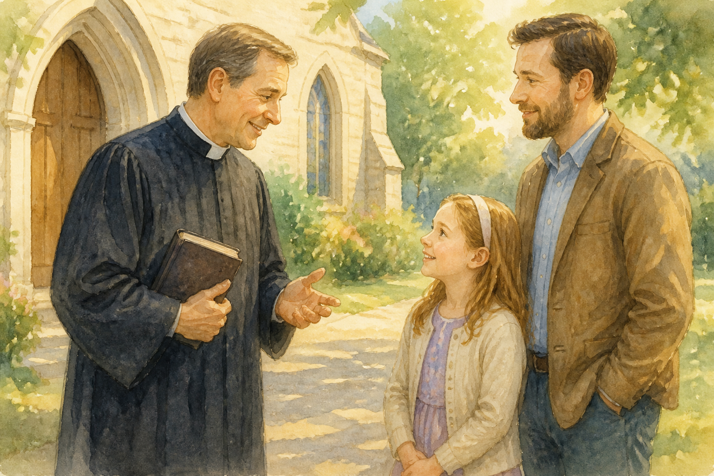

## Глава 101. Пастор

*(Папа улыбается, вспоминая церковь)*

В нашей протестантской церкви есть **пастор**. Он учит из Библии, молится с людьми, заботится о церкви, иногда смеётся с детьми и утешает грустных.

Пастор — не супергерой и не начальник вместо Бога. Он слуга: помогает нам слышать Иисуса. Мы молимся за пастора и слушаем с открытым сердцем. Если что‑то непонятно — можно спросить.

**📖 Стих из Библии:**
17. Повинуйтесь наставникам вашим и будьте покорны, ибо они неусыпно пекутся о душах ваших, как обязанные дать отчет;
Евреям 13:17 (Синодальный перевод)

**🗣 Поговорим:**
*Папа:* Чем пастор помогает нашей церкви?
*(Дать дочке ответить)*

**🙏 Наша молитва:**
«Иисус, благослови нашего пастора. Научи нас слушаться Твоего слова. Аминь.»

---

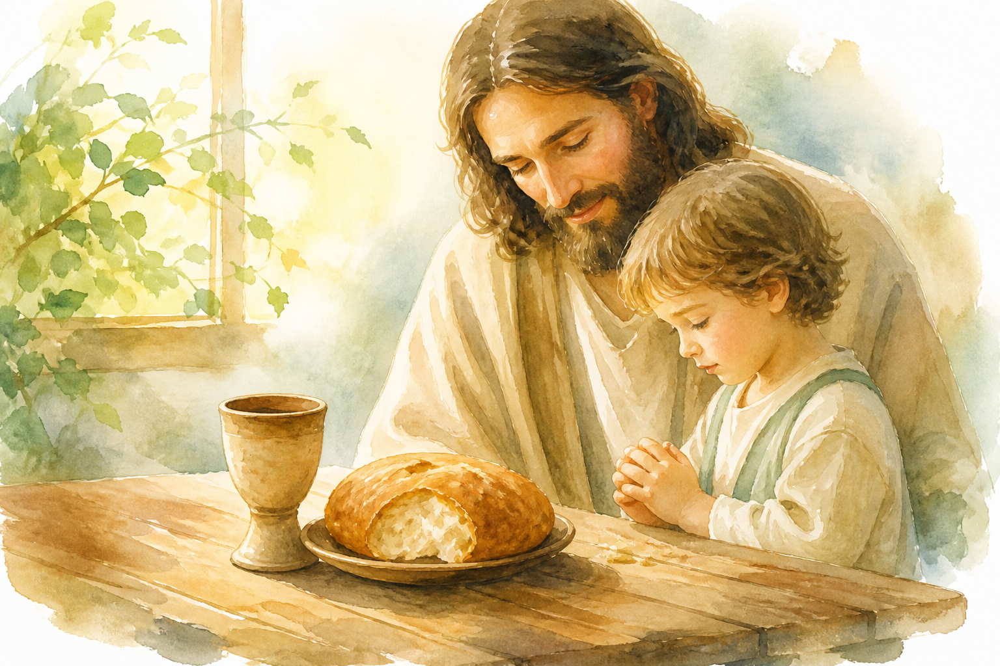

## Глава 102. Причастие

*(Папа говорит тихо и свято)*

**Причастие** (Вечеря Господня) — особое время в церкви. Мы вспоминаем Иисуса: Его тело и кровь, отданные за нас из любви. Хлеб и чаша — напоминание о кресте и прощении.

Это не «перекус». Это святое воспоминание и благодарность. Маленьким иногда объясняют и готовят постепенно — по правилам нашей церкви. Главное понять уже сейчас: Иисус отдал Себя за тебя, потому что любит.

**📖 Стих из Библии:**
23. Ибо я от Самого Господа принял то, что и вам передал, что Господь Иисус в ту ночь, в которую предан был, взял хлеб 24. и, возблагодарив, преломил и сказал: примите, ядите, сие есть Тело Мое, за вас ломимое; сие творите в Мое воспоминание. 25. Также и чашу после вечери, и сказал: сия чаша есть новый завет в Моей Крови; сие творите, когда только будете пить, в Мое воспоминание.
1 Коринфянам 11:23-25 (Синодальный перевод)

**🗣 Поговорим:**
*Папа:* Почему причастие — про любовь Иисуса, а не про еду «просто так»?
*(Дать дочке ответить)*

**🙏 Наша молитва:**
«Иисус, спасибо за Твою любовь. Научи меня помнить Тебя с благодарностью. Аминь.»

---

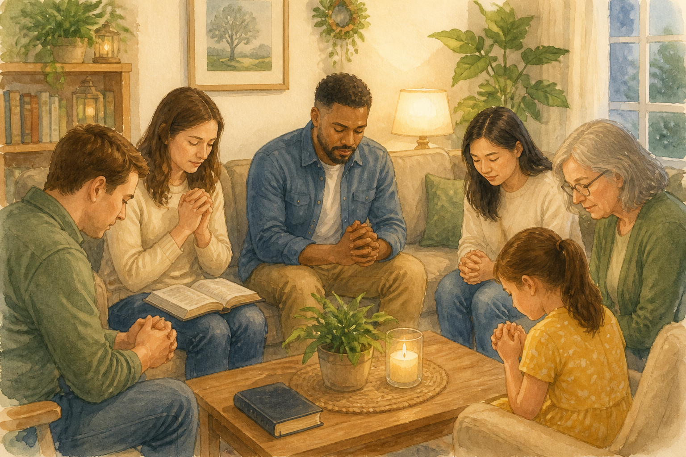

## Глава 103. Домашняя группа

*(Папа показывает уютную гостиную)*

Иногда христиане собираются не только в большом зале, а **дома**: читают Библию, молятся, пьют чай, делятся радостью и трудностями. Это **домашняя группа** — маленькая церковь в квартире.

Там тепло, как в семье. Можно задать вопрос, попросить молитвы, обнять друзей по вере. Большая церковь и домашняя группа — друзья, не враги.

**📖 Стих из Библии:**
24. Будем внимательны друг ко другу, поощряя к любви и добрым делам; 25. не будем оставлять собрания своего, как есть у некоторых обычай; но будем увещевать друг друга, и тем более, чем более усматриваете приближение дня оного.
Евреям 10:24-25 (Синодальный перевод)

**🗣 Поговорим:**
*Папа:* Чем домашняя группа похожа на большую семью?
*(Дать дочке ответить)*

**🙏 Наша молитва:**
«Иисус, благослови нашу домашнюю группу и научи нас любить друг друга. Аминь.»

---

## Глава 104. Смысл жизни

*(Папа смотрит дочке в глаза серьёзно и радостно)*

Зачем мы живём? Не только чтобы есть конфеты и смотреть мультики. **Смысл жизни** — знать Бога, любить Иисуса, любить людей и делать добро, пока мы здесь.

Ты уже живёшь со смыслом, когда молишься, делишься, прощаешь, учишься. Взрослая «работа мечты» потом приложится. Сначала — сердце с Богом.

**📖 Стих из Библии:**
33. Ищите же прежде Царства Божия и правды Его, и это все приложится вам. 34. Итак не заботьтесь о завтрашнем дне, ибо завтрашний сам будет заботиться о своем: довольно для каждого дня своей заботы.
Матфея 6:33-34 (Синодальный перевод)

**🗣 Поговорим:**
*Папа:* Что для тебя значит «жить с Иисусом» уже сейчас?
*(Дать дочке ответить)*

**🙏 Наша молитва:**
«Бог, покажи мне смысл жизни с Тобой. Веди меня. Аминь.»

---

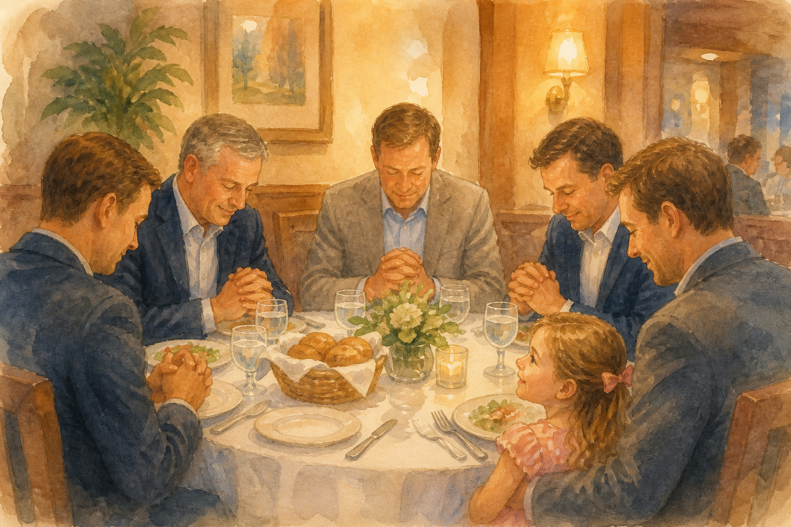

## Глава 105. Христианские встречи взрослых

*(Папа рассказывает как о празднике взрослых)*

Иногда взрослые христиане встречаются за ужином: едят вместе, благодарят Бога, рассказывают, как Иисус помогает честно работать, принимать решения и не забывать о добре.

Это не «просто ресторан». Это дружба людей, которые хотят, чтобы работа служила Богу и ближним. Иногда туда берут семьи — и маленькая девочка видит: вера нужна не только в церкви, но и в обычных взрослых делах.

**📖 Стих из Библии:**
20. ибо, где двое или трое собраны во имя Мое, там Я посреди них.
Матфея 18:20 (Синодальный перевод)

**🗣 Поговорим:**
*Папа:* Почему важно, чтобы взрослые на работе тоже помнили об Иисусе?
*(Дать дочке ответить)*

**🙏 Наша молитва:**
«Господь, благослови деловых людей, которые любят Тебя. Научи честности и добру в труде. Аминь.»

---

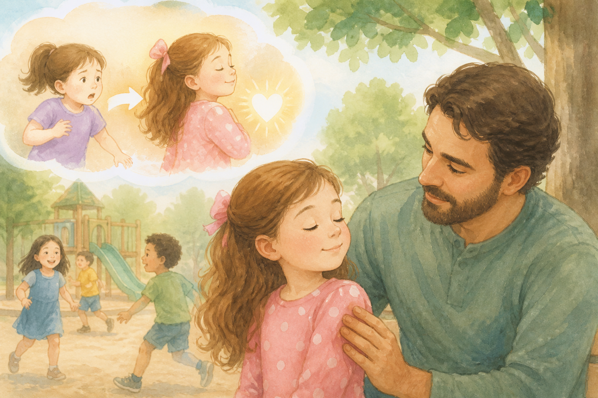

## Глава 106. Подставить другую щёку

*(Папа мягко касается своей щеки)*

Иисус сказал: если тебя ударили по щеке — подставь другую. Для пятилетки это значит: **не отвечай злом на зло**. Не мсти ударом за удар, обзывательством за обзывательство.

Это не «разреши себя бить и молчи». Если опасно — защищайся, уходи, зови взрослого. Но в обычной обиде мы выбираем мир вместо мести. Сила — остановиться.

**📖 Стих из Библии:**
38. Вы слышали, что сказано: око за око и зуб за зуб. 39. А Я говорю вам: не противься злому. Но кто ударит тебя в правую щеку твою, обрати к нему и другую;
Матфея 5:38-39 (Синодальный перевод)

**🗣 Поговорим:**
*Папа:* Что можно сделать вместо «ударить в ответ»?
*(Дать дочке ответить)*

**🙏 Наша молитва:**
«Иисус, научи меня не мстить и выбирать мир. Защити меня. Аминь.»

---

## Глава 107. Библейские девочки: Эсфирь и Мария

*(Папа открывает две картинки-истории)*

В Библии есть смелые девочки и женщины.
**Эсфирь** — царица, которая храбро заступилась за свой народ.
**Мария** — мама Иисуса. Она сказала Богу: «Пусть будет по слову Твоему», хотя было страшно и удивительно.

Ты тоже можешь быть смелой и доверяющей Богу — в садике, дома, в молитве.

**📖 Стих из Библии:**
38. Тогда Мария сказала: се, Раба Господня; да будет Мне по слову твоему. И отошел от Нее Ангел.
Луки 1:38 (Синодальный перевод)

**🗣 Поговорим:**
*Папа:* Чем тебе ближе Эсфирь или Мария — смелость или доверие?
*(Дать дочке ответить)*

**🙏 Наша молитва:**
«Бог, расти во мне смелость Эсфири и доверие Марии. Аминь.»

---

## Глава 108. «Я сама!» и принять помощь

*(Папа протягивает руку — и ждёт согласия)*

«Я сама!» — прекрасные слова роста. Но иногда замок слишком тугой, банка не открывается, сердце тяжёлое. Тогда сила — **принять помощь**.

Просить помощи — не слабость. Даже взрослые просят. Иисус тоже принимал служение друзей. «Помоги, пожалуйста» — умные слова.

**📖 Стих из Библии:**
2. Носите бремена друг друга, и таким образом исполните закон Христов.
Галатам 6:2 (Синодальный перевод)

**🗣 Поговорим:**
*Папа:* Когда тебе легко сказать «я сама», а когда стоит попросить помощь?
*(Дать дочке ответить)*

**🙏 Наша молитва:**
«Господь, научи меня и стараться самой, и принимать помощь. Аминь.»

---

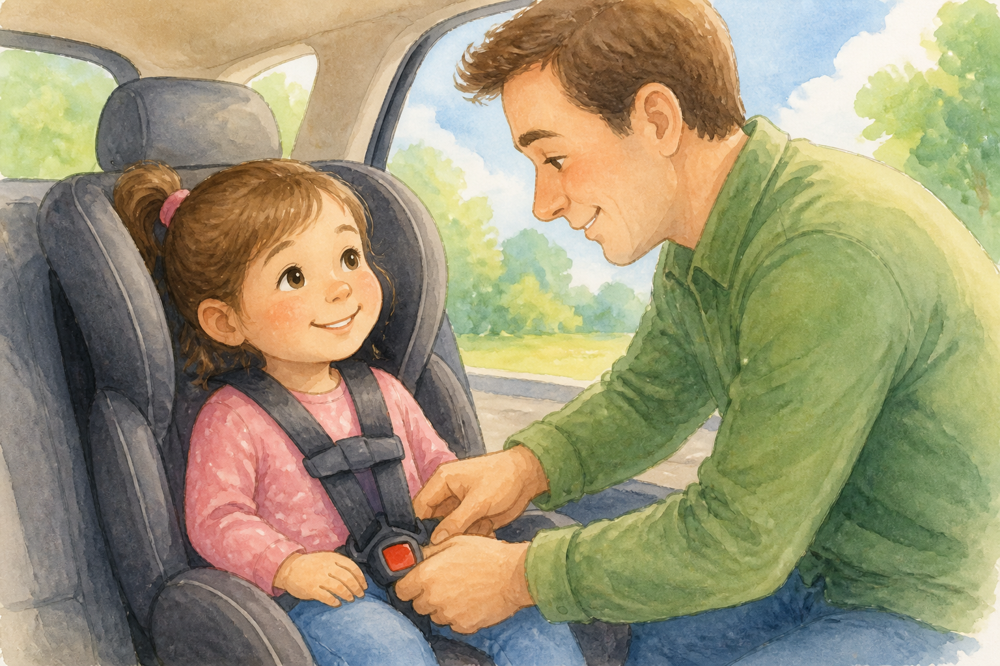

## Глава 109. Правила в машине: ремень

*(Папа щёлкает ремень — щёлк!)*

В машине правило простое и железное: **ремень**. Сидим на своём месте, не мешаем водителю, не открываем дверь на ходу.

Ремень — объятие безопасности. Даже короткая поездка. Мы любим жизнь, которую дал Бог — поэтому пристёгиваемся.

**📖 Стих из Библии:**
3. Благоразумный видит беду, и укрывается; а неопытные идут вперед, и наказываются.
Притчи 22:3 (Синодальный перевод)

**🗣 Поговорим:**
*Папа:* Почему ремень — это любовь, а не «нудность»?
*(Дать дочке ответить)*

**🙏 Наша молитва:**
«Господь, храни нас в дороге. Научи слушаться правил безопасности. Аминь.»

---

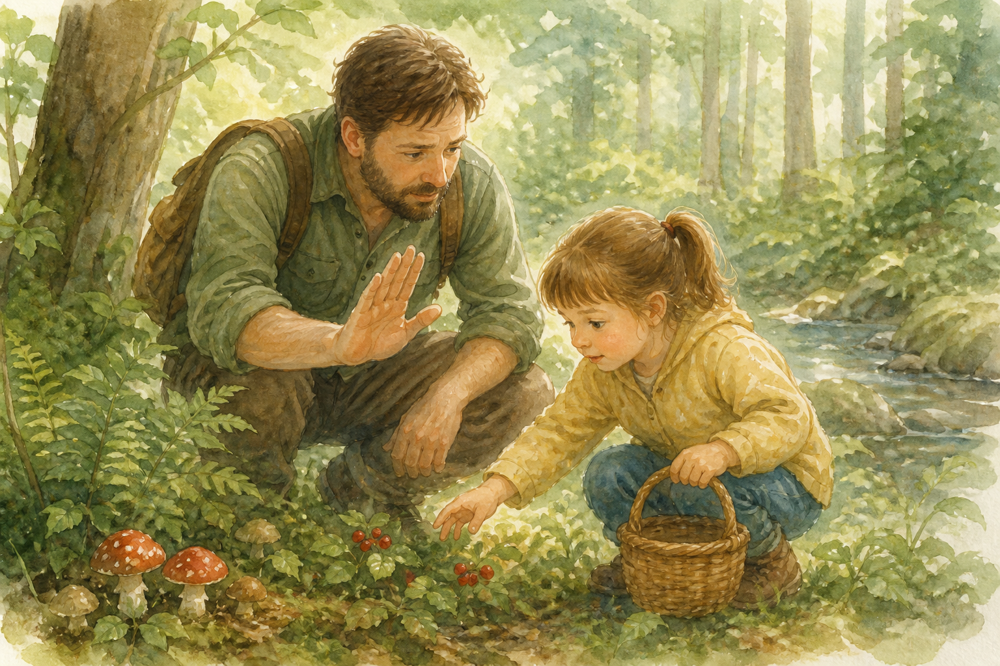

## Глава 110. Незнакомые ягоды и грибы

*(Папа качает головой у куста)*

В лесу и у дороги бывают красивые ягоды и грибы. Красивое ≠ съедобное. Правило: **не пробуем сами**. Только то, что дали мама или папа.

Если очень хочется — спроси. Лучше спросить сто раз, чем один раз отравиться. Мудрость бережёт животик.

**📖 Стих из Библии:**
3. Благоразумный видит беду, и укрывается; а неопытные идут вперед, и наказываются.
Притчи 22:3 (Синодальный перевод)

**🗣 Поговорим:**
*Папа:* Что сказать, если подруга предлагает «лесную ягодку»?
*(Дать дочке ответить)*

**🙏 Наша молитва:**
«Бог, научи меня осторожности. Не буду есть незнакомое. Аминь.»

---

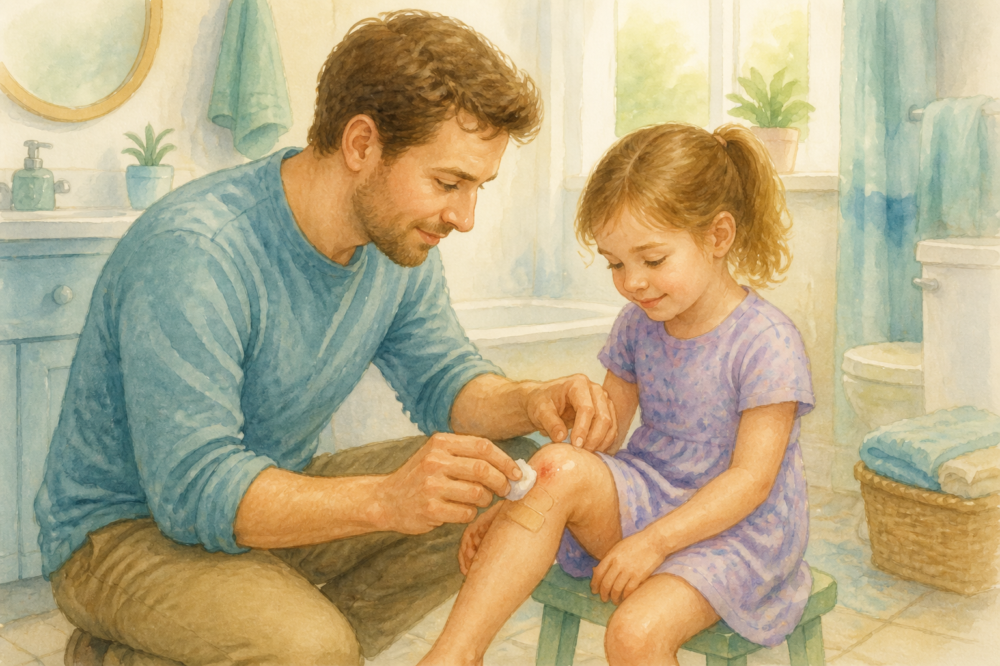

## Глава 111. Если идёт кровь из коленки

*(Папа спокойно достаёт пластырь)*

Упала — коленка в крови. Можно заплакать. Это нормально. Потом спокойно:
1. Позвать взрослого.
2. Промыть.
3. Пластырь.
4. Посидеть.

Кровь пугает, но часто ранка маленькая. Паника не лечит. Спокойствие и помощь — лечат. Я рядом.

**📖 Стих из Библии:**
34. и, подойдя, перевязал ему раны, возливая масло и вино; и, посадив его на своего осла, привез его в гостиницу и позаботился о нем;
Луки 10:34 (Синодальный перевод)

**🗣 Поговорим:**
*Папа:* Какой первый шаг, если разбила коленку?
*(Дать дочке ответить)*

**🙏 Наша молитва:**
«Иисус, когда мне больно — будь рядом и дай спокойствие. Аминь.»

---

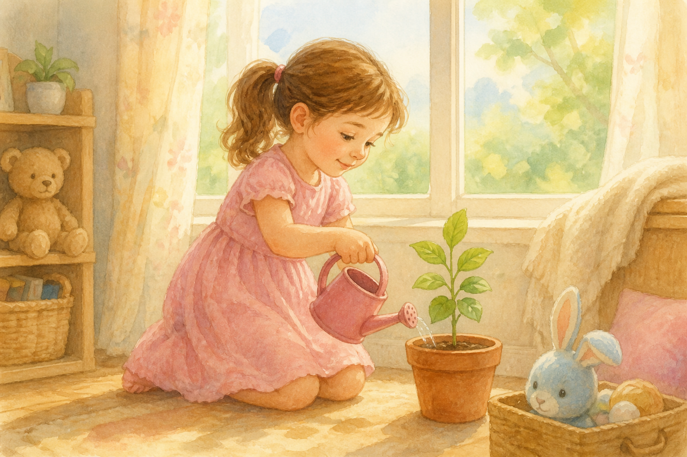

## Глава 112. Добро не только напоказ

*(Папа шепчет, будто делится секретом)*

Иногда хочется сделать добро так, чтобы все увидели и сказали: «Ой, какая хорошая!» Но настоящее добро часто тихое. Как спрятанный цветок.

Можно помочь маме, когда никто не смотрит. Можно поделиться, даже если никто не хлопает в ладоши. Бог видит добро втайне. Его улыбка важнее аплодисментов.

**📖 Стих из Библии:**
3. У тебя же, когда творишь милостыню, пусть левая рука твоя не знает, что делает правая, 4. чтобы милостыня твоя была втайне; и Отец твой, видящий тайное, воздаст тебе явно.
Матфея 6:3-4 (Синодальный перевод)

**🗣 Поговорим:**
*Папа:* Какое доброе дело можно сделать сегодня так, чтобы почти никто не заметил?
*(Дать дочке ответить)*

**🙏 Наша молитва:**
«Иисус, научи меня делать добро от сердца, а не ради похвалы. Аминь.»

---

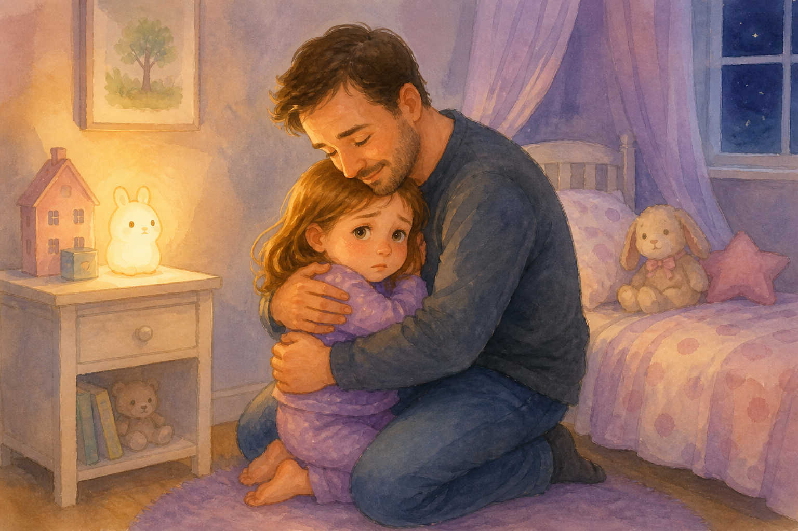

## Глава 113. Уметь сказать: «мне страшно»

*(Папа берёт дочку за руку и кивает)*

Страшно бывает всем: детям и взрослым. Страшно — не значит «ты слабая». Страшно — значит сердце просит помощи.

Можно честно сказать: «Мне страшно». Маме. Папе. Богу. Это смелые слова. Они открывают дверь объятию, молитве и свету. Прятать страх в кармане тяжелее, чем назвать его вслух.

**📖 Стих из Библии:**
4. Когда я в страхе, на Тебя я уповаю. 5. В Боге восхвалю я слово Его; на Бога уповаю, не боюсь; что сделает мне плоть?
Псалом 55:4-5 (Синодальный перевод)

**🗣 Поговорим:**
*Папа:* Когда тебе бывает страшно — и кому ты можешь это сказать?
*(Дать дочке ответить)*

**🙏 Наша молитва:**
«Иисус, когда мне страшно, помоги сказать это вслух и держаться за Твою руку. Аминь.»

---

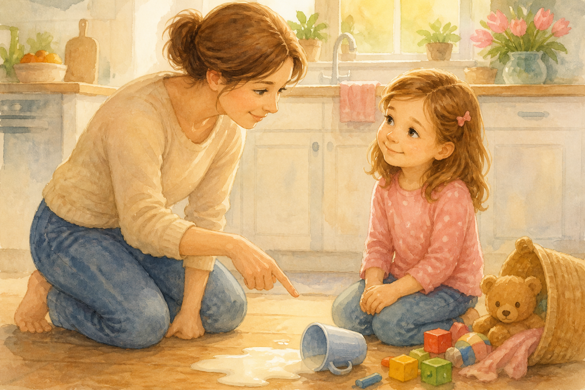

## Глава 114. Благодарить за замечание без обиды

*(Папа мягко поправляет воображаемую игрушку и улыбается)*

Замечание — как зеркальце: иногда показывает, где можно стать лучше. Сначала внутри может кольнуть: «Ой!» Но потом можно сказать: «Спасибо, я поняла».

Обида закрывает уши. Благодарность открывает рост. Мама, папа, воспитатель замечают не чтобы тебя раздавить — а чтобы помочь. Это тоже любовь.

**📖 Стих из Библии:**
16. Всегда радуйтесь. 17. Непрестанно молитесь. 18. За все благодарите: ибо такова о вас воля Божия во Христе Иисусе.
1 Фессалоникийцам 5:16-18 (Синодальный перевод)

**🗣 Поговорим:**
*Папа:* Как можно ответить на замечание без обиды?
*(Дать дочке ответить)*

**🙏 Наша молитва:**
«Господь, научи меня принимать замечания с мягким сердцем. Аминь.»

---

## Глава 115. Если потерялся телефон родителей

*(Папа показывает воображаемый телефон и кладёт его «на место»)*

Телефон мамы или папы — важная вещица. Им звонят, им ищут помощь. Если он потерялся дома — не прячь, не играй в «секрет». Скажи сразу: «Телефон пропал».

Вместе поищем: карман, диван, сумка, стол. Если нашли — отдай. Если не нашли — взрослые знают, что делать дальше. Твоя задача — сказать честно и помочь искать, а не винить себя.

**📖 Стих из Библии:**
7. Господь сохранит тебя от всякого зла; сохранит душу твою Господь. 8. Господь будет охранять выхождение твое и вхождение твое отныне и вовек.
Псалом 120:7-8 (Синодальный перевод)

**🗣 Поговорим:**
*Папа:* Что сделать первым делом, если пропал телефон мамы или папы?
*(Дать дочке ответить)*

**🙏 Наша молитва:**
«Бог, помоги мне быть честной и спокойной, если пропала важная вещь. Аминь.»

---

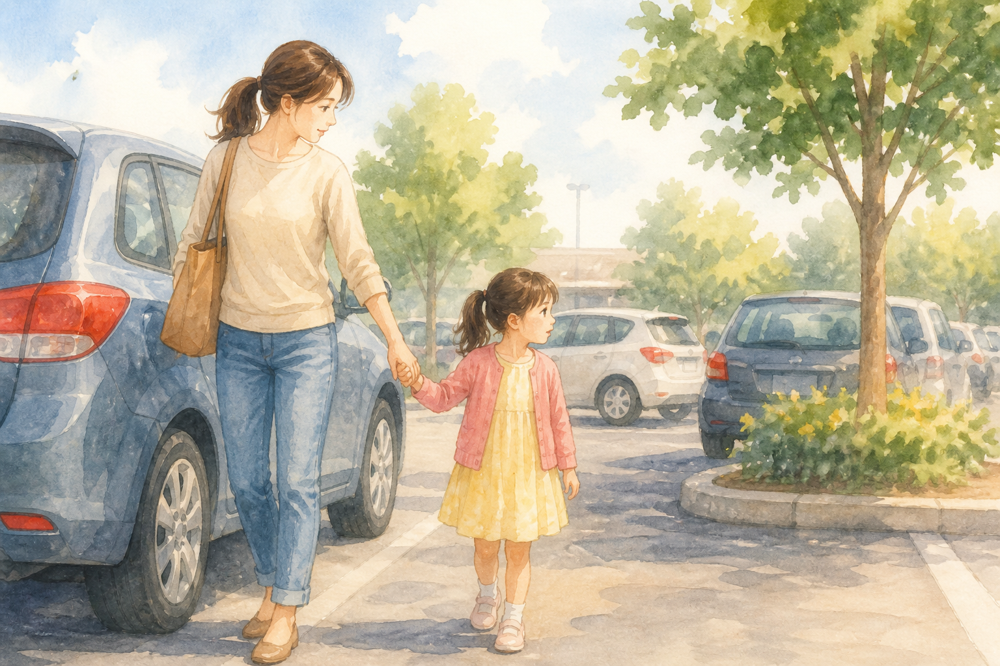

## Глава 116. Не отходить от семьи на парковке

*(Папа крепко держит за руку и смотрит по сторонам)*

Парковка — место машин. Машины большие, ездят тихо и быстро. Там нельзя бегать между рядами и «чуть‑чуть отойти посмотреть».

Правило простое: держимся за руку или идём рядом с мамой и папой. Даже если увидела красивую машинку или шарик — сначала скажи, не убегай. Рядом с семьёй — безопаснее всего.

**📖 Стих из Библии:**
3. Благоразумный видит беду, и укрывается; а неопытные идут вперед, и наказываются.
Притчи 22:3 (Синодальный перевод)

**🗣 Поговорим:**
*Папа:* Почему на парковке важно не отходить от семьи?
*(Дать дочке ответить)*

**🙏 Наша молитва:**
«Господь, научи меня держаться рядом с семьёй там, где опасно. Аминь.»

---

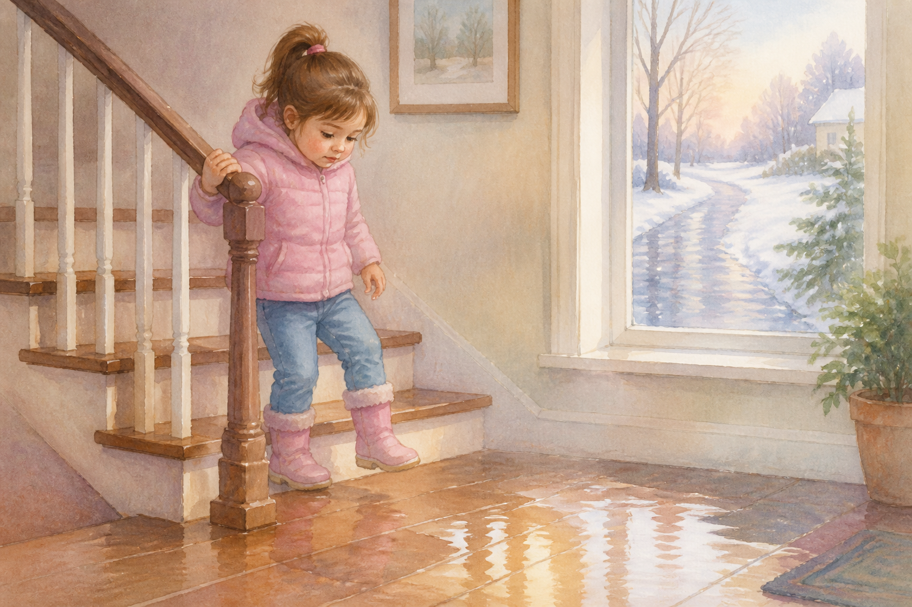

## Глава 117. Осторожность с лестницей, скользким полом, льдом

*(Папа показывает осторожные шажочки)*

Лестница, мокрый пол, лёд зимой — как хитрые ловушки для ножек. Там не место гонкам и прыжкам «по‑супергеройски».

Держись за перила. Шагай спокойно. Если скользко — скажи взрослому. Упасть больно, а осторожность — умная забота о теле, которое Бог тебе подарил.

**📖 Стих из Библии:**
3. Благоразумный видит беду, и укрывается; а неопытные идут вперед, и наказываются.
Притчи 22:3 (Синодальный перевод)

**🗣 Поговорим:**
*Папа:* Где тебе нужно быть особенно осторожной ногами?
*(Дать дочке ответить)*

**🙏 Наша молитва:**
«Бог, научи меня осторожным шагам и беречь своё тело. Аминь.»

---

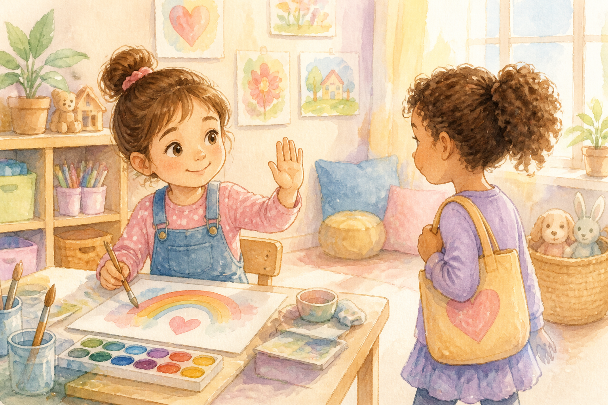

## Глава 118. Как мягко сказать: «я сейчас занята»

*(Папа показывает ладонь «стоп» — но мягко, с улыбкой)*

Иногда подруга зовёт играть, а ты уже рисуешь, строишь или отдыхаешь. Можно не кричать и не прятаться. Можно мягко сказать: «Я сейчас занята. Давай чуть позже?»

Это не злость. Это честность и уважение к своему делу и к другу. Мягкое «сейчас занята» лучше, чем грубое «отстань» или притворная улыбка, когда внутри уже нет сил.

**📖 Стих из Библии:**
1. Кроткий ответ отвращает гнев, а оскорбительное слово возбуждает ярость.
Притчи 15:1 (Синодальный перевод)

**🗣 Поговорим:**
*Папа:* Как сказать «я занята» так, чтобы другу не было больно?
*(Дать дочке ответить)*

**🙏 Наша молитва:**
«Иисус, научи меня говорить правду мягко и без грубости. Аминь.»

---

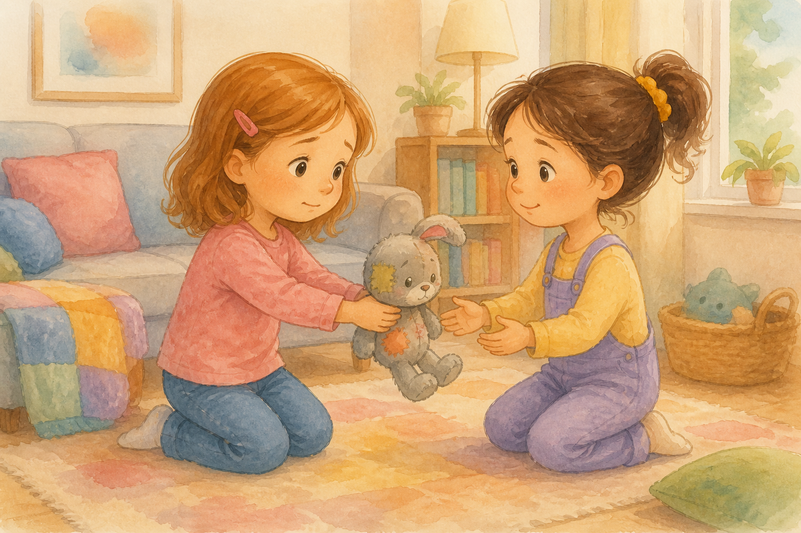

## Глава 119. Как вернуть чужую вещь, если случайно испортила

*(Папа держит сломанную игрушку бережно, без крика)*

Случается: взяла чужую куклу, книжку или фломастер — и вдруг сломалось, порвалось, испачкалось. Хочется спрятать. Но спрятанное растёт в комок в животе.

Лучше подойти и сказать: «Прости, я случайно испортила. Вот вещь». Потом вместе со взрослыми решить, как помочь: починить, заменить, извиниться. Честность чинит дружбу быстрее, чем прятки.

**📖 Стих из Библии:**
31. И как хотите, чтобы с вами поступали люди, так и вы поступайте с ними.
Луки 6:31 (Синодальный перевод)

**🗣 Поговорим:**
*Папа:* Что сказать, если случайно испортила чужую вещь?
*(Дать дочке ответить)*

**🙏 Наша молитва:**
«Господь, дай мне смелость честно вернуть и попросить прощения. Аминь.»

---

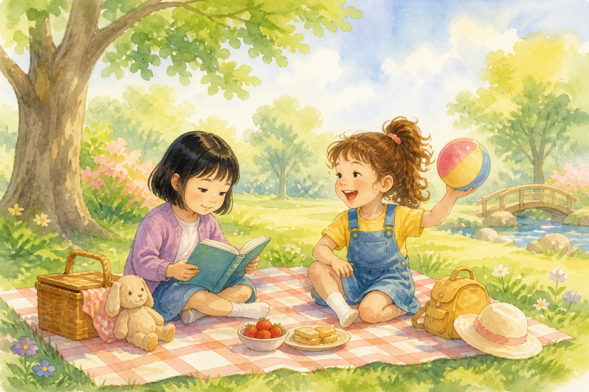

## Глава 120. Как дружить, если вы разные по характеру

*(Папа показывает два разных карандаша, лежащих рядом)*

Одна подруга тихая, другая громкая. Одна любит кукол, другая — бегать. Вы разные — и это не ошибка. Бог любит разноцветные сердца.

Дружить по‑разному можно так: иногда твоя игра, иногда её; иногда вместе помолчать, иногда вместе посмеяться. Не надо переделывать друга в копию себя. Разность — не враг дружбы, если есть доброта.

**📖 Стих из Библии:**
7. Посему принимайте друг друга, как и Христос принял вас в славу Божию.
Римлянам 15:7 (Синодальный перевод)

**🗣 Поговорим:**
*Папа:* Чем ты и твоя подруга разные — и что в этом хорошего?
*(Дать дочке ответить)*

**🙏 Наша молитва:**
«Бог, научи меня дружить с теми, кто не совсем как я. Аминь.»

---

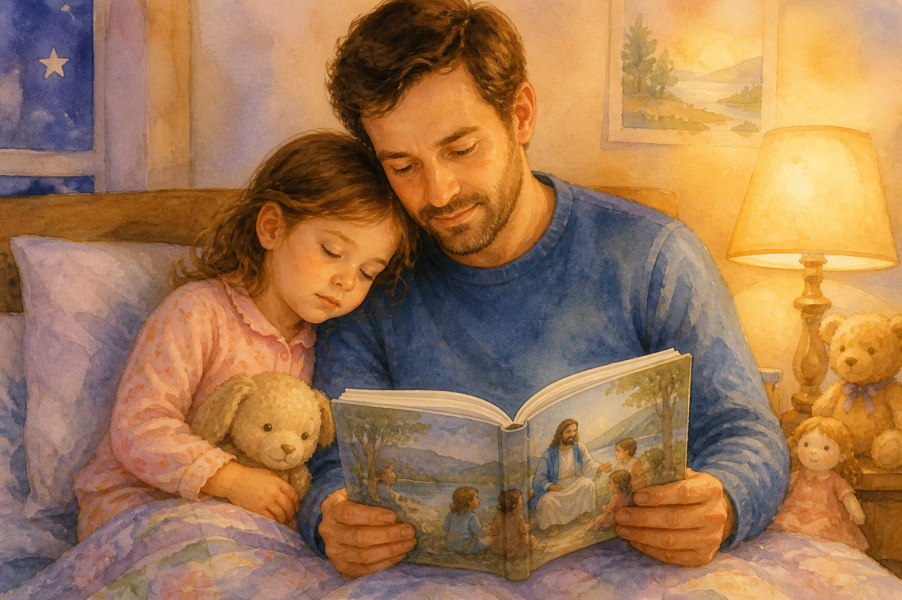

## Глава 121. Как слушать Библию, когда устала

*(Папа читает тихо, почти как колыбельную)*

Иногда глаза клеятся, а папа открывает Библию. Не надо притворяться бодрой солдаткой. Можно сказать: «Я устала». И всё равно услышать чуть‑чуть.

Можно лечь рядом, слушать шёпотом, смотреть одну картинку, запомнить одно слово. Бог не требует от усталой девочки длинного урока. Он рад даже маленькому внимательному «я здесь».

**📖 Стих из Библии:**
28. Придите ко Мне все труждающиеся и обремененные, и Я успокою вас; 29. возьмите иго Мое на себя и научитесь от Меня, ибо Я кроток и смирен сердцем, и найдете покой душам вашим; 30. ибо иго Мое благо, и бремя Мое легко.
Матфея 11:28-30 (Синодальный перевод)

**🗣 Поговорим:**
*Папа:* Как слушать Божье слово, когда совсем хочется спать?
*(Дать дочке ответить)*

**🙏 Наша молитва:**
«Господь, даже когда я устала, коснись моего сердца Твоим словом. Аминь.»

---

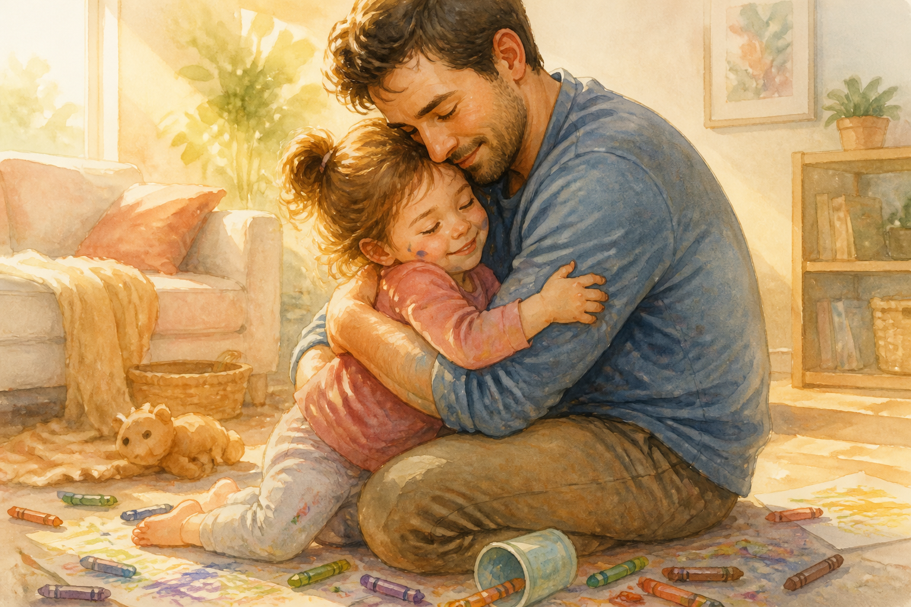

## Глава 122. Почему Бог любит нас не за идеальность

*(Папа обнимает даже после «ой, ошиблась»)*

Иногда кажется: Бог любит только послушных, чистых, умных, без ошибок. Но это неправда. Бог любит тебя, потому что ты Его ребёнок — а не потому что ты идеальная.

Идеальность — как блестящая игрушка в витрине. А любовь Бога — как объятие папы после падения. Он радуется росту, прощает, поднимает. Ты любима уже сейчас.

**📖 Стих из Библии:**
8. Но Бог Свою любовь к нам доказывает тем, что Христос умер за нас, когда мы были еще грешниками.
Римлянам 5:8 (Синодальный перевод)

**🗣 Поговорим:**
*Папа:* Почему важно знать, что Бог любит тебя даже с ошибками?
*(Дать дочке ответить)*

**🙏 Наша молитва:**
«Отец, спасибо, что любишь меня не за идеальность, а потому что я Твоя. Аминь.»

---

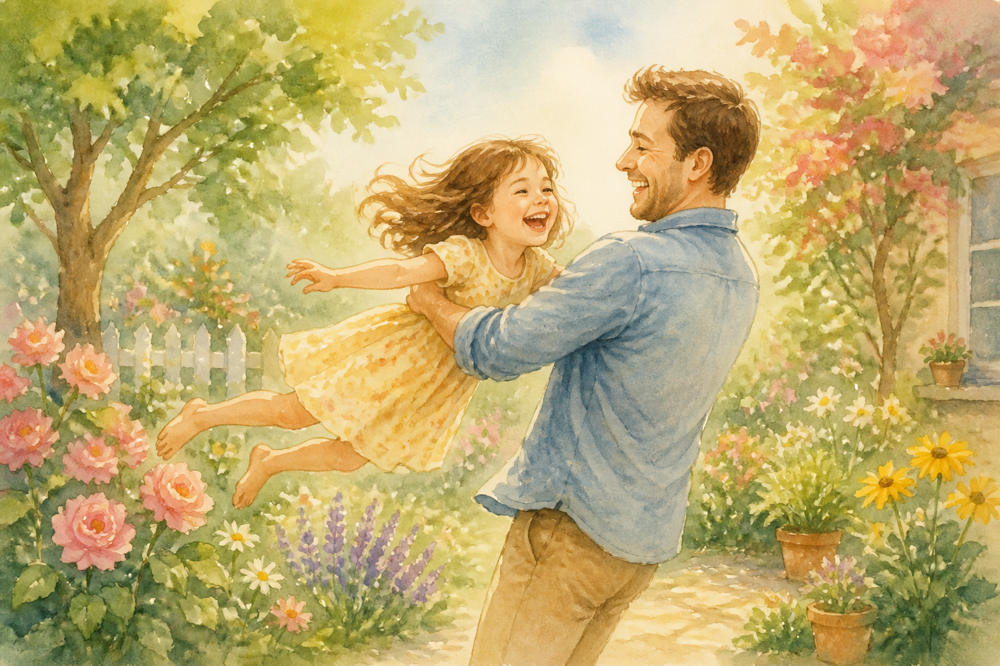

## Глава 123. Радость быть маленькой сейчас

*(Папа поднимает дочку на руки — легко и весело)*

Быть маленькой — это уметь сидеть на руках, играть в куклы без стыда, верить в чудеса, задавать сто «почему?», прятаться под одеялом и смеяться звонко.

Большие тоже радуются — но у пяти лет есть своя яркая радость. Не выбрасывай её раньше времени. Сегодня ты маленькая — и это прекрасно.

**📖 Стих из Библии:**
51. И Он пошел с ними и пришел в Назарет; и был в повиновении у них. И Матерь Его сохраняла все слова сии в сердце Своем. 52. Иисус же преуспевал в премудрости и возрасте и в любви у Бога и человеков.
Луки 2:51-52 (Синодальный перевод)

**🗣 Поговорим:**
*Папа:* Что тебе особенно нравится в том, что ты ещё маленькая?
*(Дать дочке ответить)*

**🙏 Наша молитва:**
«Бог, спасибо за радость быть маленькой прямо сейчас. Аминь.»

---

## Глава 124. Красота послушного и свободного сердца

*(Папа рисует в воздухе сердце и открытую дверь)*

Послушание — не клетка. Настоящее послушание — когда сердце свободно выбирает доверие: «Я слушаю, потому что люблю и верю».

Свободное сердце не бунтует назло и не притворяется. Оно мягкое и честное. Такая красота сильнее любого наряда: послушная и свободная одновременно — как дочь, которая держит папу за руку и радостно идёт.

**📖 Стих из Библии:**
15. Если любите Меня, соблюдите Мои заповеди.
Иоанна 14:15 (Синодальный перевод)

**🗣 Поговорим:**
*Папа:* Чем послушание из любви отличается от послушания из страха?
*(Дать дочке ответить)*

**🙏 Наша молитва:**
«Иисус, сделай моё сердце послушным и свободным в любви. Аминь.»

---

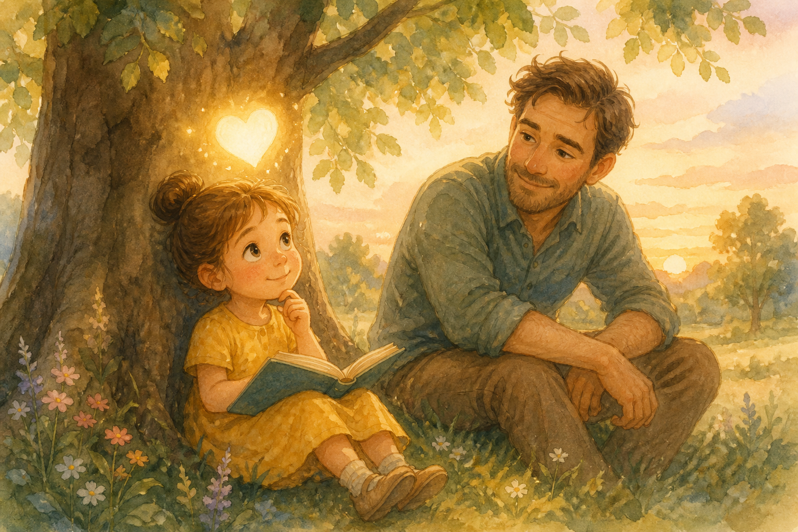

## Глава 125. Как расти в мудрости, а не только в возрасте

*(Папа указывает на голову и на сердце)*

Каждый день ты становишься чуть старше. Но мудрость растёт не сама, как волосы. Мудрость растёт, когда ты слушаешь, думаешь, прощаешь, выбираешь добро, учишься на ошибках.

Можно вырасти высокой и всё равно остаться капризной. А можно уже в пять лет растить мудрое сердце: говорить правду, быть доброй, просить помощи, благодарить. Возраст считает годы. Мудрость считает выборы.

**📖 Стих из Библии:**
51. И Он пошел с ними и пришел в Назарет; и был в повиновении у них. И Матерь Его сохраняла все слова сии в сердце Своем. 52. Иисус же преуспевал в премудрости и возрасте и в любви у Бога и человеков.
Луки 2:51-52 (Синодальный перевод)

**🗣 Поговорим:**
*Папа:* Какой мудрый выбор ты можешь сделать уже сегодня?
*(Дать дочке ответить)*

**🙏 Наша молитва:**
«Господь, расти во мне мудрость быстрее капризов. Аминь.»

---

## Глава 126. Благословение на ночь

*(Папа кладёт руку на голову или плечо дочки)*

Моя любимая девочка, ты драгоценна для меня и для Бога.
Пусть Господь хранит твоё сердце, даёт мудрость, радость и смелость.
Пусть ты растёшь в любви к Иисусу, в уважении к людям и в верности истине.

Что бы ни случилось завтра — я рядом. И Небесный Отец ещё ближе.

**📖 Стих из Библии:**
24. Да благословит тебя Господь и сохранит тебя! 25. Да призрит на тебя Господь светлым лицем Своим и помилует тебя! 26. Да обратит Господь лице Свое на тебя и даст тебе мир!
Числа 6:24-26 (Синодальный перевод)

**🗣 Поговорим:**
*Папа:* Давай скажем друг другу: «Я тебя люблю».
*(Обняться)*

**🙏 Наша молитва:**
«Господь Иисус, спасибо за нашу семью. Научи нас любить Тебя и людей каждый день. Храни нашу дочку. Аминь.»

---

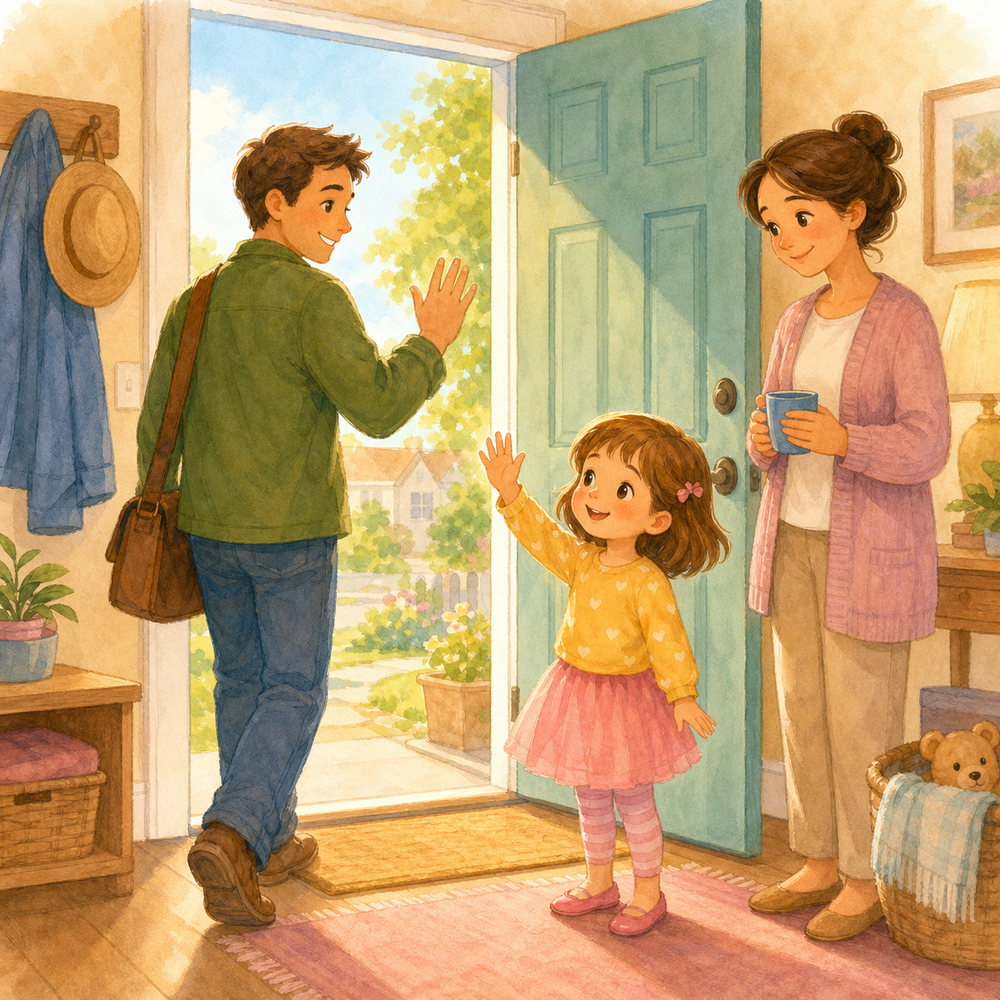

## Глава 127. Когда мама или папа уходят и возвращаются

*(Папа показывает дверь и улыбается спокойно)*

Иногда мама уходит в магазин. Иногда папа идёт на работу. Иногда в садике надо сказать: «Пока-пока» — и сердечко вдруг сжимается, будто маленький кулачок.

Но любовь не остаётся только там, где видны лица. Мама любит тебя, когда она за дверью. Папа любит тебя, когда он далеко. Бог видит нас всех сразу и помогает ждать возвращения без паники.

Можно помахать рукой, обнять крепко, сказать: «Я буду ждать». А потом играть, кушать, спать, слушать воспитателя. Время пройдёт — и дверь снова откроется.

**📖 Стих из Библии:**
9. Вот Я повелеваю тебе: будь тверд и мужествен, не страшись и не ужасайся; ибо с тобою Господь Бог твой везде, куда ни пойдешь.
Иисус Навин 1:9 (Синодальный перевод)

**🗣 Поговорим:**
*Папа:* Что поможет тебе помнить: «меня любят и за мной вернутся»?
*(Дать дочке ответить)*

**🙏 Наша молитва:**
«Господь, помоги мне спокойно ждать маму и папу. Спасибо, что Ты рядом всегда. Аминь.»

---

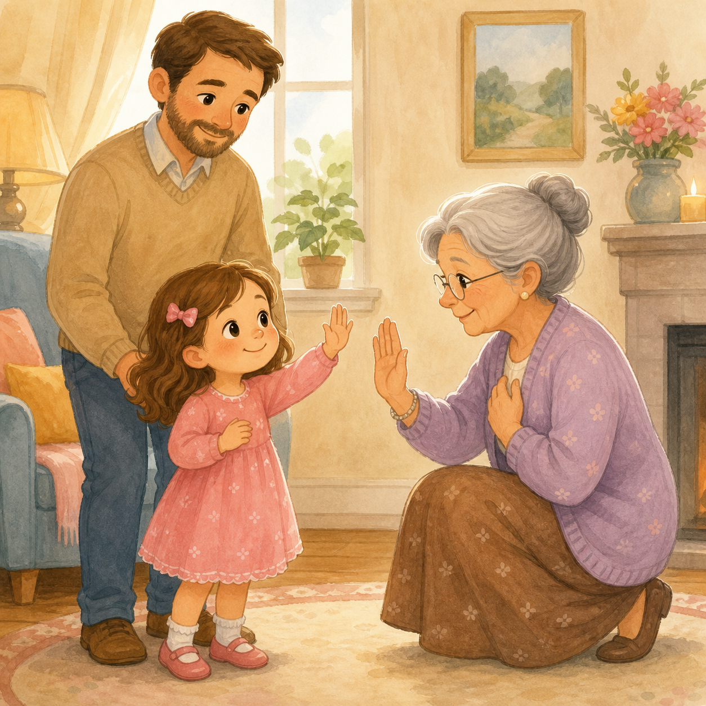

## Глава 128. Можно ли не обниматься?

*(Папа раскрывает ладони, будто говорит: «можно выбрать»)*

Объятия бывают тёплыми, как плед. Но иногда тебе не хочется обниматься. И это можно сказать спокойно: «Я сейчас не хочу». Можно помахать рукой, улыбнуться, сказать «здравствуйте» или дать пять.

Твоё тело — Божий подарок. Мы не грубим людям, но и не отдаём объятия через силу. Даже если это знакомый взрослый или родственник, ты можешь быть вежливой и честной.

Добрая девочка не обязана всем нравиться своим телом. Добрая девочка учится уважать себя и других.

**📖 Стих из Библии:**
12. Итак во всем, как хотите, чтобы с вами поступали люди, так поступайте и вы с ними.
Матфея 7:12 (Синодальный перевод)

**🗣 Поговорим:**
*Папа:* Как можно вежливо поздороваться без объятия?
*(Дать дочке ответить)*

**🙏 Наша молитва:**
«Бог, спасибо за моё тело. Научи меня быть доброй и смелой говорить правду. Аминь.»

---

## Глава 129. Туалет, стыд и чистота

*(Папа говорит просто, без смущения)*

Туалет — обычная часть жизни. Бог создал тело мудро, и телу нужно освобождаться, мыться, переодеваться, быть чистым. В этом нет ничего смешного и ничего стыдного.

Но есть вещи личные. В туалете закрывают дверь. После туалета моют руки. Если нужна помощь — можно позвать маму или папу. Если одежда испачкалась, это не конец света: мы спокойно переоденемся и всё исправим.

Чистота — не повод бояться ошибки. Это тихая забота о теле, которое Бог подарил.

**📖 Стих из Библии:**
40. Только все должно быть благопристойно и чинно.
1 Коринфянам 14:40 (Синодальный перевод)

**🗣 Поговорим:**
*Папа:* Что мы делаем после туалета?
*(Дать дочке ответить)*

**🙏 Наша молитва:**
«Господь, спасибо за моё тело. Помоги мне заботиться о чистоте спокойно и без стыда. Аминь.»

---

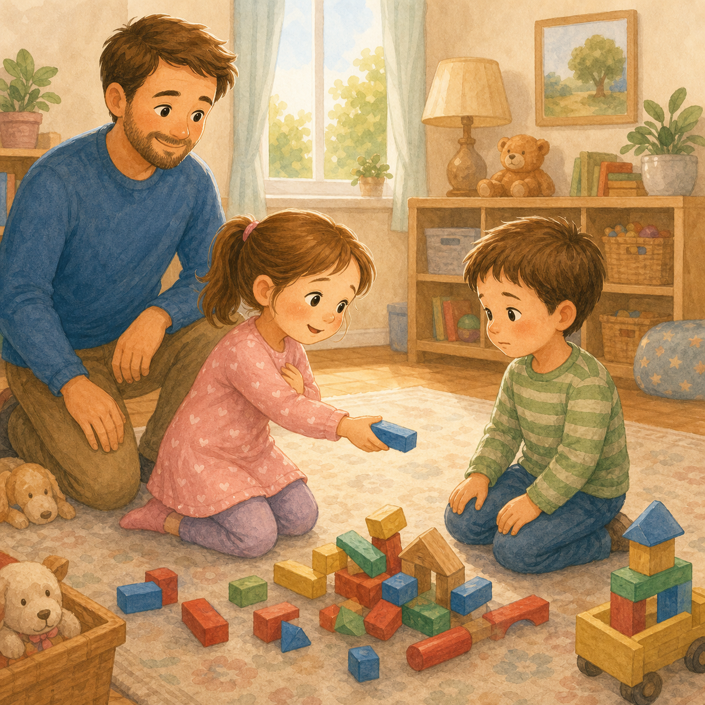

## Глава 130. Как просить прощения по-настоящему

*(Папа кладёт руку на сердце)*

Иногда слово «прости» вылетает быстро-быстро, как мячик: «Прости!» — и сразу хочется бежать дальше. Но настоящее прощение не торопится.

Сначала мы замечаем: «Я сделала больно». Потом говорим: «Прости меня». Потом, если можно, исправляем: поднять игрушку, принести салфетку, вернуть место, обнять — если другой человек хочет объятие.

Бог учит нас не только говорить красивые слова, но и делать сердце мягким. Настоящее «прости» похоже на маленький мостик после ссоры.

**📖 Стих из Библии:**
32. Но будьте друг ко другу добры, сострадательны, прощайте друг друга, как и Бог во Христе простил вас.
Ефесянам 4:32 (Синодальный перевод)

**🗣 Поговорим:**
*Папа:* Что можно сделать после слова «прости», чтобы исправить ошибку?
*(Дать дочке ответить)*

**🙏 Наша молитва:**
«Иисус, научи меня просить прощения честно и исправлять то, что могу. Аминь.»

---

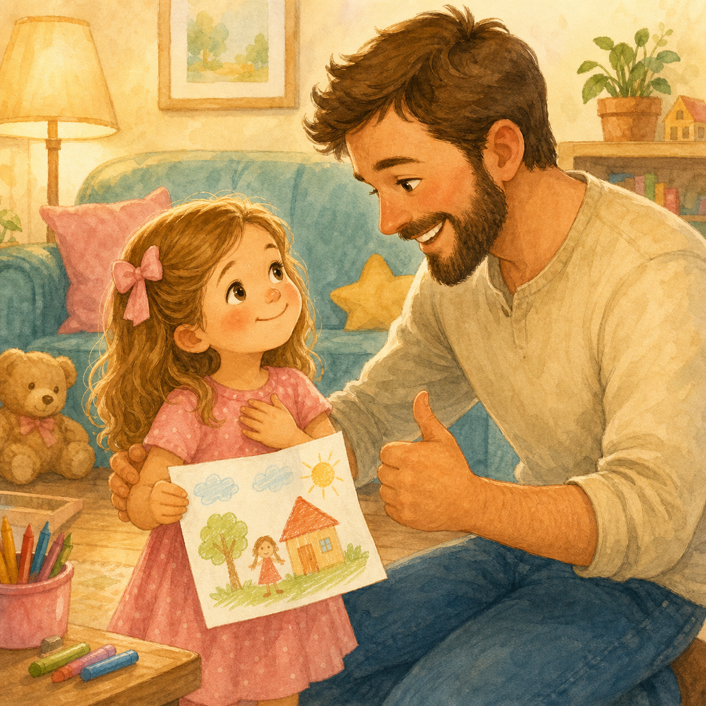

## Глава 131. Когда тебя хвалят

*(Папа хлопает тихо, как после маленького концерта)*

Когда тебя хвалят, сердечко радуется: «У меня получилось!» Это хорошая радость. Не надо прятать улыбку и говорить: «Ой, нет, я совсем не умею». Можно просто сказать: «Спасибо».

Но похвала — не корона, чтобы смотреть на других сверху. Всё хорошее в нас — подарок от Бога: умение рисовать, быстро бегать, красиво петь, помогать, быть внимательной.

Принимай похвалу как цветочек: понюхай, порадуйся и поблагодари. А потом неси радость дальше.

**📖 Стих из Библии:**
17. Всякое даяние доброе и всякий дар совершенный нисходит свыше, от Отца светов.
Иакова 1:17 (Синодальный перевод)

**🗣 Поговорим:**
*Папа:* Что можно ответить, когда тебя похвалили?
*(Дать дочке ответить)*

**🙏 Наша молитва:**
«Бог, спасибо за мои дары. Помоги мне радоваться без гордости. Аминь.»

---

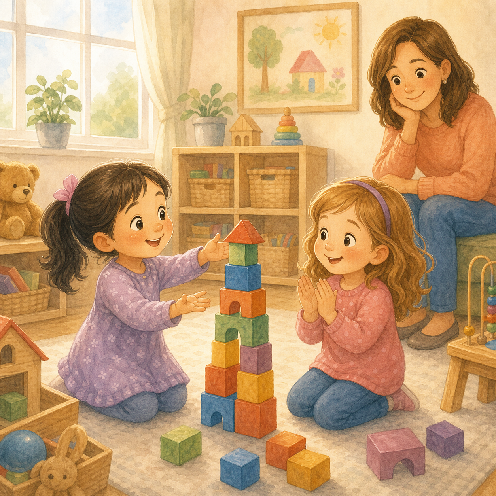

## Глава 132. Когда другой лучше умеет

*(Папа рисует две разные звёздочки в воздухе)*

Одна девочка быстрее бегает. Другая ровнее раскрашивает. Кто-то уже складывает буквы, а кто-то красиво танцует. И сердце иногда шепчет: «А я хуже?»

Нет, родная. Ты не хуже. Вы разные. Бог даёт людям разные дары, как разные цветы в саду. Роза не сердится, что ромашка другая. Ромашка не грустит, что она не роза.

Можно сказать: «У тебя красиво получилось!» А потом учиться маленькими шагами. Чужой дар не забирает твой.

**📖 Стих из Библии:**
15. Радуйтесь с радующимися и плачьте с плачущими.
Римлянам 12:15 (Синодальный перевод)

**🗣 Поговорим:**
*Папа:* Кого ты можешь похвалить за то, что у него хорошо получается?
*(Дать дочке ответить)*

**🙏 Наша молитва:**
«Господь, научи меня радоваться чужим дарам и спокойно растить свои. Аминь.»

---

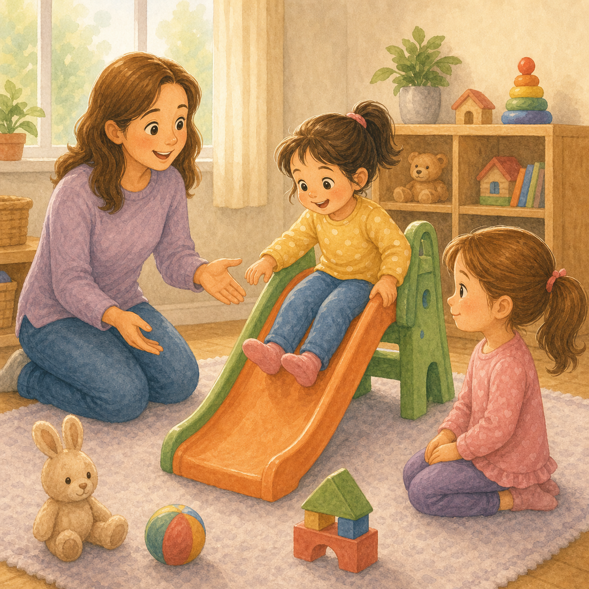

## Глава 133. Делиться и ждать своей очереди

*(Папа показывает две ладошки: «сейчас ты, потом я»)*

Качели одни, а детей двое. Любимая игрушка одна, а поиграть хотят все. Вот тут и начинается маленькая школа любви.

Делиться — не значит всё всегда отдавать и грустить в углу. Делиться — значит помнить: рядом тоже человек. Можно договориться: «Пять минут ты, потом я». Можно дать другую игрушку. Можно подождать, хотя ждать непросто.

Очередь учит сердце: мир не ломается, если я не первая. Бог помогает быть терпеливой и справедливой.

**📖 Стих из Библии:**
31. И как хотите, чтобы с вами поступали люди, так и вы поступайте с ними.
Луки 6:31 (Синодальный перевод)

**🗣 Поговорим:**
*Папа:* Где тебе труднее всего ждать очередь?
*(Дать дочке ответить)*

**🙏 Наша молитва:**
«Бог, помоги мне делиться с любовью и ждать без капризов. Аминь.»

---

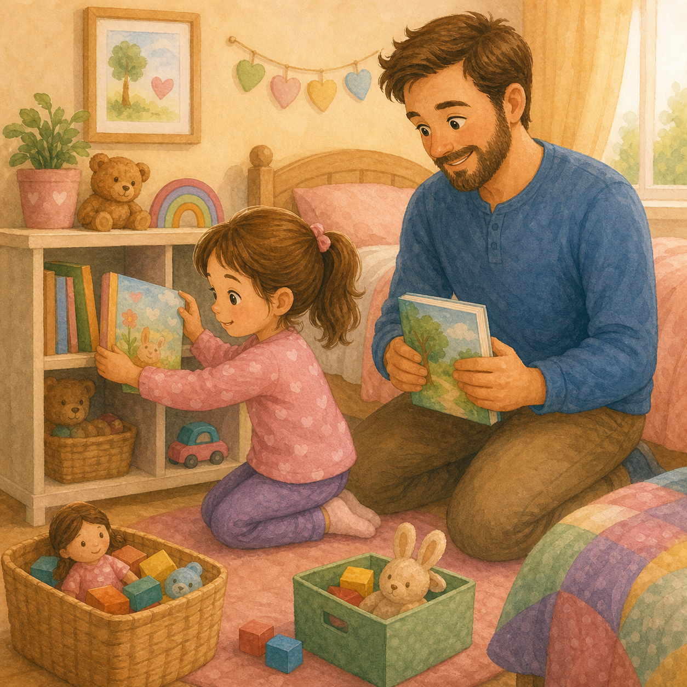

## Глава 134. Бережность к вещам

*(Папа берёт книгу двумя руками)*

Игрушки, книжки, платье, чашка, карандаши — это не просто «штуки». Через них кто-то позаботился о тебе: купил, подарил, сделал, принёс, постирал.

Бережность говорит без слов: «Спасибо». Мы не бросаем книгу на пол, не наступаем на игрушки, не мнём чужой рисунок. Если вещь сломалась — говорим правду и просим помочь.

Бог учит нас быть верными в малом. Маленькая аккуратность сегодня растит большое ответственное сердце.

**📖 Стих из Библии:**
10. Верный в малом и во многом верен, а неверный в малом неверен и во многом.
Луки 16:10 (Синодальный перевод)

**🗣 Поговорим:**
*Папа:* Какая твоя вещь просит сегодня бережной заботы?
*(Дать дочке ответить)*

**🙏 Наша молитва:**
«Господь, научи меня беречь вещи и быть благодарной за заботу. Аминь.»

---

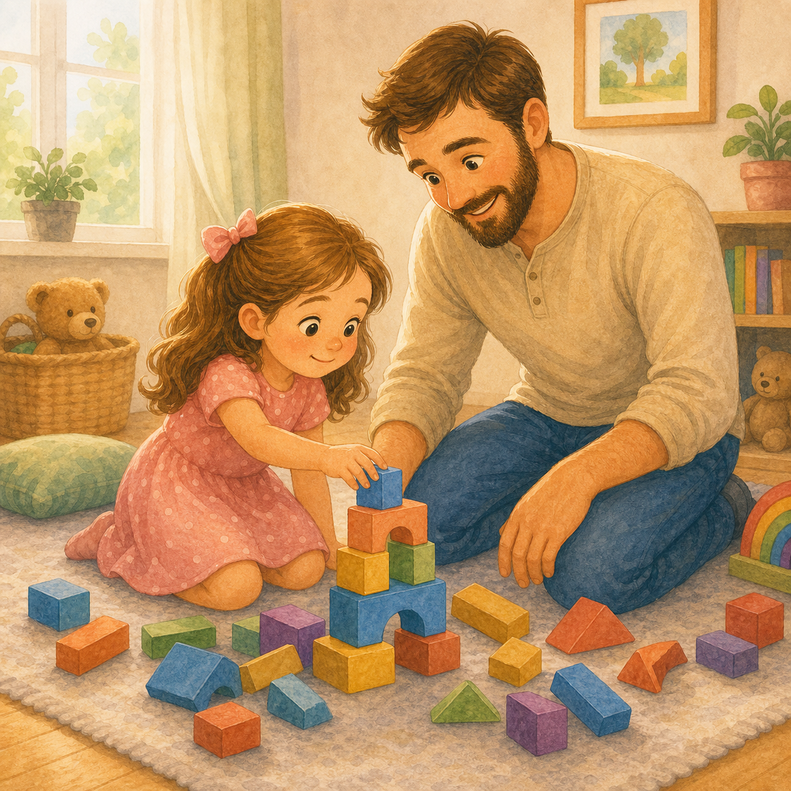

## Глава 135. Когда что-то не получилось

*(Папа показывает помятый лист и новый карандаш)*

Башня упала. Буква вышла кривой. Пуговица не застегнулась. И сразу хочется топнуть ножкой: «Я не умею!»

Но «не получилось» не значит «никогда не получится». Это значит: сердце встретило трудную ступеньку. Можно поплакать, попросить помощи, отдохнуть и попробовать ещё раз.

Бог не смеётся над нашими ошибками. Он поднимает. Ошибка — не яма навсегда, а место, где мы учимся.

**📖 Стих из Библии:**
16. Ибо семь раз упадет праведник, и встанет.
Притчи 24:16 (Синодальный перевод)

**🗣 Поговорим:**
*Папа:* Что у тебя сначала не получалось, а потом стало лучше?
*(Дать дочке ответить)*

**🙏 Наша молитва:**
«Бог, дай мне терпение учиться и смелость пробовать снова. Аминь.»

---

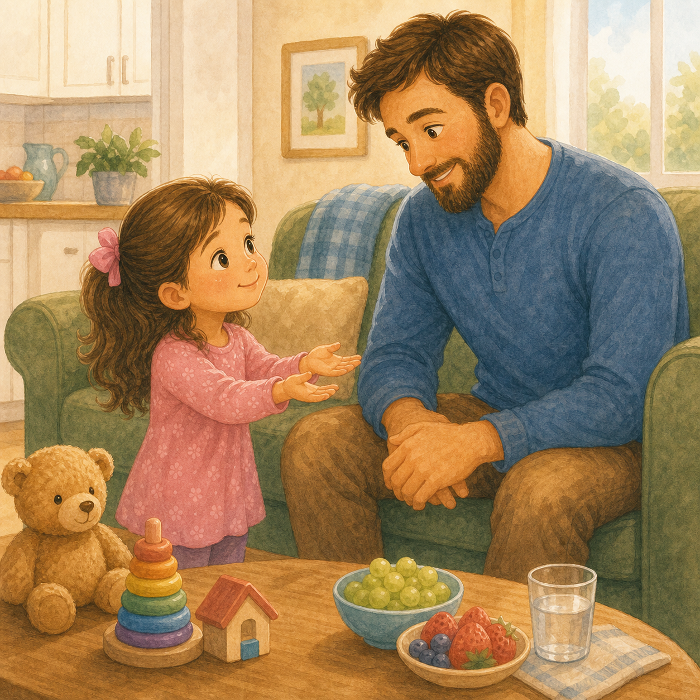

## Глава 136. Как говорить «можно мне?»

*(Папа говорит очень мягким голосом)*

Есть просьба, а есть требование. Просьба звучит тихо: «Можно мне, пожалуйста?» Требование топает ногами: «Дай! Сейчас же!»

Когда мы просим, мы оставляем другому человеку место ответить. Иногда ответ будет «да». Иногда — «позже». Иногда — «нет». Это трудно, но любовь не превращает просьбу в крик.

Мягкие слова похожи на тёплый ключик: они открывают разговор. А крик часто закрывает дверь.

**📖 Стих из Библии:**
1. Кроткий ответ отвращает гнев, а оскорбительное слово возбуждает ярость.
Притчи 15:1 (Синодальный перевод)

**🗣 Поговорим:**
*Папа:* Как можно попросить конфету, игрушку или помощь красиво?
*(Дать дочке ответить)*

**🙏 Наша молитва:**
«Господь, помоги мне просить мягко и принимать ответ спокойно. Аминь.»

---

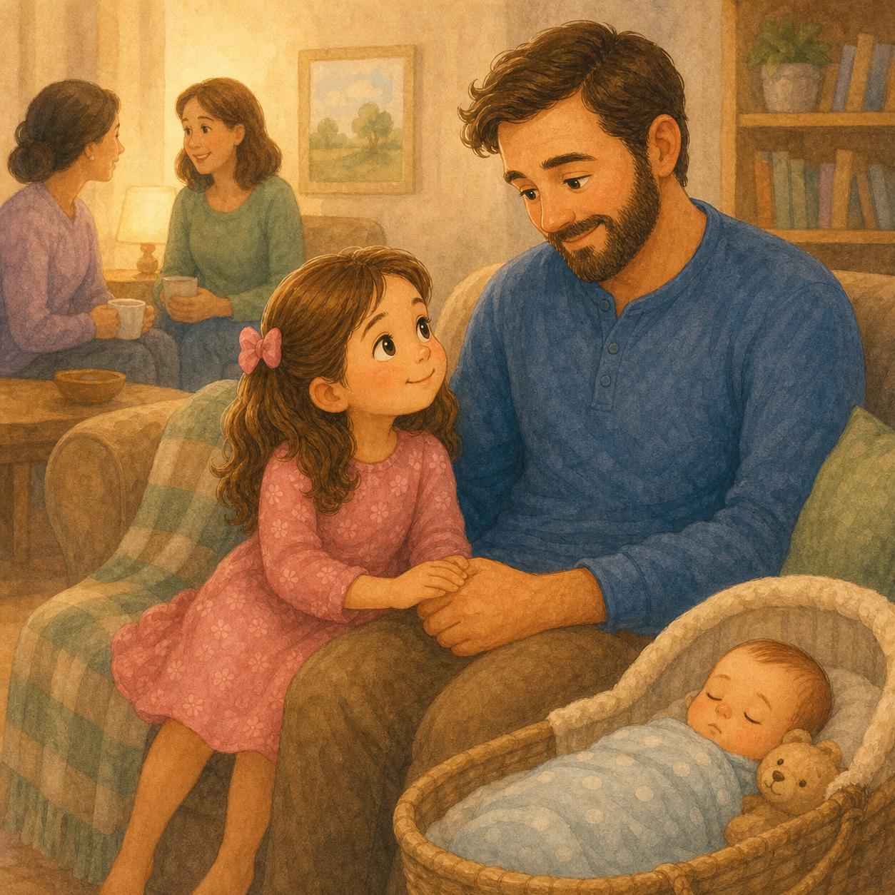

## Глава 137. Маленькая тишина

*(Папа прикладывает палец к губам и улыбается)*

Тишина — это не наказание. Тишина — как мягкая подушка для уставшего сердца. Иногда в храме тихо. Иногда взрослые разговаривают. Иногда малыш спит. Иногда папе нужно услышать важные слова.

Пяти минут тишины уже достаточно, чтобы сердце потренировалось. Можно смотреть в окно, держать папу за руку, дышать медленно, слушать, как стучит дождик.

Бог умеет говорить тихо. И мы учимся не бояться маленькой тишины.

**📖 Стих из Библии:**
11. Остановитесь и познайте, что Я - Бог.
Псалом 45:11 (Синодальный перевод)

**🗣 Поговорим:**
*Папа:* Где нам иногда нужна добрая тишина?
*(Дать дочке ответить)*

**🙏 Наша молитва:**
«Бог, научи моё сердце быть спокойным и слышать доброе в тишине. Аминь.»

---

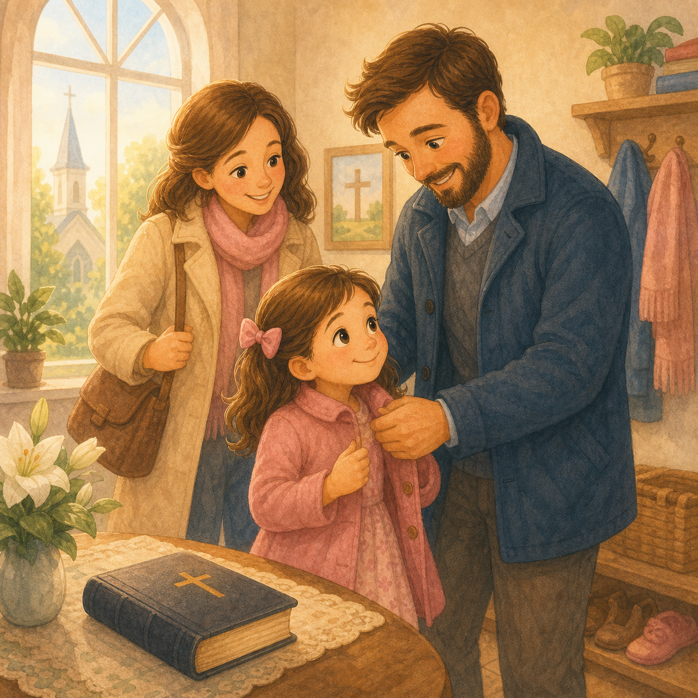

## Глава 138. Воскресенье — особенный день

*(Папа показывает календарь и маленькое солнышко)*

Воскресенье похоже на золотую пуговку на неделе. Мы вспоминаем, что Иисус жив, благодарим Бога, идём в церковь или молимся дома, замедляемся и снова собираемся сердцем.

В этот день не обязательно всё делать идеально. Можно устать, опоздать, забыть бантик. Главное — помнить: Бог зовёт нас не на строгий экзамен, а к Себе.

Воскресенье учит нас: мы не только работаем, покупаем и спешим. Мы любим, молимся, отдыхаем и радуемся Божьей семье.

**📖 Стих из Библии:**
24. Сей день сотворил Господь: возрадуемся и возвеселимся в оный!
Псалом 117:24 (Синодальный перевод)

**🗣 Поговорим:**
*Папа:* Что тебе нравится в воскресенье?
*(Дать дочке ответить)*

**🙏 Наша молитва:**
«Иисус, спасибо за воскресенье. Помоги нам радоваться Тебе всей семьёй. Аминь.»

---

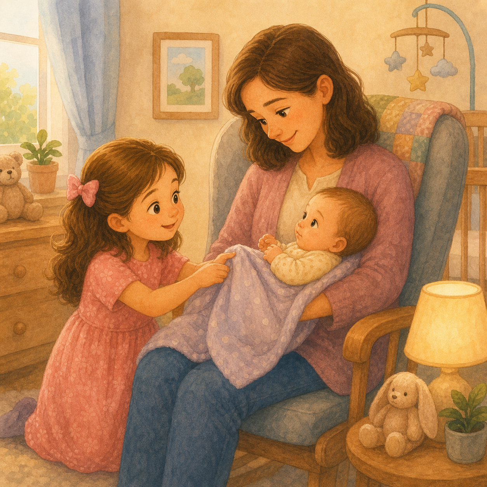

## Глава 139. Когда дома младший ребёнок или малыш

*(Папа показывает, как держать ладошку мягко)*

Малыш маленький: он плачет, много спит, не умеет ждать и не понимает правил. Иногда кажется, что все смотрят только на него. Сердечко может ревновать.

Но любовь в семье не делится, как последний кусочек пирога. Любовь растёт. Папина любовь к малышу не забирает любовь к тебе. Мамина забота о малыше не делает тебя невидимой.

Ты можешь быть старшей помощницей: принести пелёнку, спеть тихую песенку, погладить ножку одним пальчиком. А когда тебе тоже нужны руки — скажи нам.

**📖 Стих из Библии:**
14. Пустите детей приходить ко Мне и не препятствуйте им, ибо таковых есть Царствие Божие.
Марка 10:14 (Синодальный перевод)

**🗣 Поговорим:**
*Папа:* Как можно помогать малышу нежно и безопасно?
*(Дать дочке ответить)*

**🙏 Наша молитва:**
«Господь, дай мне нежное сердце к маленьким и уверенность, что меня тоже любят. Аминь.»

---

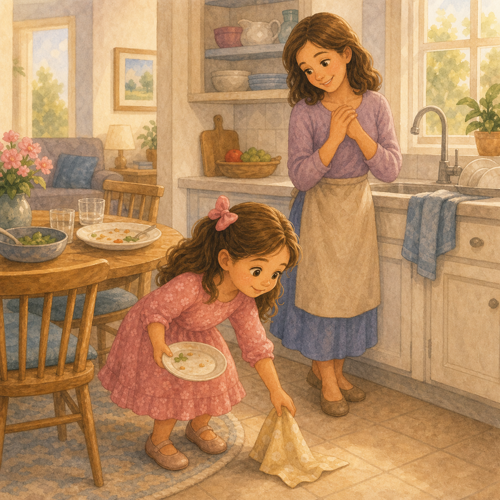

## Глава 140. Помогать без команды

*(Папа будто замечает упавшую салфетку)*

Иногда помощь зовёт тихо. Не голосом, а видом: ботинки стоят криво, ложка упала, мама несёт сумку, папа ищет очки.

Можно ждать, пока скажут: «Помоги». А можно заметить самой: поднять, принести, придержать дверь, убрать свою тарелку. Такая помощь похожа на маленький огонёк любви.

Мы служим не чтобы нас обязательно похвалили. Мы служим, потому что Иисус любит людей через наши руки.

**📖 Стих из Библии:**
13. Любовью служите друг другу.
Галатам 5:13 (Синодальный перевод)

**🗣 Поговорим:**
*Папа:* Какую маленькую помощь ты можешь заметить сама?
*(Дать дочке ответить)*

**🙏 Наша молитва:**
«Иисус, сделай мои глаза внимательными, а руки готовыми помогать. Аминь.»

---

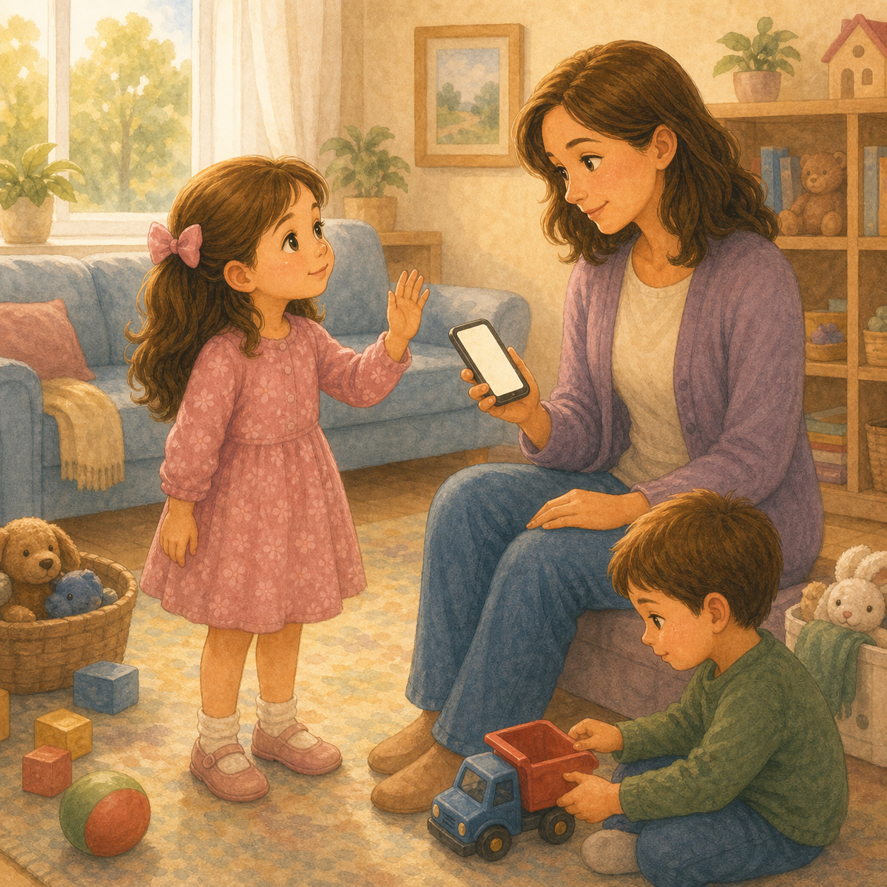

## Глава 141. Почему нельзя брать без спроса

*(Папа кладёт ладонь рядом с игрушкой, но не берёт её)*

Иногда вещь лежит совсем рядом: конфета, мамина помада, папин телефон, чужая машинка. Рука уже тянется. Но важный вопрос звучит раньше руки: «Можно взять?»

Если вещь не твоя, её нельзя брать тайком. Даже если очень хочется. Даже если «только посмотреть». Спросить — значит уважать человека.

Если взяла без спроса, можно остановиться, вернуть и сказать правду. Бог помогает нам выбирать честность раньше хитрости.

**📖 Стих из Библии:**
28. Кто крал, вперед не кради, а лучше трудись, делая своими руками полезное.
Ефесянам 4:28 (Синодальный перевод)

**🗣 Поговорим:**
*Папа:* Какие вещи дома нужно брать только с разрешения?
*(Дать дочке ответить)*

**🙏 Наша молитва:**
«Бог, помоги мне спрашивать и уважать чужое. Аминь.»

---

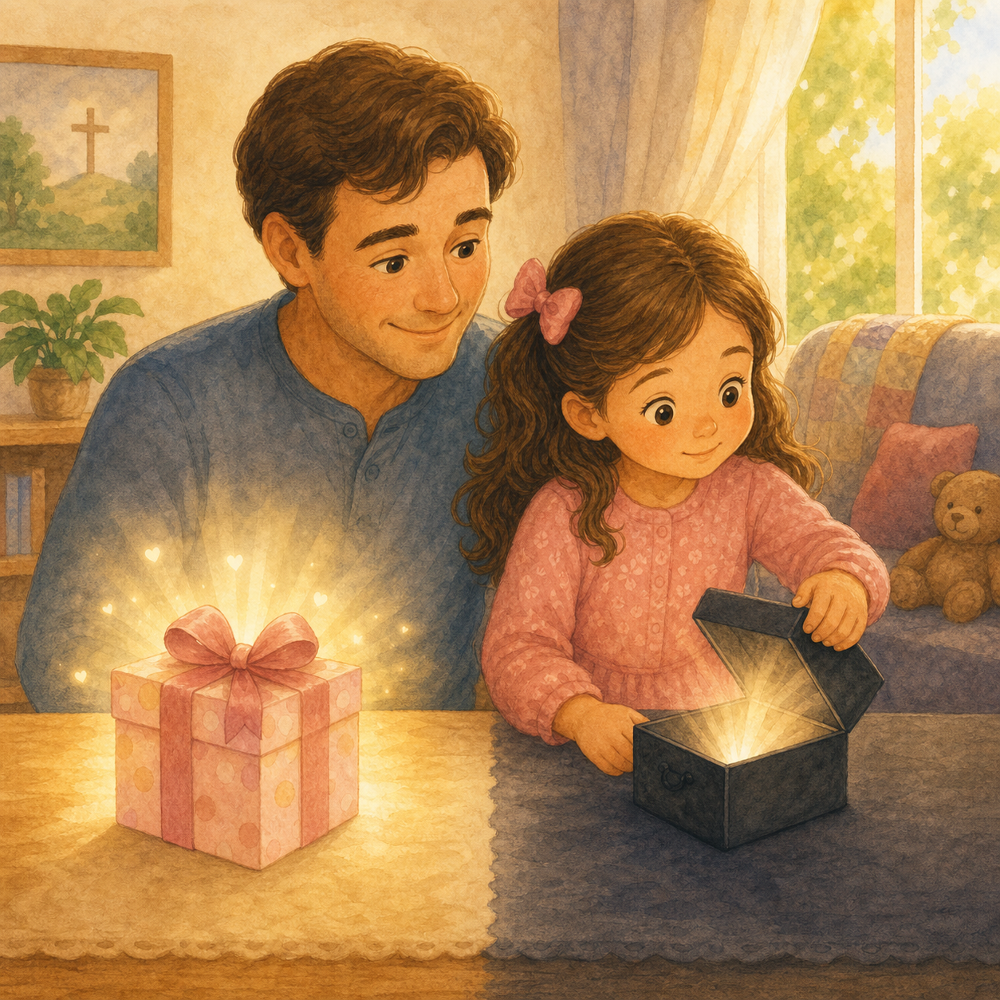

## Глава 142. Секреты хорошие и плохие

*(Папа говорит серьёзно и очень спокойно)*

Есть хорошие секреты: подарок маме, сюрприз на день рождения, рисунок, который мы покажем вечером. От такого секрета внутри светло и радостно.

А есть плохие секреты. Если кто-то говорит: «Никому не рассказывай», а тебе страшно, стыдно, неприятно или тревожно — это не секрет для хранения. Это надо рассказать маме или папе. Сразу.

Ты не будешь виновата за правду. В нашей семье можно говорить о трудном. Свет сильнее тайной темноты.

**📖 Стих из Библии:**
32. И познаете истину, и истина сделает вас свободными.
Иоанна 8:32 (Синодальный перевод)

**🗣 Поговорим:**
*Папа:* Чем хороший секрет отличается от плохого?
*(Дать дочке ответить)*

**🙏 Наша молитва:**
«Господь, дай мне смелость рассказывать маме и папе всё, что пугает моё сердце. Аминь.»

---

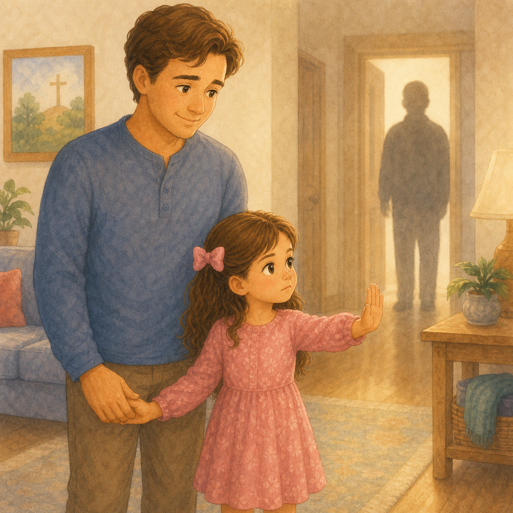

## Глава 143. Когда взрослый неправ

*(Папа говорит уверенно, чтобы дочке было спокойно)*

Мы уважаем взрослых: слушаем воспитателя, здороваемся, не грубим. Но взрослый тоже может ошибиться. Если взрослый просит сделать плохое, скрыть опасное, уйти куда-то без разрешения родителей или нарушает твои границы — слушаться нельзя.

Можно громко сказать: «Нет!» Можно уйти к безопасному взрослому. Можно рассказать маме или папе, даже если тот человек сказал не рассказывать.

Послушание Богу и защита правды важнее страха перед человеком.

**📖 Стих из Библии:**
29. Должно повиноваться больше Богу, нежели человекам.
Деяния 5:29 (Синодальный перевод)

**🗣 Поговорим:**
*Папа:* К кому ты пойдёшь, если взрослый попросит странное или плохое?
*(Дать дочке ответить)*

**🙏 Наша молитва:**
«Бог, дай мне смелость говорить “нет” плохому и сразу идти к маме или папе. Аминь.»

---

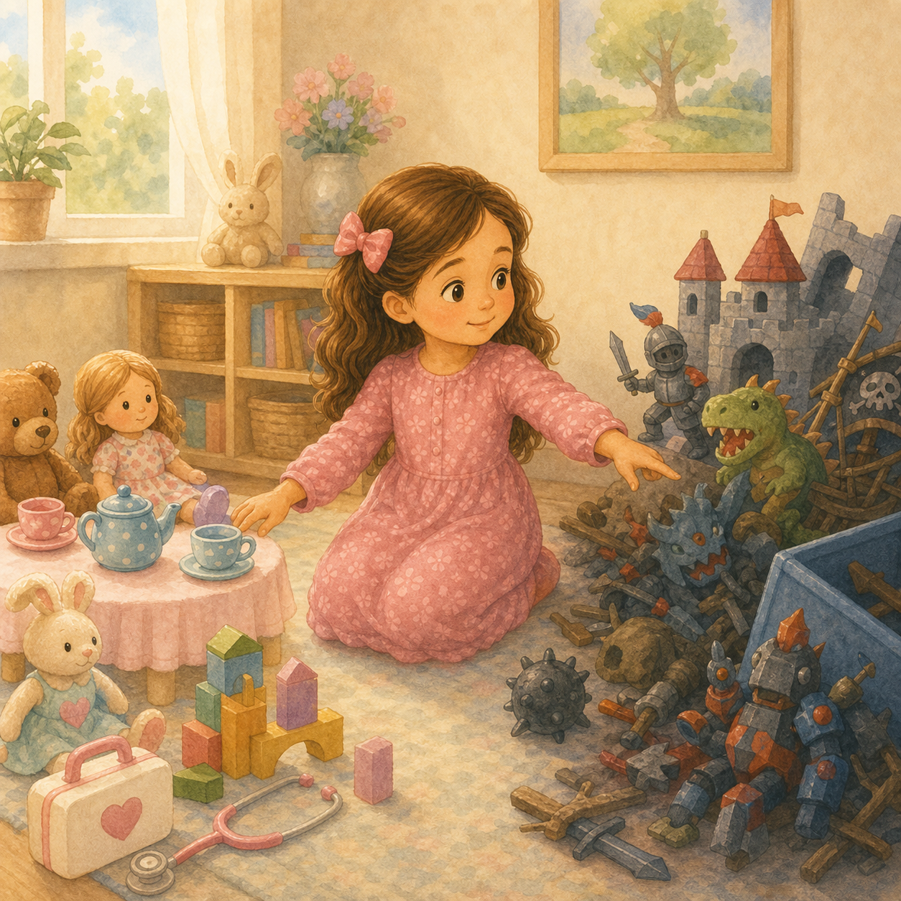

## Глава 144. Как выбирать игру

*(Папа раскладывает воображаемые игрушки)*

Игры бывают разными. Одни делают сердце весёлым и добрым: строить дом, лечить кукол, готовить чай, спасать, мастерить, придумывать истории. Другие учат командовать, пугать, смеяться над слабым или делать вид, что плохое — это хорошо.

Перед игрой можно спросить: «После этой игры я стану добрее? Мне будет спокойно? Другим будет хорошо?» Если игра делает сердце грубым, можно выбрать другую.

Бог любит радость. Игра — тоже место, где сердце учится добру.

**📖 Стих из Библии:**
8. Что только истинно, что честно, что справедливо, что чисто, что любезно, что достославно, что только добродетель и похвала, о том помышляйте.
Филиппийцам 4:8 (Синодальный перевод)

**🗣 Поговорим:**
*Папа:* Какая игра делает тебя добрее и радостнее?
*(Дать дочке ответить)*

**🙏 Наша молитва:**
«Господь, помоги мне выбирать игры, после которых сердце остаётся светлым. Аминь.»

---

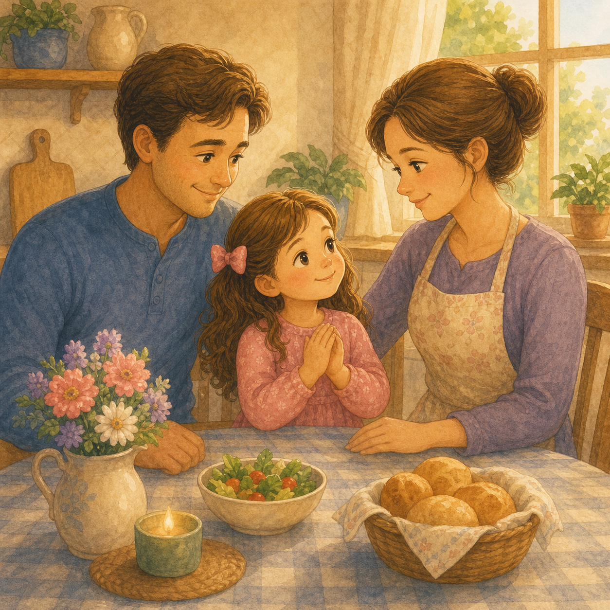

## Глава 145. Добрые слова дома

*(Папа смотрит вокруг комнаты)*

Иногда мы бережём самые красивые слова для гостей, а дома говорим резко: «Дай!», «Уйди!», «Не мешай!» Но дом — первое место, где любовь должна звучать вслух.

Маме приятно слышать «спасибо». Папе приятно слышать «пожалуйста». Брату или сестре важно слышать «прости». Близкие люди не становятся менее важными только потому, что они всегда рядом.

Добрые слова дома — как чистый воздух. С ними легче жить, мириться, смеяться и молиться.

**📖 Стих из Библии:**
6. Слово ваше да будет всегда с благодатию, приправлено солью.
Колоссянам 4:6 (Синодальный перевод)

**🗣 Поговорим:**
*Папа:* Кому дома ты сегодня скажешь доброе слово?
*(Дать дочке ответить)*

**🙏 Наша молитва:**
«Иисус, положи добрые слова на мой язычок, особенно дома. Аминь.»

---

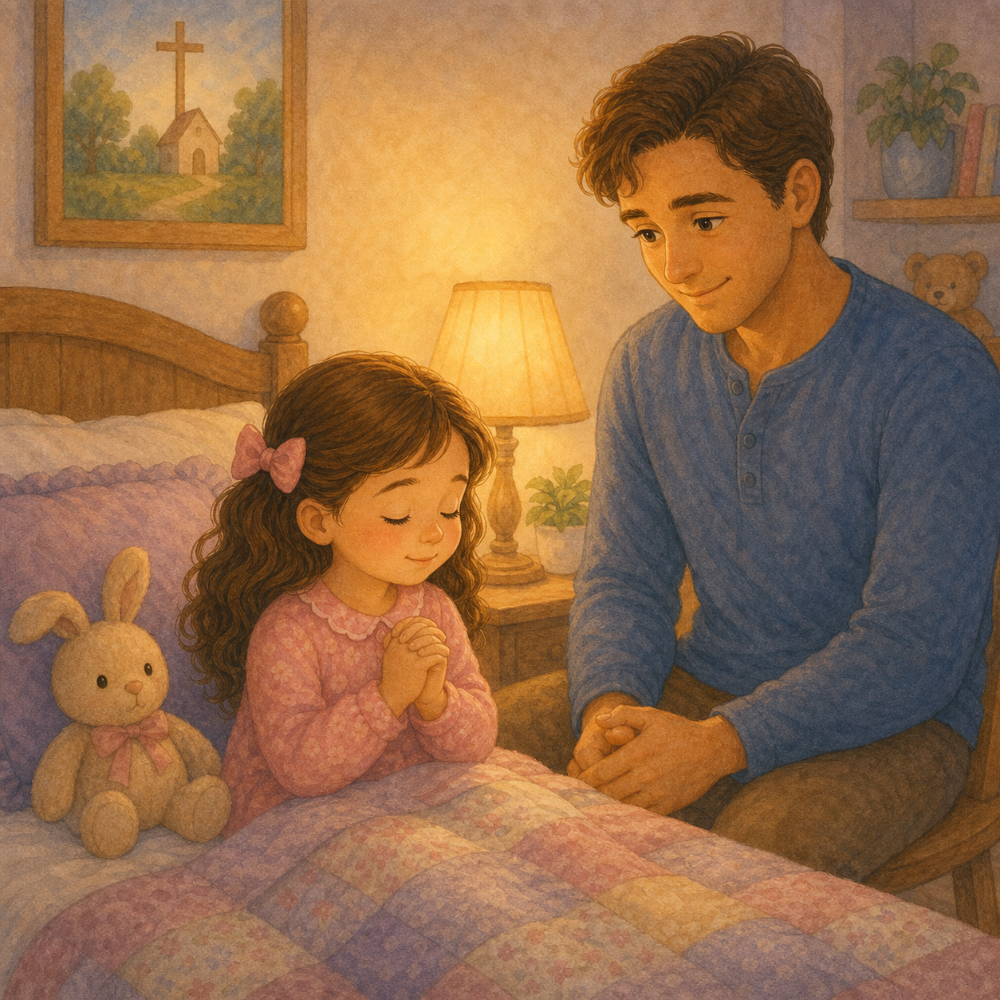

## Глава 146. Бог слышит даже короткую молитву

*(Папа складывает ладони на одну секунду)*

Молитва не обязана быть длинной, как дорога до моря. Иногда молитва совсем короткая: «Господи, помоги». «Спасибо». «Прости». «Мне страшно». «Будь рядом».

Бог не считает слова, будто бусинки. Он слышит сердце. Можно молиться в кроватке, в машине, в садике, перед супом, перед трудным разговором.

Короткая молитва — как маленький звонок Небесному Отцу. И Он не говорит: «Слишком мало слов». Он слышит тебя.

**📖 Стих из Библии:**
13. Ибо всякий, кто призовет имя Господне, спасется.
Римлянам 10:13 (Синодальный перевод)

**🗣 Поговорим:**
*Папа:* Какую короткую молитву ты можешь сказать сегодня?
*(Дать дочке ответить)*

**🙏 Наша молитва:**
«Господи, помоги мне помнить: Ты слышишь даже самые короткие слова. Аминь.»

---

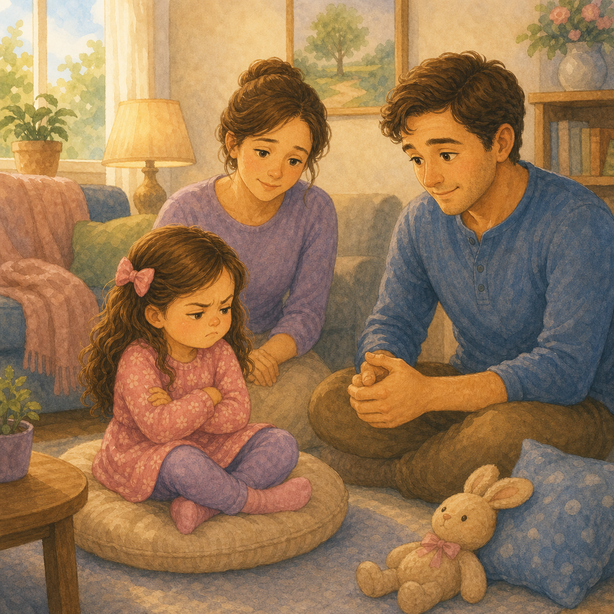

## Глава 147. Когда я злюсь на маму или папу

*(Папа говорит спокойно, не сердясь на само чувство)*

Иногда мама говорит «нельзя». Иногда папа выключает мультик. И внутри поднимается горячая злость: «Не хочу! Вы плохие!» Но злость — это чувство, а не командир.

Можно злиться и всё равно не бить, не кричать обидные слова, не бросать вещи. Можно сказать: «Я злюсь». Можно топнуть подушку, подышать, поплакать, попросить обнять, когда сердце остынет.

Мама и папа не становятся врагами, когда ставят границу. Любовь остаётся даже в трудном «нет».

**📖 Стих из Библии:**
26. Гневаясь, не согрешайте: солнце да не зайдет во гневе вашем.
Ефесянам 4:26 (Синодальный перевод)

**🗣 Поговорим:**
*Папа:* Что можно сделать со злостью, чтобы никого не ранить?
*(Дать дочке ответить)*

**🙏 Наша молитва:**
«Бог, помоги мне говорить о злости честно и не делать больно тем, кого люблю. Аминь.»

---

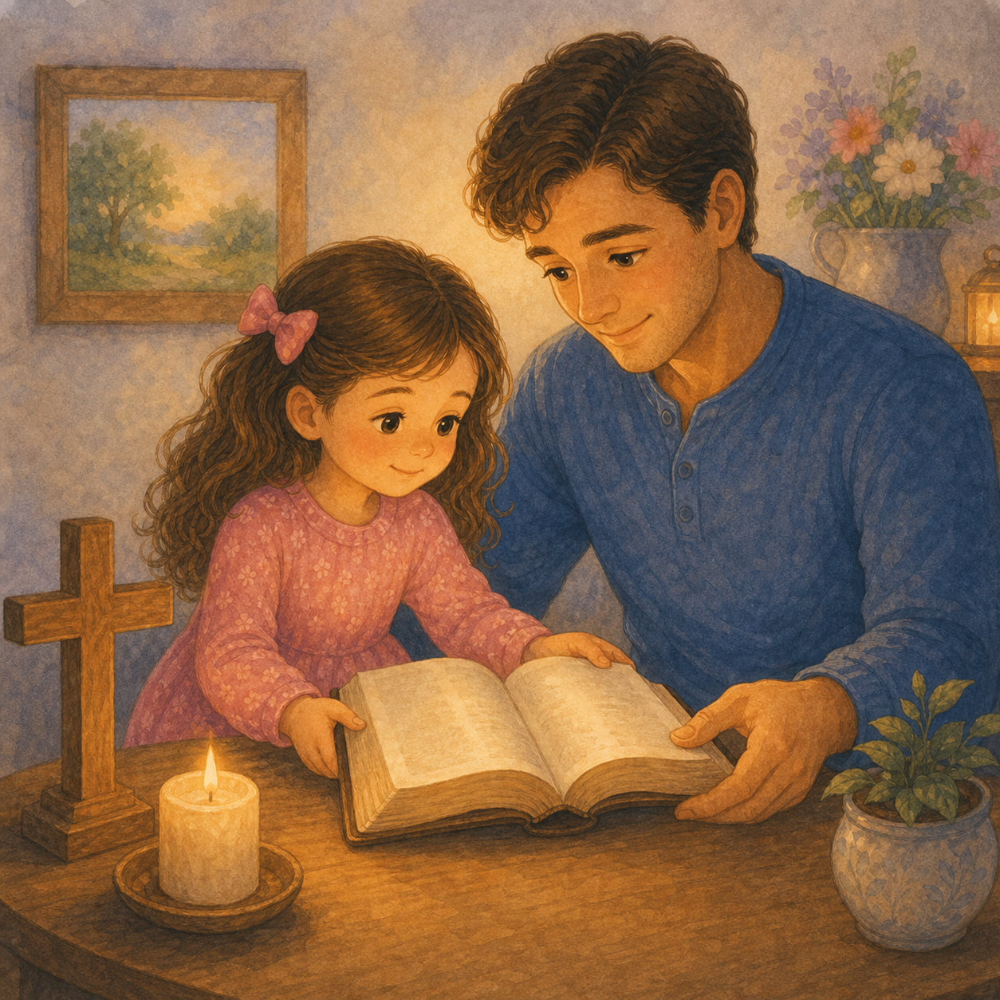

## Глава 148. Книги, Библия и святые вещи

*(Папа осторожно открывает книгу)*

Книги любят чистые руки и спокойные страницы. А Библия — особенная книга: через неё мы слушаем Божье слово. Её не бросают, не рисуют в ней просто так, не ставят на неё чашку.

В храме или дома бывают вещи, к которым относятся бережно: крестик, свеча, икона, хлеб для причастия, молитвенник. Мы не боимся их, но уважаем.

Бережность помогает сердцу помнить: есть вещи не для шума и игры, а для молитвы, памяти и любви к Богу.

**📖 Стих из Библии:**
105. Слово Твое - светильник ноге моей и свет стезе моей.
Псалом 118:105 (Синодальный перевод)

**🗣 Поговорим:**
*Папа:* Как мы можем бережно обращаться с Библией?
*(Дать дочке ответить)*

**🙏 Наша молитва:**
«Господь, научи меня уважать Твоё слово и всё, что помогает нам молиться. Аминь.»

---

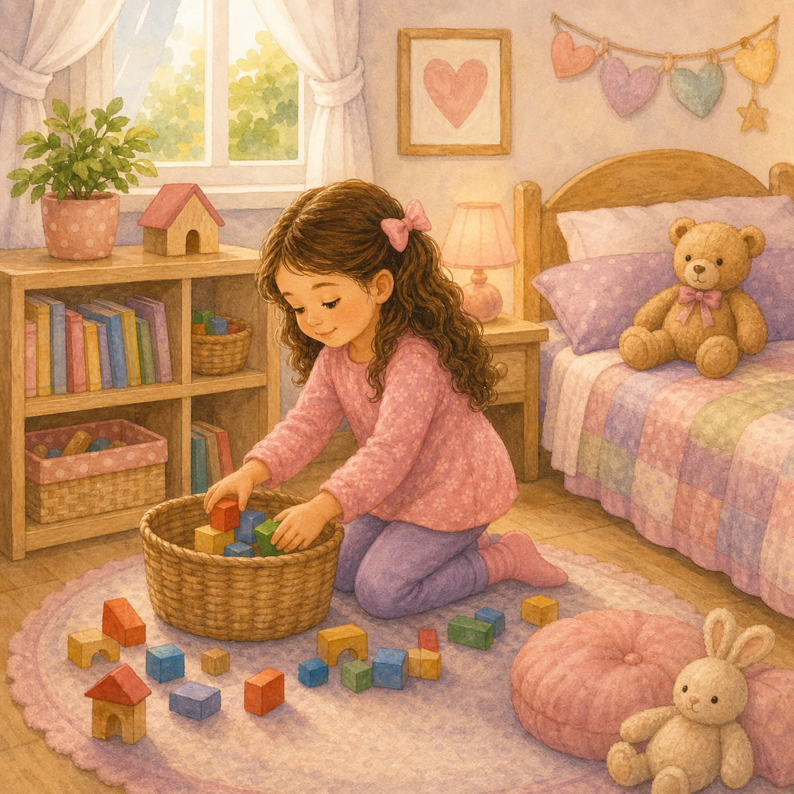

## Глава 149. Моя комната — маленькое царство порядка

*(Папа показывает на пол, полку и кроватку)*

Твоя комната — маленькое царство. В нём живут куклы, кубики, книжки, носочки и одеяло. Если всё лежит где попало, царство начинает спотыкаться.

Порядок не значит, что играть нельзя. Играть можно! Но после игры вещи возвращаются домой: кубики в коробку, книжки на полку, одежда в корзину, мишка на кроватку.

Когда ты наводишь порядок, ты не просто убираешь. Ты учишься заботиться о месте, которое Бог дал нашей семье.

**📖 Стих из Библии:**
23. И все, что делаете, делайте от души, как для Господа.
Колоссянам 3:23 (Синодальный перевод)

**🗣 Поговорим:**
*Папа:* У какой вещи в твоей комнате есть свой «домик»?
*(Дать дочке ответить)*

**🙏 Наша молитва:**
«Бог, помоги мне любить порядок и убирать без ворчания. Аминь.»

---

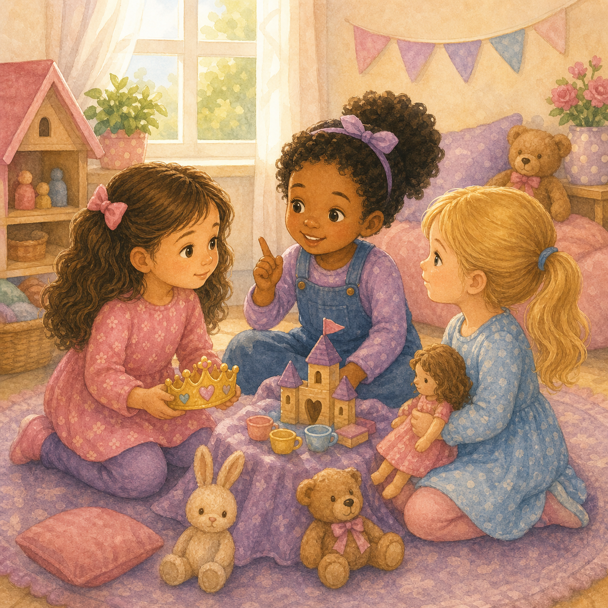

## Глава 150. Когда хочется командовать всеми

*(Папа изображает маленькую корону и снимает её с улыбкой)*

Иногда хочется сказать всем: «Ты будешь мамой, ты будешь ребёнком, ты стой тут, а ты играй только так!» Кажется, если все послушаются, игра станет идеальной.

Но друзья — не игрушки на верёвочках. Можно предлагать, можно договариваться, можно быть ведущей. Но нельзя давить, обижаться каждый раз и заставлять всех играть только по-твоему.

Настоящая старшая или главная умеет служить: замечать других, слушать, уступать, помогать. Иисус был самым главным — и всё равно служил людям.

**📖 Стих из Библии:**
45. Ибо и Сын Человеческий не для того пришел, чтобы Ему служили, но чтобы послужить.
Марка 10:45 (Синодальный перевод)

**🗣 Поговорим:**
*Папа:* Как можно предложить игру так, чтобы другим тоже было хорошо?
*(Дать дочке ответить)*

**🙏 Наша молитва:**
«Иисус, научи меня быть не командиром капризов, а доброй помощницей в игре. Аминь.»

---

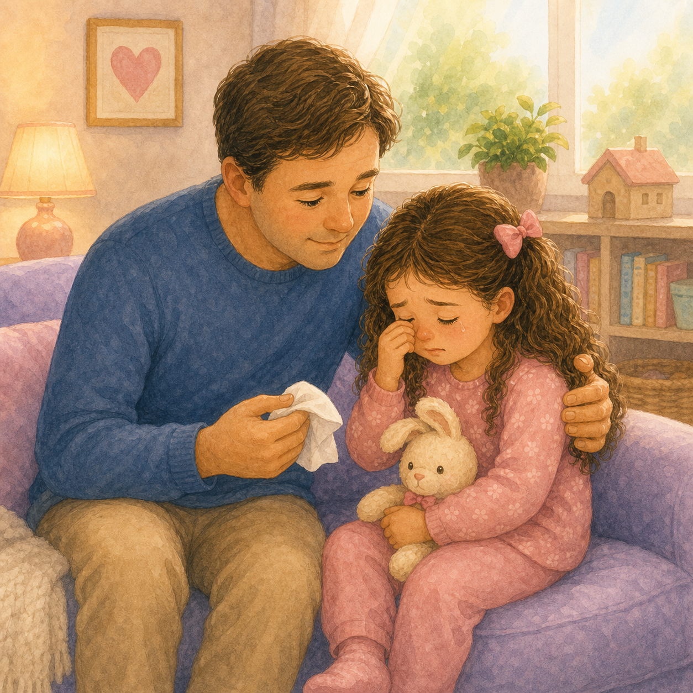

## Глава 151. Слёзы — это не стыдно

*(Папа протягивает платочек)*

Слёзы приходят, когда больно, обидно, страшно, устало или слишком много всего сразу. Слёзы не делают тебя плохой или маленькой «неправильно». Они говорят: сердцу нужна помощь.

Не надо смеяться над чужими слезами. И не надо прятать свои, будто это грязная тайна. Можно сказать: «Мне грустно». Можно попросить воды, обнять, посидеть тихо.

Бог близко к сердцу, которое плачет. А папа и мама рядом, чтобы утешить и помочь снова подняться.

**📖 Стих из Библии:**
19. Близок Господь к сокрушенным сердцем и смиренных духом спасет.
Псалом 33:19 (Синодальный перевод)

**🗣 Поговорим:**
*Папа:* Что помогает тебе, когда хочется плакать?
*(Дать дочке ответить)*

**🙏 Наша молитва:**
«Господь, спасибо, что Ты не стыдишь мои слёзы. Утешь моё сердце. Аминь.»

---

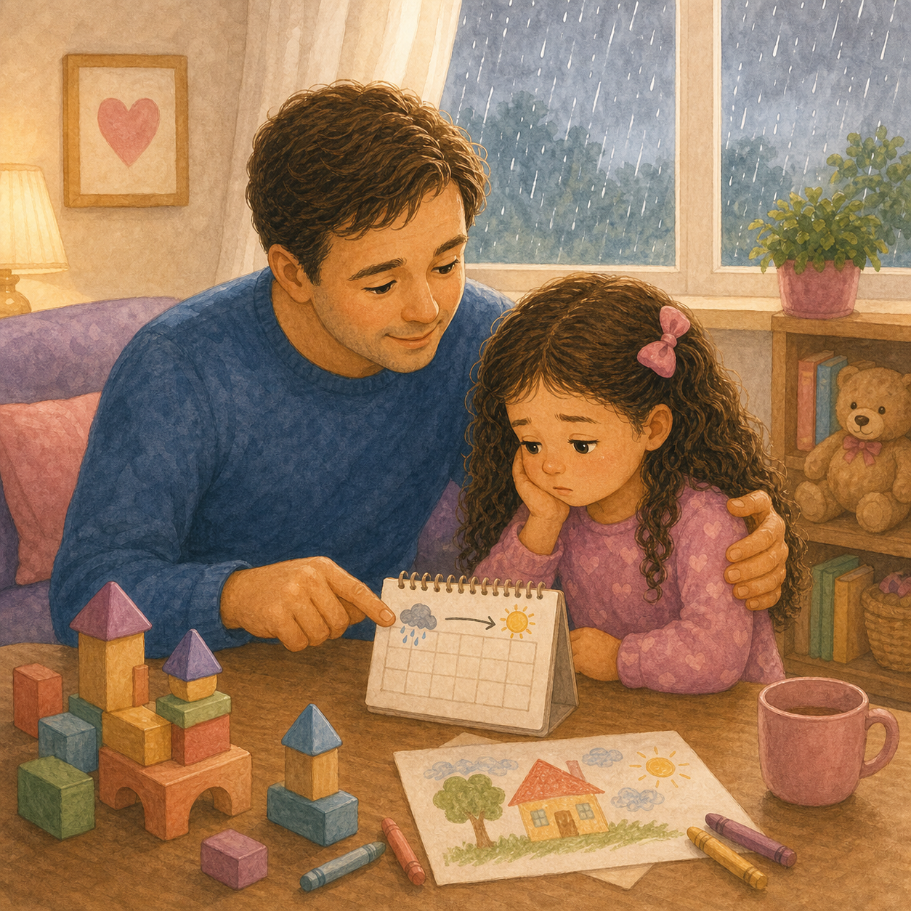

## Глава 152. Когда планы поменялись

*(Папа переворачивает воображаемый лист календаря)*

Иногда мы собирались гулять — а пошёл дождь. Ждали гостей — а они заболели. Хотели в парк — а машина не завелась. Сердце сразу говорит: «Но я же ждала!»

Грустить можно. Планы правда бывают дорогими. Но если план поменялся, любовь не поменялась. Бог всё ещё рядом, мама и папа всё ещё любят тебя, а день всё ещё может стать добрым по-другому.

Можно сказать: «Мне жалко». Потом выдохнуть и спросить: «А что мы можем сделать теперь?» Гибкое сердце не ломается, как сухая веточка. Оно сгибается и снова поднимается.

**📖 Стих из Библии:**
9. Сердце человека обдумывает свой путь, но Господь управляет шествием его.
Притчи 16:9 (Синодальный перевод)

**🗣 Поговорим:**
*Папа:* Что можно сделать хорошего, если наш первый план не получился?
*(Дать дочке ответить)*

**🙏 Наша молитва:**
«Господь, помоги мне не сердиться долго, когда планы меняются. Научи меня доверять Тебе. Аминь.»

---

## Глава 153. Как принимать подарки

*(Папа протягивает воображаемую коробочку)*

Подарок — это не только вещь. Это чья-то мысль о тебе: «Я хочу тебя порадовать». Поэтому подарок берут двумя руками и говорят: «Спасибо».

Иногда подарок не такой, как ты мечтала. Не та кукла, не тот цвет, не самая большая коробка. Но доброе сердце сначала замечает любовь человека, а уже потом рассматривает ленточку.

Не надо говорить: «А ещё есть?» или «Я такое не хотела». Можно улыбнуться, поблагодарить и помнить: благодарность делает подарок красивее.

**📖 Стих из Библии:**
18. За все благодарите: ибо такова о вас воля Божия во Христе Иисусе.
1 Фессалоникийцам 5:18 (Синодальный перевод)

**🗣 Поговорим:**
*Папа:* Какие слова мы говорим, когда нам дарят подарок?
*(Дать дочке ответить)*

**🙏 Наша молитва:**
«Бог, научи меня видеть любовь за подарком и благодарить от сердца. Аминь.»

---

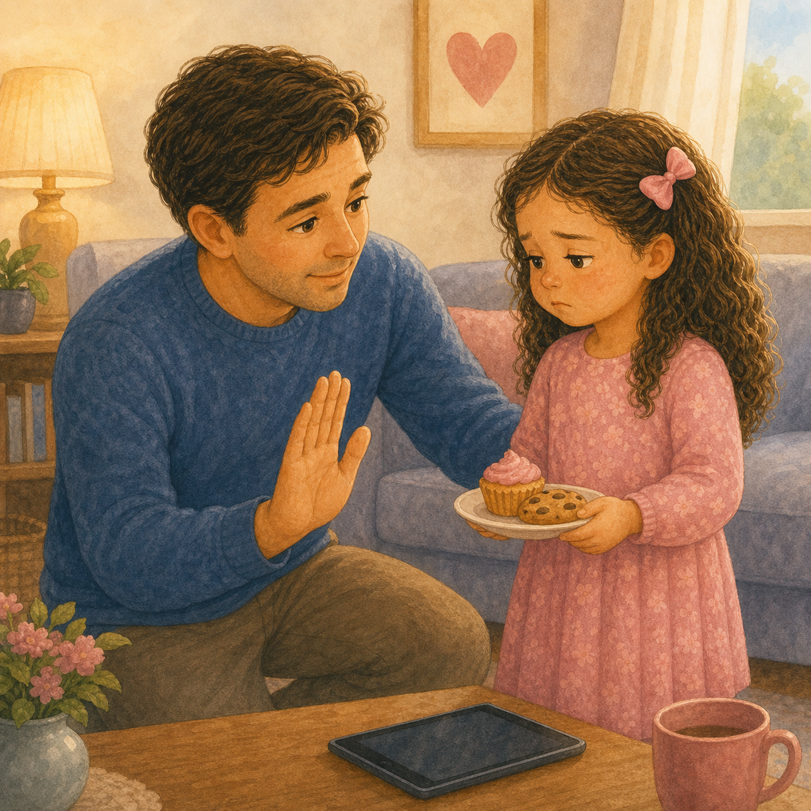

## Глава 154. Когда тебе сказали «нет»

*(Папа мягко качает головой и держит дочку за руку)*

Слово «нет» иногда колется. Ты просишь ещё мультик, конфету, игрушку, пойти туда, куда нельзя, а взрослый отвечает: «Нет». И внутри сразу поднимается буря.

Но «нет» не всегда значит «тебя не любят». Часто «нет» — это заборчик безопасности. Или забота о здоровье. Или помощь сердцу, чтобы оно не стало командиром всего дома.

Можно расстроиться и всё равно не кричать. Можно спросить: «Почему?» Можно услышать ответ. Сердце растёт, когда учится принимать добрую границу.

**📖 Стих из Библии:**
1. Дети, повинуйтесь своим родителям в Господе, ибо сего требует справедливость.
Ефесянам 6:1 (Синодальный перевод)

**🗣 Поговорим:**
*Папа:* Как можно ответить спокойно, когда тебе сказали «нет»?
*(Дать дочке ответить)*

**🙏 Наша молитва:**
«Иисус, помоги мне принимать доброе “нет” без крика и помнить, что меня любят. Аминь.»

---

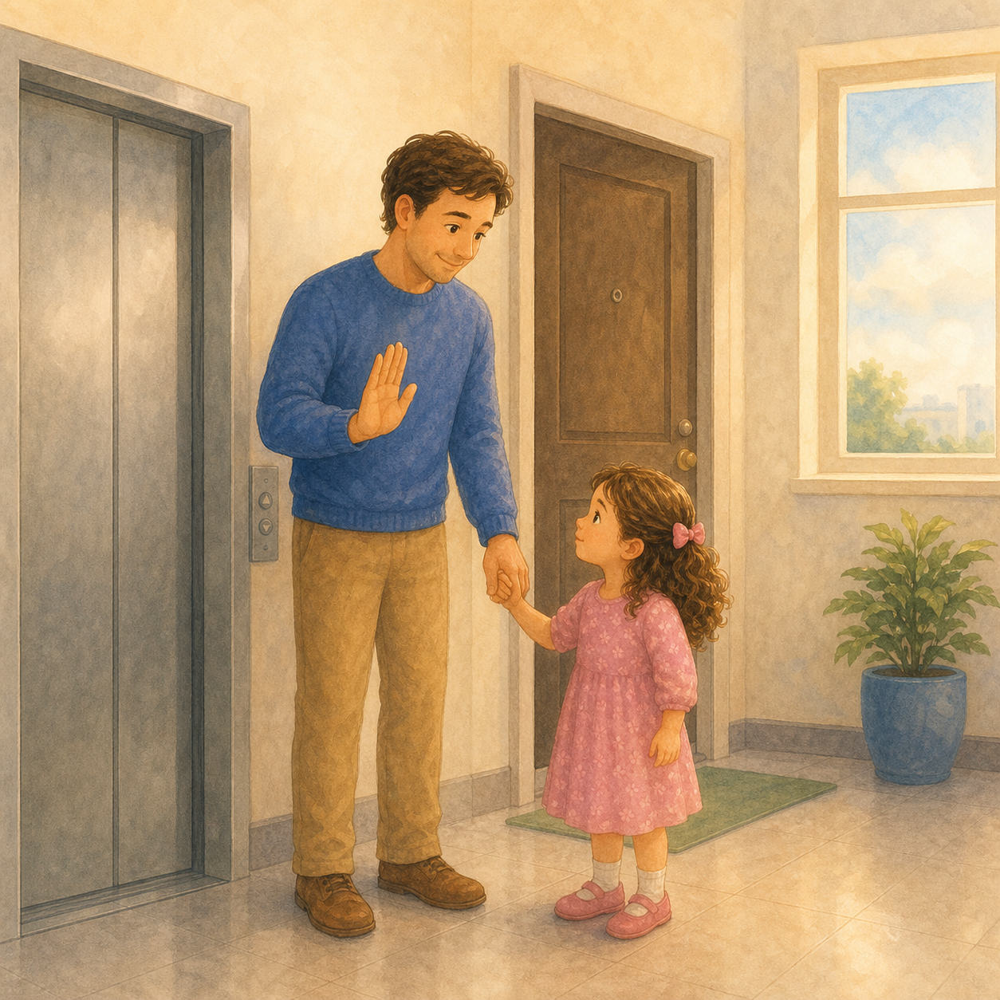

## Глава 155. Двери, окна и лифт

*(Папа показывает: стоп, рука взрослого, ждать)*

Двери умеют щёлкать, окна высокие, а лифт ездит сам. Это не игрушки для маленьких ручек без взрослого рядом.

Мы не открываем входную дверь незнакомым. Не залезаем на подоконник. Не нажимаем кнопки лифта и не заходим в лифт одни. Если дверь закрывается — ручки держим подальше, чтобы пальчики были целы.

Безопасность не делает жизнь скучной. Она хранит радость, чтобы мы могли играть, бегать и смеяться дальше.

**📖 Стих из Библии:**
3. Благоразумный видит беду и укрывается; а неопытные идут вперед и наказываются.
Притчи 22:3 (Синодальный перевод)

**🗣 Поговорим:**
*Папа:* Что мы делаем, если нужно ехать в лифте?
*(Дать дочке ответить)*

**🙏 Наша молитва:**
«Господь, дай мне внимательность у дверей, окон и лифта. Храни мои ручки и ножки. Аминь.»

---

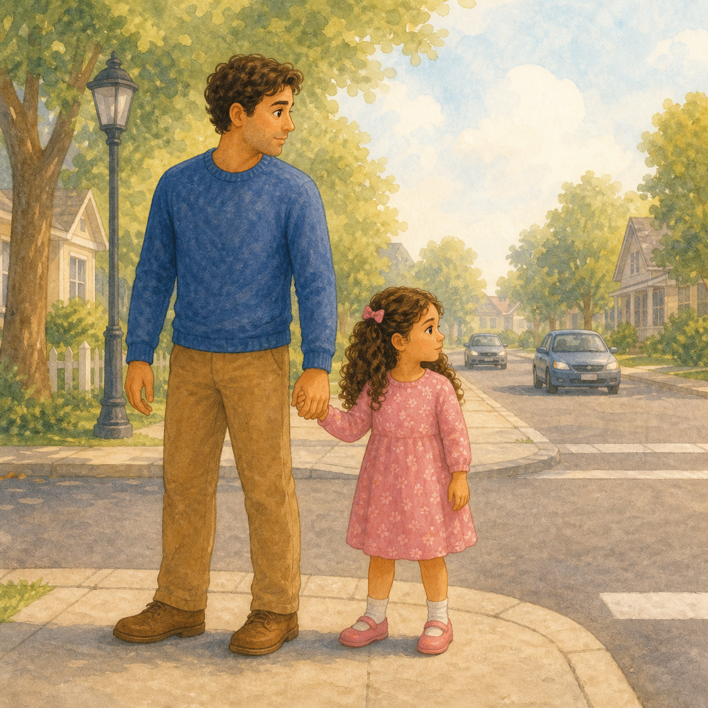

## Глава 156. Переход через дорогу

*(Папа крепко берёт дочкину руку)*

Дорога — место для машин, автобусов и больших колёс. Даже если ты очень быстро бегаешь, на дороге мы не бегаем. Мы держим взрослого за руку.

Перед переходом останавливаемся. Смотрим. Слушаем. Ждём разрешения взрослого. Даже если светофор зелёный, мы всё равно идём внимательно, не прыгаем и не вырываемся.

Храбрая девочка — не та, которая мчится первой. Храбрая девочка умеет остановиться вовремя.

**📖 Стих из Библии:**
3. Благоразумный видит беду и укрывается; а неопытные идут вперед и наказываются.
Притчи 22:3 (Синодальный перевод)

**🗣 Поговорим:**
*Папа:* Чью руку ты держишь, когда переходишь дорогу?
*(Дать дочке ответить)*

**🙏 Наша молитва:**
«Бог, помоги мне быть внимательной у дороги и слушаться взрослых. Аминь.»

---

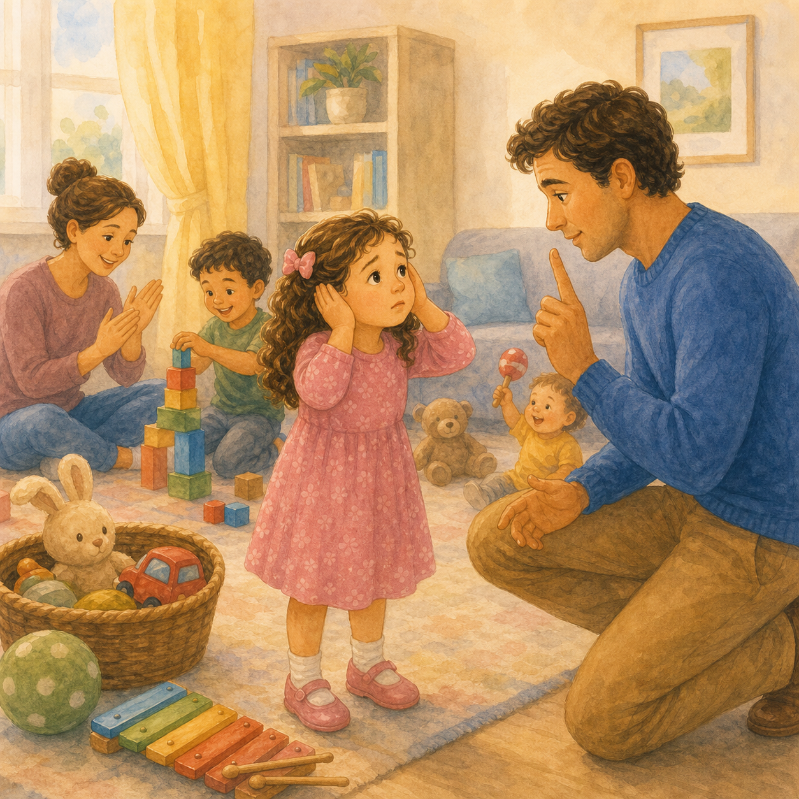

## Глава 157. Когда в комнате слишком шумно

*(Папа прикрывает уши ладонями и улыбается)*

Иногда вокруг слишком много звуков: кто-то смеётся, кто-то поёт, игрушки стучат, музыка играет, взрослые говорят. Голова устает, и сердцу хочется спрятаться.

Можно не кричать громче всех. Можно подойти к взрослому и сказать: «Мне слишком шумно». Можно попросить тише, выйти на минутку, попить воды, посидеть рядом.

Бог знает, что мы не железные. Тишина иногда помогает любви вернуться в голос.

**📖 Стих из Библии:**
15. Отвращайся от зла и делай добро; ищи мира и следуй за ним.
Псалом 33:15 (Синодальный перевод)

**🗣 Поговорим:**
*Папа:* Что ты можешь сказать, если тебе стало слишком шумно?
*(Дать дочке ответить)*

**🙏 Наша молитва:**
«Господь, помоги мне просить тишины спокойно и беречь мир в доме. Аминь.»

---

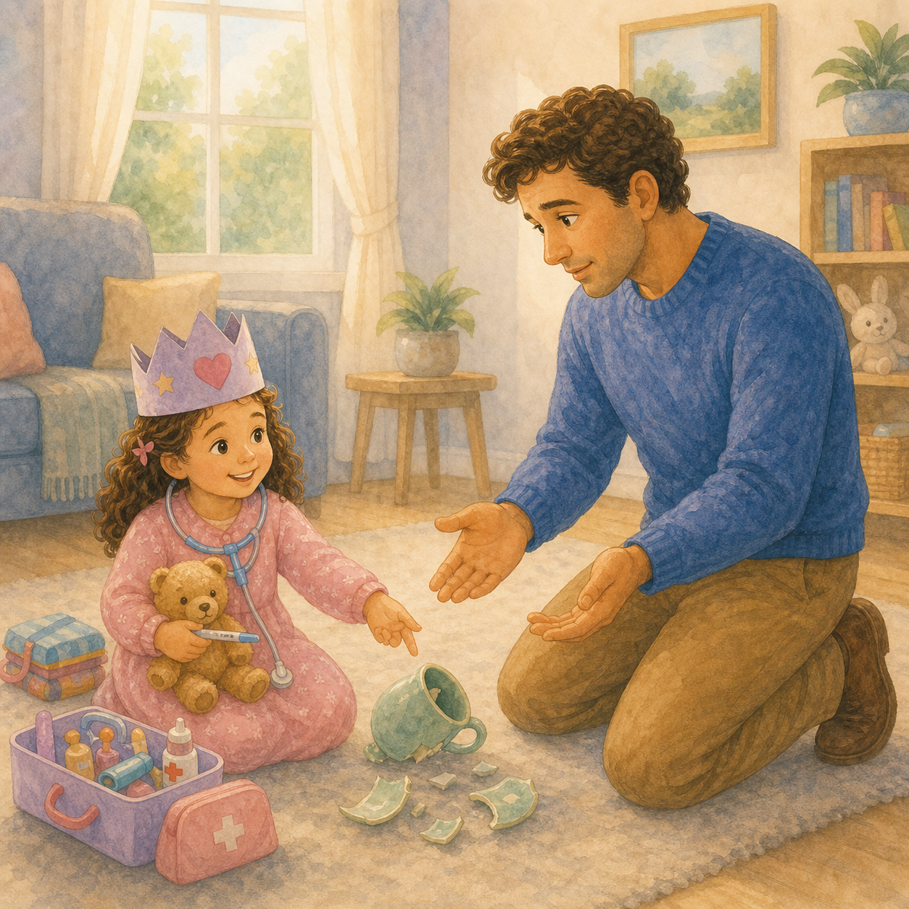

## Глава 158. Фантазия и правда

*(Папа надевает воображаемую корону и смеётся)*

В игре можно быть принцессой, доктором, мамой, путешественницей, строителем корабля. Фантазия — чудесный подарок. Она помогает играть и придумывать.

Но есть разница между «понарошку» и правдой. Если ты говоришь: «Я лечу на Луну» во время игры — это фантазия. А если разбила чашку и сказала: «Это не я» — это уже неправда.

Доброе сердце умеет играть смело и говорить честно. В игре — сказка. В жизни — правда.

**📖 Стих из Библии:**
25. Посему, отвергнув ложь, говорите истину каждый ближнему своему.
Ефесянам 4:25 (Синодальный перевод)

**🗣 Поговорим:**
*Папа:* Чем игра «понарошку» отличается от обмана?
*(Дать дочке ответить)*

**🙏 Наша молитва:**
«Бог, спасибо за фантазию. Помоги мне играть радостно и говорить правду. Аминь.»

---

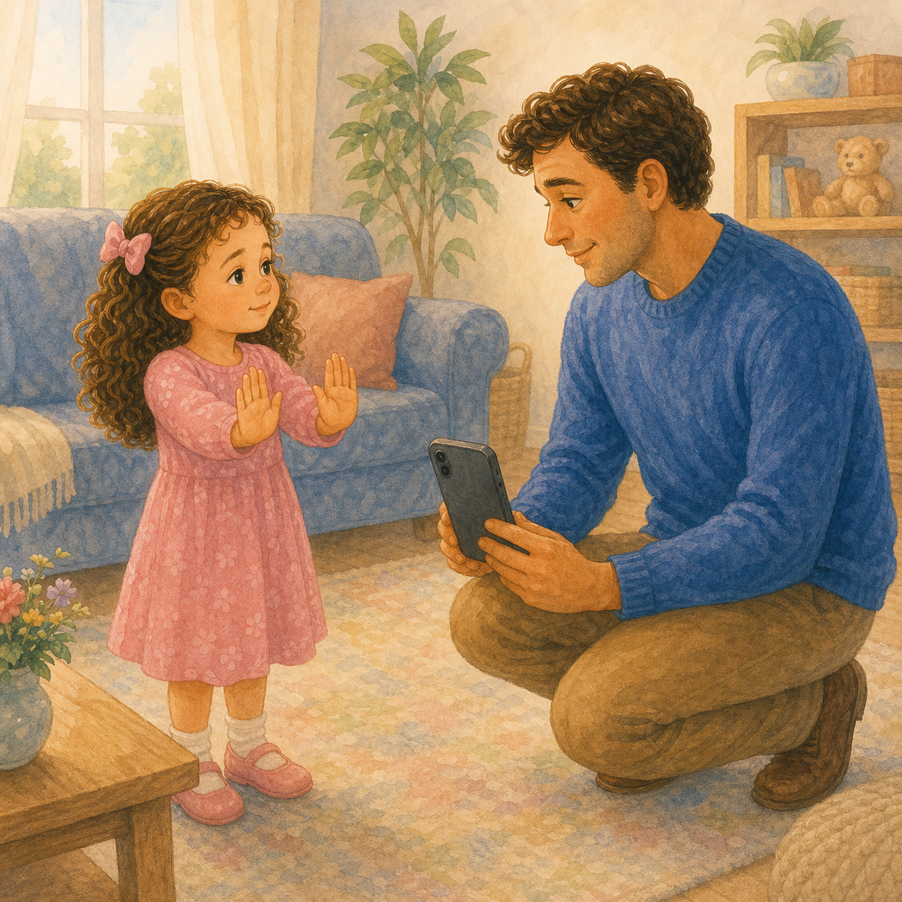

## Глава 159. Фото и видео: можно попросить не снимать

*(Папа показывает телефон и опускает его вниз)*

Фото помогают помнить радостные дни. Но иногда ты не хочешь, чтобы тебя снимали: устала, плачешь, переодеваешься, кушаешь или просто не хочешь сейчас.

Можно сказать: «Не снимай меня, пожалуйста». Можно закрыться ладошкой и пойти к маме или папе. Мы уважаем людей не только рядом, но и на фотографиях.

Твоё лицо, тело и грустные минуты — не игрушка для чужого смеха. Любовь умеет отложить телефон.

**📖 Стих из Библии:**
12. Итак во всем, как хотите, чтобы с вами поступали люди, так поступайте и вы с ними.
Матфея 7:12 (Синодальный перевод)

**🗣 Поговорим:**
*Папа:* Как можно вежливо попросить не снимать тебя?
*(Дать дочке ответить)*

**🙏 Наша молитва:**
«Господь, научи нас уважать друг друга и быть добрыми даже с телефоном в руках. Аминь.»

---

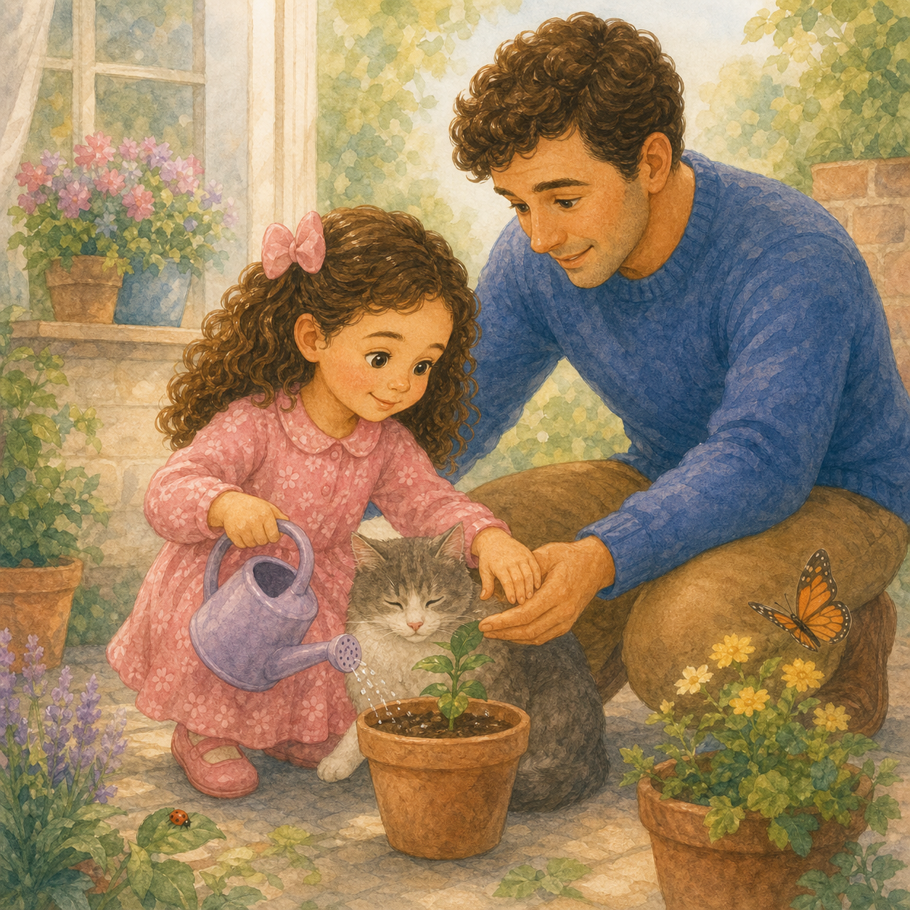

## Глава 160. Бережность к животным и растениям

*(Папа показывает мягкую ладошку)*

Живое не любит грубых рук. Цветок нельзя рвать просто так. Кошку нельзя тянуть за хвост. Жучка не надо давить от скуки. Маленькое живое тоже чувствует Божью заботу.

Можно гладить мягко, поливать аккуратно, смотреть внимательно, не пугать и не ломать. Если животное уходит — значит ему нужно место. Если растение тонкое — значит его трогают нежно.

Бог доверил нам мир не для того, чтобы мы были хозяевами-ломателями, а чтобы были заботливыми хранителями.

**📖 Стих из Библии:**
15. И взял Господь Бог человека, и поселил его в саду Едемском, чтобы возделывать его и хранить его.
Бытие 2:15 (Синодальный перевод)

**🗣 Поговорим:**
*Папа:* Как выглядит мягкая рука для животного или цветка?
*(Дать дочке ответить)*

**🙏 Наша молитва:**
«Бог, научи меня беречь всё живое, что Ты создал. Аминь.»

---

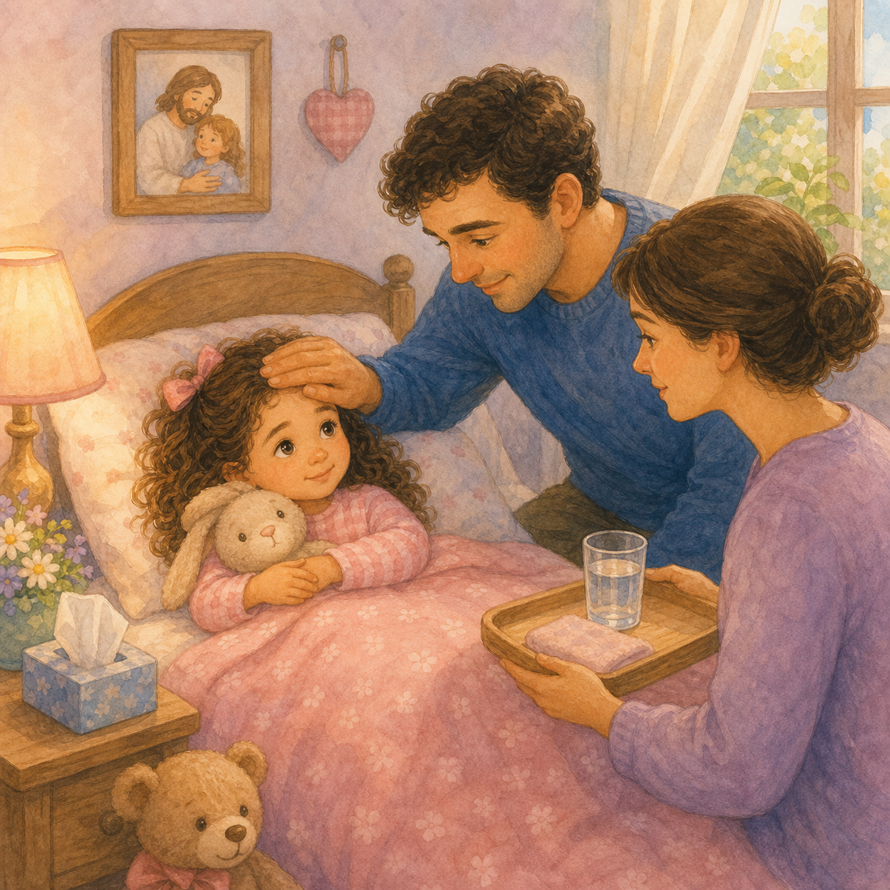

## Глава 161. Когда болеешь дома

*(Папа поправляет одеяло)*

Когда болеешь, тело просит заботы: поспать, попить воды, измерить температуру, принять лекарство от взрослого. Болеть неприятно, но это не значит, что Бог забыл о тебе.

Иногда нельзя бежать, есть сладкое или идти гулять. Это не наказание. Это помощь телу выздоравливать. Можно скучать и всё равно лечиться спокойно.

Мама, папа, врач и лекарства — как маленькая команда заботы. А Бог даёт терпение и мир сердцу.

**📖 Стих из Библии:**
10. Не бойся, ибо Я с тобою; не смущайся, ибо Я Бог твой; Я укреплю тебя и помогу тебе.
Исаия 41:10 (Синодальный перевод)

**🗣 Поговорим:**
*Папа:* Что помогает телу выздоравливать?
*(Дать дочке ответить)*

**🙏 Наша молитва:**
«Господь, будь рядом, когда я болею. Дай мне терпение и помоги выздороветь. Аминь.»

---

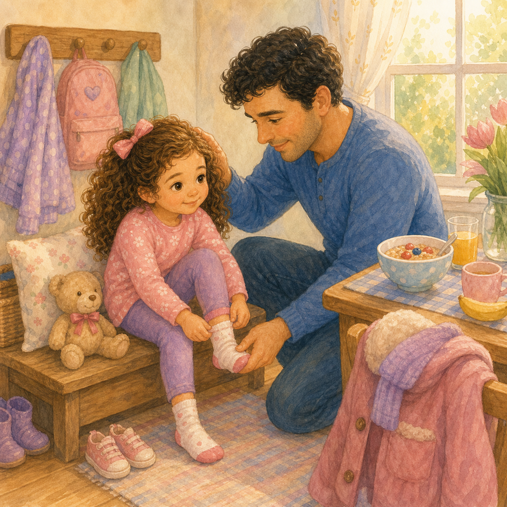

## Глава 162. Утренние сборы без войны

*(Папа показывает носочки, расчёску и курточку)*

Утром всё будто спешит: носочки прячутся, волосы путаются, завтрак ждёт, дверь зовёт. И очень легко начать ворчать ещё до солнца.

Но утро может быть не войной, а маленьким порядком. Сначала встать. Потом умыться. Потом одеться. Потом поесть. Если трудно — попросить помощи словами, а не плачем-командиром.

Когда мы собираемся мирно, день начинает идти мягче. Не идеально, но добрее.

**📖 Стих из Библии:**
24. Сей день сотворил Господь: возрадуемся и возвеселимся в оный!
Псалом 117:24 (Синодальный перевод)

**🗣 Поговорим:**
*Папа:* Что утром можно сделать первым, чтобы стало легче собираться?
*(Дать дочке ответить)*

**🙏 Наша молитва:**
«Господь, благослови наше утро. Помоги нам собираться без крика и с любовью. Аминь.»

---

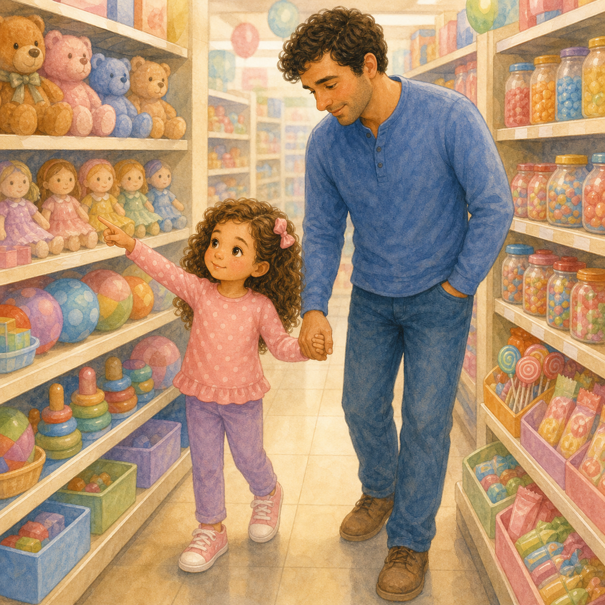

## Глава 163. «Купи!» и витрины в магазине

*(Папа показывает на воображаемую полку и потом на сердце)*

Магазин умеет шептать: «Посмотри! Возьми! Купи! Ещё!» Игрушки блестят, конфеты улыбаются обёртками, и сердце начинает тянуть папу за руку.

Но не всё красивое нужно покупать. Иногда мы просто смотрим. Иногда выбираем одно. Иногда говорим: «Не сегодня». Это не беда. Дом не должен слушаться каждой витрины.

Можно сказать: «Мне понравилось». Можно сфотографировать в памяти. Можно поблагодарить и идти дальше. Радость живёт не только в пакетах из магазина.

**📖 Стих из Библии:**
15. Жизнь человека не зависит от изобилия его имения.
Луки 12:15 (Синодальный перевод)

**🗣 Поговорим:**
*Папа:* Что можно сказать в магазине вместо крика «купи»?
*(Дать дочке ответить)*

**🙏 Наша молитва:**
«Бог, научи моё сердце быть довольным и не командовать через “купи”. Аминь.»

---

_Конец. С любовью ко Христу._
