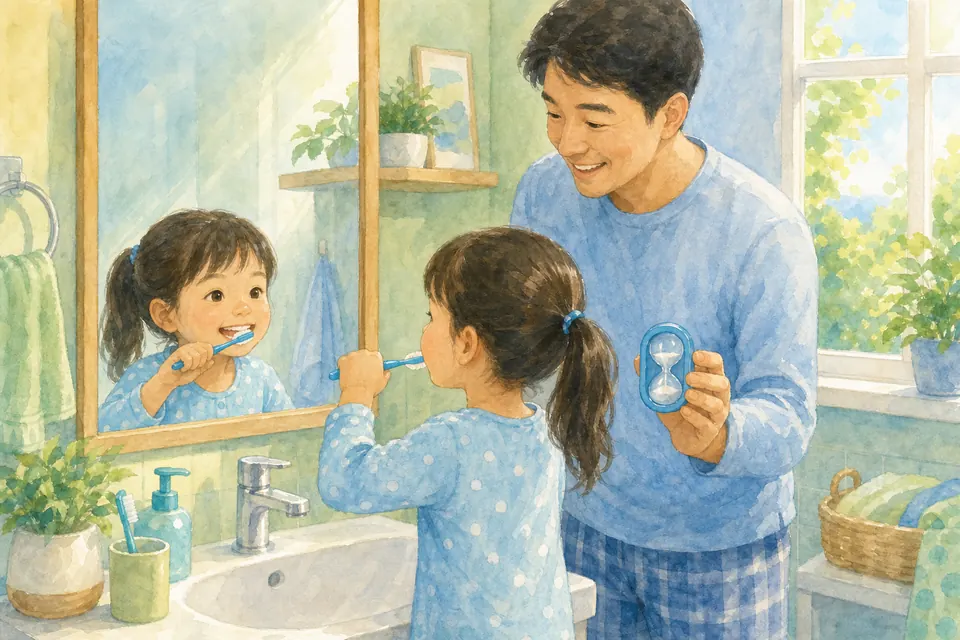
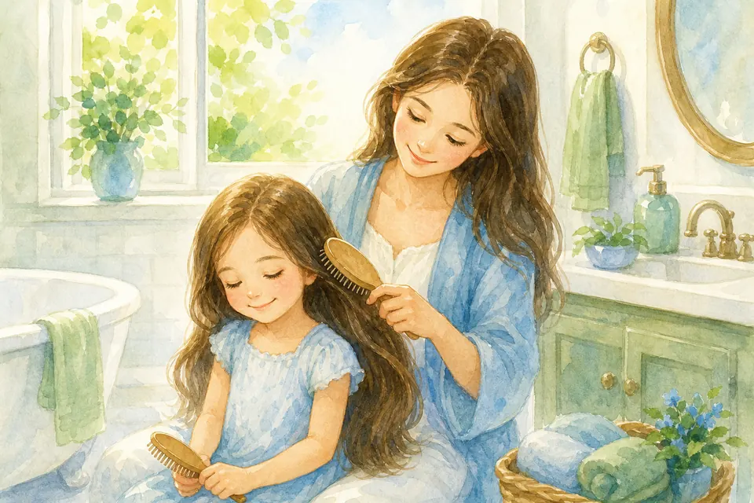
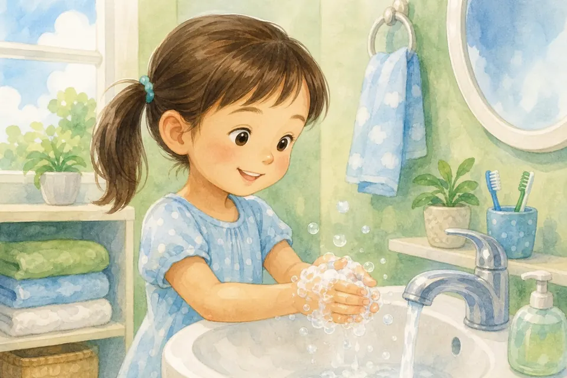
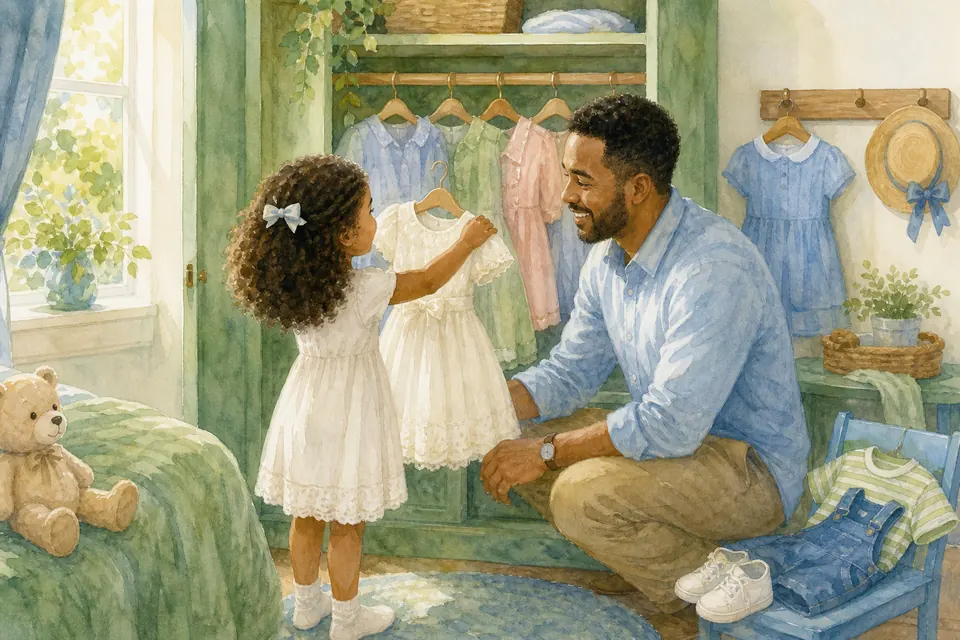
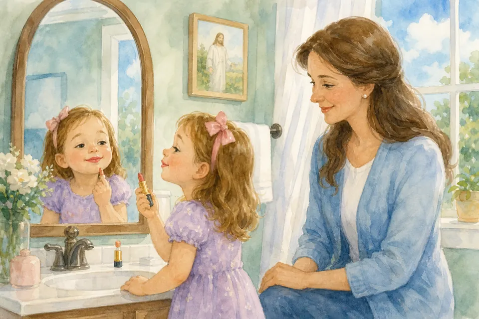
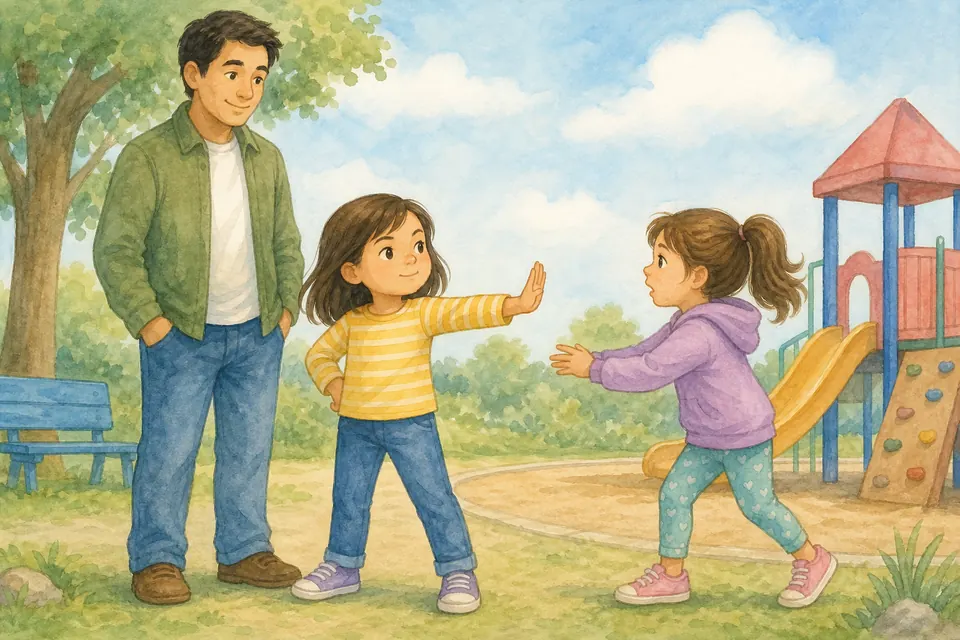
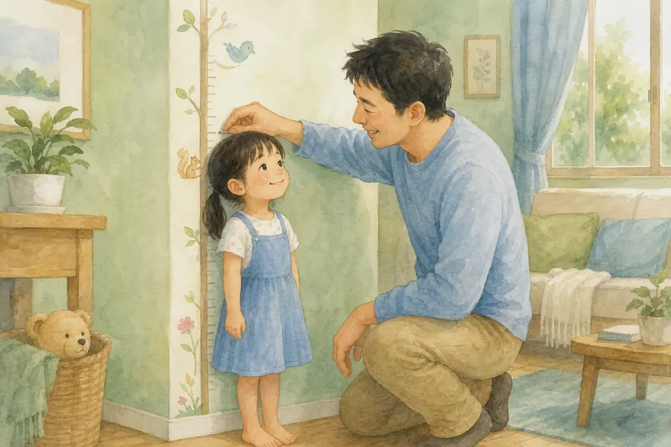
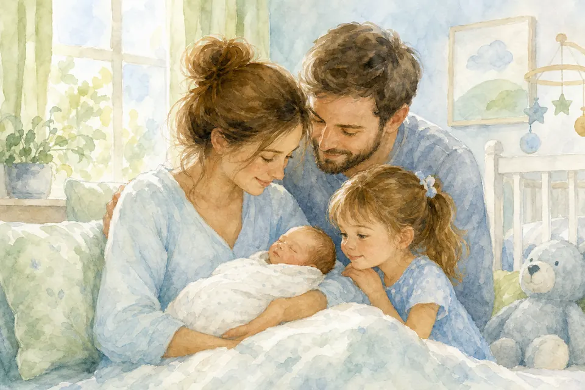

## В этой части

- [Глава 13. Твоё тело — Божий подарок](#ch-13)
- [Глава 14. Чистим зубки — как маленькие солдаты](#ch-14)
- [Глава 15. Волосы: нежность и порядок](#ch-15)
- [Глава 16. Ногти и чистые ручки](#ch-16)
- [Глава 17. Как стоит одеваться](#ch-17)
- [Глава 18. Настоящая красота: дочь Царя](#ch-18)
- [Глава 19. Косметика: всё в своё время](#ch-19)
- [Глава 20. Правило купальника](#ch-20)
- [Глава 21. Ты растёшь — и это хорошо](#ch-21)
- [Глава 22. Как появляются детки](#ch-22)

## Глава 13. Твоё тело — Божий подарок {#ch-13}

*(Папа говорит бережно)*

У тебя есть глаза, чтобы видеть добро. Уши — чтобы слышать. Ноги — чтобы бегать. Руки — чтобы обнимать и помогать. Животик — чтобы чувствовать сытость. Сердце — чтобы любить.

Тело ценно. Мы бережём его: едим, спим, двигаемся, моем, лечимся, когда нужно. Бережём глазки и ушки, сидим ровно, гуляем, пьём воду и говорим взрослым, если что-то болит. Никто не имеет права стыдить твоё тело. Бог не ошибся, когда создавал тебя.

**📖 Стих из Библии:**
19. Не знаете ли, что тела ваши суть храм живущего в вас Святаго Духа, Которого имеете вы от Бога, и вы не свои? 20. Ибо вы куплены дорогою ценою. Посему прославляйте Бога и в телах ваших и в душах ваших, которые суть Божии.
1 Коринфянам 6:19-20 (Синодальный перевод)

**🗣 Поговорим:**
*Папа:* Что тебе особенно нравится в своём теле — что оно умеет делать?
*(Дать дочке ответить)*

**🙏 Наша молитва:**
«Бог, спасибо за моё тело. Помоги мне беречь его и радоваться Твоему дару. Аминь.»

---

{ loading=lazy }

## Глава 14. Чистим зубки — как маленькие солдаты {#ch-14}

*(Папа изображает весёлую чистку)*

Утром и вечером наши зубки идут «на службу»! Мы чистим их около двух минут. Можно петь песенку или смотреть песочные часы.

Зачем? Чтобы зубки были сильными, дыхание свежим, а улыбка радостной. Это не наказание — это забота о Божьем подарке. Если иногда лень — я рядом. Вместе легче!

**📖 Стих из Библии:**
31. Итак, едите ли, пьете ли, или иное что делаете, все делайте в славу Божию.
1 Коринфянам 10:31 (Синодальный перевод)

**🗣 Поговорим:**
*Папа:* Какую песенку мы можем петь, пока чистим зубки?
*(Дать дочке ответить или вместе придумать)*

**🙏 Наша молитва:**
«Господь, спасибо за мои зубки. Научи меня заботиться о них с радостью. Аминь.»

---

{ loading=lazy }

## Глава 15. Волосы: нежность и порядок {#ch-15}

*(Папа аккуратно касается волос дочки, если ей комфортно)*

Волосы расчёсываем аккуратно, моем, когда нужно, не тянем сильно. Если запутались — просим помощи, не рвём.

Чистые волосы — про заботу, а не про «быть самой красивой в группе». Бог смотрит на сердце — и одновременно радуется, когда мы бережём себя.

**📖 Стих из Библии:**
31. Итак, едите ли, пьете ли, или иное что делаете, все делайте в славу Божию.
1 Коринфянам 10:31 (Синодальный перевод)

**🗣 Поговорим:**
*Папа:* Кто обычно помогает тебе с волосами — и чем я могу помочь?
*(Дать дочке ответить)*

**🙏 Наша молитва:**
«Бог, спасибо за заботу близких. Научи меня быть аккуратной и терпеливой. Аминь.»

---

{ loading=lazy }

## Глава 16. Ногти и чистые ручки {#ch-16}

*(Папа показывает свои руки и руки дочки)*

Ногти коротко и чисто — так меньше микробов. Руки моем: после улицы, туалета, перед едой. И туалетные привычки — не повод для стыда, а обычная забота о теле: попросить бумагу, смыть, помыть руки, сказать взрослому, если нужна помощь.

Это простое «служение» своему телу. Ты уже почти большая — можешь делать это почти сама. Я только напомню с любовью: «Мыло, вода — и ручки как новые!»

**📖 Стих из Библии:**
31. Итак, едите ли, пьете ли, или иное что делаете, все делайте в славу Божию.
1 Коринфянам 10:31 (Синодальный перевод)

**🗣 Поговорим:**
*Папа:* Когда важно мыть руки? Давай вспомним вместе три раза.
*(Дать дочке ответить)*

**🙏 Наша молитва:**
«Господь, помоги мне помнить о чистоте и беречь здоровье. Аминь.»

---

{ loading=lazy }

## Глава 17. Как стоит одеваться {#ch-17}

*(Папа помогает выбрать наряд словами)*

Одеваемся по погоде: холодно или тепло. По месту: площадка, садик, церковь, праздник. Чисто и удобно.

Одежда помогает уважать себя и других. Не обязательно «самая модная». Важны скромность, аккуратность и радость. Ты прекрасна и в простом платьице — если сердце светлое.

**📖 Стих из Библии:**
30. Миловидность обманчива и красота суетна; но жена, боящаяся Господа, достойна хвалы.
Притчи 31:30 (Синодальный перевод)

**🗣 Поговорим:**
*Папа:* Что надеть в церковь? А на площадку?
*(Дать дочке ответить)*

**🙏 Наша молитва:**
«Господь, научи меня одеваться мудро и с уважением к себе и людям. Аминь.»

---

{ loading=lazy }

## Глава 18. Настоящая красота: дочь Царя {#ch-18}

*(Папа смотрит дочке в глаза)*

Настоящая красота — доброта, чистота сердца, смелость сказать правду, умение пожалеть. Внешность тоже дар — но она не главный экзамен жизни. Ты не просто «красивая девочка» и не кукла для оценки. Ты — любимая дочь Небесного Царя.

Твой голос, твои вопросы, твой смех, твоя улыбка — не ошибка. Можно быть милой и умной, нежной и смелой одновременно. Вот это — сияние.

**📖 Стих из Библии:**
30. Миловидность обманчива и красота суетна; но жена, боящаяся Господа, достойна хвалы.
Притчи 31:30 (Синодальный перевод)

**🗣 Поговорим:**
*Папа:* Кого ты считаешь красивым человеком — и почему?
*(Дать дочке ответить)*

**🙏 Наша молитва:**
«Иисус, сделай моё сердце красивым — добрым, честным и светлым. Аминь.»

---

{ loading=lazy }

## Глава 19. Косметика: всё в своё время {#ch-19}

*(Папа объясняет спокойно)*

Косметика — в основном для взрослых. Сейчас твоя кожа прекрасна сама. Иногда можно поиграть «в праздник» с разрешения родителей — и смыть.

Мы не делаем из косметики «секрет» и не стыдим. Просто говорим: всё в своё время. Сейчас важнее сон, улыбка, чистые ручки и доброе сердце.

**📖 Стих из Библии:**
30. Миловидность обманчива и красота суетна; но жена, боящаяся Господа, достойна хвалы.
Притчи 31:30 (Синодальный перевод)

**🗣 Поговорим:**
*Папа:* Что делает тебя красивой без всякой косметики?
*(Дать дочке ответить)*

**🙏 Наша молитва:**
«Бог, спасибо, что я прекрасна такой, какая есть. Научи меня ждать своего времени. Аминь.»

---

{ loading=lazy }

## Глава 20. Правило купальника {#ch-20}

*(Папа говорит очень спокойно и серьёзно, без страха)*

Места под купальником — **личные**. Никто не должен их трогать, фотографировать или просить показать — ни чужой взрослый, ни другой ребёнок.

Если неприятно или страшно:
1. Громко скажи **«Нет!»**
2. **Уйди**
3. Сразу **расскажи** маме, папе или другому безопасному взрослому.

Ты не виновата, если кто-то ведёт себя плохо. Я и мама всегда на твоей стороне. Это правило — как ремень безопасности: чтобы ты была в безопасности.

Есть ещё правило секретов: добрый секрет скоро становится радостным сюрпризом, а опасный секрет нельзя хранить от мамы и папы. И если кто-то просит открыть дверь, обняться через силу или «никому не говорить» о неприятном — сразу иди к своим взрослым.

**📖 Стих из Библии:**
19. Не знаете ли, что тела ваши суть храм живущего в вас Святаго Духа, Которого имеете вы от Бога, и вы не свои? 20. Ибо вы куплены дорогою ценою. Посему прославляйте Бога и в телах ваших и в душах ваших, которые суть Божии.
1 Коринфянам 6:19-20 (Синодальный перевод)

**🗣 Поговорим:**
*Папа:* Кому из взрослых ты можешь рассказать, если станет неприятно?
*(Дать дочке ответить; папа называет 2–3 безопасных взрослых)*

**🙏 Наша молитва:**
«Господь, храни моё тело. Дай мне смелость сказать «нет» и сразу рассказать своим. Аминь.»

---

{ loading=lazy }

## Глава 21. Ты растёшь — и это хорошо {#ch-21}

*(Папа показывает, как дочка выросла)*

Сейчас важно знать только это: ты растёшь. Тело будет меняться по возрасту — это нормально и хорошо. Подробности про «взрослые изменения» будут позже, спокойно, без стыда, когда придёт время.

Если увидишь что-то непонятное или услышишь от детей странное — **сразу спроси меня или маму**. Лучше спросить у своих, чем гадать. И не надо торопить взрослость: у пяти лет тоже есть свои подарки — игры, вопросы, объятия и радость быть маленькой сегодня.

**📖 Стих из Библии:**
51. И Он пошел с ними и пришел в Назарет; и был в повиновении у них. И Матерь Его сохраняла все слова сии в сердце Своем. 52. Иисус же преуспевал в премудрости и возрасте и в любви у Бога и человеков.
Луки 2:51-52 (Синодальный перевод)

**🗣 Поговорим:**
*Папа:* Чему ты уже научилась за этот год, чего раньше не умела?
*(Дать дочке ответить)*

**🙏 Наша молитва:**
«Бог, спасибо, что я расту. Помоги мне расти мудро и без страха. Аминь.»

---

{ loading=lazy }

## Глава 22. Как появляются детки {#ch-22}

*(Папа говорит честно и тепло, по-детски)*

Бог дарит жизнь. У мамы в животике есть особое место — там малыш растёт, пока не родится. Мама и папа любят друг друга особой супружеской любовью; в браке эта любовь участвует в появлении детей — и это свято и хорошо.

Сейчас достаточно знать: ребёнка **ждут, любят и берегут**. Если будут новые вопросы — спрашивай. Мы ответим правду по возрасту, без стыда.

**📖 Стих из Библии:**
3. Вот наследие от Господа: дети; награда от Него - плод чрева.
Псалом 126:3 (Синодальный перевод)

**🗣 Поговорим:**
*Папа:* Что нужно маленькому малышу, когда он появляется?
*(Дать дочке ответить)*

**🙏 Наша молитва:**
«Бог, спасибо за дар жизни. Научи нашу семью беречь и любить друг друга. Аминь.»
