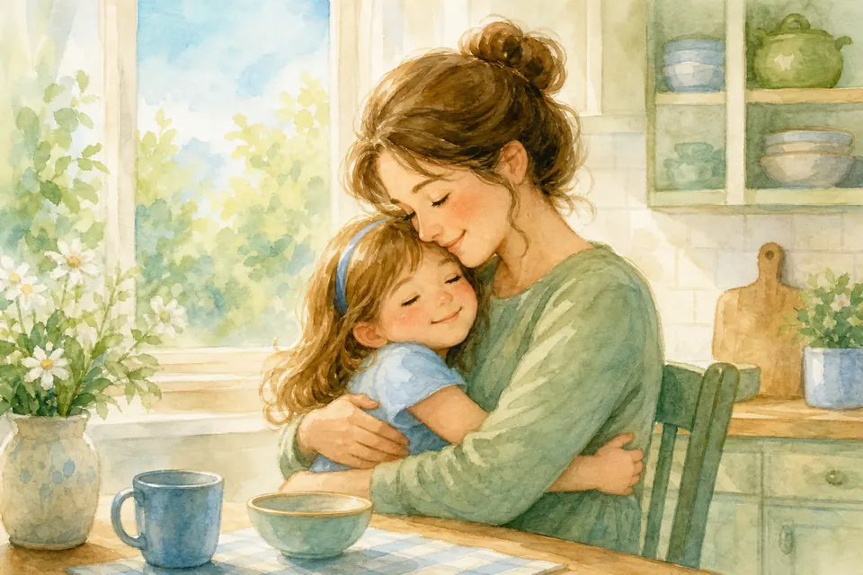
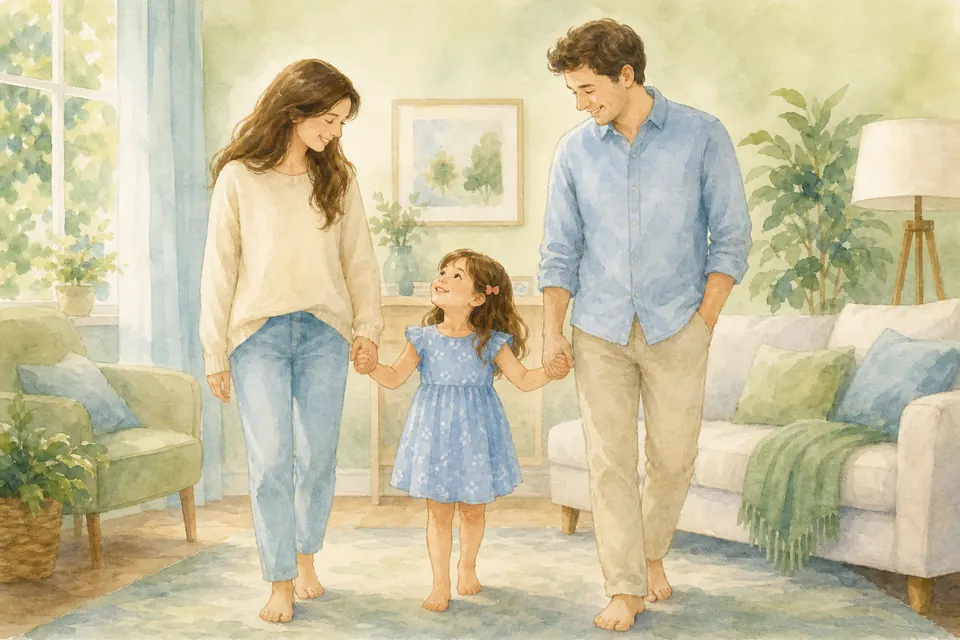
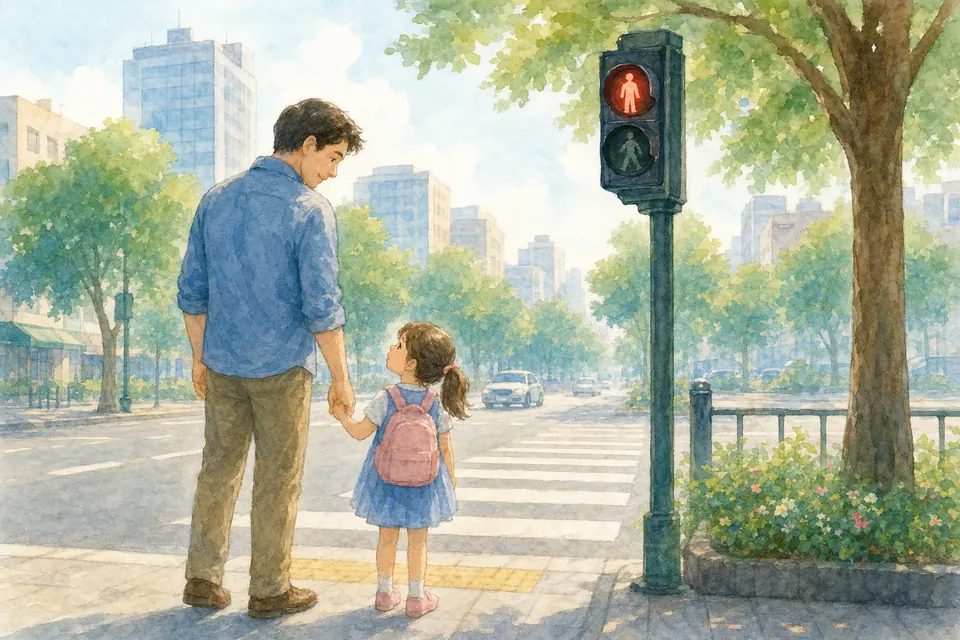
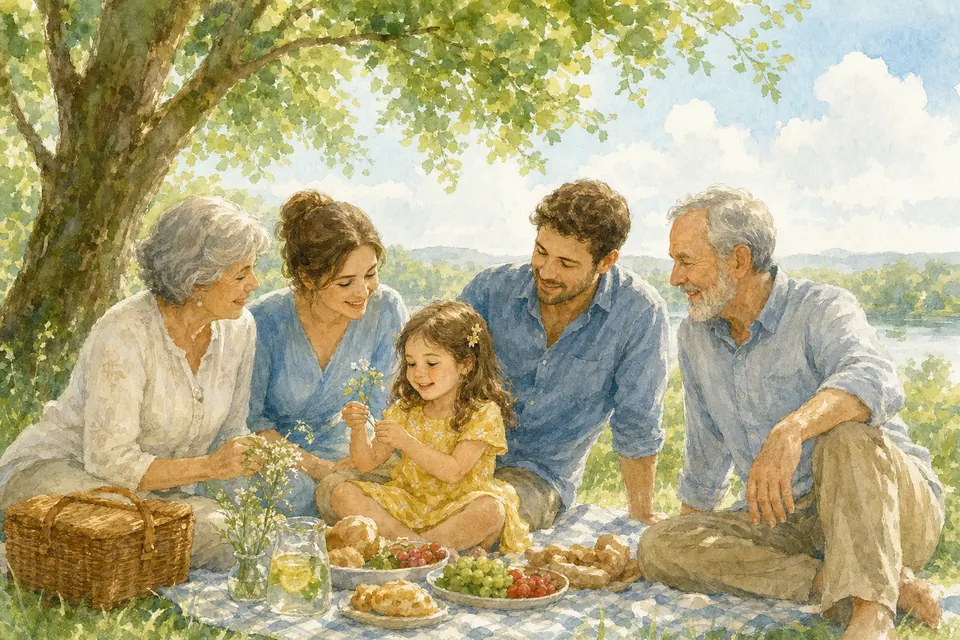
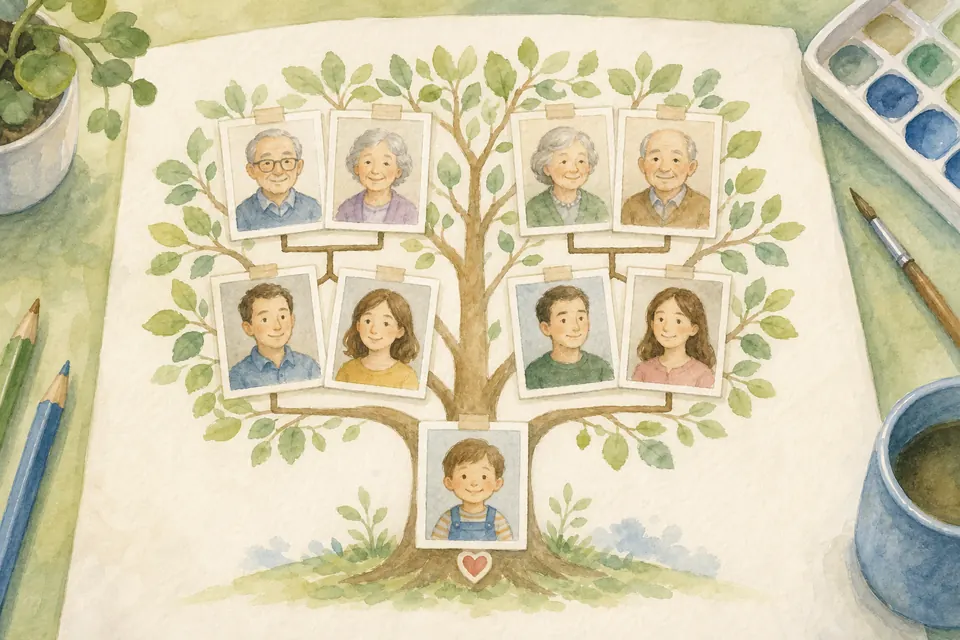
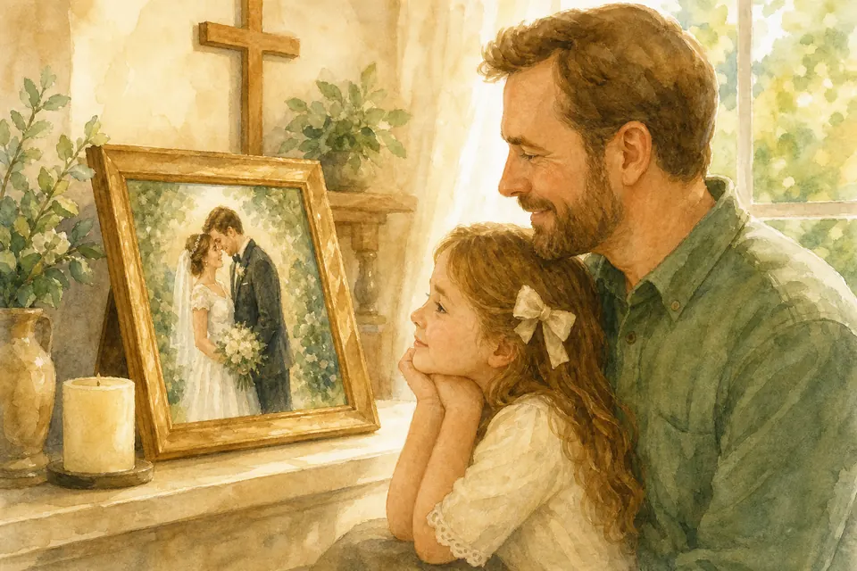
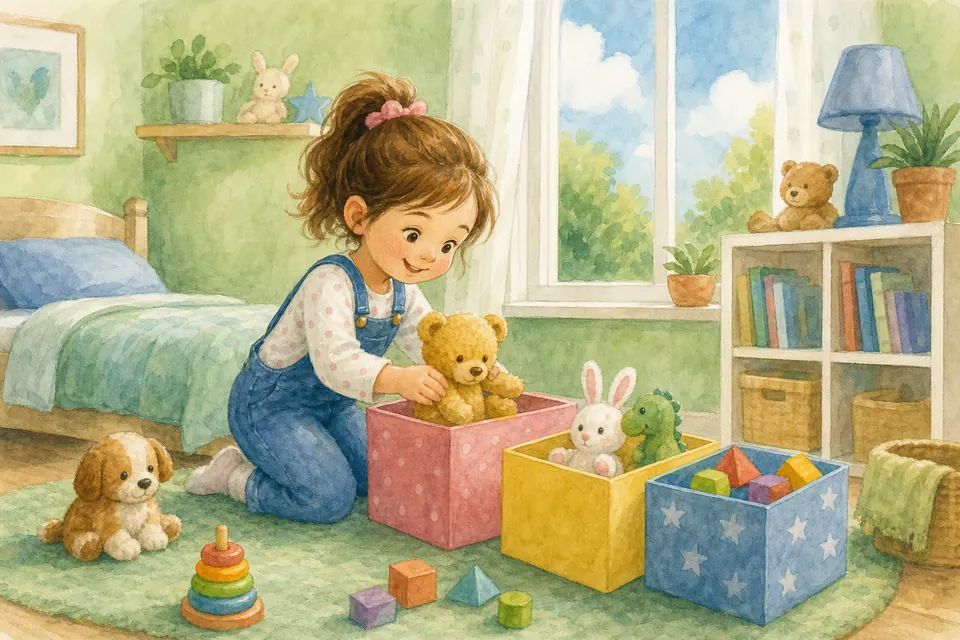
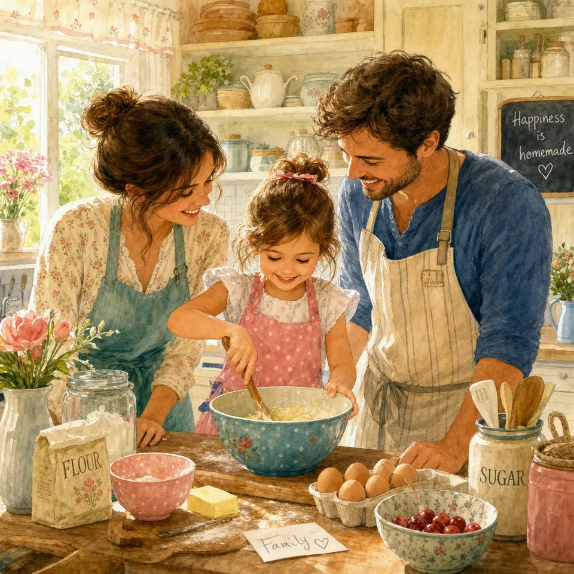

## В этой части

- [Глава 23. Мама](#ch-23)
- [Глава 24. Папина любовь](#ch-24)
- [Глава 25. Мама и папа — команда](#ch-25)
- [Глава 26. Послушание — это доверие](#ch-26)
- [Глава 27. Бабушки и дедушки](#ch-27)
- [Глава 28. Семья и род](#ch-28)
- [Глава 29. Брак — красивый завет](#ch-29)
- [Глава 30. Уборка — мир в доме](#ch-30)
- [Глава 31. Готовим вместе](#ch-31)

## Глава 23. Мама

{ loading=lazy }

*(Папа говорит с благодарностью о маме)*

Мама заботится, учит, иногда устаёт, часто молится за тебя сердцем. Уважение к маме — это слушаться, говорить ласково, помогать, говорить «спасибо» и «я люблю тебя».

Если мама попросила — это не «вредность», а забота или порядок в доме. Хочешь сделать сюрприз? Рисунок или помощь без просьбы — настоящее сокровище.

**📖 Стих из Библии:**
28. Встают дети и ублажают ее, - муж, и хвалит ее:
Притчи 31:28 (Синодальный перевод)

**🗣 Поговорим:**
*Папа:* Что доброе мы можем сделать для мамы завтра?
*(Дать дочке ответить)*

**🙏 Наша молитва:**
«Господь, благослови мою маму. Научи меня любить её словами и делами. Аминь.»

---

## Глава 24. Папина любовь

{ loading=lazy }

*(Папа обнимает дочку)*

Я твой земной папа, и я люблю тебя больше всего на свете. Я люблю с тобой играть, люблю носить тебя на руках, люблю смотреть, как ты спишь.

Если ты упадёшь и разобьёшь коленку — я подую, и всё пройдёт. Если тебе приснится страшный сон — я приду и обниму тебя. Я всегда буду тебя защищать.

Но знаешь что? Наш Небесный Отец любит тебя **ещё сильнее**! Мои руки сильные, но Его руки держат весь мир. Моя любовь большая, но Его любовь — бесконечная.

Запомни на всю жизнь, моя родная: что бы ни случилось — у тебя всегда есть два Папы, которые тебя безумно любят. Я — твой папа на земле, и Бог — твой Папа на Небесах.

**📖 Стих из Библии:**
13. Как отец милует сынов, так милует Господь боящихся Его.
Псалом 102:13 (Синодальный перевод)

**🗣 Поговорим:**
*Папа:* Давай обнимемся так крепко-крепко, как только можем! Чувствуешь, как я тебя люблю?
*(Крепко обнять дочку)*

**🙏 Наша молитва:**
«Небесный Отец, спасибо Тебе за моего земного папу. Спасибо, что мы есть друг у друга. Благослови нашу семью, чтобы в нашем доме всегда жила Твоя любовь. Аминь.»

---

## Глава 25. Мама и папа — команда

{ loading=lazy }

*(Папа объясняет спокойно)*

Мама и папа — команда. Мы несём ответственность перед Богом за твою безопасность и воспитание. Иногда мы советуемся без тебя — это нормально.

Если родители спорят — это **не твоя вина**. Взрослые тоже учатся мириться. Ты можешь помолиться: «Господи, дай маме и папе мир.» Твоя молитва важна.

**📖 Стих из Библии:**
1. Дети, повинуйтесь своим родителям в Господе, ибо сего требует справедливость. 2. Почитай отца твоего и мать, это первая заповедь с обетованием: 3. да будет тебе благо, и будешь долголетен на земле.
Ефесянам 6:1-3 (Синодальный перевод)

**🗣 Поговорим:**
*Папа:* Как ты думаешь, чем мама и папа помогают друг другу?
*(Дать дочке ответить)*

**🙏 Наша молитва:**
«Господь, дай нашей семье мир, уважение и умение мириться. Аминь.»

---

## Глава 26. Послушание — это доверие

{ loading=lazy }

*(Папа берёт дочку за руку)*

Послушание — не рабство и не страх. Это **доверие**: «Мои родители хотят мне добра».

Иногда «нельзя» у дороги спасает от боли. Иногда «сейчас» учит терпению. Послушание Богу и родителям растит мудрое сердце. Сильная девочка умеет остановиться, когда её зовут к безопасности.

**📖 Стих из Библии:**
1. Дети, повинуйтесь своим родителям в Господе, ибо сего требует справедливость. 2. Почитай отца твоего и мать, это первая заповедь с обетованием: 3. да будет тебе благо, и будешь долголетен на земле.
Ефесянам 6:1-3 (Синодальный перевод)

**🗣 Поговорим:**
*Папа:* Вспомни случай, когда послушание тебе помогло.
*(Дать дочке ответить)*

**🙏 Наша молитва:**
«Господь, научи меня слушаться с любовью и доверием. Аминь.»

---

## Глава 27. Бабушки и дедушки

{ loading=lazy }

*(Папа вспоминает старших с теплом)*

Бабушки и дедушки — сокровище нашего рода. Они видели больше жизни. Часто молились за семью ещё до твоего рождения.

Мы говорим уважительно, обнимаем, слушаем истории, помогаем нести сумку, звоним «просто так». Их любовь — как тёплый плед.

**📖 Стих из Библии:**
6. Венец стариков - сыновья сыновей, и слава детей - родители их.
Притчи 17:6 (Синодальный перевод)

**🗣 Поговорим:**
*Папа:* Какая история бабушки или дедушки тебе больше всего нравится?
*(Дать дочке ответить)*

**🙏 Наша молитва:**
«Господь, благослови моих бабушек и дедушек. Научи меня уважать старших. Аминь.»

---

## Глава 28. Семья и род

{ loading=lazy }

*(Папа рисует пальцем дерево в воздухе)*

Ты — часть рода. Есть те, кого ты знаешь, и те, кого уже нет на земле. Мы благодарим Бога за добро, которое нам передали. Мы учимся не повторять плохое.

Семья — место, где учат любви, прощению, труду и вере. Ты не одна. Ты — веточка на большом дереве, которое поливает Бог.

**📖 Стих из Библии:**
12. Почитай отца твоего и мать твою, чтобы продлились дни твои на земле, которую Господь, Бог твой, дает тебе.
Исход 20:12 (Синодальный перевод)

**🗣 Поговорим:**
*Папа:* Давай назовём людей нашего «дерева»: ты, мама, папа… Кто ещё?
*(Вместе перечислить)*

**🙏 Наша молитва:**
«Бог, спасибо за наш род. Помоги нам передавать добро следующим. Аминь.»

---

## Глава 29. Брак — красивый завет

{ loading=lazy }

*(Папа показывает или вспоминает свадебное фото)*

Брак — завет мужчины и женщины перед Богом: любить, быть верными, заботиться, прощать. Это не просто «игра в принцесс», а серьёзный и красивый путь.

В 5 лет мы не готовим свадьбу и не ищем жениха. Сейчас время детства, игры, дружбы и веры. Мы учим уважению, верности в мелочах и тому, что любовь — это дела, а не только слова. Я и мама учимся этому каждый день.

**📖 Стих из Библии:**
24. Потому оставит человек отца своего и мать свою и прилепится к жене своей; и будут одна плоть.
Бытие 2:24 (Синодальный перевод)

**🗣 Поговорим:**
*Папа:* Какие добрые дела показывают любовь в семье?
*(Дать дочке ответить)*

**🙏 Наша молитва:**
«Господь, благослови брак мамы и папы. Научи нашу семью верности и нежности. Аминь.»

---

## Глава 30. Уборка — мир в доме

{ loading=lazy }

*(Папа предлагает игру)*

Уборка — забота о ближних. Когда вещи на месте, дома спокойнее, и мама с папой меньше устают.

Ты уже можешь: собрать игрушки, положить одежду в корзину, протереть стол, помочь заправить кровать, вернуть взятое на место. Аккуратность — не страх перед каждой крошкой, а спокойная забота. Хочешь игру? «Коробка за 3 минуты» — и мы команда!

**📖 Стих из Библии:**
23. И все, что делаете, делайте от души, как для Господа, а не для человеков, 24. зная, что в воздаяние от Господа получите наследие, ибо вы служите Господу Христу.
Колоссянам 3:23-24 (Синодальный перевод)

**🗣 Поговорим:**
*Папа:* Какую одну зону дома ты возьмёшь «под свою заботу»?
*(Дать дочке ответить)*

**🙏 Наша молитва:**
«Господь, научи меня трудиться с радостью и заботиться о нашем доме. Аминь.»

---

## Глава 31. Готовим вместе

{ loading=lazy }

*(Папа зовёт на кухню словами)*

Еда — Божий дар. Готовка учит благодарности и труду. В 5 лет безопасно можно: мыть овощи, рвать зелень, мешать тесто, сервировать стол, класть салфетки.

Нож, плита, кипяток — только со мной или с мамой. «Помощница на кухне» — почётное звание! Вместе вкуснее.

**📖 Стих из Библии:**
31. Итак, едите ли, пьете ли, или иное что делаете, все делайте в славу Божию.
1 Коринфянам 10:31 (Синодальный перевод)

**🗣 Поговорим:**
*Папа:* Какое блюдо хочешь научиться готовить вместе?
*(Дать дочке ответить)*

**🙏 Наша молитва:**
«Бог, спасибо за еду и за руки, которые готовят. Научи нас быть благодарными. Аминь.»

---

**Навигация по частям:**

[<- Предыдущая часть](https://msadakov.github.io/book-for-5-year-old-daughter/part-02-telo/) | [Следующая часть ->](https://msadakov.github.io/book-for-5-year-old-daughter/part-04-druzya/)
_Часть 2. Тело и красота | Часть 4. Друзья и школа_
