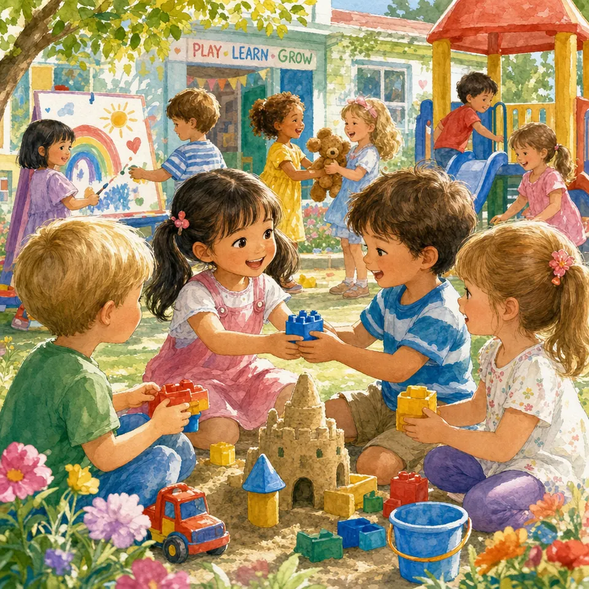
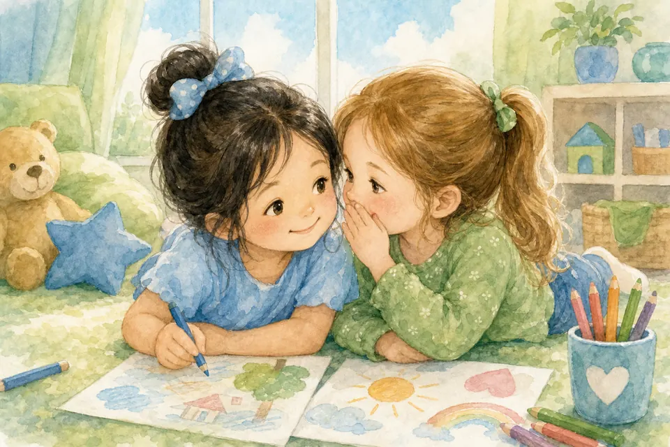
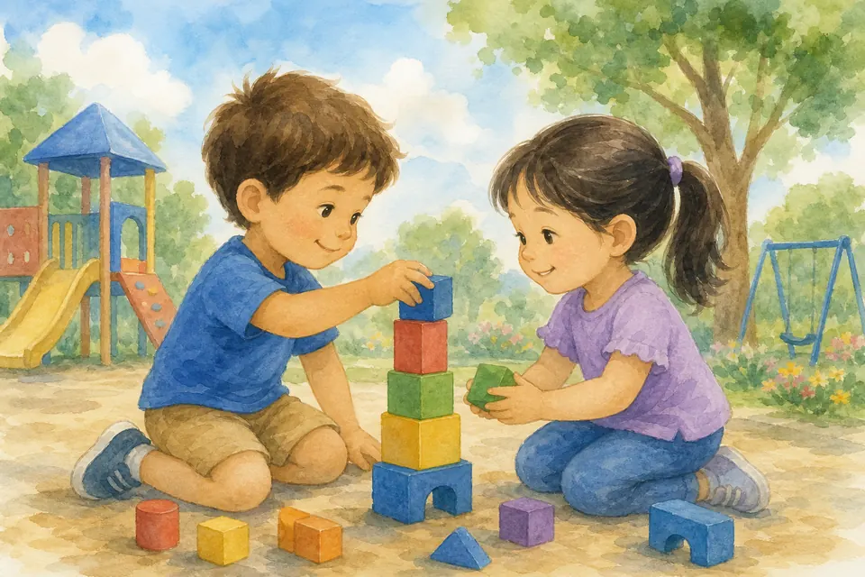
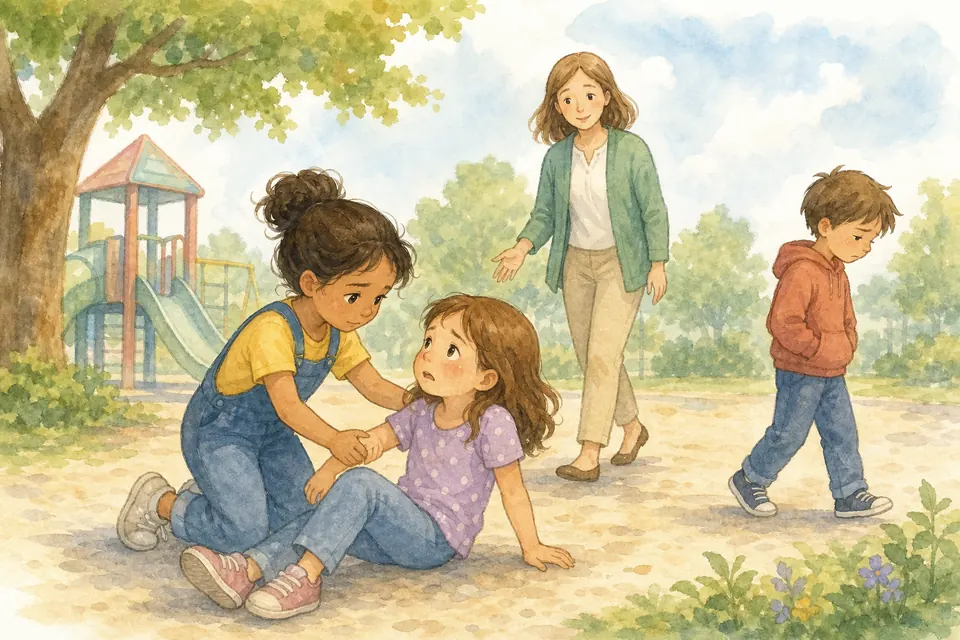
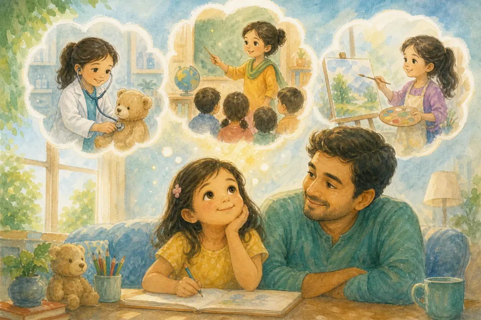

## В этой части

- [Глава 32. Детский сад](#ch-32)
- [Глава 33. Друзья и сверстники](#ch-33)
- [Глава 34. Подруги](#ch-34)
- [Глава 35. Мальчики](#ch-35)
- [Глава 36. Почему одни могут обижать](#ch-36)
- [Глава 37. Слова-колючки: когда обзывают и говорят грубо](#ch-37)
- [Глава 38. Прощение](#ch-38)
- [Глава 39. Как вести себя в обществе](#ch-39)
- [Глава 40. Готовимся к школе](#ch-40)
- [Глава 41. Учёба — исследование Божьего мира](#ch-41)
- [Глава 42. Выбор пути: маленькие шаги](#ch-42)

- [Глава 211. Когда обидели — и когда обидела сама](#ch-211)

## Глава 32. Детский сад

{ loading=lazy }

*(Мама или папа вспоминает утро у садика)*

В садике ты учишься жить среди людей: ждать очередь, просить игрушку словами, слушать воспитателя, дружить, мириться, иногда скучать по дому.

Скучать — нормально. Я и мама возвращаемся. Бог с тобой и в садике. Если трудно — скажи воспитателю и дома расскажи маме или папе. Мы на твоей стороне.

**📖 Стих из Библии:**
8. Наконец, братия мои, что только истинно, что честно, что справедливо, что чисто, что любезно, что достославно, что только добродетель и похвала, о том помышляйте.
Филиппийцам 4:8 (Синодальный перевод)

**🗣 Поговорим:**
*Родитель:* Что сегодня было самым хорошим в садике? А что трудным?
*(Дать дочке ответить)*

**🙏 Наша молитва:**
«Иисус, будь со мной в садике. Дай мне смелость, доброту и спокойствие. Аминь.»

---

## Глава 33. Друзья и сверстники

{ loading=lazy }

*(Мама или папа улыбается)*

Дружить — значит играть честно, делиться, не обзывать, радоваться чужой радости. Можно сказать: «Давай вместе?» или «Мне это неприятно».

Не обязательно дружить со всеми одинаково близко. Но ко всем — уважение. Иногда друг сегодня не хочет играть; иногда тихого ребёнка надо заметить первым; иногда кто-то ошибся, и над ним нельзя смеяться. Настоящий друг не тащит в плохое.

**📖 Стих из Библии:**
17. Друг любит во всякое время и, как брат, явится во время несчастья.
Притчи 17:17 (Синодальный перевод)

**🗣 Поговорим:**
*Родитель:* Какое качество тебе нравится в настоящем друге?
*(Дать дочке ответить)*

**🙏 Наша молитва:**
«Господь, пошли мне добрых друзей и научи самой быть хорошей подругой. Аминь.»

---

## Глава 34. Подруги

{ loading=lazy }

*(Мама или папа говорит по-секрету тепло)*

Подруга — сокровище. С ней весело и спокойно. Хорошая подруга не учит плохому секрету «против мамы», не заставляет делать вредное.

Если подруга обидела — можно сказать о боли и простить. Если снова и снова причиняет зло — расскажи взрослым: иногда нужна помощь. Хорошая дружба не говорит: «только со мной и ни с кем больше». Ты имеешь право на безопасную дружбу.

**📖 Стих из Библии:**
17. Друг любит во всякое время и, как брат, явится во время несчастья.
Притчи 17:17 (Синодальный перевод)

**🗣 Поговорим:**
*Родитель:* Что делает подругу настоящей подругой?
*(Дать дочке ответить)*

**🙏 Наша молитва:**
«Иисус, научи меня выбирать добрую дружбу и самой быть верной. Аминь.»

---

## Глава 35. Мальчики

{ loading=lazy }

*(Мама или папа спокойно и ясно)*

Мальчики и девочки одинаково ценны перед Богом. Можно дружить, играть, учиться вместе.

Уважение и границы важны всегда: не бьём, не дразним, не лезем в личное. В 5 лет дружба — это дружба, без взрослых «романтических» игр. Просто добро и уважение.

**📖 Стих из Библии:**
17. Друг любит во всякое время и, как брат, явится во время несчастья.
Притчи 17:17 (Синодальный перевод)

**🗣 Поговорим:**
*Родитель:* Как можно вежливо играть вместе с мальчиками?
*(Дать дочке ответить)*

**🙏 Наша молитва:**
«Бог, научи меня уважать и мальчиков, и девочек — всех Твоих детей. Аминь.»

---

## Глава 36. Почему одни могут обижать

{ loading=lazy }

*(Мама или папа говорит серьёзно, но без злости)*

Иногда ребёнок обижает, потому что не умеет словами сказать о злости, ревнует, сам был обижен, хочет власти в игре — или просто ещё учится быть человеком.

Это **не оправдание**. Плохой поступок остаётся плохим. Но понимание помогает не ненавидеть человека.

Что делать тебе:
1. Громко: «Так нельзя / мне больно!»
2. Отойти.
3. Позвать взрослого.
4. Не мстить ещё сильнее. Если опасно — защищаться и звать на помощь.

**📖 Стих из Библии:**
21. Не будь побежден злом, но побеждай зло добром.
Римлянам 12:21 (Синодальный перевод)

**🗣 Поговорим:**
*Родитель:* Что ты сделаешь, если тебя толкнули или обозвали?
*(Дать дочке ответить)*

**🙏 Наша молитва:**
«Господь, дай мне смелость защищать себя словами и звать на помощь. Аминь.»

---

## Глава 37. Слова-колючки: когда обзывают и говорят грубо

{ loading=lazy }

*(Мама или папа говорит живо, как сказку)*

Представь: слова бывают как **подушечки** — мягкие, тёплые. А бывают как **колючки** — царапают сердце.

Иногда ребёнок говорит грубо: «Замолчи», «Уйди отсюда», «Ты плохая», «Я с тобой не дружу». Иногда обзывают, дразнят за имя, за ошибку, за платье, за то, что не получилось. Это не просто шум. Это слова, которыми хотят толкнуть сердце.

А ещё бывают совсем грязные слова — брань. Такие слова не делают человека сильным или взрослым. Они похожи на грязь с улицы: можно случайно услышать, но не нужно приносить её в рот и в дом.

Если тебя обозвали или сказали грубость, не обязательно колоть в ответ. Можно сказать спокойно и твёрдо: «Со мной так нельзя», «Мне неприятно», «Не говори так, пожалуйста». Если ребёнок не останавливается — отойди и позови взрослого. Это не ябедничать. Это беречь сердце и границы.

Если услышала грязное слово — не повторяй его «просто проверить». Пусть колючка остановится на тебе и не летит дальше. А если ты сама сказала грубость, можно быстро исправить: «Прости. Я так говорить не хочу».

Сильный человек умеет говорить ясно **без грязи** и защищать себя **без злости**.

**📖 Стих из Библии:**
29. Никакое гнилое слово да не исходит из уст ваших, а только доброе для назидания в вере, дабы оно доставляло благодать слушающим.
Ефесянам 4:29 (Синодальный перевод)

**🗣 Поговорим:**
*Родитель:* Что ты можешь сказать, если тебе грубо говорят: «Уйди», «Замолчи» или начинают обзывать?
*(Дать дочке ответить)*
*Игра:* потренируйтесь вместе сказать спокойно: «Мне неприятно», «Со мной так нельзя», «Я позову взрослого».

**🙏 Наша молитва:**
«Господь Иисус, научи мой рот говорить доброе, а моё сердце — не пачкаться чужой грубостью. Дай мне смелость говорить правду спокойно. Аминь.»

---

## Глава 38. Прощение

{ loading=lazy }

*(Мама или папа говорит мягко)*

Прощение — отпустить желание мстить. Это не значит: «делай со мной что хочешь». Границы остаются. Если нужно — взрослые защищают.

Обида говорит: «Мне было больно». Её можно назвать словами, а не носить как камень. Если плохо поступила ты — честное «прости» лучше пряток и оправданий. Иисус учит прощать, потому что нас тоже прощают. Прощение освобождает сердце — как открытое окошко после духоты.

**📖 Стих из Библии:**
31. Всякое раздражение и ярость, и гнев, и крик, и злоречие со всякою злобою да будут удалены от вас; 32. но будьте друг ко другу добры, сострадательны, прощайте друг друга, как и Бог во Христе простил вас.
Ефесянам 4:31-32 (Синодальный перевод)

**🗣 Поговорим:**
*Родитель:* Кому сегодня можно сказать доброе «прости» или принять чужое «прости»?
*(Дать дочке ответить)*

**🙏 Наша молитва:**
«Иисус, помоги мне прощать. И защити меня. Аминь.»

---

## Глава 39. Как вести себя в обществе

{ loading=lazy }

*(Мама или папа идёт с дочкой в воображаемый автобус)*

В магазине, автобусе, поликлинике, гостях мы говорим «здравствуйте», «спасибо», «пожалуйста». Не орём без нужды. Не трогаем чужое. Ждём очередь. Не перебиваем. Уважаем тишину других. Помогаем, если можем.

Вежливость — практическая любовь к ближнему. Так маленькая девочка светит Иисусом даже в очереди к кассе.

**📖 Стих из Библии:**
12. Итак во всем, как хотите, чтобы с вами поступали люди, так поступайте и вы с ними, ибо в этом закон и пророки.
Матфея 7:12 (Синодальный перевод)

**🗣 Поговорим:**
*Родитель:* Какое вежливое слово тебе легче всего говорить? А какое хочешь потренировать?
*(Дать дочке ответить)*

**🙏 Наша молитва:**
«Господь, научи меня быть вежливой и внимательной к людям. Аминь.»

---

## Глава 40. Готовимся к школе

{ loading=lazy }

*(Мама или папа показывает воображаемый рюкзак)*

До школы важно не только «знать все буквы». Важнее: слушать 10–15 минут, доводить дело до конца, просить помощь, спокойно сидеть часть времени, радоваться новому.

Давай иногда играть в «школу» дома: звонок, задание, переменка, похвала за старание. Ты справишься — шаг за шагом.

**📖 Стих из Библии:**
31. Итак, едите ли, пьете ли, или иное что делаете, все делайте в славу Божию.
1 Коринфянам 10:31 (Синодальный перевод)

**🗣 Поговорим:**
*Родитель:* Во что из «школьного» тебе уже интересно играть?
*(Дать дочке ответить)*

**🙏 Наша молитва:**
«Бог, готовь моё сердце к учёбе: дай терпение, радость и смелость спрашивать. Аминь.»

---

## Глава 41. Учёба — исследование Божьего мира

{ loading=lazy }

*(Мама или папа с восхищением)*

Учёба — не ради страха перед оценкой. Это способ лучше понимать мир, который создал Бог, и однажды помогать людям.

Любопытство — дар. Вопросы — хорошо. «Я не знаю» — честное начало учёбы, а не стыд. Ошибки — часть пути. Бог видит старание, не только результат. Ошибаться можно. Врать про ошибку — не нужно.

**📖 Стих из Библии:**
5. Надейся на Господа всем сердцем твоим, и не полагайся на разум твой. 6. Во всех путях твоих познавай Его, и Он направит стези твои.
Притчи 3:5-6 (Синодальный перевод)

**🗣 Поговорим:**
*Родитель:* О чём тебе сейчас больше всего хочется узнать?
*(Дать дочке ответить)*

**🙏 Наша молитва:**
«Творец, спасибо за ум и любопытство. Научи меня учиться с радостью. Аминь.»

---

## Глава 42. Выбор пути: маленькие шаги

{ loading=lazy }

*(Мама или папа мечтает вместе с дочкой)*

В 5 лет мы не выбираем профессию навсегда. Мы учимся любить труд, пробовать разное, замечать, что получается с радостью, служить людям.

Бог даёт дары. Путь откроется шаг за шагом. Сегодня твой «путь» — быть доброй дочкой, подругой и ученицей маленьких чудес.

**📖 Стих из Библии:**
5. Надейся на Господа всем сердцем твоим, и не полагайся на разум твой. 6. Во всех путях твоих познавай Его, и Он направит стези твои.
Притчи 3:5-6 (Синодальный перевод)

**🗣 Поговорим:**
*Родитель:* Кем ты сегодня поиграешь в мечте: врачом, учителем, художником…?
*(Дать дочке ответить)*

**🙏 Наша молитва:**
«Господь, покажи мне мои дары и научи использовать их для любви к людям. Аминь.»

---

## Глава 211. Когда обидели — и когда обидела сама

{ loading=lazy }

*(Мама или папа кладёт руку на сердце дочки)*

Иногда кто-то толкает, обзывает или не зовёт в игру — и внутри становится колко. Можно заплакать. Можно разозлиться. Иисус видит эту боль. Он рядом не только в церкви — Он рядом на площадке.

А бывает иначе: ты сама сказала колко, выхватила игрушку, не пустила. Тогда тоже можно подойти к Иисусу: «Прости. Помоги извиниться». Покаяние — не стыд навсегда. Это смелый шаг к свету.

Иисус прощает и учит мириться. Мы на твоей стороне — и когда тебя обидели, и когда нужно исправить своё.

**📖 Стих из Библии:**
28. Придите ко Мне все труждающиеся и обремененные, и Я успокою вас;
Матфея 11:28 (Синодальный перевод)

**🗣 Поговорим:**
*Родитель:* Когда тебе в последний раз было обидно — что бы ты хотела сказать Иисусу?
*(Дать дочке ответить)*

**🙏 Наша молитва:**
«Иисус, будь рядом, когда мне больно. Научи прощать и просить прощения. Аминь.»
