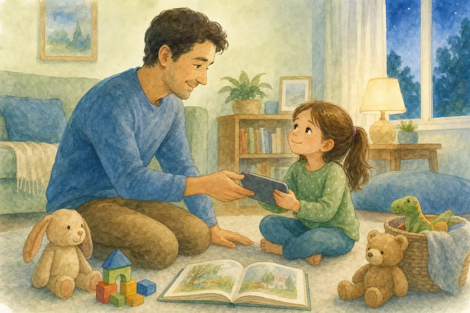
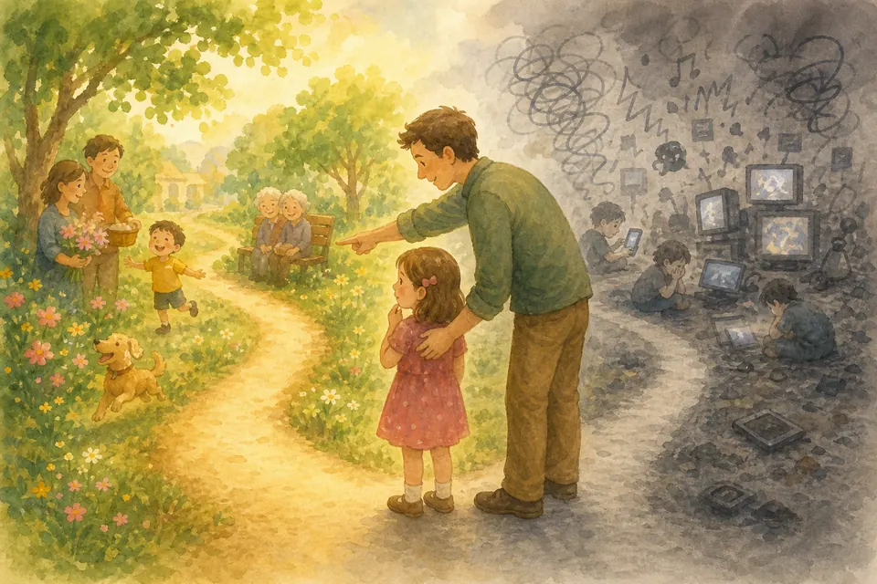
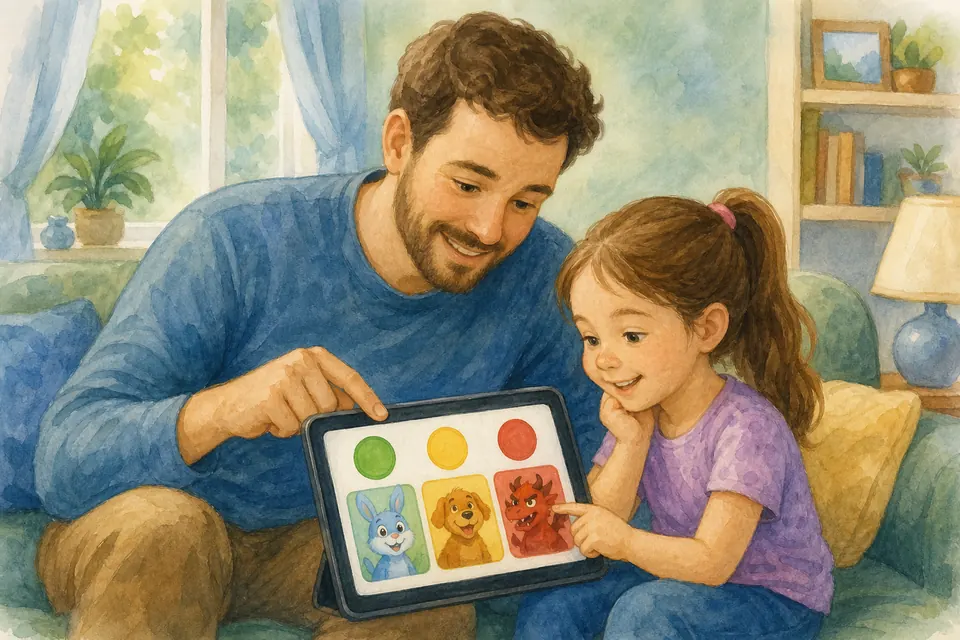
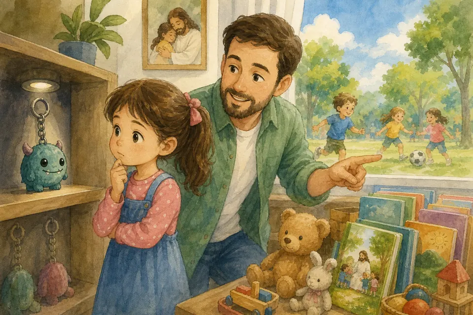
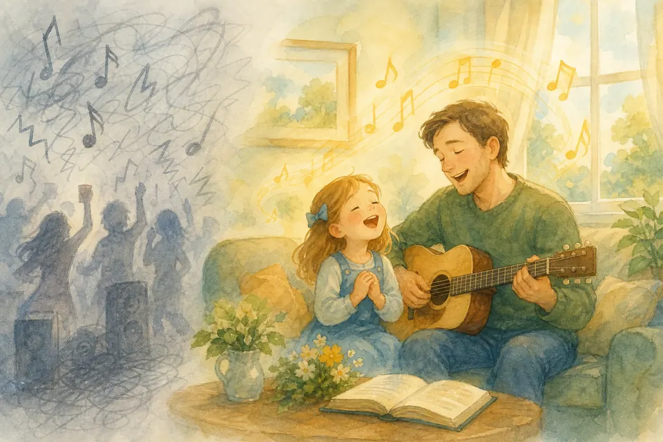
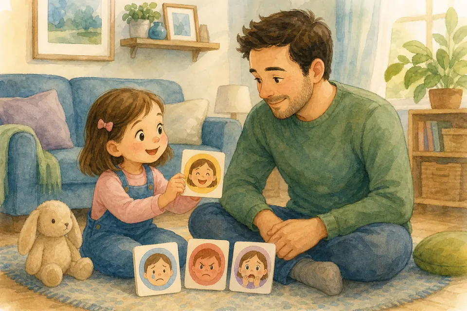
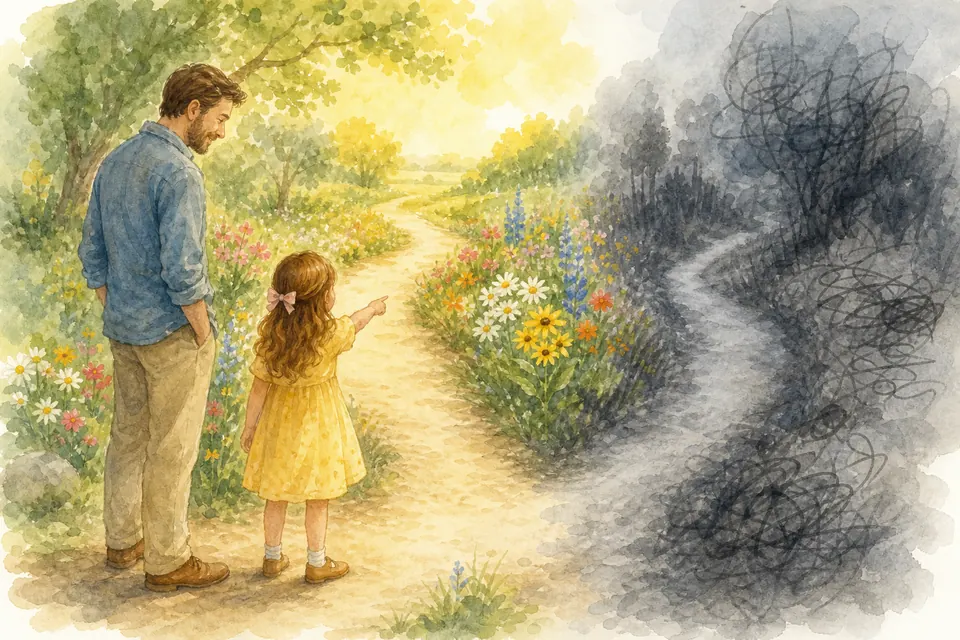
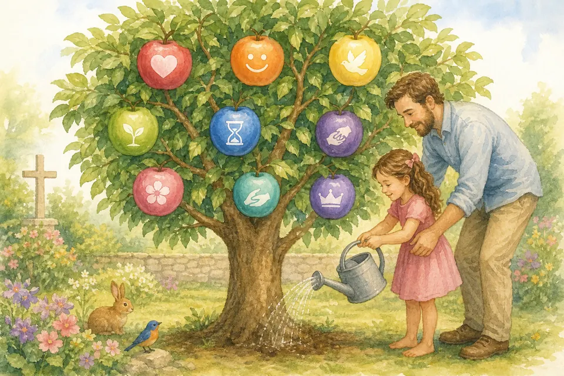
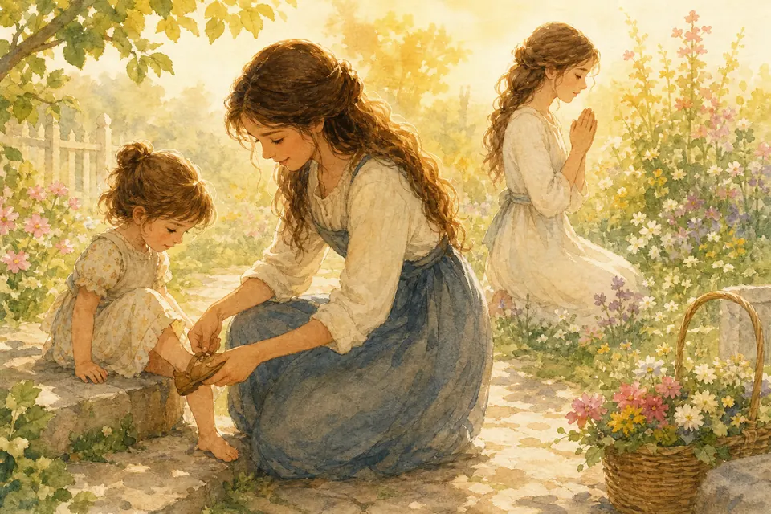
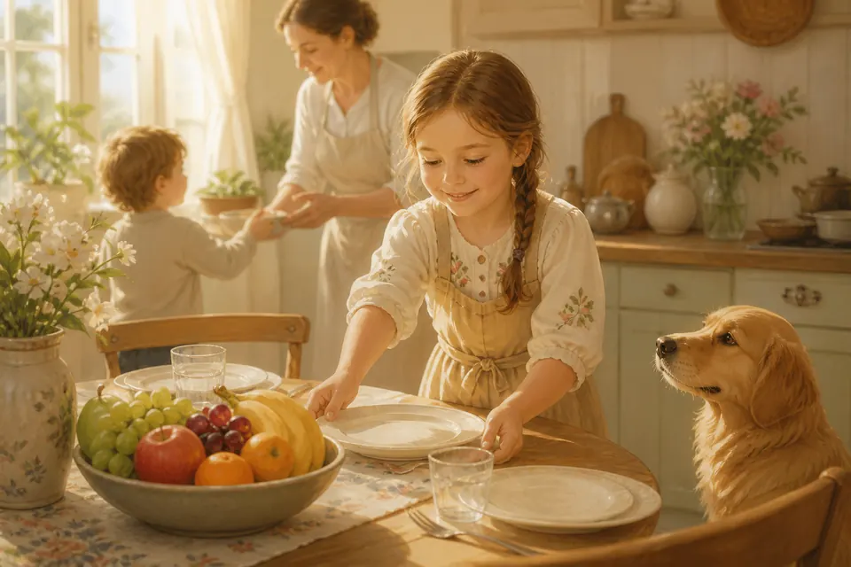

## В этой части

- [Глава 43. Телефон — не хозяин дома](#ch-43)
- [Глава 44. Мультики — еда для глаз и сердца](#ch-44)
- [Глава 45. Что стоит смотреть — а что нет](#ch-45)
- [Глава 46. Модные игрушки и «хочу-как-все»](#ch-46)
- [Глава 47. Песни и ценности](#ch-47)
- [Глава 48. Эмоции — погода в сердце](#ch-48)
- [Глава 49. Когда страшно](#ch-49)
- [Глава 50. Искушения: развилка на дороге](#ch-50)
- [Глава 51. Доброе сердечко и плоды Духа](#ch-51)
- [Глава 52. Какой быть девочкой — и потом женщиной](#ch-52)

- [Глава 212. Доверять Богу, когда страшно](#ch-212)
- [Глава 213. Плоды Духа в обычном дне](#ch-213)

## Глава 43. Телефон — не хозяин дома

{ loading=lazy }

*(Мама или папа мягко, но твёрдо)*

Телефон — как волшебное окошко. В нём можно позвонить бабушке, посмотреть добрую картинку, узнать погоду.

Но окошко бывает жадным: тянет глаза снова и снова. Тогда забываются объятия, книга, двор и сон.

В нашей семье телефон — инструмент, а не игрушка на весь день. Смотрим вместе или с разрешения. Есть время без экрана. Ночью телефон «спит» далеко от кроватки. Короткие ролики и чужие фото особенно быстро тянут сердце в «ещё один» и «у всех лучше». В интернет и чужие телефоны не пишем без родителей, чужой Wi‑Fi и чужие устройства не трогаем без разрешения. Если капризничаешь из‑за экрана — окошку пора отдохнуть.

**📖 Стих из Библии:**
12. Все мне позволительно, но не все полезно; все мне позволительно, но ничто не должно обладать мною.
1 Коринфянам 6:12 (Синодальный перевод)

**🗣 Поговорим:**
*Родитель:* Что тебе нравится делать больше, чем телефон?
*(Дать дочке ответить)*

**🙏 Наша молитва:**
«Господь, научи меня не отдавать сердце экрану. Дай радость живой жизни. Аминь.»

---

## Глава 44. Мультики — еда для глаз и сердца

{ loading=lazy }

*(Мама или папа сравнивает с едой)*

Мультик — как еда. Бывает полезная тарелка. Бывает сладкая вата: вкусно, но потом кружится голова. А бывает испорченная еда — её лучше не брать.

Мультики учат. Даже когда кажется, что «просто смешно». Они показывают, как говорить, как злиться, кого слушаться, что считать «крутым». Поэтому мы выбираем мультики как друзей для сердца.

**📖 Стих из Библии:**
12. Все мне позволительно, но не все полезно; все мне позволительно, но ничто не должно обладать мною.
1 Коринфянам 6:12 (Синодальный перевод)

**🗣 Поговорим:**
*Родитель:* Какой герой из мультика тебе нравится? Чему он учит?
*(Дать дочке ответить)*

**🙏 Наша молитва:**
«Иисус, помоги мне выбирать истории, которые делают сердце добрее. Аминь.»

---

## Глава 45. Что стоит смотреть — а что нет

{ loading=lazy }

*(Мама или папа рисует светофор словами)*

**Зелёный свет:** добро побеждает без злорадства; герои просят прощения и помогают; спокойный темп; после просмотра хочется обнять и поиграть.

**Жёлтый свет:** много шума или драки — спроси взрослых: «Нам это надо?»

**Красный свет:** грязные слова; насмешки над телом, верой, семьёй; страх и жестокость «ради смеха»; бесконечные короткие ролики подряд; всё, после чего снятся страхи или хочется повторять плохое.

Спросить — умно. Тайком смотреть запретное — опасно для сердца.

**📖 Стих из Библии:**
8. Наконец, братия мои, что только истинно, что честно, что справедливо, что чисто, что любезно, что достославно, что только добродетель и похвала, о том помышляйте.
Филиппийцам 4:8 (Синодальный перевод)

**🗣 Поговорим:**
*Родитель:* Давай проверим один мультик светофором: зелёный, жёлтый или красный?
*(Обсудить вместе)*

**🙏 Наша молитва:**
«Господь, дай нам мудрость выбирать, что смотреть. Аминь.»

---

## Глава 46. Модные игрушки и «хочу-как-все»

{ loading=lazy }

*(Мама или папа объясняет просто и твёрдо)*

Иногда все вдруг говорят об одной игрушке: «У всех есть! Купи и мне!» Бывают милые вещи, бывают странные модные игрушки, бывают коллекции, за которыми все гонятся.

Почему такая гонка опасна для сердца?
1. Игрушка становится почти божком — думают о ней чаще, чем о Боге и людях.
2. Учит жадности: «ещё одну… и редкую…»
3. Учит зависти: «без неё я хуже».
4. Пустая гонка: мода уйдёт, а Иисус останется.
5. Вокруг моды бывают ссоры, обман и шум — плохой плод.
6. Нам ближе добро и тепло, а не культ любой вещи.

Мы не говорим: «Ты плохая, если тебе понравилась игрушка». Мы говорим: **не пускай моду на трон сердца.** Можно иметь игрушки. Нельзя, чтобы игрушка командовала капризами.

Если спросят подруги: «У меня другие любимые игрушки. Мне важнее играть вместе».

**📖 Стих из Библии:**
23. Больше всего хранимого храни сердце твое, потому что из него источники жизни.
Притчи 4:23 (Синодальный перевод)

**🗣 Поговорим:**
*Родитель:* Какая твоя игрушка правда радует — без сравнения с другими?
*(Дать дочке ответить)*

**🙏 Наша молитва:**
«Господи, научи меня радоваться простому и не делать кумиров. Аминь.»

---

## Глава 47. Песни и ценности

{ loading=lazy }

*(Мама или папа говорит о музыке)*

Песня — как сок. Пьёшь — и он попадает внутрь. В разных песнях мотив бывает красивым, но внутрь иногда кладут плохие ценности: хвастовство, грубость, «делай что хочешь», злость, пустую жизнь без Бога — только лайки и вещи.

Уши слышат ритм — а сердце незаметно учится словам.

Слушаем с родителями. Спрашиваем: «О чём эта песня?» Если слова плохие — выключаем, даже если «всем нравится». Дома растим добрый плейлист: христианские детские песни, семейные мелодии. Петь вместе — сильнее чужой колонки.

Проверка: смогли бы мы спеть это Иисусу без стыда? Если нет — песня не наша.

**📖 Стих из Библии:**
8. Наконец, братия мои, что только истинно, что честно, что справедливо, что чисто, что любезно, что достославно, что только добродетель и похвала, о том помышляйте.
Филиппийцам 4:8 (Синодальный перевод)

**🗣 Поговорим:**
*Родитель:* Какая добрая песня тебе нравится петь вместе?
*(Дать дочке ответить; можно напеть куплет)*

**🙏 Наша молитва:**
«Господь, наполни мои уши и сердце тем, что чисто и истинно. Аминь.»

---

## Глава 48. Эмоции — погода в сердце

{ loading=lazy }

*(Мама или папа показывает лица: радость, грусть, злость)*

Все эмоции **нормальны**. Радость, грусть, злость, страх, стыд, восторг — как погода в сердце. Слёзы не слабость, грусть не плохость, а страх не делает тебя трусишкой.

Важно не запретить чувство, а выбрать поступок. Можно топнуть ножкой на коврике и сказать: «Я злюсь!» Нельзя бить и ломать назло. Чувства — гости. Поступки — наш выбор.

**📖 Стих из Библии:**
6. Не заботьтесь ни о чем, но всегда в молитве и прошении с благодарением открывайте свои желания пред Богом, 7. и мир Божий, который превыше всякого ума, соблюдет сердца ваши и помышления ваши во Христе Иисусе.
Филиппийцам 4:6-7 (Синодальный перевод)

**🗣 Поговорим:**
*Родитель:* Какое чувство у тебя сейчас? Где оно в теле?
*(Дать дочке ответить)*

**🙏 Наша молитва:**
«Иисус, помоги мне понимать свои чувства и поступать по-доброму. Аминь.»

---

## Глава 49. Когда страшно

{ loading=lazy }

*(Мама или папа обнимает)*

Страх темноты, собак, громкости, разлуки, «монстров» бывает у многих детей. Это не стыдно.

Помогает: ночник, объятие, правда вместо страшилки, молитва, медленный вдох и длинный выдох, моё присутствие. Иисус — Добрый Пастырь. Он с тобой, когда страшно.

**📖 Стих из Библии:**
4. Когда я в страхе, на Тебя я уповаю. 5. В Боге восхвалю я слово Его; на Бога уповаю, не боюсь; что сделает мне плоть?
Псалом 55:4-5 (Синодальный перевод)

**🗣 Поговорим:**
*Родитель:* Что тебе помогает, когда немного страшно?
*(Дать дочке ответить)*

**🙏 Наша молитва:**
«Иисус, я боюсь. Будь со мной. Аминь.»

---

## Глава 50. Искушения: развилка на дороге

{ loading=lazy }

*(Мама или папа рисует две дорожки)*

Искушение — тяга сделать неправильное, когда кажется: «Никто не увидит». Взять чужое. Солгать. Повторить грязное слово.

Помогают: пауза, молитва «помоги», честность, уйти, позвать взрослого. Даже Иисус был искушаем — и сказал «нет» плохому. Мы можем учиться у Него.

**📖 Стих из Библии:**
13. Вас постигло искушение не иное, как человеческое; и верен Бог, Который не попустит вам быть искушаемыми сверх сил, но при искушении даст и облегчение, так чтобы вы могли перенести.
1 Коринфянам 10:13 (Синодальный перевод)

**🗣 Поговорим:**
*Родитель:* Что ты можешь сказать себе на развилке: «стоп, подумаю»?
*(Дать дочке ответить)*

**🙏 Наша молитва:**
«Иисус, помоги мне выбирать добро, даже когда трудно. Аминь.»

---

## Глава 51. Доброе сердечко и плоды Духа

{ loading=lazy }

*(Мама или папа перечисляет фрукты характера)*

Бог подарил тебе сердечко и хочет, чтобы оно было добрым. Что значит быть доброй? Делиться, пожалеть того, кто плачет, слушаться маму и папу.

Иногда хочется топнуть: «Моё! Не дам!» Тогда просим Иисуса: «Помоги сердечку снова стать добрым».

А ещё Бог растит в нас прекрасные плоды: любовь, радость, мир, терпение, доброту, милосердие, верность, кротость, воздержание. Каждый день можно выбрать один «плод» и поискать, где его проявить.

И помни волшебное слово **«Прости»**: облачко обиды улетает — и снова светит солнышко!

**📖 Стих из Библии:**
22. Плод же духа: любовь, радость, мир, долготерпение, благость, милосердие, вера, 23. кротость, воздержание. На таковых нет закона.
Галатам 5:22-23 (Синодальный перевод)

**🗣 Поговорим:**
*Родитель:* Кому мы сегодня можем сделать что-то доброе?
*(Дать дочке ответить)*

**🙏 Наша молитва:**
«Иисус, помоги мне иметь такое же доброе сердце, как у Тебя. Научи меня делиться, любить и вовремя говорить «прости». Аминь.»

---

## Глава 52. Какой быть девочкой — и потом женщиной

{ loading=lazy }

*(Мама или папа говорит с уважением и мечтой)*

Христианская женственность — не только платье. Это вера в Иисуса, мудрость и честность, доброта и смелость, чистота сердца и уважение к телу, умение трудиться и дружить, готовность служить — дома, в церкви, людям.

Ты уже учишься этому маленькими шагами. Ты не должна быть «идеальной куклой». Ты призвана быть живой дочерью Божьей.

**📖 Стих из Библии:**
30. Миловидность обманчива и красота суетна; но жена, боящаяся Господа, достойна хвалы.
Притчи 31:30 (Синодальный перевод)

**🗣 Поговорим:**
*Родитель:* Какое качество настоящей женщины-христианки тебе уже хочется расти в себе?
*(Дать дочке ответить)*

**🙏 Наша молитва:**
«Господь, расти во мне веру, мудрость, доброту и смелость. Аминь.»

---

## Глава 212. Доверять Богу, когда страшно

{ loading=lazy }

*(Мама или папа говорит тихо, как ночничок)*

Страх бывает разный: темнота, гроза, новый сад, укол, «а вдруг не получится». Страх — сигнал. Но он не хозяин дома.

Богу можно сказать всё: «Мне страшно». Можно держать руку мамы или папы и одновременно держать сердце у Бога. Доверие — это не «мне уже не страшно», а «я не одна, даже если страшно».

Иисус успокаивал учеников в буре. Он может успокоить и тебя — молитвой, объятием, спокойным дыханием и правдой: «Бог со мной».

**📖 Стих из Библии:**
10. Не бойся, ибо Я с тобою; не смущайся, ибо Я Бог твой; Я укреплю тебя, и помогу тебе, и поддержу тебя десницею правды Моей.
Исаия 41:10 (Синодальный перевод)

**🗣 Поговорим:**
*Родитель:* Чего тебе иногда бывает страшно — и кому ты скажешь об этом первым?
*(Дать дочке ответить)*

**🙏 Наша молитва:**
«Бог, когда мне страшно, напомни, что Ты со мной. Дай мир сердцу. Аминь.»

---

## Глава 213. Плоды Духа в обычном дне

{ loading=lazy }

*(Мама или папа показывает на пальцах «плоды»)*

Плоды Духа — не только красивые слова в церкви. Это выбор утром, днём и вечером.

Любовь — обнять сестру. Радость — поблагодарить за кашу. Мир — не кричать из-за кубика. Терпение — подождать очередь. Доброта — поделиться. Верность — сдержать слово. Кротость — уступить. Воздержание — отойти от экрана, когда сказали «хватит».

Выберем на сегодня один плод — и поищем, где его «вырастить» дома или в садике. Бог помогает расти тому, кто просит.

**📖 Стих из Библии:**
22. Плод же духа: любовь, радость, мир, долготерпение, благость, милосердие, вера, 23. кротость, воздержание.
Галатам 5:22-23 (Синодальный перевод)

**🗣 Поговорим:**
*Родитель:* Какой один «плод» ты попробуешь сегодня?
*(Дать дочке ответить)*

**🙏 Наша молитва:**
«Святой Дух, расти во мне добрые плоды — особенно тот, который я выбираю сегодня. Аминь.»
