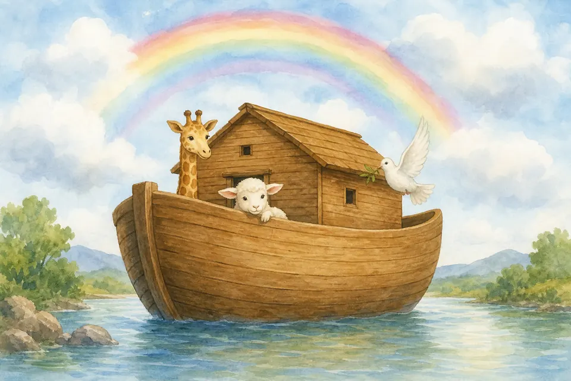
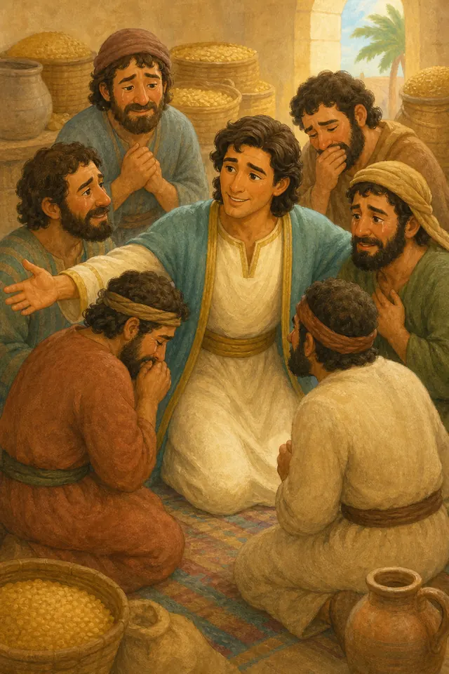
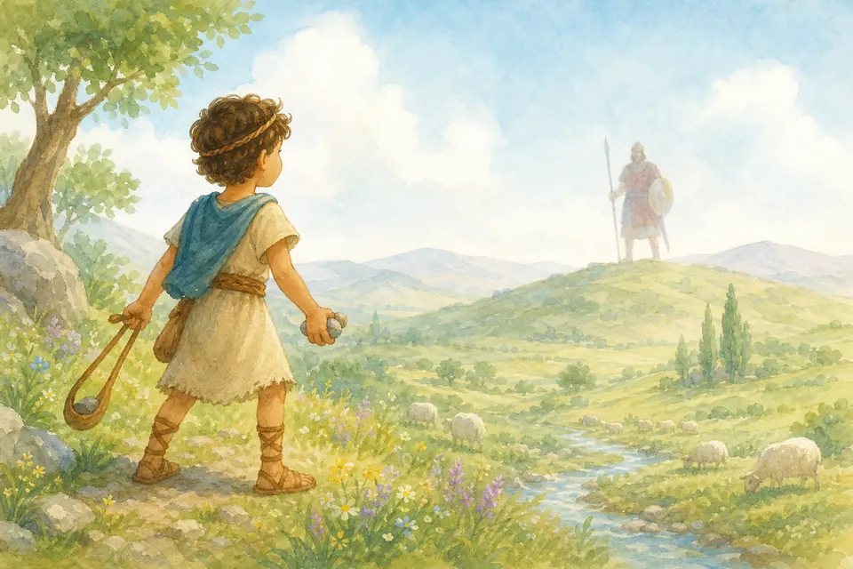
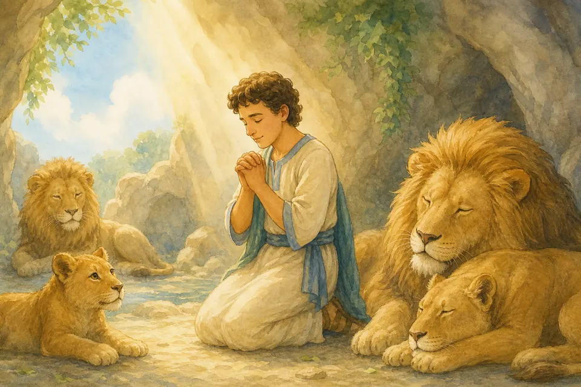
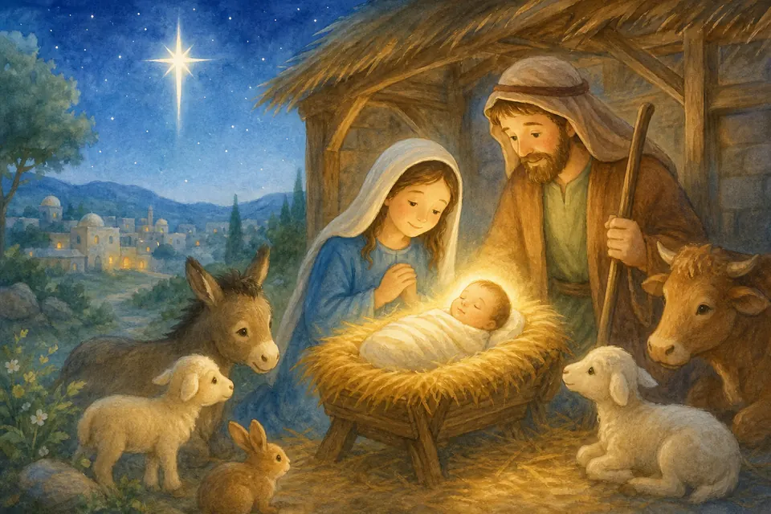
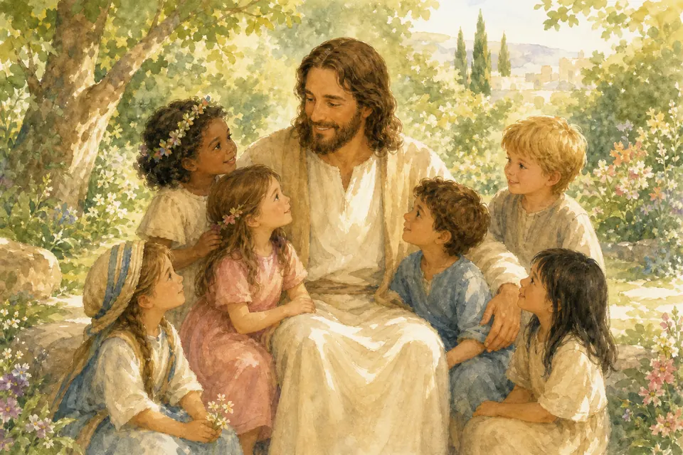
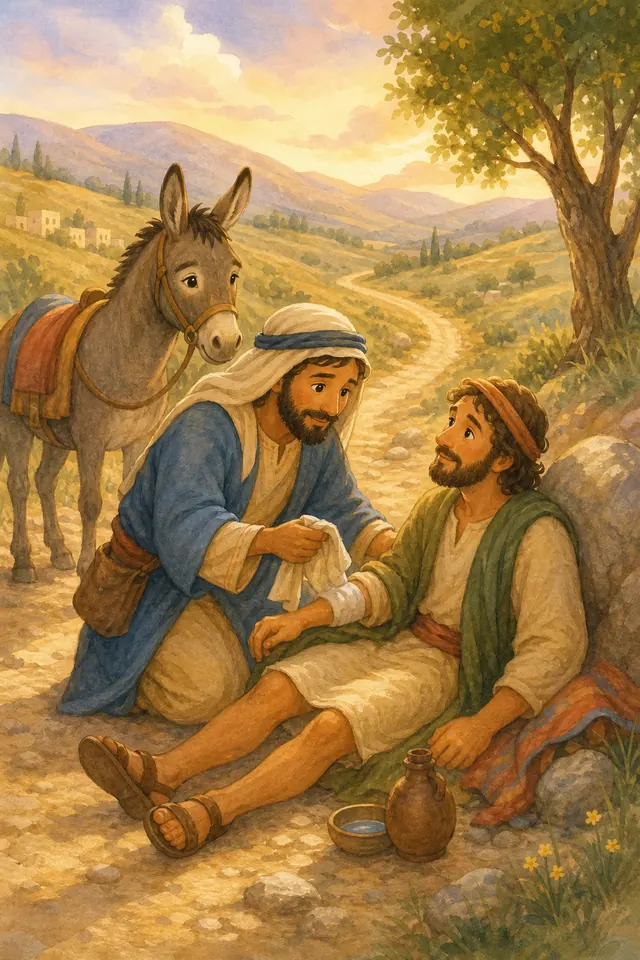
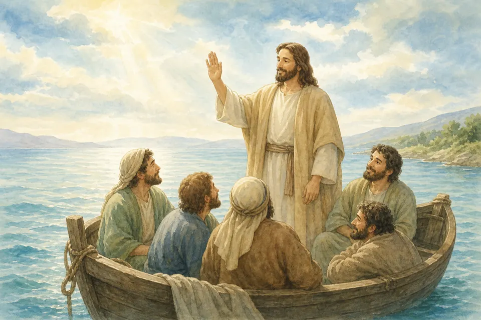

## В этой части

- [Глава 53. Сотворение](#ch-53)
- [Глава 54. Адам и Ева](#ch-54)
- [Глава 55. Ной](#ch-55)
- [Глава 56. Иосиф прощает](#ch-56)
- [Глава 57. Давид и Голиаф](#ch-57)
- [Глава 58. Даниил](#ch-58)
- [Глава 59. Рождество](#ch-59)
- [Глава 60. Иисус и дети](#ch-60)
- [Глава 61. Добрый самарянин](#ch-61)
- [Глава 62. Буря утихла](#ch-62)
- [Глава 63. Крест и воскресение](#ch-63)

## Глава 53. Сотворение {#ch-53}

*(Папа говорит тихо, почти шёпотом — как будто вместе смотрят на чудо)*

Представь: сначала было темно и тихо. А потом Бог сказал — и засиял свет! Он сделал небо, море и сушу. Зелёную травку. Солнце днём и луну ночью. Рыбок, птичек, зверей… И ещё Он сделал людей — особенных, похожих на Себя сердцем: чтобы любить, радоваться и дружить с Ним.

Бог посмотрел на всё, что создал, и сказал: «Это хорошо!» А самое-самое чудесное в этом мире — что ты тоже Его творение. Твои глазки, твой смех, твоя ладошка в моей — всё это придумал Бог с любовью.

**📖 Стих из Библии:**
1. В начале сотворил Бог небо и землю. 2. Земля же была безвидна и пуста, и тьма над бездною, и Дух Божий носился над водою. 3. И сказал Бог: да будет свет. И стал свет.
Бытие 1:1-3 (Синодальный перевод)

**🗣 Поговорим:**
*Папа:* Что в Божьем мире тебе кажется самым чудесным?
*(Дать дочке ответить)*

**🙏 Наша молитва:**
«Дорогой Творец, спасибо за Твой прекрасный мир и за то, что Ты создал меня. Аминь.»

---

{ loading=lazy }

## Глава 54. Адам и Ева {#ch-54}

*(Папа говорит мягко, без страшилок)*

Первых людей звали Адам и Ева. Бог поселил их в красивом саду. Там было всё нужное — и Сам Бог был рядом, как самый добрый Друг.

У Бога было одно важное правило: одно дерево трогать нельзя. Но Адам и Ева не послушались. Им стало грустно и стыдно. Так в мир вошли боль и непослушание.

Но знаешь самое главное? Бог не бросил их. Он уже тогда готовил спасение — дорогу обратно к Себе. Позже этой дорогой стал Иисус. Даже когда мы ошибаемся, Бог зовёт нас к прощению и любви.

**📖 Стих из Библии:**
16. И заповедал Господь Бог человеку, говоря: от всякого дерева в саду ты будешь есть, 17. а от дерева познания добра и зла, не ешь от него; ибо в день, в который ты вкусишь от него, смертью умрешь.
Бытие 2:16-17 (Синодальный перевод)

**🗣 Поговорим:**
*Папа:* Почему важно слушаться Бога — даже когда очень хочется по-своему?
*(Дать дочке ответить)*

**🙏 Наша молитва:**
«Господь, научи меня слушаться Тебя. Спасибо, что Ты не оставляешь меня. Аминь.»

---

{ loading=lazy }

## Глава 55. Ной {#ch-55}

*(Папа показывает на радугу пальцем в воздухе)*

Жил человек по имени Ной. Он любил Бога и доверял Ему. Однажды Бог сказал Ною построить большой корабль — ковчег. Ной слушался, хотя это было непросто.

Бог сохранил Ноя, его семью и животных. А потом на небе появилась радуга — знак Божьего обещания. Бог сказал: «Я помню Своё слово».

Когда тебе бывает трудно, вспомни Ноя: доверять Богу — значит идти шаг за шагом, а Он держит Свои обещания. Радуга напоминает: Бог верен.

**📖 Стих из Библии:**
12. И сказал Бог: вот знамение завета, который Я поставляю между Мною и между вами и между всякою душею живою, которая с вами, в роды навсегда: 13. Я полагаю радугу Мою в облаке, чтоб она была знамением завета между Мною и между землею.
Бытие 9:12-13 (Синодальный перевод)

**🗣 Поговорим:**
*Папа:* Как ты сегодня можешь довериться Богу — в чём одном маленьком деле?
*(Дать дочке ответить)*

**🙏 Наша молитва:**
«Бог, спасибо, что Ты держишь обещания. Помоги мне доверять Тебе, как Ной. Аминь.»

---

{ loading=lazy }

## Глава 56. Иосиф прощает {#ch-56}

*(Папа говорит тепло, глядя в глаза)*

У Иосифа было много братьев. Однажды они поступили с ним очень плохо — и Иосифу стало тяжело. Прошло много времени. Бог был с Иосифом и помог ему вырасти мудрым и сильным.

Потом братья снова встретились с Иосифом. Он мог бы ответить злом… Но он простил. Он даже заплакал от любви и сказал: «Не бойтесь. Бог обернул плохое к добру».

Прощать не всегда легко. Но Бог помогает нашему сердцу отпускать обиду — как помог Иосифу.

**📖 Стих из Библии:**
19. И сказал Иосиф: не бойтесь, ибо я боюсь Бога; 20. вот, вы умышляли против меня зло; но Бог обратил это в добро, чтобы сделать то, что теперь есть: сохранить жизнь великому числу людей;
Бытие 50:19-20 (Синодальный перевод)

**🗣 Поговорим:**
*Папа:* Кому бывает трудно прощать — и Кто может помочь нашему сердцу?
*(Дать дочке ответить)*

**🙏 Наша молитва:**
«Иисус, научи меня прощать, как Иосиф. Сделай моё сердце мягким. Аминь.»

---

{ loading=lazy }

## Глава 57. Давид и Голиаф {#ch-57}

*(Папа говорит бодро, но спокойно)*

Давид был ещё мальчиком. Он пас овечек и любил Бога. А однажды всему народу стало страшно из‑за огромного сильного врага — Голиафа.

Давид не был самым большим. У него не было тяжёлых доспехов. Но у него было другое: он верил, что Бог сильнее любого страха. Давид вышел смело — и Бог помог ему победить.

Смелость — это не «я сама всё могу». Смелость — это «я с Богом». И маленькая девочка тоже может быть храброй: сказать правду, подойти к новой подруге, попросить прощения.

**📖 Стих из Библии:**
47. И узнает весь этот сонм, что не мечом и копьем спасает Господь, ибо это война Господа, и Он предаст вас в руки наши.
1 Царств 17:47 (Синодальный перевод)

**🗣 Поговорим:**
*Папа:* В чём тебе сегодня нужна смелость — и как Бог может помочь?
*(Дать дочке ответить)*

**🙏 Наша молитва:**
«Бог, помоги мне быть смелой с Тобой, как Давид. Аминь.»

---

{ loading=lazy }

## Глава 58. Даниил {#ch-58}

*(Папа складывает руки, как будто вместе молятся)*

Даниил жил в далёкой стране. Там были правила, которые мешали молиться Богу. Но Даниил всё равно открывал окно и тихо говорил с Господом — утром, днём и вечером. Он не прятал свою любовь к Богу.

Людям это не понравилось, и Даниила бросили туда, где были львы. Но Бог послал ангела и закрыл пасти львам. Даниил остался цел — потому что Бог услышал его молитву.

Когда тебе тревожно или одиноко, ты тоже можешь молиться. Бог слышит даже шёпот.

**📖 Стих из Библии:**
21. Тогда Даниил сказал царю: царь! во веки живи! 22. Бог мой послал Ангела Своего и заградил пасть львам, и они не повредили мне, потому что я оказался пред Ним чист, да и пред тобою, царь, я не сделал преступления.
Даниил 6:21-22 (Синодальный перевод)

**🗣 Поговорим:**
*Папа:* Когда тебе особенно помогает молитва?
*(Дать дочке ответить)*

**🙏 Наша молитва:**
«Бог, будь со мной, когда страшно. Спасибо, что Ты слышишь меня, как Даниила. Аминь.»

---

{ loading=lazy }

## Глава 59. Рождество {#ch-59}

*(Папа улыбается, как будто рассказывает о самом лучшем подарке)*

Давным-давно в маленьком городе Вифлееме родился Младенец. Его положили в ясли — туда, где обычно лежит корм для животных. Не во дворец. Не под золотую крышу. А совсем просто.

Но это был не обычный малыш. Это был Иисус — Сын Божий! Ангелы пели пастухам: «Не бойтесь! Сегодня родился Спаситель!» Звезда светила на небе. Мудрецы пришли поклониться.

Рождество — праздник самого лучшего подарка: Бог дал миру Иисуса. А Иисус пришёл, чтобы быть с нами и спасти нас.

**📖 Стих из Библии:**
10. И сказал им Ангел: не бойтесь; я возвещаю вам великую радость, которая будет всем людям: 11. ибо ныне родился вам в городе Давидовом Спаситель, Который есть Христос Господь;
Луки 2:10-11 (Синодальный перевод)

**🗣 Поговорим:**
*Папа:* Почему рождение Иисуса — лучший подарок на свете?
*(Дать дочке ответить)*

**🙏 Наша молитва:**
«Спасибо, Бог, за Иисуса! Наполни наше Рождество радостью о Нём. Аминь.»

---

{ loading=lazy }

## Глава 60. Иисус и дети {#ch-60}

*(Папа садится ближе, будто Иисус рядом)*

Однажды родители привели детей к Иисусу. А взрослые ученики сказали: «Не мешайте Учителю! Он занят!» Им казалось, что дети — «не сейчас», «потом», «не так важно».

Но Иисус расстроился из‑за этого. Он сказал: «Пусть дети приходят ко Мне! Не мешайте им». И Он обнял малышей, положил на них руки и благословил.

Ты для Иисуса не «помеха». Ты желанная. Он рад, когда ты молишься, поёшь, спрашиваешь, обнимаешь папу и думаешь о Нём. Можно просто прийти к Нему сердцем — прямо сейчас.

**📖 Стих из Библии:**
13. Тогда приведены были к Нему дети, чтобы Он возложил на них руки и помолился; ученики же возбраняли им. 14. Но Иисус сказал: пустите детей и не препятствуйте им приходить ко Мне, ибо таковых есть Царство Небесное.
Матфея 19:13-14 (Синодальный перевод)

**🗣 Поговорим:**
*Папа:* Что бы ты сказала Иисусу, если бы сидела рядом с Ним?
*(Дать дочке ответить)*

**🙏 Наша молитва:**
«Иисус, я прихожу к Тебе. Спасибо, что Ты любишь детей — и меня. Аминь.»

---

{ loading=lazy }

## Глава 61. Добрый самарянин {#ch-61}

*(Папа говорит просто, почти как сказку о добре)*

Иисус рассказал историю. Один человек шёл по дороге и попал в беду: ему было больно и одиноко. Мимо прошли люди, которые могли помочь… но прошли мимо.

А потом подошёл самарянин — человек из другого народа, с которым обычно не дружили. Он остановился. Перевязал раны. Посадил на своего осла. Отвёз в гостиницу и заплатил за заботу.

Иисус спросил: «Кто был настоящим ближним?» Тот, кто помог. Доброта — это не слова «я хорошая», а руки, которые останавливаются рядом с нуждающимся.

**📖 Стих из Библии:**
36. Кто из этих троих, думаешь ты, был ближний попавшемуся разбойникам? 37. Он сказал: оказавший ему милость. Тогда Иисус сказал ему: иди, и ты поступай так же.
Луки 10:36-37 (Синодальный перевод)

**🗣 Поговорим:**
*Папа:* Кому ты можешь помочь на этой неделе — даже совсем чуть-чуть?
*(Дать дочке ответить)*

**🙏 Наша молитва:**
«Иисус, сделай меня добрым другом. Научи замечать, кому нужна помощь. Аминь.»

---

{ loading=lazy }

## Глава 62. Буря утихла {#ch-62}

*(Папа говорит спокойно, как будто гладит волны ладонью)*

Ученики плыли в лодке. Вдруг поднялась сильная буря: ветер, волны, страх. А Иисус… спал. Ученики закричали: «Учитель, мы гибнем!»

Иисус встал и сказал морю: «Тихо! Перестань!» И стало тихо. Совсем. Ученики удивились: «Кто же Это такой, что даже ветер и вода слушаются Его?»

Иногда «буря» бывает не на море, а в сердце: обида, страх перед садиком, тревожный сон. Иисус может успокоить и это. Можно сказать Ему: «Иисус, будь со мной» — и держаться за Его руку.

**📖 Стих из Библии:**
39. И, встав, Он запретил ветру и сказал морю: умолкни, перестань. И ветер утих, и сделалась великая тишина. 40. И сказал им: что вы так боязливы? как у вас нет веры? 41. И убоялись страхом великим и говорили между собою: кто же Сей, что и ветер и море повинуются Ему?
Марка 4:39-41 (Синодальный перевод)

**🗣 Поговорим:**
*Папа:* О какой «буре» в сердце ты можешь попросить Иисуса сегодня?
*(Дать дочке ответить)*

**🙏 Наша молитва:**
«Иисус, успокой моё сердце. Ты сильнее любой бури. Аминь.»

---

{ loading=lazy }

## Глава 63. Крест и воскресение {#ch-63}

*(Папа говорит тихо и радостно — без страшных подробностей)*

Иисус очень любит людей. Он пришёл спасти нас от греха — от всего, что отделяет нас от Бога. Он отдал Свою жизнь на кресте: это было самое большое «я люблю тебя» в мире.

Но история не закончилась грустью. На третий день гробница оказалась пустой! Иисус воскрес — Он живой! Ангелы сказали женщинам: «Его здесь нет. Он воскрес!»

Поэтому Пасха — праздник радости. Зло и смерть не победили Иисуса. Он победил — и зовёт нас жить с Ним.

**📖 Стих из Библии:**
3. Ибо я первоначально преподал вам, что и сам принял, то есть, что Христос умер за грехи наши, по Писанию, 4. и что Он погребен был, и что воскрес в третий день, по Писанию,
1 Коринфянам 15:3-4 (Синодальный перевод)

**🗣 Поговорим:**
*Папа:* Почему Пасха — праздник радости, а не грусти?
*(Дать дочке ответить)*

**🙏 Наша молитва:**
«Иисус, спасибо, что Ты умер за нас и воскрес! Ты живой — и я радуюсь. Аминь.»
