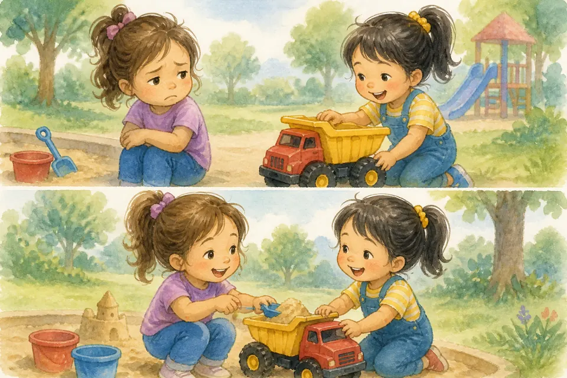

## В этой части

- [Глава 64. Сон — тоже Божий подарок](#ch-64)
- [Глава 65. Еда без капризов и «спасибо» за стол](#ch-65)
- [Глава 66. Деньги: «хочу» и «нужно»](#ch-66)
- [Глава 67. Правда и ложь](#ch-67)
- [Глава 68. Зависть и сравнение](#ch-68)
- [Глава 69. Хвастовство и скромность](#ch-69)
- [Глава 70. Терпение и ожидание](#ch-70)
- [Глава 71. Щедрость и помощь нуждающимся](#ch-71)
- [Глава 72. Труд и лень](#ch-72)
- [Глава 73. Благодарность как привычка](#ch-73)

## Глава 64. Сон — тоже Божий подарок {#ch-64}

*(Папа говорит тише, почти шёпотом)*

Знаешь, даже сильным людям нужен сон. Сон — не наказание и не «скука». Это Божий подарок: тело отдыхает, сердце успокаивается, мозг складывает день по полочкам.

Когда мы ложимся вовремя, завтра легче быть доброй и внимательной. Ночник, объятие, молитва — и глазки отдыхают. Если спишь в гостях или дома шумит малыш, можно сказать взрослым, что тебе нужна помощь и тишина. Я рядом.

**📖 Стих из Библии:**
9. Спокойно ложусь я и сплю, ибо Ты, Господи, един даешь мне жить в безопасности.
Псалом 4:9 (Синодальный перевод)

**🗣 Поговорим:**
*Папа:* Что тебе помогает быстрее заснуть?
*(Дать дочке ответить)*

**🙏 Наша молитва:**
«Господь, благослови мой сон. Храни меня ночью. Аминь.»

---

{ loading=lazy }

## Глава 65. Еда без капризов и «спасибо» за стол {#ch-65}

*(Папа гладит воображаемую тарелку)*

Еда — забота Бога через руки мамы, папы, бабушки. Не всегда на столе то, что «самая-самая хотелка». Иногда — суп. Иногда — каша.

Мы учимся пробовать, говорить «спасибо» и не превращать стол в битву. Перед едой можно коротко поблагодарить Бога: «Спасибо за еду и за руки, которые готовили». Капризы делают обед горьким. Благодарность — вкусным даже простому блюду.

**📖 Стих из Библии:**
31. Итак, едите ли, пьете ли, или иное что делаете, все делайте в славу Божию.
1 Коринфянам 10:31 (Синодальный перевод)

**🗣 Поговорим:**
*Папа:* За какую еду сегодня скажем «спасибо»?
*(Дать дочке ответить)*

**🙏 Наша молитва:**
«Бог, спасибо за еду и за руки, которые готовят. Научи меня быть благодарной. Аминь.»

---

{ loading=lazy }

## Глава 66. Деньги: «хочу» и «нужно» {#ch-66}

*(Папа показывает две ладошки)*

В одной ладошке — «хочу»: игрушка, конфетка, модная вещица. В другой — «нужно»: еда, дом, помощь людям, подарки с любовью.

Деньги — инструмент, не царь. Мы не кланяемся витрине. Мы спрашиваем: «Это нужно? Это мудро? Это доброе?» Иногда ответ: «Не сейчас». И это тоже любовь.

**📖 Стих из Библии:**
6. Великое приобретение - быть благочестивым и довольным. 7. Ибо мы ничего не принесли в мир; явно, что ничего не можем и вынести из него. 8. Имея пропитание и одежду, будем довольны тем.
1 Тимофею 6:6-8 (Синодальный перевод)

**🗣 Поговорим:**
*Папа:* Вспомни, когда «не сейчас» оказалось правильным.
*(Дать дочке ответить)*

**🙏 Наша молитва:**
«Господь, научи меня мудрости: отличать «хочу» от «нужно». Аминь.»

---

{ loading=lazy }

## Глава 67. Правда и ложь {#ch-67}

*(Папа смотрит прямо и тепло)*

Правда — как чистый свет. Ложь — как тень, в которой потом страшно самой.

Иногда врут от страха: «Вдруг накажут». В нашей семье безопаснее сказать правду. Ошибку можно исправить. Ложь запутывает ещё сильнее. Бог любит правду — и помогает быть смелой говорить её мягко. Если ты передумала — скажи честно. Если обещала — доведи до конца или попроси помощи. Если случилось важное или опасное — расскажи взрослому, даже если страшно.

**📖 Стих из Библии:**
25. Посему, отвергнув ложь, говорите истину каждый ближнему своему, потому что мы члены друг другу.
Ефесянам 4:25 (Синодальный перевод)

**🗣 Поговорим:**
*Папа:* Почему правду иногда говорить трудно — и кто может помочь?
*(Дать дочке ответить)*

**🙏 Наша молитва:**
«Иисус, научи меня правде без страха и злости. Аминь.»

---

{ loading=lazy }

## Глава 68. Зависть и сравнение {#ch-68}

*(Папа мягко качает головой)*

Зависть шепчет: «У неё лучше — значит, я хуже». Это ядовитый шёпот. Он крадёт радость.

Ты не должна быть копией подруги. У тебя свой путь, свои дары, своя красота. Зависть может прийти к игрушке, платью, вниманию, спокойствию, лёгкой учёбе или красивой фотографии. Можно порадоваться за другую и сказать: «Как здорово у тебя!» — а себе: «Спасибо, Бог, и за меня».

**📖 Стих из Библии:**
30. Кроткое сердце - жизнь для тела, а зависть - гниль для костей.
Притчи 14:30 (Синодальный перевод)

**🗣 Поговорим:**
*Папа:* Что у тебя есть такого, за что можно сказать «спасибо» без сравнения?
*(Дать дочке ответить)*

**🙏 Наша молитва:**
«Бог, избавь меня от зависти. Научи радоваться за других и за себя. Аминь.»

---

{ loading=lazy }

## Глава 69. Хвастовство и скромность {#ch-69}

*(Папа улыбается)*

Хвастовство кричит: «Смотрите, какая я!» Скромность говорит: «Спасибо Богу» — и делится радостью без унижения других.

Можно гордиться старанием. Нельзя топтать чужое сердце. Настоящая сила не орёт громче всех.

**📖 Стих из Библии:**
2. Пусть хвалит тебя другой, а не уста твои, - чужой, а не язык твой.
Притчи 27:2 (Синодальный перевод)

**🗣 Поговорим:**
*Папа:* Как можно рассказать о своей радости, не хвастаясь?
*(Дать дочке ответить)*

**🙏 Наша молитва:**
«Господь, научи меня скромности и тёплой радости. Аминь.»

---

{ loading=lazy }

## Глава 70. Терпение и ожидание {#ch-70}

*(Папа медленно считает до трёх)*

Ждать очередь, ждать день рождения, ждать маму с работы — трудно! Терпение — мышца сердца. Она растёт, когда мы не топаем каждую секунду.

Можно сказать: «Мне трудно ждать» — и подышать, помолиться, найти тихое дело. Бог тоже часто учит нас ждать с любовью.

**📖 Стих из Библии:**
7. Итак, братия, будьте долготерпеливы до пришествия Господня. Вот, земледелец ждет драгоценного плода от земли и для него терпит долго, пока получит дождь ранний и поздний. 8. Долготерпите и вы, укрепите сердца ваши, потому что пришествие Господне приближается.
Иакова 5:7-8 (Синодальный перевод)

**🗣 Поговорим:**
*Папа:* Что тебе ждать труднее всего?
*(Дать дочке ответить)*

**🙏 Наша молитва:**
«Иисус, научи меня терпению. Помоги ждать спокойно. Аминь.»

---

{ loading=lazy }

## Глава 71. Щедрость и помощь нуждающимся {#ch-71}

*(Папа показывает жест «отдать»)*

Щедрость — когда сердце открывает кулачок: делится игрушкой, печеньем, временем, монеткой для нуждающихся.

Мы помогаем не чтобы «казаться хорошими», а потому что Бог щедр к нам. Бог любит и бедных, и богатых, а ценность человека не измеряется витриной. Маленькая девочка тоже может быть Божьими руками — очень маленькими, но настоящими.

**📖 Стих из Библии:**
6. При сем скажу: кто сеет скупо, тот скупо и пожнет; а кто сеет щедро, тот щедро и пожнет. 7. Каждый уделяй по расположению сердца, не с огорчением и не с принуждением; ибо доброхотно дающего любит Бог.
2 Коринфянам 9:6-7 (Синодальный перевод)

**🗣 Поговорим:**
*Папа:* Чем ты можешь поделиться на этой неделе?
*(Дать дочке ответить)*

**🙏 Наша молитва:**
«Господь, сделай моё сердце щедрым. Аминь.»

---

{ loading=lazy }

## Глава 72. Труд и лень {#ch-72}

*(Папа потягивается, потом бодро встаёт)*

Лень шепчет: «Пусть другие». Труд говорит: «Я помогу». После труда бывает приятная усталость и радость: «Я смогла!»

Мы не рабы дел. Но мы и не принцессы на диване без заботы. Бог даёт руки для добрых дел — дома, в садике, в церкви.

**📖 Стих из Библии:**
23. И все, что делаете, делайте от души, как для Господа, а не для человеков, 24. зная, что в воздаяние от Господа получите наследие, ибо вы служите Господу Христу.
Колоссянам 3:23-24 (Синодальный перевод)

**🗣 Поговорим:**
*Папа:* Какое маленькое дело ты сделаешь сегодня без каприза?
*(Дать дочке ответить)*

**🙏 Наша молитва:**
«Бог, научи меня трудиться с радостью и не лениться. Аминь.»

---

{ loading=lazy }

## Глава 73. Благодарность как привычка {#ch-73}

*(Папа перечисляет на пальцах)*

Благодарность — очки, через которые мир становится светлее. «Спасибо» за еду, за объятие, за обычный день, за врача, учителя, воспитателя, за Иисуса.

Каждый вечер можно находить три «спасибо». Даже в трудный день найдётся хотя бы одно. Это тренировка радостного сердца.

**📖 Стих из Библии:**
16. Всегда радуйтесь. 17. Непрестанно молитесь. 18. За все благодарите: ибо такова о вас воля Божия во Христе Иисусе.
1 Фессалоникийцам 5:16-18 (Синодальный перевод)

**🗣 Поговорим:**
*Папа:* Назови три «спасибо» за сегодняшний день.
*(Дать дочке ответить)*

**🙏 Наша молитва:**
«Бог, спасибо Тебе за всё доброе. Научи меня замечать Твои дары. Аминь.»
