## В этой части

- [Глава 74. Незнакомцы и безопасные взрослые](#ch-74)
- [Глава 75. Что делать, если потерялась](#ch-75)
- [Глава 76. Врач, уколы и боль](#ch-76)
- [Глава 77. Гроза и непогода](#ch-77)
- [Глава 78. Братья, сёстры и ревность](#ch-78)
- [Глава 79. Гости и гостеприимство](#ch-79)
- [Глава 80. Воспитатели и уважение](#ch-80)
- [Глава 81. Каждый человек — ценный](#ch-81)
- [Глава 82. Святой Дух — Помощник рядом](#ch-82)
- [Глава 83. Ангелы — Божьи слуги](#ch-83)
- [Глава 84. Крещение: я принадлежу Иисусу](#ch-84)
- [Глава 85. Монетка от сердца](#ch-85)
- [Глава 86. Рассказывать друзьям об Иисусе](#ch-86)
- [Глава 87. Когда близкие с Иисусом](#ch-87)

## Глава 74. Незнакомцы и безопасные взрослые

*(Папа говорит спокойно и серьёзно)*

Не каждый улыбчивый взрослый — безопасный. Правило: не уходим с незнакомцами, не садимся в чужую машину, не берём конфеты, деньги и «секретные» подарки. Не рассказываем чужим адрес, код двери и дорогу домой. В лифт с незнакомыми не заходим, дверь дома без взрослых не открываем, окна и балкон одной не открываем.

**Безопасные взрослые** — мама, папа, бабушка, дедушка, воспитатель, охранник или продавец на рабочем месте, тот, кого назвали родители. Если кто-то пугает или зовёт «посекрету» — громко зови меня, маму или безопасного взрослого.

**📖 Стих из Библии:**
3. Благоразумный видит беду, и укрывается; а неопытные идут вперед, и наказываются.
Притчи 22:3 (Синодальный перевод)

**🗣 Поговорим:**
*Папа:* Назови двух-трёх своих безопасных взрослых.
*(Дать дочке ответить)*

**🙏 Наша молитва:**
«Господь, храни меня. Дай смелость звать на помощь. Аминь.»

---

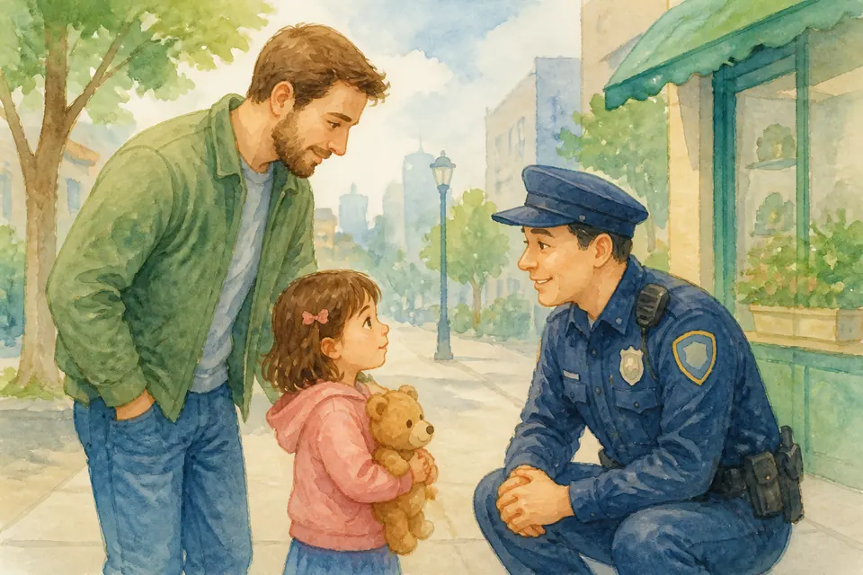{ loading=lazy }

## Глава 75. Что делать, если потерялась

*(Папа отрабатывает план, как тренировку)*

Если вдруг потерялась в магазине, торговом центре, парке, на празднике или в транспорте:
1. Остановись на месте, если это безопасно, или подойди к кассе, охране, водителю, сотруднику станции, маме с детьми.
2. Громко зови: «Папа! Мама!»
3. Скажи: «Я потерялась. Помогите позвать моих родителей».
4. Не уходи с незнакомцем «помочь искать» и не выбегай куда попало.

Мы всегда будем искать тебя. Ты очень важна.

**📖 Стих из Библии:**
7. Господь сохранит тебя от всякого зла; сохранит душу твою Господь. 8. Господь будет охранять выхождение твое и вхождение твое отныне и вовек.
Псалом 120:7-8 (Синодальный перевод)

**🗣 Поговорим:**
*Папа:* Давай повторим план вместе: остановиться — позвать — подойти к кому?
*(Дать дочке ответить)*

**🙏 Наша молитва:**
«Иисус, если мне страшно, будь со мной и помоги найти своих. Аминь.»

---

{ loading=lazy }

## Глава 76. Врач, уколы и боль

*(Папа берёт дочку за руку)*

Врач помогает телу быть здоровым. Иногда неприятно: горло смотрят, укол делают, лекарство горькое, аллергия пугает. Боль бывает — но она не навсегда, и ты не одна.

Можно плакать. Можно сжать мою руку. Можно молиться: «Иисус, помоги». Храбрость — не «не чувствовать», а идти через трудное с поддержкой.

**📖 Стих из Библии:**
7. Все заботы ваши возложите на Него, ибо Он печется о вас.
1 Петра 5:7 (Синодальный перевод)

**🗣 Поговорим:**
*Папа:* Что тебе помогает у врача?
*(Дать дочке ответить)*

**🙏 Наша молитва:**
«Иисус, будь со мной у врача. Дай спокойствие и исцеление. Аминь.»

---

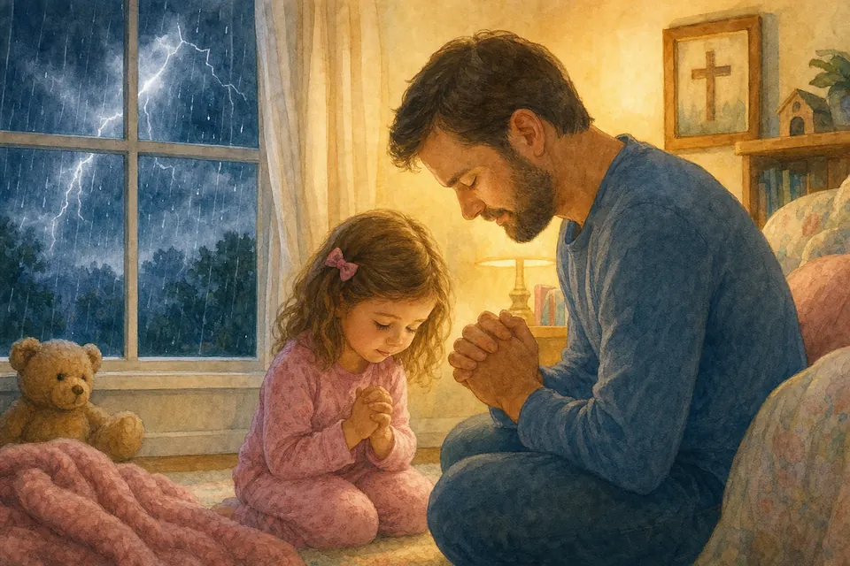{ loading=lazy }

## Глава 77. Гроза и непогода

*(Папа изображает гром далеко-далеко)*

Гром бывает громким. Молния — яркой. Это сила природы, которую создал Бог. Дом, родители и молитва — твоя тихая гавань.

Можно сказать: «Мне страшно» — и держаться за руку. Бог сильнее страха. Буря проходит. Утро приходит.

**📖 Стих из Библии:**
4. Когда я в страхе, на Тебя я уповаю.
Псалом 55:4 (Синодальный перевод)

**🗣 Поговорим:**
*Папа:* Что тебе помогает, когда гремит гром?
*(Дать дочке ответить)*

**🙏 Наша молитва:**
«Бог, Ты сильнее бури. Успокой моё сердце. Аминь.»

---

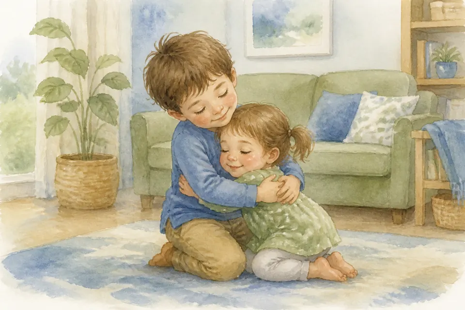{ loading=lazy }

## Глава 78. Братья, сёстры и ревность

*(Папа говорит очень понимающе)*

Если есть брат или сестра — иногда хочется кричать: «Это моё! А меня меньше любят!» Если ты одна — иногда тоже бывает ревность к друзьям или малышам в гостях.

Ревность болит. Но любовь родителей не как торт, который кончается. Божья любовь тоже не делится по крошкам. Можно сказать о боли словами, заботиться о младших и слабых в игре, уважать сон малыша — и учиться радоваться вместе.

**📖 Стих из Библии:**
12. Почитай отца твоего и мать твою, чтобы продлились дни твои на земле, которую Господь, Бог твой, дает тебе.
Исход 20:12 (Синодальный перевод)

**🗣 Поговорим:**
*Папа:* Когда тебе бывает ревниво — и что бы ты хотела услышать?
*(Дать дочке ответить)*

**🙏 Наша молитва:**
«Господь, исцели мою ревность. Научи делить любовь. Аминь.»

---

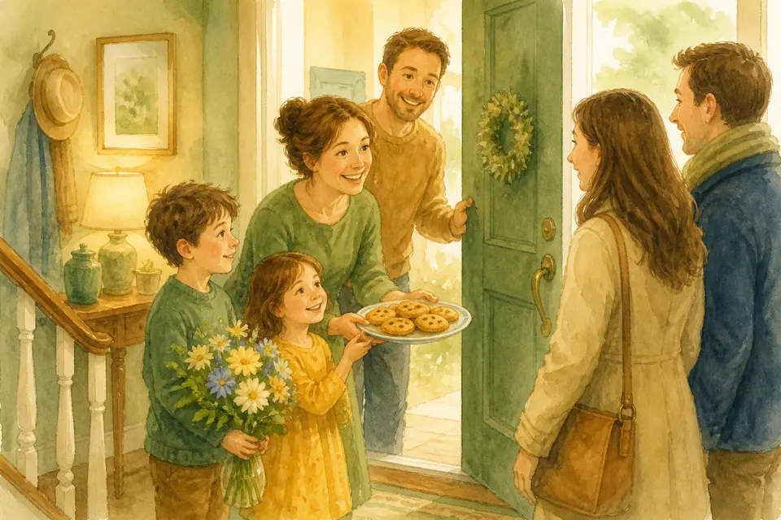{ loading=lazy }

## Глава 79. Гости и гостеприимство

*(Папа распахивает воображаемую дверь)*

Гостеприимство — тёплое «заходите!» Угостить, показать игрушку, сказать «здравствуйте», не хватать всё со стола первым.

Гость — не враг и не хозяин твоего сердца. В церкви могут быть гости из другой страны, с другим языком и привычками. Мы делимся домом и вниманием, потому что Бог сначала принял нас.

**📖 Стих из Библии:**
12. Итак во всем, как хотите, чтобы с вами поступали люди, так поступайте и вы с ними, ибо в этом закон и пророки.
Матфея 7:12 (Синодальный перевод)

**🗣 Поговорим:**
*Папа:* Как можно обрадовать гостя?
*(Дать дочке ответить)*

**🙏 Наша молитва:**
«Иисус, научи меня тёплому гостеприимству. Аминь.»

---

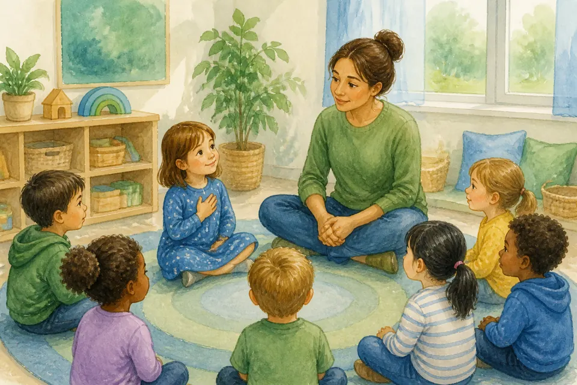{ loading=lazy }

## Глава 80. Воспитатели и уважение

*(Папа кивает с уважением)*

Воспитатель и учитель помогают расти. Мы говорим уважительно, слушаем правила группы и благодарим за обычную заботу.

Уважение — не слепой страх. Если кто-то поступает плохо или тебе опасно — ты всё равно рассказываешь мне и маме. Взрослые тоже бывают разными. Твоя безопасность важнее «молчаливой вежливости».

**📖 Стих из Библии:**
12. Итак во всем, как хотите, чтобы с вами поступали люди, так поступайте и вы с ними, ибо в этом закон и пророки.
Матфея 7:12 (Синодальный перевод)

**🗣 Поговорим:**
*Папа:* Чем хороший воспитатель похож на доброго помощника?
*(Дать дочке ответить)*

**🙏 Наша молитва:**
«Господь, благослови моих воспитателей. Дай мне уважение и смелость говорить правду. Аминь.»

---

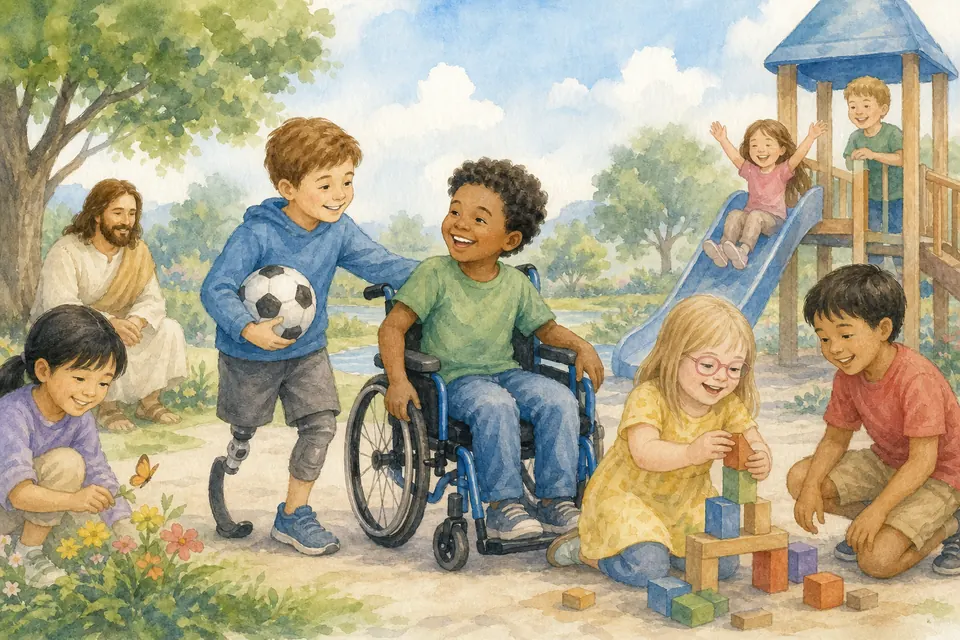{ loading=lazy }

## Глава 81. Каждый человек — ценный

*(Папа говорит медленно и важно)*

Некоторые дети ходят иначе, слышат иначе, учатся иначе. Кто-то в коляске. Кто-то говорит медленнее.

Это не повод смеяться. Каждый человек — Божье творение с достоинством. Стыд не должен прятать человека в угол, а чужая бедность или богатство не делает его лучше или хуже. Мы дружим, помогаем, не пялимся грубо, не обзываем. Иисус любит всех детей.

**📖 Стих из Библии:**
34. Петр отверз уста и сказал: истинно познаю, что Бог нелицеприятен, 35. но во всяком народе боящийся Его и поступающий по правде приятен Ему.
Деяния 10:34-35 (Синодальный перевод)

**🗣 Поговорим:**
*Папа:* Как можно быть доброй подругой тому, кто не похож на тебя?
*(Дать дочке ответить)*

**🙏 Наша молитва:**
«Иисус, научи меня видеть ценность каждого человека. Аминь.»

---

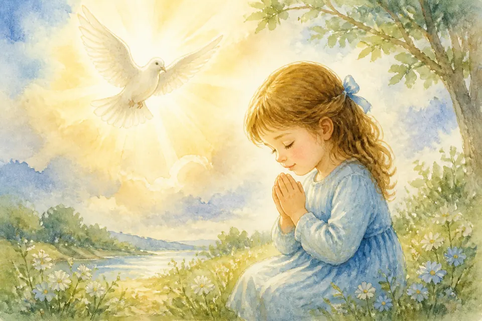{ loading=lazy }

## Глава 82. Святой Дух — Помощник рядом

*(Папа говорит просто и тепло)*

Бог — Отец, Сын Иисус и Святой Дух. Святой Дух — Помощник. Он помогает помнить доброе, утешает, учит, даёт силы сказать «нет» плохому.

Ты не видишь ветер — но чувствуешь. Так и Дух Божий действует мягко и сильно. Совесть может тихо подсказать: «остановись, скажи правду, попроси прощения». Можно молиться: «Святой Дух, помоги мне».

**📖 Стих из Библии:**
26. Утешитель же, Дух Святый, Которого пошлет Отец во имя Мое, научит вас всему и напомнит вам все, что Я говорил вам. 27. Мир оставляю вам, мир Мой даю вам; не так, как мир дает, Я даю вам. Да не смущается сердце ваше и да не устрашается.
Иоанна 14:26-27 (Синодальный перевод)

**🗣 Поговорим:**
*Папа:* В чём тебе сегодня нужна помощь Помощника?
*(Дать дочке ответить)*

**🙏 Наша молитва:**
«Святой Дух, будь моим Помощником. Научи меня добру. Аминь.»

---

{ loading=lazy }

## Глава 83. Ангелы — Божьи слуги

*(Папа говорит спокойно, без сказки-ужастика)*

Ангелы — Божьи слуги. Они не волшебные феи из мультика и не персонажи для игры в суеверия. Бог может посылать защиту и помощь.

Главное — не ангелы, а Бог. Мы молимся Богу, доверяем Иисусу. Ангелы радуются, когда человек идёт путём добра.

**📖 Стих из Библии:**
11. Ибо Ангелам Своим заповедает о тебе - охранять тебя на всех путях твоих: 12. на руках понесут тебя, да не преткнешься о камень ногою твоею;
Псалом 90:11-12 (Синодальный перевод)

**🗣 Поговорим:**
*Папа:* Кому мы доверяем в первую очередь — ангелам или Богу?
*(Дать дочке ответить)*

**🙏 Наша молитва:**
«Бог, спасибо за Твою защиту. Научи меня доверять Тебе. Аминь.»

---

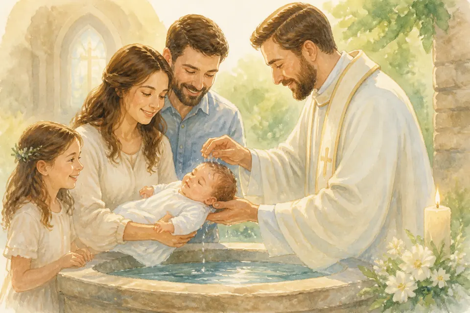{ loading=lazy }

## Глава 84. Крещение: я принадлежу Иисусу

*(Папа говорит торжественно и просто)*

Крещение — особый знак, что человек принадлежит Иисусу и Божьей семье. В разных церквях это делают по-разному: кого-то крестят маленьким, кого-то — когда уже верит сам и понимает.

Сейчас тебе важно знать: Иисус зовёт тебя к Себе. Ты можешь сказать Ему: «Я хочу быть Твоей». А когда крестят друга, брата или сестру, мы радуемся: ещё один человек говорит Иисусу «да». Про детали крещения в нашей семье мы поговорим с мамой и пастором спокойно.

**📖 Стих из Библии:**
38. Петр же сказал им: покайтесь, и да крестится каждый из вас во имя Иисуса Христа для прощения грехов; и получите дар Святаго Духа. 39. Ибо вам принадлежит обетование и детям вашим и всем дальним, кого ни призовет Господь Бог наш.
Деяния 2:38-39 (Синодальный перевод)

**🗣 Поговорим:**
*Папа:* Что значит для тебя «принадлежать Иисусу»?
*(Дать дочке ответить)*

**🙏 Наша молитва:**
«Иисус, я хочу быть Твоей. Веди меня. Аминь.»

---

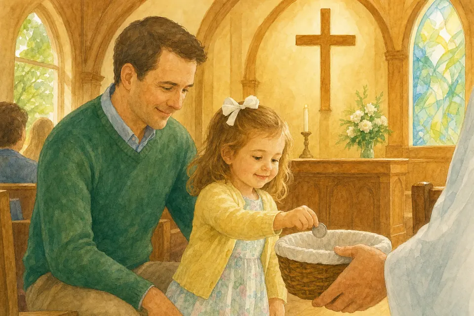{ loading=lazy }

## Глава 85. Монетка от сердца

*(Папа кладёт воображаемую монетку)*

В церкви люди приносят пожертвование — часть того, что Бог дал. Это не «плата за билет». Это благодарность и забота о деле Божьем и о нуждающихся.

Даже маленькая монетка от сердца важна. Когда вырастешь, услышишь слово «десятина» — часть того, что Бог дал, возвращают Ему с благодарностью. Сейчас главное простое: Бог смотрит не на размер монеты — на сердце.

**📖 Стих из Библии:**
6. При сем скажу: кто сеет скупо, тот скупо и пожнет; а кто сеет щедро, тот щедро и пожнет. 7. Каждый уделяй по расположению сердца, не с огорчением и не с принуждением; ибо доброхотно дающего любит Бог.
2 Коринфянам 9:6-7 (Синодальный перевод)

**🗣 Поговорим:**
*Папа:* Почему важно давать с радостью, а не с обидой?
*(Дать дочке ответить)*

**🙏 Наша молитва:**
«Господь, научи меня давать с благодарным сердцем. Аминь.»

---

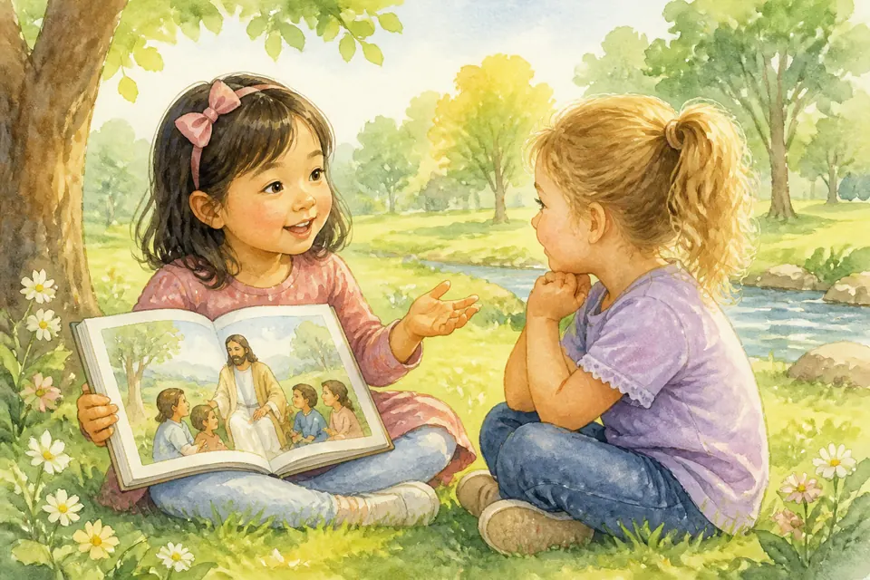{ loading=lazy }

## Глава 86. Рассказывать друзьям об Иисусе

*(Папа шепчет, как секрет радости)*

Если у тебя есть вкусная ягода — хочется поделиться. Если есть Иисус — тоже можно делиться: «Он меня любит. Он помогает. Он прощает».

Мы не спорим грубо и не давим. Мы светим. Можно пригласить в церковь, нарисовать открытку, рассказать историю, помочь тому, кому трудно. Мечты служить людям начинаются с маленькой доброты сегодня. Миссионер — даже пятилетка со светлым сердцем.

**📖 Стих из Библии:**
19. Итак идите, научите все народы, крестя их во имя Отца и Сына и Святаго Духа, 20. уча их соблюдать все, что Я повелел вам; и се, Я с вами во все дни до скончания века. Аминь.
Матфея 28:19-20 (Синодальный перевод)

**🗣 Поговорим:**
*Папа:* Кому из друзей ты могла бы сказать что-то доброе об Иисусе?
*(Дать дочке ответить)*

**🙏 Наша молитва:**
«Иисус, помоги мне смело и ласково рассказывать о Тебе. Аминь.»

---

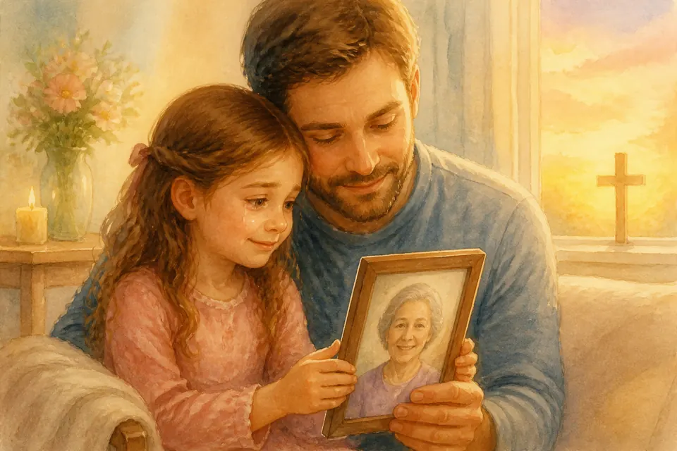{ loading=lazy }

## Глава 87. Когда близкие с Иисусом

*(Папа обнимает, говорит очень нежно)*

Иногда кто-то из близких умирает — и становится очень грустно. Можно плакать. Иисус тоже плакал с друзьями.

Для тех, кто с Иисусом, смерть — не конец: они с Богом. Мы помним, любим, благодарим за жизнь этого человека и держимся надежды. Если грустно — скажи мне. Мы вместе.

**📖 Стих из Библии:**
15. А я и дом мой будем служить Господу.
Иисус Навин 24:15 (Синодальный перевод)

**🗣 Поговорим:**
*Папа:* Кого из близких ты хочешь поблагодарить в молитве?
*(Дать дочке ответить)*

**🙏 Наша молитва:**
«Иисус, утешь нас. Спасибо за надежду Небес. Аминь.»
