## В этой части

- [Глава 88. Скука: что делать без экрана](#ch-88)
- [Глава 89. Вода: пить и быть осторожной](#ch-89)
- [Глава 90. Петь Богу от сердца](#ch-90)
- [Глава 91. Рукоделие и творчество — радость, не идеал](#ch-91)
- [Глава 92. Умение проигрывать](#ch-92)
- [Глава 93. Огонь, розетки и горячее](#ch-93)
- [Глава 94. Лекарства — не конфеты](#ch-94)
- [Глава 95. Библейский стих на неделю](#ch-95)
- [Глава 96. Острые предметы: ножницы и ножи](#ch-96)
- [Глава 97. Пожарная сирена и тревога дома](#ch-97)
- [Глава 98. Как мириться после ссоры](#ch-98)
- [Глава 99. «Мне нужно побыть одной»](#ch-99)

## Глава 88. Скука: что делать без экрана

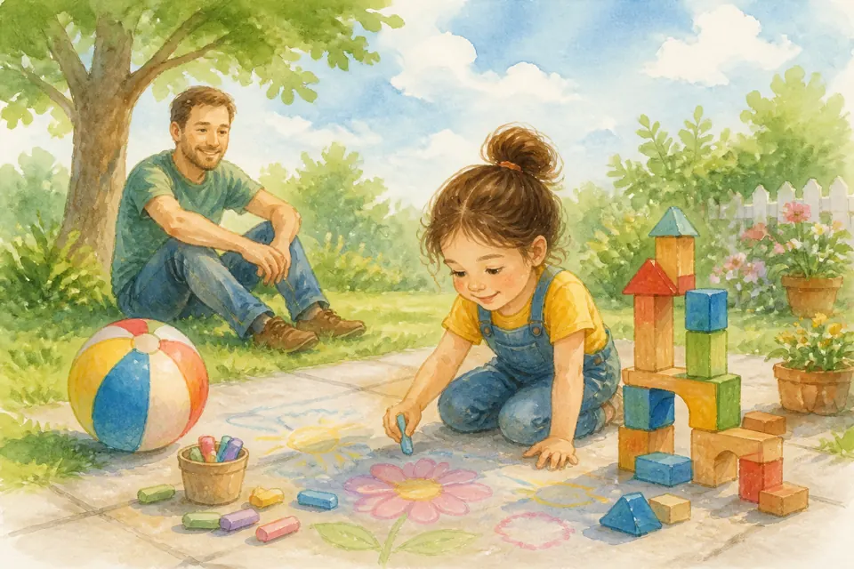{ loading=lazy }

*(Папа разводит руками — и вдруг оживляется)*

Скука — не враг. Иногда она как пустая страница: можно нарисовать что угодно! Построить из подушек дом. Найти жучка. Слепить. Спеть. Помочь на кухне. Посмотреть в окно на облака.

Экран кричит: «Скучно? Нажми!» А мы учимся: скука проходит, если дать рукам и фантазии работу. Бог дал тебе ум и игрушки мира — даже палочки и камешки.

**📖 Стих из Библии:**
11. Остановитесь и познайте, что Я - Бог: буду превознесен в народах, превознесен на земле.
Псалом 45:11 (Синодальный перевод)

**🗣 Поговорим:**
*Папа:* Что интересное можно сделать без телефона прямо сейчас?
*(Дать дочке ответить)*

**🙏 Наша молитва:**
«Творец, спасибо за фантазию. Научи меня играть и творить без экрана. Аминь.»

---

## Глава 89. Вода: пить и быть осторожной

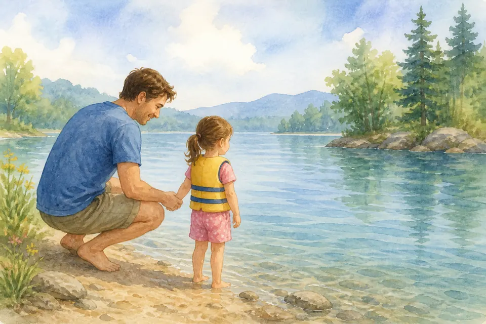{ loading=lazy }

*(Папа показывает глоток — и «стоп» у края)*

Вода — чудо: она утоляет жажду, помогает расти, в ней плещутся рыбки. Пей достаточно — телу нужна водичка.

А у моря, озера, ванны и бассейна — правило: только со взрослым. Не заплываем туда, где глубоко и страшно. Вода друг, когда рядом мудрость. Я учу тебя плавать и осторожности — потому что люблю.

**📖 Стих из Библии:**
3. Благоразумный видит беду, и укрывается; а неопытные идут вперед, и наказываются.
Притчи 22:3 (Синодальный перевод)

**🗣 Поговорим:**
*Папа:* Какие правила у воды мы запомним вместе?
*(Дать дочке ответить)*

**🙏 Наша молитва:**
«Бог, спасибо за воду. Научи меня пить и быть осторожной. Аминь.»

---

## Глава 90. Петь Богу от сердца

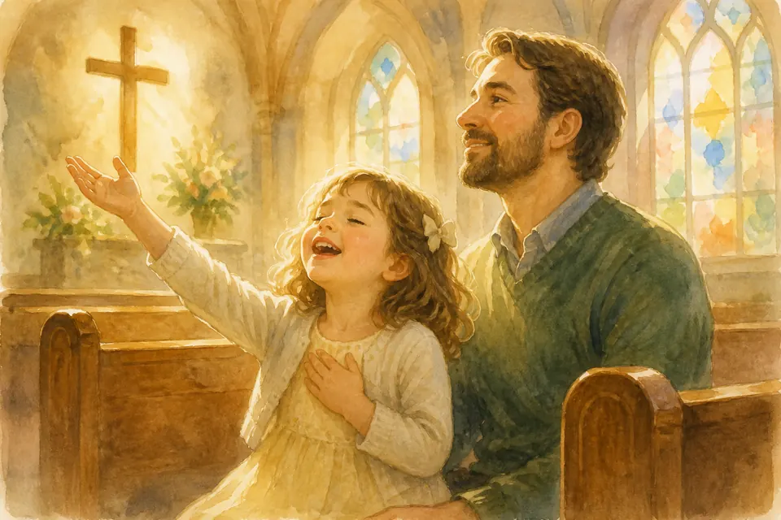{ loading=lazy }

*(Папа тихо запевает)*

Поклонение и прославление — не концерт и не только «стоять ровно». Это сказать Богу: «Ты большой! Ты хороший! Я Тебя люблю!» Можно петь громко, можно тихо. Можно хлопать. Можно просто слушать и улыбаться.

Богу важнее сердце, чем идеальные ноты. Если промазала звук — не беда. Главное — кому ты поёшь.

**📖 Стих из Библии:**
6. Все дышащее да хвалит Господа! Аллилуия.
Псалом 150:6 (Синодальный перевод)

**🗣 Поговорим:**
*Папа:* Какую песню о Боге тебе нравится петь?
*(Дать дочке ответить)*

**🙏 Наша молитва:**
«Бог, принимай мою песню. Научи меня любить Тебя голосом и сердцем. Аминь.»

---

## Глава 91. Рукоделие и творчество — радость, не идеал

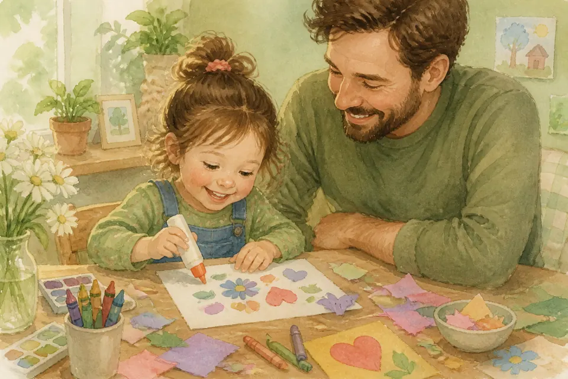{ loading=lazy }

*(Папа радуется кривой, но искренней поделке)*

Клеить, рисовать, шить, лепить — это радость рук! Не экзамен на «самую ровную аппликацию в мире». Если хвостик у зайца кривой — зато зайчик твой и живой.

Сравнение и «надо идеально» крадут веселье. Можно расстелить клеёнку, испачкать пальцы краской, потом вместе убрать. Бог Творец радуется, когда ты творишь с любовью. Давай иногда творить просто так — для улыбки.

**📖 Стих из Библии:**
8. Наконец, братия мои, что только истинно, что честно, что справедливо, что чисто, что любезно, что достославно, что только добродетель и похвала, о том помышляйте.
Филиппийцам 4:8 (Синодальный перевод)

**🗣 Поговорим:**
*Папа:* Что тебе хочется сделать руками на этой неделе?
*(Дать дочке ответить)*

**🙏 Наша молитва:**
«Творец, спасибо за руки и фантазию. Научи меня радоваться творчеству без страха ошибки. Аминь.»

---

## Глава 92. Умение проигрывать

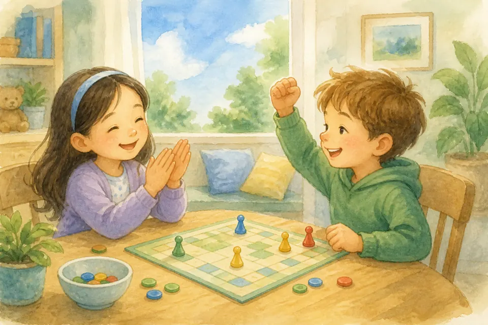{ loading=lazy }

*(Папа хлопает победителю — и обнимает проигравшую)*

В игре кто‑то выигрывает, кто‑то нет. Проигрывать обидно — можно вздохнуть. Нельзя ломать игру, кричать «нечестно всегда!» и портить радость другим.

Храбрая девочка говорит: «Молодец! Ещё партию?» Проигрыш — учитель, не враг. Он учит терпению. Радоваться чужой победе тоже тренировка сердца. А завтра ты можешь выиграть — и тогда тоже будешь доброй.

**📖 Стих из Библии:**
8. Наконец, братия мои, что только истинно, что честно, что справедливо, что чисто, что любезно, что достославно, что только добродетель и похвала, о том помышляйте.
Филиппийцам 4:8 (Синодальный перевод)

**🗣 Поговорим:**
*Папа:* Что сказать, когда проиграла, но хочешь остаться доброй?
*(Дать дочке ответить)*

**🙏 Наша молитва:**
«Иисус, научи меня проигрывать с миром в сердце. Аминь.»

---

## Глава 93. Огонь, розетки и горячее

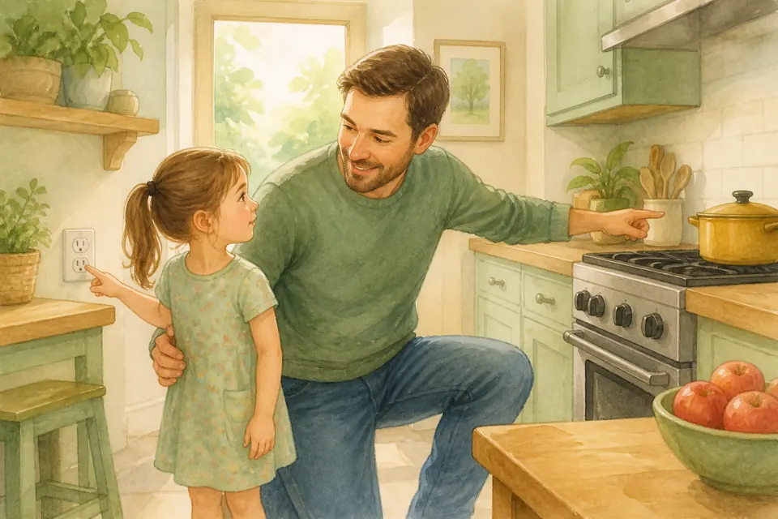{ loading=lazy }

*(Папа показывает «стоп» ладонью)*

Огонь красивый — и опасный. Плита, чайник, свеча, розетка — это не игрушки. Правило: не трогаем сами. Если нужно — только со мной или с мамой.

Горячее обжигает быстро. Розетка — не дырочки для палочек. Если видишь опасность — отойди и позови взрослого. Умная осторожность — тоже храбрость.

**📖 Стих из Библии:**
8. Наконец, братия мои, что только истинно, что честно, что справедливо, что чисто, что любезно, что достославно, что только добродетель и похвала, о том помышляйте.
Филиппийцам 4:8 (Синодальный перевод)

**🗣 Поговорим:**
*Папа:* Что из «горячего и электрического» мы никогда не трогаем одни?
*(Дать дочке ответить)*

**🙏 Наша молитва:**
«Господь, храни меня. Научи осторожности дома. Аминь.»

---

## Глава 94. Лекарства — не конфеты

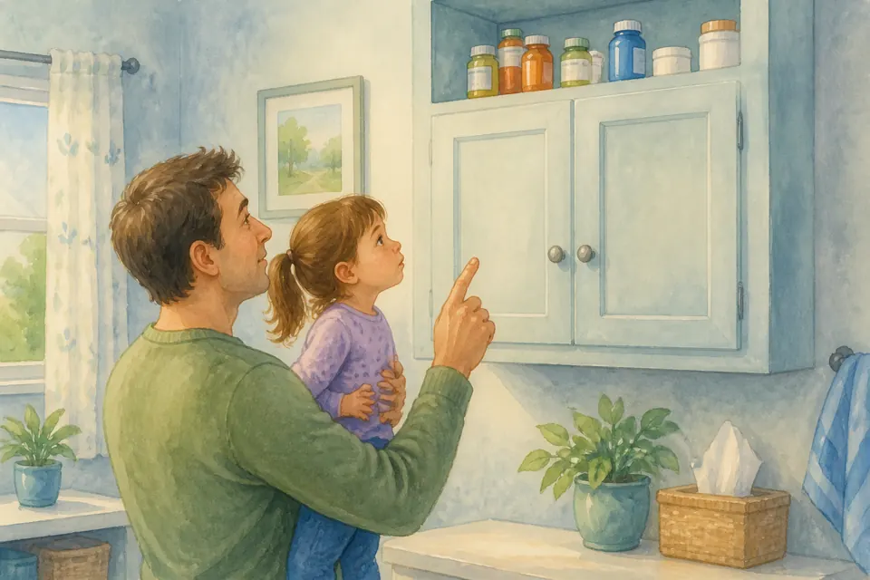{ loading=lazy }

*(Папа качает головой у полки)*

Лекарства бывают сладкими на вкус — но это не конфеты. Их даёт только мама, папа или врач. Самой из шкафчика не берём. И другу «полечиться» не угощаем.

Если нашла таблетку на полу — не в рот. Позови взрослого. Так мы бережём тело, которое дал Бог.

**📖 Стих из Библии:**
3. Благоразумный видит беду, и укрывается; а неопытные идут вперед, и наказываются.
Притчи 22:3 (Синодальный перевод)

**🗣 Поговорим:**
*Папа:* Что делать, если увидела лекарство без взрослых?
*(Дать дочке ответить)*

**🙏 Наша молитва:**
«Бог, научи меня слушаться в заботе о здоровье. Аминь.»

---

## Глава 95. Библейский стих на неделю

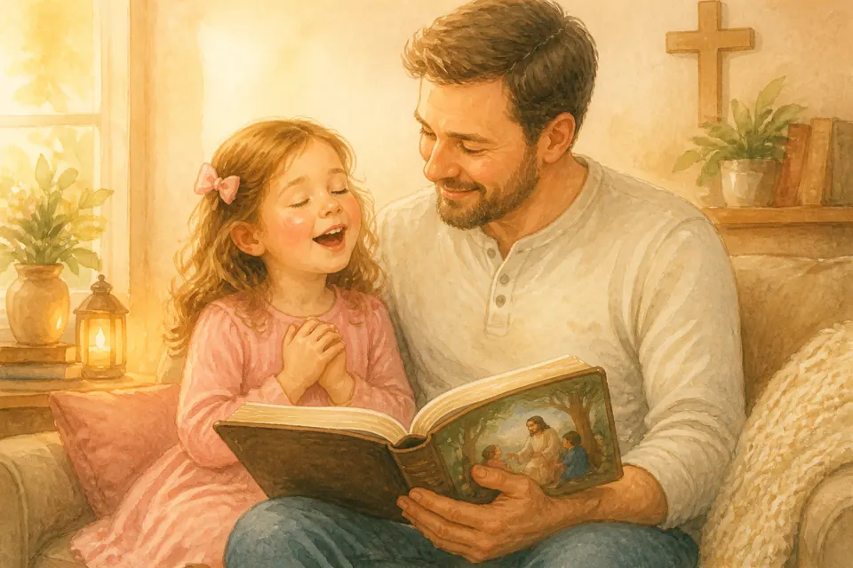{ loading=lazy }

*(Папа открывает детскую Библию)*

Каждую неделю можно взять **одну короткую** Божью фразу — как витаминку для сердца. Например: «Бог есть любовь» или «Не бойся, Я с тобой».

Мы повторяем её утром, в дороге, перед сном — играючи, не как экзамен. Слово Божье селится в память и потом помогает в трудный день.

**📖 Стих из Библии:**
11. В сердце моем сокрыл я слово Твое, чтобы не грешить пред Тобою.
Псалом 118:11 (Синодальный перевод)

**🗣 Поговорим:**
*Папа:* Какой короткий стих хочешь учить на эту неделю?
*(Дать дочке ответить)*

**🙏 Наша молитва:**
«Господь, посели Своё слово в моём сердце. Аминь.»

---

## Глава 96. Острые предметы: ножницы и ножи

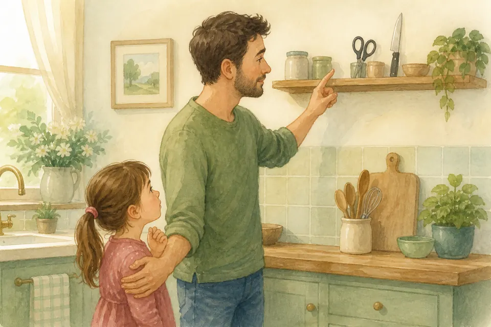{ loading=lazy }

*(Папа показывает «стоп» у ножниц)*

Ножницы и ножи — помощники взрослых, не игрушки. Они острые. Мы не берём их сами, не машем, не «просто потрогать».

Если нужно вырезать — только со мной или с мамой, медленно и внимательно. Увидел острый предмет на полу — не поднимай к лицу, позови взрослого. Осторожность бережёт пальчики.

**📖 Стих из Библии:**
3. Благоразумный видит беду, и укрывается; а неопытные идут вперед, и наказываются.
Притчи 22:3 (Синодальный перевод)

**🗣 Поговорим:**
*Папа:* Что делать, если увидел нож или ножницы без взрослых?
*(Дать дочке ответить)*

**🙏 Наша молитва:**
«Господь, научи меня осторожности с острым. Аминь.»

---

## Глава 97. Пожарная сирена и тревога дома

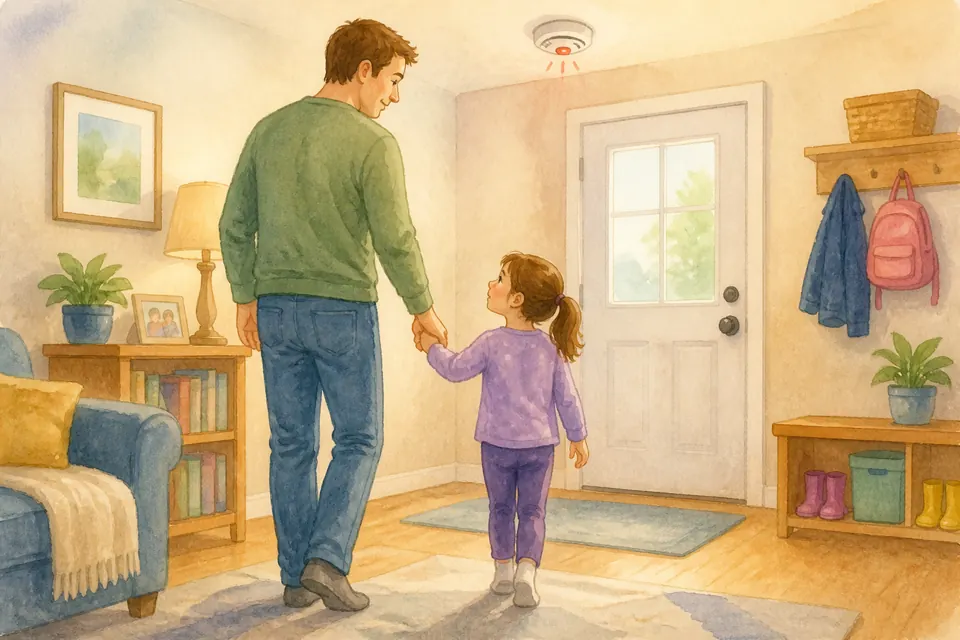{ loading=lazy }

*(Папа говорит очень спокойно)*

Иногда пищит датчик или воет сирена. Это громко — можно испугаться. Мы не бегаем как курочки. Мы делаем простое:

1. Идём к взрослому.
2. Если дым/опасно — вместе к выходу, низко, без лифта если сказали взрослые.
3. Не прячемся в шкаф.
4. На улице ждём на месте сбора.

Тренировка — не страшилка. Это умная забота. Я с тобой.

**📖 Стих из Библии:**
3. Благоразумный видит беду, и укрывается; а неопытные идут вперед, и наказываются.
Притчи 22:3 (Синодальный перевод)

**🗣 Поговорим:**
*Папа:* Какой первый шаг, если услышала громкую тревогу дома?
*(Дать дочке ответить)*

**🙏 Наша молитва:**
«Иисус, когда громко и страшно — будь рядом и дай спокойствие. Аминь.»

---

## Глава 98. Как мириться после ссоры

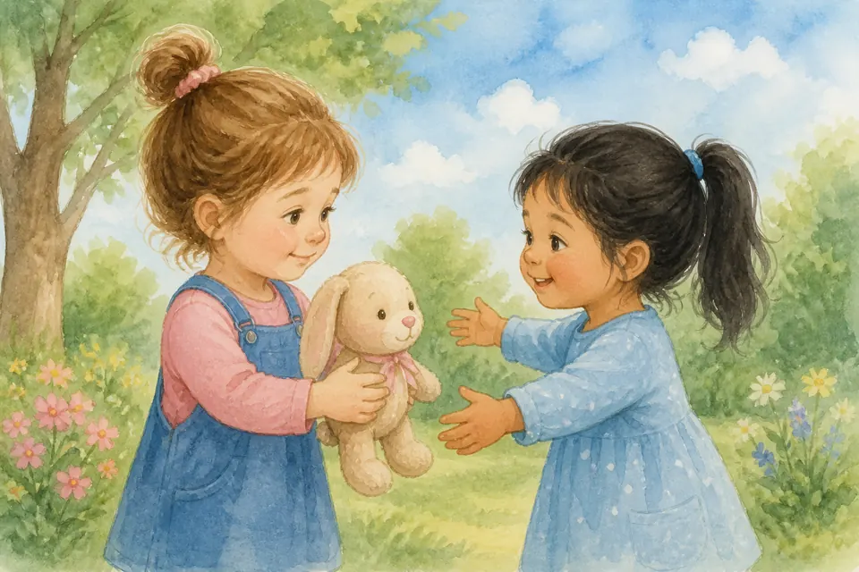{ loading=lazy }

*(Папа считает шаги на пальцах)*

После ссоры мир возвращается шагами:
1. Остыть (подышать).
2. Сказать, что больно, без крика.
3. Искреннее «прости».
4. Принять «прости» другого.
5. Иногда — исправить дело (поднять игрушку, обнять).

Мириться — не «кто победил». Мириться — снова выбрать любовь. Иисус любит мир.

**📖 Стих из Библии:**
17. Никому не воздавайте злом за зло, но пекитесь о добром перед всеми человеками. 18. Если возможно с вашей стороны, будьте в мире со всеми людьми.
Римлянам 12:17-18 (Синодальный перевод)

**🗣 Поговорим:**
*Папа:* Какой шаг мира тебе даётся труднее всего?
*(Дать дочке ответить)*

**🙏 Наша молитва:**
«Иисус, научи меня мириться быстро и искренне. Аминь.»

---

## Глава 99. «Мне нужно побыть одной»

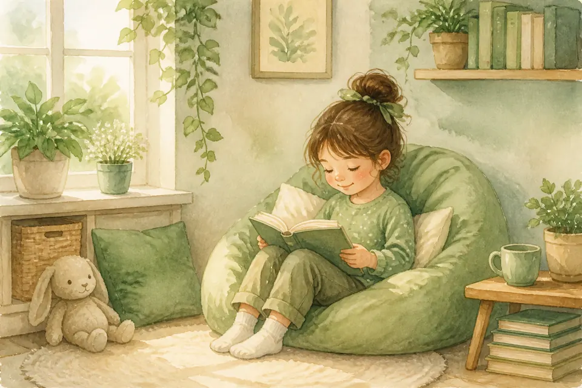{ loading=lazy }

*(Папа уважительно отходит на шаг)*

Иногда сердце полное шума: хочется тишины, уголка, книжки. Можно сказать: «Мне нужно побыть одной немного» — это не злость и не отвержение семьи.

Уважай и чужое «побыть одной». Потом можно вернуться с объятием. Уединение — отдых, не стена навсегда.

**📖 Стих из Библии:**
11. Остановитесь и познайте, что Я - Бог: буду превознесен в народах, превознесен на земле.
Псалом 45:11 (Синодальный перевод)

**🗣 Поговорим:**
*Папа:* Где тебе хорошо побыть одной спокойно?
*(Дать дочке ответить)*

**🙏 Наша молитва:**
«Господь, научи меня отдыхать в тишине и возвращаться с любовью. Аминь.»

---

**Навигация по частям:**

[<- Предыдущая часть](part-08-bezopasnost.md) | [Следующая часть ->](part-10-tserkov.md)
_Часть 8. Безопасность и люди | Часть 10. Церковь_
