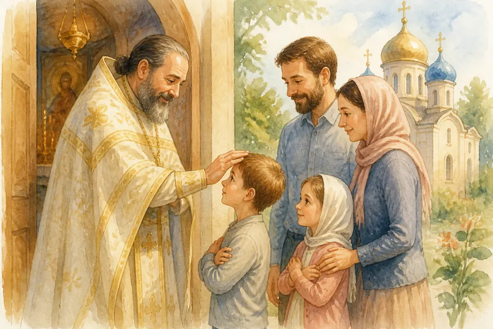
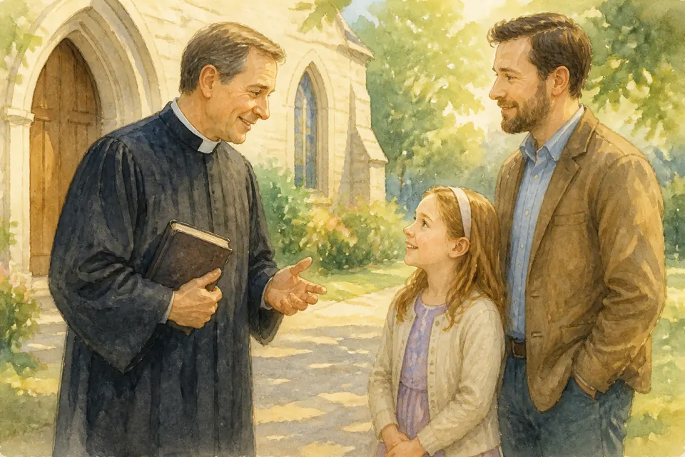
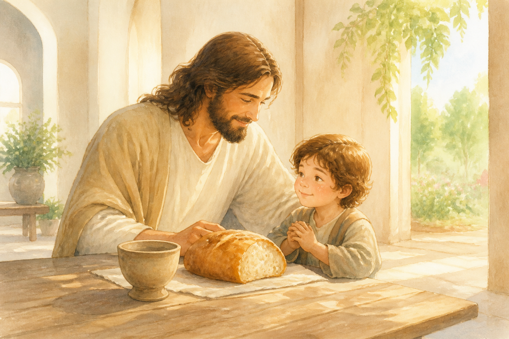
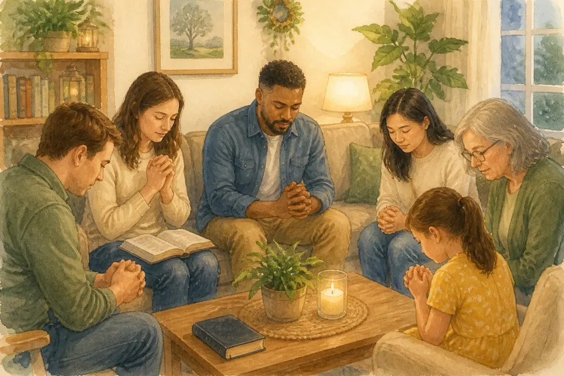
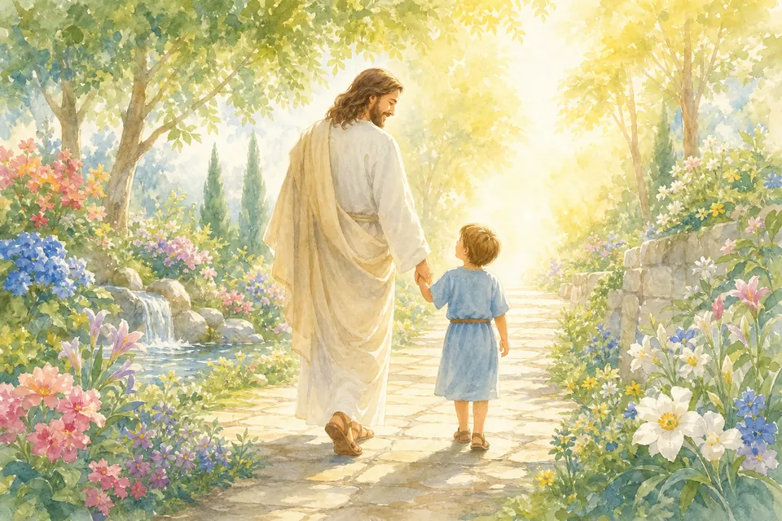
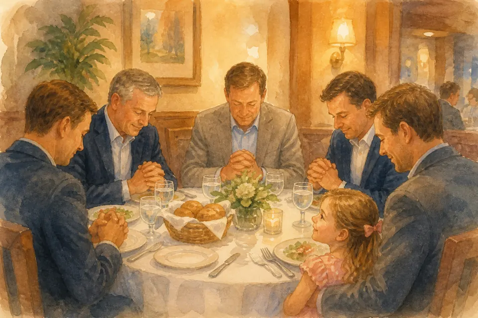
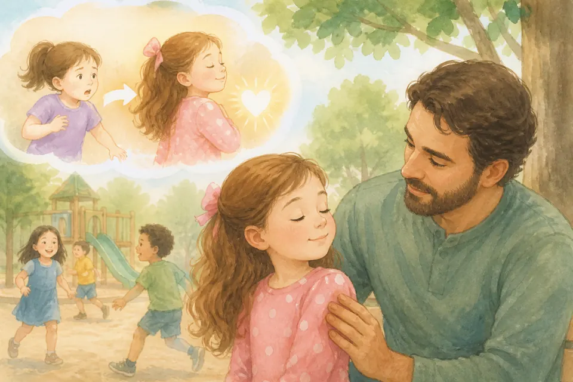
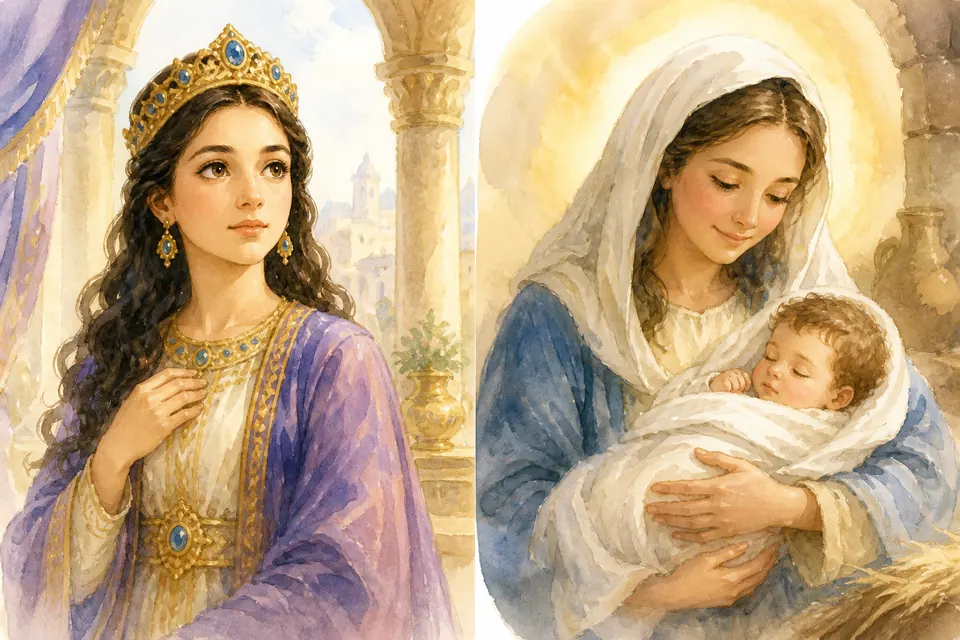
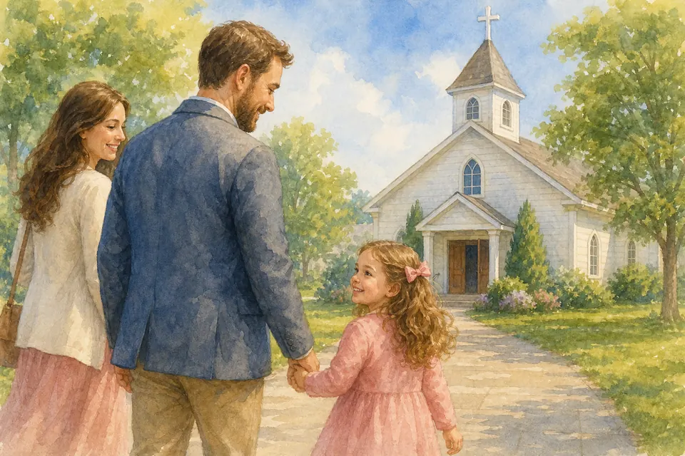

## В этой части

- [Глава 100. Священники](#ch-100)
- [Глава 101. Пастор](#ch-101)
- [Глава 102. Причастие](#ch-102)
- [Глава 103. Домашняя группа](#ch-103)
- [Глава 104. Смысл жизни](#ch-104)
- [Глава 105. Христианские встречи взрослых](#ch-105)
- [Глава 106. Подставить другую щёку](#ch-106)
- [Глава 107. Библейские девочки: Эсфирь и Мария](#ch-107)
- [Глава 208. Почему каждое воскресенье стоит ходить в церковь](#ch-208)

## Глава 100. Священники

{ loading=lazy }

*(Папа говорит уважительно и просто)*

В православном храме ты можешь увидеть **священника**. Он в особой одежде, молится, служит, благословляет людей, помогает им идти к Богу.

Священник — не «волшебник». Он человек, который служит Богу и людям. Мы относимся к нему с уважением — как к тому, кто посвятил жизнь церкви. А самый главный Священник для нас — Иисус: Он привёл нас к Отцу.

**📖 Стих из Библии:**
17. Повинуйтесь наставникам вашим и будьте покорны, ибо они неусыпно пекутся о душах ваших, как обязанные дать отчет;
Евреям 13:17 (Синодальный перевод)

**🗣 Поговорим:**
*Папа:* Почему важно уважать тех, кто служит в храме?
*(Дать дочке ответить)*

**🙏 Наша молитва:**
«Господь, научи меня уважать служителей и помнить, что Ты главный. Аминь.»

---

## Глава 101. Пастор

{ loading=lazy }

*(Папа улыбается, вспоминая церковь)*

В нашей протестантской церкви есть **пастор**. Он учит из Библии, молится с людьми, заботится о церкви, иногда смеётся с детьми и утешает грустных.

Пастор — не супергерой и не начальник вместо Бога. Он слуга: помогает нам слышать Иисуса. Мы молимся за пастора и слушаем с открытым сердцем. Если что‑то непонятно — можно спросить.

**📖 Стих из Библии:**
17. Повинуйтесь наставникам вашим и будьте покорны, ибо они неусыпно пекутся о душах ваших, как обязанные дать отчет;
Евреям 13:17 (Синодальный перевод)

**🗣 Поговорим:**
*Папа:* Чем пастор помогает нашей церкви?
*(Дать дочке ответить)*

**🙏 Наша молитва:**
«Иисус, благослови нашего пастора. Научи нас слушаться Твоего слова. Аминь.»

---

## Глава 102. Причастие

{ loading=lazy }

*(Папа говорит тихо и свято)*

**Причастие** (Вечеря Господня) — особое время в церкви. На столе может быть хлеб и чаша. В этот момент мы не думаем: «О, угощение». Мы вспоминаем Иисуса: Его тело и кровь, отданные за нас из любви. Хлеб и чаша напоминают о кресте, прощении и о том, как сильно Он нас любит.

Это не «перекус» и не церковная привычка «просто так». Это святое воспоминание и благодарность. Иногда маленьким детям сначала объясняют, что происходит, и учат смотреть на причастие с уважением — по правилам нашей церкви и вместе с родителями.

Если ты ещё не участвуешь, ты всё равно не «снаружи». Ты можешь тихо стоять или сидеть рядом, слушать, молиться в сердце и благодарить Иисуса: «Спасибо, что Ты меня любишь». Так сердце тоже учится подходить к святому не шумно, а с миром.

**📖 Стих из Библии:**
23. Ибо я от Самого Господа принял то, что и вам передал, что Господь Иисус в ту ночь, в которую предан был, взял хлеб 24. и, возблагодарив, преломил и сказал: примите, ядите, сие есть Тело Мое, за вас ломимое; сие творите в Мое воспоминание. 25. Также и чашу после вечери, и сказал: сия чаша есть новый завет в Моей Крови; сие творите, когда только будете пить, в Мое воспоминание.
1 Коринфянам 11:23-25 (Синодальный перевод)

**🗣 Поговорим:**
*Папа:* Что можно делать во время причастия, даже если ты пока только смотришь и учишься?
*(Дать дочке ответить)*

**🙏 Наша молитва:**
«Иисус, спасибо за Твою любовь и Твой крест. Научи меня помнить Тебя тихо, внимательно и с благодарностью. Аминь.»

---

## Глава 103. Домашняя группа

{ loading=lazy }

*(Папа показывает уютную гостиную)*

Иногда христиане собираются не только в большом зале, а **дома**: читают Библию, молятся, пьют чай, делятся радостью и трудностями. Это **домашняя группа** — маленькая церковь в квартире.

Там тепло, как в семье. Можно задать вопрос, попросить молитвы, обнять друзей по вере. Большая церковь и домашняя группа — друзья, не враги.

**📖 Стих из Библии:**
24. Будем внимательны друг ко другу, поощряя к любви и добрым делам; 25. не будем оставлять собрания своего, как есть у некоторых обычай; но будем увещевать друг друга, и тем более, чем более усматриваете приближение дня оного.
Евреям 10:24-25 (Синодальный перевод)

**🗣 Поговорим:**
*Папа:* Чем домашняя группа похожа на большую семью?
*(Дать дочке ответить)*

**🙏 Наша молитва:**
«Иисус, благослови нашу домашнюю группу и научи нас любить друг друга. Аминь.»

---

## Глава 104. Смысл жизни

{ loading=lazy }

*(Папа смотрит дочке в глаза серьёзно и радостно)*

Зачем мы живём? Не только чтобы есть конфеты и смотреть мультики. **Смысл жизни** — знать Бога, любить Иисуса, любить людей и делать добро, пока мы здесь.

Ты уже живёшь со смыслом, когда молишься, делишься, прощаешь, учишься. Взрослая «работа мечты» потом приложится. Сначала — сердце с Богом.

**📖 Стих из Библии:**
33. Ищите же прежде Царства Божия и правды Его, и это все приложится вам. 34. Итак не заботьтесь о завтрашнем дне, ибо завтрашний сам будет заботиться о своем: довольно для каждого дня своей заботы.
Матфея 6:33-34 (Синодальный перевод)

**🗣 Поговорим:**
*Папа:* Что для тебя значит «жить с Иисусом» уже сейчас?
*(Дать дочке ответить)*

**🙏 Наша молитва:**
«Бог, покажи мне смысл жизни с Тобой. Веди меня. Аминь.»

---

## Глава 105. Христианские встречи взрослых

{ loading=lazy }

*(Папа рассказывает как о празднике взрослых)*

Иногда взрослые христиане встречаются за ужином: едят вместе, благодарят Бога, рассказывают, как Иисус помогает честно работать, принимать решения и не забывать о добре.

Это не «просто ресторан». Это дружба людей, которые хотят, чтобы работа служила Богу и ближним. Иногда туда берут семьи — и маленькая девочка видит: вера нужна не только в церкви, но и в обычных взрослых делах.

**📖 Стих из Библии:**
20. ибо, где двое или трое собраны во имя Мое, там Я посреди них.
Матфея 18:20 (Синодальный перевод)

**🗣 Поговорим:**
*Папа:* Почему важно, чтобы взрослые на работе тоже помнили об Иисусе?
*(Дать дочке ответить)*

**🙏 Наша молитва:**
«Господь, благослови деловых людей, которые любят Тебя. Научи честности и добру в труде. Аминь.»

---

## Глава 106. Подставить другую щёку

{ loading=lazy }

*(Папа мягко касается своей щеки)*

Иисус сказал: если тебя ударили по щеке — подставь другую. Для пятилетки это значит: **не отвечай злом на зло**. Не мсти ударом за удар, обзывательством за обзывательство.

Это не «разреши себя бить и молчи». Если опасно — защищайся, уходи, зови взрослого. Но в обычной обиде мы выбираем мир вместо мести. Сила — остановиться.

**📖 Стих из Библии:**
38. Вы слышали, что сказано: око за око и зуб за зуб. 39. А Я говорю вам: не противься злому. Но кто ударит тебя в правую щеку твою, обрати к нему и другую;
Матфея 5:38-39 (Синодальный перевод)

**🗣 Поговорим:**
*Папа:* Что можно сделать вместо «ударить в ответ»?
*(Дать дочке ответить)*

**🙏 Наша молитва:**
«Иисус, научи меня не мстить и выбирать мир. Защити меня. Аминь.»

---

## Глава 107. Библейские девочки: Эсфирь и Мария

{ loading=lazy }

*(Папа открывает две картинки-истории)*

В Библии есть смелые девочки и женщины.
**Эсфирь** — царица, которая храбро заступилась за свой народ.
**Мария** — мама Иисуса. Она сказала Богу: «Пусть будет по слову Твоему», хотя было страшно и удивительно.

Ты тоже можешь быть смелой и доверяющей Богу — в садике, дома, в молитве.

**📖 Стих из Библии:**
38. Тогда Мария сказала: се, Раба Господня; да будет Мне по слову твоему. И отошел от Нее Ангел.
Луки 1:38 (Синодальный перевод)

**🗣 Поговорим:**
*Папа:* Чем тебе ближе Эсфирь или Мария — смелость или доверие?
*(Дать дочке ответить)*

**🙏 Наша молитва:**
«Бог, расти во мне смелость Эсфири и доверие Марии. Аминь.»

---

## Глава 208. Почему каждое воскресенье стоит ходить в церковь

{ loading=lazy }

*(Папа берёт дочку за руку, будто уже идёте к церкви)*

Иногда утром в воскресенье хочется ещё поспать. Или поиграть. Или сказать: «А можно в другой раз?» Но знаешь, зачем мы всё‑таки идём?

Церковь — это как семейный обед у Бога. Если приходить только раз в год, можно забыть вкус и тепло. А если приходить снова и снова — сердце учится: «Я дома. Я не одна. Иисус рядом. Здесь моя большая Божья семья.»

Каждое воскресенье мы вспоминаем важное: Иисус жив. Мы поём Ему, слушаем Библию, молимся, обнимаем друзей по вере. Это не «скучная обязанность», как чистить зубы только для галочки. Это радость, которая растёт привычкой — как любимая песня, которую поёшь снова и снова.

Даже если служба кажется долгой, даже если бантик съехал, даже если ты чуть‑чуть заскучала — ты всё равно нужна там. Твоё маленькое «аминь», твоя улыбка, твоя тихая молитва — часть праздника. Бог радуется, когда Его дочка приходит.

**📖 Стих из Библии:**
24. Будем внимательны друг ко другу, поощряя к любви и добрым делам; 25. не будем оставлять собрания своего, как есть у некоторых обычай; но будем увещевать друг друга, и тем более, чем более усматриваете приближение дня оного.
Евреям 10:24-25 (Синодальный перевод)

**🗣 Поговорим:**
*Папа:* Что тебе помогает радоваться воскресной церкви — песни, друзья, история из Библии?
*(Дать дочке ответить)*

**🙏 Наша молитва:**
«Иисус, спасибо за воскресенье и за церковь. Помоги нам приходить с радостью и любить Твою семью. Аминь.»
