## В этой части

- [Глава 108. «Я сама!» и принять помощь](#ch-108)
- [Глава 109. Правила в машине: ремень](#ch-109)
- [Глава 110. Незнакомые ягоды и грибы](#ch-110)
- [Глава 111. Если идёт кровь из коленки](#ch-111)
- [Глава 112. Добро не только напоказ](#ch-112)
- [Глава 113. Уметь сказать: «мне страшно»](#ch-113)
- [Глава 114. Благодарить за замечание без обиды](#ch-114)
- [Глава 115. Если потерялся телефон родителей](#ch-115)
- [Глава 116. Не отходить от семьи на парковке](#ch-116)
- [Глава 117. Осторожность с лестницей, скользким полом, льдом](#ch-117)
- [Глава 118. Как мягко сказать: «я сейчас занята»](#ch-118)
- [Глава 119. Как вернуть чужую вещь, если случайно испортила](#ch-119)
- [Глава 120. Как дружить, если вы разные по характеру](#ch-120)
- [Глава 121. Как слушать Библию, когда устала](#ch-121)
- [Глава 122. Почему Бог любит нас не за идеальность](#ch-122)
- [Глава 123. Радость быть маленькой сейчас](#ch-123)
- [Глава 124. Красота послушного и свободного сердца](#ch-124)
- [Глава 125. Как расти в мудрости, а не только в возрасте](#ch-125)
- [Глава 126. Благословение на ночь](#ch-126)

## Глава 108. «Я сама!» и принять помощь

*(Папа протягивает руку — и ждёт согласия)*

«Я сама!» — прекрасные слова роста. Но иногда замок слишком тугой, банка не открывается, сердце тяжёлое. Тогда сила — **принять помощь**.

Просить помощи — не слабость. Даже взрослые просят. Иисус тоже принимал служение друзей. «Помоги, пожалуйста» — умные слова.

**📖 Стих из Библии:**
2. Носите бремена друг друга, и таким образом исполните закон Христов.
Галатам 6:2 (Синодальный перевод)

**🗣 Поговорим:**
*Папа:* Когда тебе легко сказать «я сама», а когда стоит попросить помощь?
*(Дать дочке ответить)*

**🙏 Наша молитва:**
«Господь, научи меня и стараться самой, и принимать помощь. Аминь.»

---

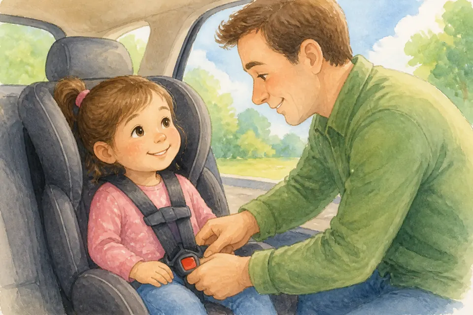{ loading=lazy }

## Глава 109. Правила в машине: ремень

*(Папа щёлкает ремень — щёлк!)*

В машине правило простое и железное: **ремень**. Сидим на своём месте, не мешаем водителю, не открываем дверь на ходу.

Ремень — объятие безопасности. Даже короткая поездка. Мы любим жизнь, которую дал Бог — поэтому пристёгиваемся.

**📖 Стих из Библии:**
3. Благоразумный видит беду, и укрывается; а неопытные идут вперед, и наказываются.
Притчи 22:3 (Синодальный перевод)

**🗣 Поговорим:**
*Папа:* Почему ремень — это любовь, а не «нудность»?
*(Дать дочке ответить)*

**🙏 Наша молитва:**
«Господь, храни нас в дороге. Научи слушаться правил безопасности. Аминь.»

---

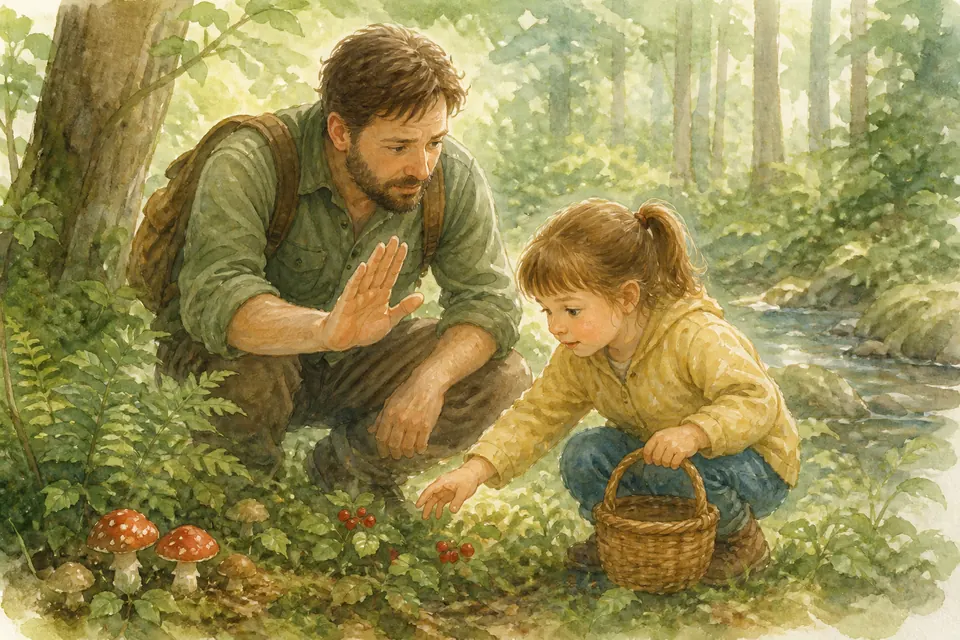{ loading=lazy }

## Глава 110. Незнакомые ягоды и грибы

*(Папа качает головой у куста)*

В лесу и у дороги бывают красивые ягоды и грибы. Красивое ≠ съедобное. Правило: **не пробуем сами**. Только то, что дали мама или папа.

Если очень хочется — спроси. Лучше спросить сто раз, чем один раз отравиться. Мудрость бережёт животик.

**📖 Стих из Библии:**
3. Благоразумный видит беду, и укрывается; а неопытные идут вперед, и наказываются.
Притчи 22:3 (Синодальный перевод)

**🗣 Поговорим:**
*Папа:* Что сказать, если подруга предлагает «лесную ягодку»?
*(Дать дочке ответить)*

**🙏 Наша молитва:**
«Бог, научи меня осторожности. Не буду есть незнакомое. Аминь.»

---

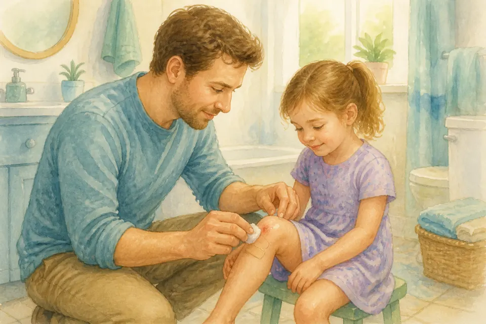{ loading=lazy }

## Глава 111. Если идёт кровь из коленки

*(Папа спокойно достаёт пластырь)*

Упала — коленка в крови. Можно заплакать. Это нормально. Потом спокойно:
1. Позвать взрослого.
2. Промыть.
3. Пластырь.
4. Посидеть.

Кровь пугает, но часто ранка маленькая. Паника не лечит. Спокойствие и помощь — лечат. Я рядом.

**📖 Стих из Библии:**
34. и, подойдя, перевязал ему раны, возливая масло и вино; и, посадив его на своего осла, привез его в гостиницу и позаботился о нем;
Луки 10:34 (Синодальный перевод)

**🗣 Поговорим:**
*Папа:* Какой первый шаг, если разбила коленку?
*(Дать дочке ответить)*

**🙏 Наша молитва:**
«Иисус, когда мне больно — будь рядом и дай спокойствие. Аминь.»

---

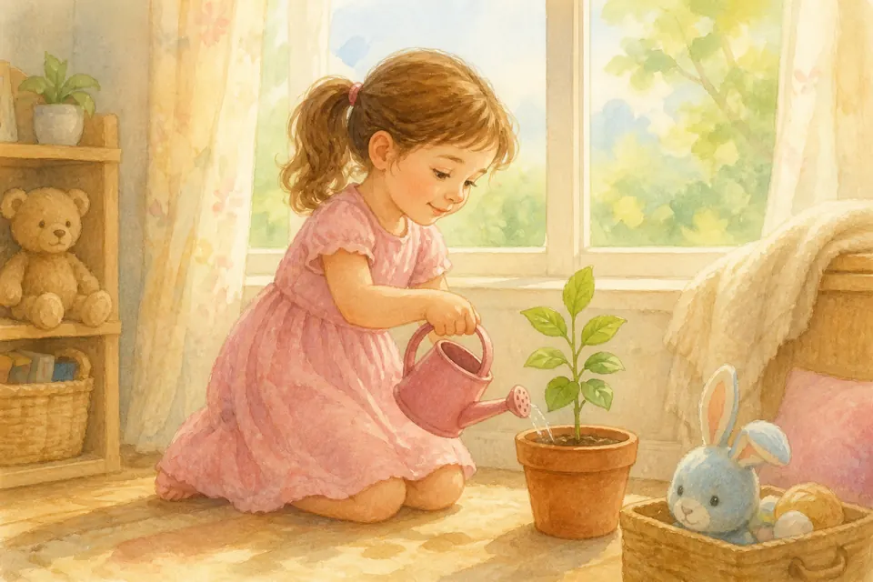{ loading=lazy }

## Глава 112. Добро не только напоказ

*(Папа шепчет, будто делится секретом)*

Иногда хочется сделать добро так, чтобы все увидели и сказали: «Ой, какая хорошая!» Но настоящее добро часто тихое. Как спрятанный цветок.

Можно помочь маме, когда никто не смотрит. Можно поделиться, даже если никто не хлопает в ладоши. Бог видит добро втайне. Его улыбка важнее аплодисментов.

**📖 Стих из Библии:**
3. У тебя же, когда творишь милостыню, пусть левая рука твоя не знает, что делает правая, 4. чтобы милостыня твоя была втайне; и Отец твой, видящий тайное, воздаст тебе явно.
Матфея 6:3-4 (Синодальный перевод)

**🗣 Поговорим:**
*Папа:* Какое доброе дело можно сделать сегодня так, чтобы почти никто не заметил?
*(Дать дочке ответить)*

**🙏 Наша молитва:**
«Иисус, научи меня делать добро от сердца, а не ради похвалы. Аминь.»

---

{ loading=lazy }

## Глава 113. Уметь сказать: «мне страшно»

*(Папа берёт дочку за руку и кивает)*

Страшно бывает всем: детям и взрослым. Страшно — не значит «ты слабая». Страшно — значит сердце просит помощи.

Можно честно сказать: «Мне страшно». Маме. Папе. Богу. Это смелые слова. Они открывают дверь объятию, молитве и свету. Прятать страх в кармане тяжелее, чем назвать его вслух.

**📖 Стих из Библии:**
4. Когда я в страхе, на Тебя я уповаю. 5. В Боге восхвалю я слово Его; на Бога уповаю, не боюсь; что сделает мне плоть?
Псалом 55:4-5 (Синодальный перевод)

**🗣 Поговорим:**
*Папа:* Когда тебе бывает страшно — и кому ты можешь это сказать?
*(Дать дочке ответить)*

**🙏 Наша молитва:**
«Иисус, когда мне страшно, помоги сказать это вслух и держаться за Твою руку. Аминь.»

---

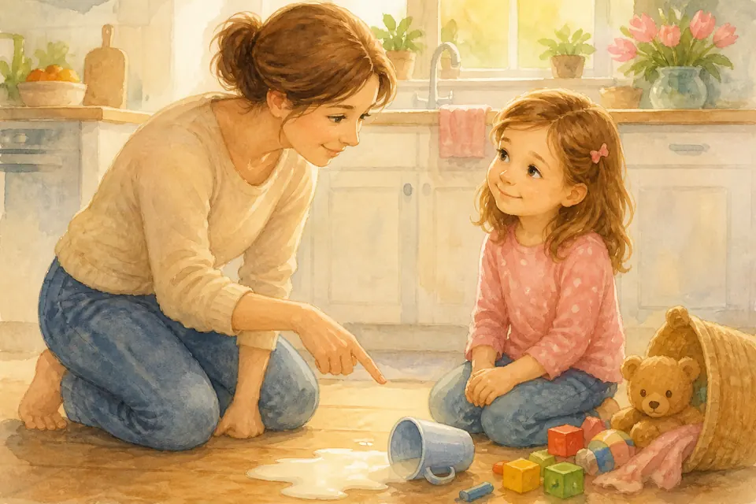{ loading=lazy }

## Глава 114. Благодарить за замечание без обиды

*(Папа мягко поправляет воображаемую игрушку и улыбается)*

Замечание — как зеркальце: иногда показывает, где можно стать лучше. Сначала внутри может кольнуть: «Ой!» Но потом можно сказать: «Спасибо, я поняла».

Обида закрывает уши. Благодарность открывает рост. Мама, папа, воспитатель замечают не чтобы тебя раздавить — а чтобы помочь. Это тоже любовь.

**📖 Стих из Библии:**
16. Всегда радуйтесь. 17. Непрестанно молитесь. 18. За все благодарите: ибо такова о вас воля Божия во Христе Иисусе.
1 Фессалоникийцам 5:16-18 (Синодальный перевод)

**🗣 Поговорим:**
*Папа:* Как можно ответить на замечание без обиды?
*(Дать дочке ответить)*

**🙏 Наша молитва:**
«Господь, научи меня принимать замечания с мягким сердцем. Аминь.»

---

{ loading=lazy }

## Глава 115. Если потерялся телефон родителей

*(Папа показывает воображаемый телефон и кладёт его «на место»)*

Телефон мамы или папы — важная вещица. Им звонят, им ищут помощь. Если он потерялся дома — не прячь, не играй в «секрет». Скажи сразу: «Телефон пропал».

Вместе поищем: карман, диван, сумка, стол. Если нашли — отдай. Если не нашли — взрослые знают, что делать дальше. Твоя задача — сказать честно и помочь искать, а не винить себя.

**📖 Стих из Библии:**
7. Господь сохранит тебя от всякого зла; сохранит душу твою Господь. 8. Господь будет охранять выхождение твое и вхождение твое отныне и вовек.
Псалом 120:7-8 (Синодальный перевод)

**🗣 Поговорим:**
*Папа:* Что сделать первым делом, если пропал телефон мамы или папы?
*(Дать дочке ответить)*

**🙏 Наша молитва:**
«Бог, помоги мне быть честной и спокойной, если пропала важная вещь. Аминь.»

---

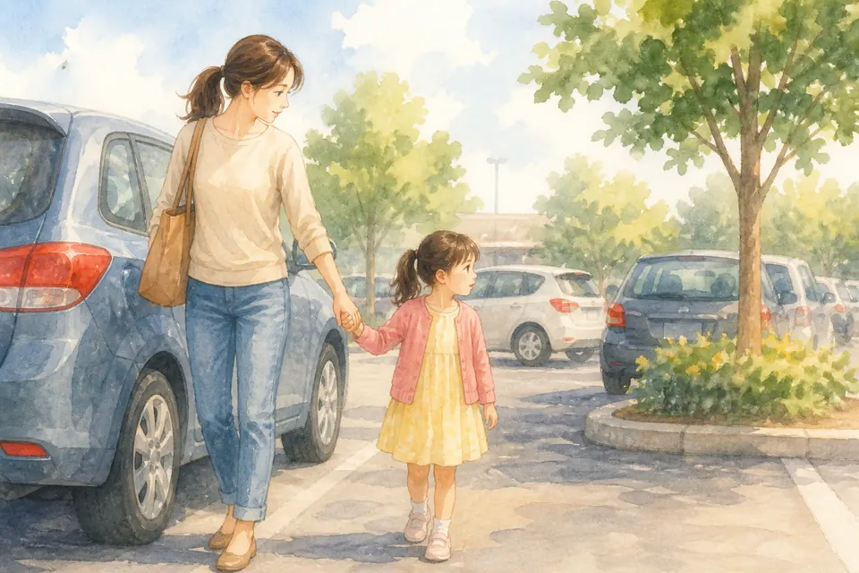{ loading=lazy }

## Глава 116. Не отходить от семьи на парковке

*(Папа крепко держит за руку и смотрит по сторонам)*

Парковка — место машин. Машины большие, ездят тихо и быстро. Там нельзя бегать между рядами и «чуть‑чуть отойти посмотреть».

Правило простое: держимся за руку или идём рядом с мамой и папой. Даже если увидела красивую машинку или шарик — сначала скажи, не убегай. Рядом с семьёй — безопаснее всего.

**📖 Стих из Библии:**
3. Благоразумный видит беду, и укрывается; а неопытные идут вперед, и наказываются.
Притчи 22:3 (Синодальный перевод)

**🗣 Поговорим:**
*Папа:* Почему на парковке важно не отходить от семьи?
*(Дать дочке ответить)*

**🙏 Наша молитва:**
«Господь, научи меня держаться рядом с семьёй там, где опасно. Аминь.»

---

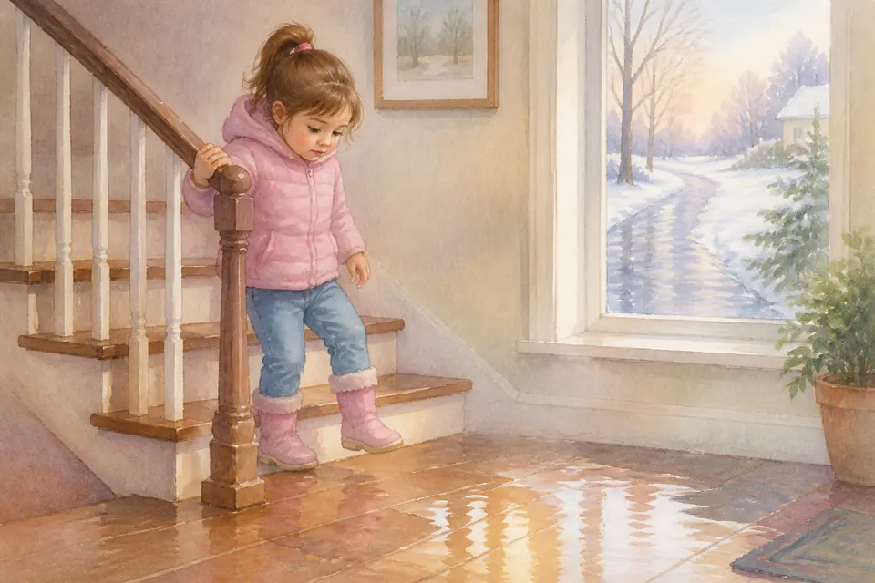{ loading=lazy }

## Глава 117. Осторожность с лестницей, скользким полом, льдом

*(Папа показывает осторожные шажочки)*

Лестница, мокрый пол, лёд зимой — как хитрые ловушки для ножек. Там не место гонкам и прыжкам «по‑супергеройски».

Держись за перила. Шагай спокойно. Если скользко — скажи взрослому. Упасть больно, а осторожность — умная забота о теле, которое Бог тебе подарил.

**📖 Стих из Библии:**
3. Благоразумный видит беду, и укрывается; а неопытные идут вперед, и наказываются.
Притчи 22:3 (Синодальный перевод)

**🗣 Поговорим:**
*Папа:* Где тебе нужно быть особенно осторожной ногами?
*(Дать дочке ответить)*

**🙏 Наша молитва:**
«Бог, научи меня осторожным шагам и беречь своё тело. Аминь.»

---

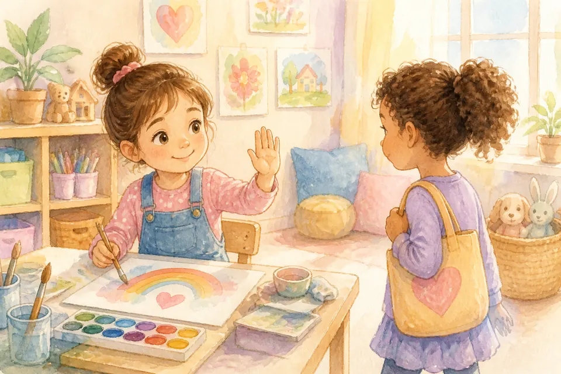{ loading=lazy }

## Глава 118. Как мягко сказать: «я сейчас занята»

*(Папа показывает ладонь «стоп» — но мягко, с улыбкой)*

Иногда подруга зовёт играть, а ты уже рисуешь, строишь или отдыхаешь. Можно не кричать и не прятаться. Можно мягко сказать: «Я сейчас занята. Давай чуть позже?»

Это не злость. Это честность и уважение к своему делу и к другу. Мягкое «сейчас занята» лучше, чем грубое «отстань» или притворная улыбка, когда внутри уже нет сил.

**📖 Стих из Библии:**
1. Кроткий ответ отвращает гнев, а оскорбительное слово возбуждает ярость.
Притчи 15:1 (Синодальный перевод)

**🗣 Поговорим:**
*Папа:* Как сказать «я занята» так, чтобы другу не было больно?
*(Дать дочке ответить)*

**🙏 Наша молитва:**
«Иисус, научи меня говорить правду мягко и без грубости. Аминь.»

---

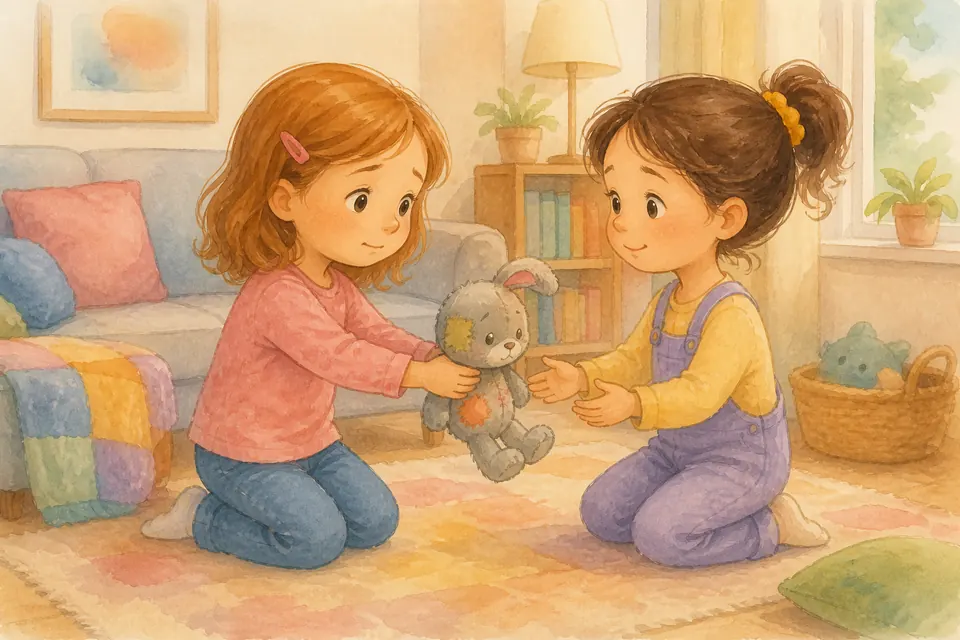{ loading=lazy }

## Глава 119. Как вернуть чужую вещь, если случайно испортила

*(Папа держит сломанную игрушку бережно, без крика)*

Случается: взяла чужую куклу, книжку или фломастер — и вдруг сломалось, порвалось, испачкалось. Хочется спрятать. Но спрятанное растёт в комок в животе.

Лучше подойти и сказать: «Прости, я случайно испортила. Вот вещь». Потом вместе со взрослыми решить, как помочь: починить, заменить, извиниться. Честность чинит дружбу быстрее, чем прятки.

**📖 Стих из Библии:**
31. И как хотите, чтобы с вами поступали люди, так и вы поступайте с ними.
Луки 6:31 (Синодальный перевод)

**🗣 Поговорим:**
*Папа:* Что сказать, если случайно испортила чужую вещь?
*(Дать дочке ответить)*

**🙏 Наша молитва:**
«Господь, дай мне смелость честно вернуть и попросить прощения. Аминь.»

---

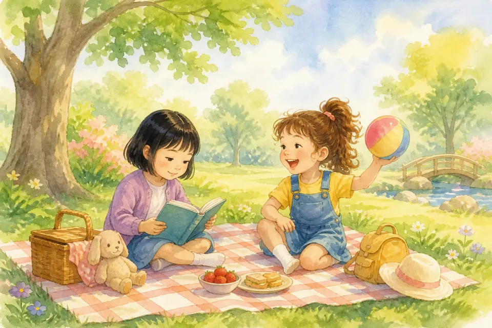{ loading=lazy }

## Глава 120. Как дружить, если вы разные по характеру

*(Папа показывает два разных карандаша, лежащих рядом)*

Одна подруга тихая, другая громкая. Одна любит кукол, другая — бегать. Вы разные — и это не ошибка. Бог любит разноцветные сердца.

Дружить по‑разному можно так: иногда твоя игра, иногда её; иногда вместе помолчать, иногда вместе посмеяться. Не надо переделывать друга в копию себя. Разность — не враг дружбы, если есть доброта.

**📖 Стих из Библии:**
7. Посему принимайте друг друга, как и Христос принял вас в славу Божию.
Римлянам 15:7 (Синодальный перевод)

**🗣 Поговорим:**
*Папа:* Чем ты и твоя подруга разные — и что в этом хорошего?
*(Дать дочке ответить)*

**🙏 Наша молитва:**
«Бог, научи меня дружить с теми, кто не совсем как я. Аминь.»

---

{ loading=lazy }

## Глава 121. Как слушать Библию, когда устала

*(Папа читает тихо, почти как колыбельную)*

Иногда глаза клеятся, а папа открывает Библию. Не надо притворяться бодрой солдаткой. Можно сказать: «Я устала». И всё равно услышать чуть‑чуть.

Можно лечь рядом, слушать шёпотом, смотреть одну картинку, запомнить одно слово. Бог не требует от усталой девочки длинного урока. Он рад даже маленькому внимательному «я здесь».

**📖 Стих из Библии:**
28. Придите ко Мне все труждающиеся и обремененные, и Я успокою вас; 29. возьмите иго Мое на себя и научитесь от Меня, ибо Я кроток и смирен сердцем, и найдете покой душам вашим; 30. ибо иго Мое благо, и бремя Мое легко.
Матфея 11:28-30 (Синодальный перевод)

**🗣 Поговорим:**
*Папа:* Как слушать Божье слово, когда совсем хочется спать?
*(Дать дочке ответить)*

**🙏 Наша молитва:**
«Господь, даже когда я устала, коснись моего сердца Твоим словом. Аминь.»

---

{ loading=lazy }

## Глава 122. Почему Бог любит нас не за идеальность

*(Папа обнимает даже после «ой, ошиблась»)*

Иногда кажется: Бог любит только послушных, чистых, умных, без ошибок. Но это неправда. Бог любит тебя, потому что ты Его ребёнок — а не потому что ты идеальная.

Идеальность — как блестящая игрушка в витрине. А любовь Бога — как объятие папы после падения. Он радуется росту, прощает, поднимает. Ты любима уже сейчас.

**📖 Стих из Библии:**
8. Но Бог Свою любовь к нам доказывает тем, что Христос умер за нас, когда мы были еще грешниками.
Римлянам 5:8 (Синодальный перевод)

**🗣 Поговорим:**
*Папа:* Почему важно знать, что Бог любит тебя даже с ошибками?
*(Дать дочке ответить)*

**🙏 Наша молитва:**
«Отец, спасибо, что любишь меня не за идеальность, а потому что я Твоя. Аминь.»

---

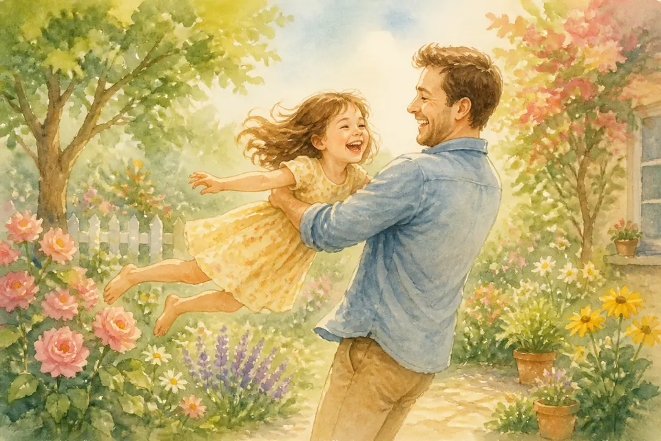{ loading=lazy }

## Глава 123. Радость быть маленькой сейчас

*(Папа поднимает дочку на руки — легко и весело)*

Быть маленькой — это уметь сидеть на руках, играть в куклы без стыда, верить в чудеса, задавать сто «почему?», прятаться под одеялом и смеяться звонко.

Большие тоже радуются — но у пяти лет есть своя яркая радость. Не выбрасывай её раньше времени. Сегодня ты маленькая — и это прекрасно.

**📖 Стих из Библии:**
51. И Он пошел с ними и пришел в Назарет; и был в повиновении у них. И Матерь Его сохраняла все слова сии в сердце Своем. 52. Иисус же преуспевал в премудрости и возрасте и в любви у Бога и человеков.
Луки 2:51-52 (Синодальный перевод)

**🗣 Поговорим:**
*Папа:* Что тебе особенно нравится в том, что ты ещё маленькая?
*(Дать дочке ответить)*

**🙏 Наша молитва:**
«Бог, спасибо за радость быть маленькой прямо сейчас. Аминь.»

---

{ loading=lazy }

## Глава 124. Красота послушного и свободного сердца

*(Папа рисует в воздухе сердце и открытую дверь)*

Послушание — не клетка. Настоящее послушание — когда сердце свободно выбирает доверие: «Я слушаю, потому что люблю и верю».

Свободное сердце не бунтует назло и не притворяется. Оно мягкое и честное. Такая красота сильнее любого наряда: послушная и свободная одновременно — как дочь, которая держит папу за руку и радостно идёт.

**📖 Стих из Библии:**
15. Если любите Меня, соблюдите Мои заповеди.
Иоанна 14:15 (Синодальный перевод)

**🗣 Поговорим:**
*Папа:* Чем послушание из любви отличается от послушания из страха?
*(Дать дочке ответить)*

**🙏 Наша молитва:**
«Иисус, сделай моё сердце послушным и свободным в любви. Аминь.»

---

{ loading=lazy }

## Глава 125. Как расти в мудрости, а не только в возрасте

*(Папа указывает на голову и на сердце)*

Каждый день ты становишься чуть старше. Но мудрость растёт не сама, как волосы. Мудрость растёт, когда ты слушаешь, думаешь, прощаешь, выбираешь добро, учишься на ошибках.

Можно вырасти высокой и всё равно остаться капризной. А можно уже в пять лет растить мудрое сердце: говорить правду, быть доброй, просить помощи, благодарить. Возраст считает годы. Мудрость считает выборы.

**📖 Стих из Библии:**
51. И Он пошел с ними и пришел в Назарет; и был в повиновении у них. И Матерь Его сохраняла все слова сии в сердце Своем. 52. Иисус же преуспевал в премудрости и возрасте и в любви у Бога и человеков.
Луки 2:51-52 (Синодальный перевод)

**🗣 Поговорим:**
*Папа:* Какой мудрый выбор ты можешь сделать уже сегодня?
*(Дать дочке ответить)*

**🙏 Наша молитва:**
«Господь, расти во мне мудрость быстрее капризов. Аминь.»

---

{ loading=lazy }

## Глава 126. Благословение на ночь

*(Папа кладёт руку на голову или плечо дочки)*

Моя любимая девочка, ты драгоценна для меня и для Бога.
Пусть Господь хранит твоё сердце, даёт мудрость, радость и смелость.
Пусть ты растёшь в любви к Иисусу, в уважении к людям и в верности истине.

Что бы ни случилось завтра — я рядом. И Небесный Отец ещё ближе.

**📖 Стих из Библии:**
24. Да благословит тебя Господь и сохранит тебя! 25. Да призрит на тебя Господь светлым лицем Своим и помилует тебя! 26. Да обратит Господь лице Свое на тебя и даст тебе мир!
Числа 6:24-26 (Синодальный перевод)

**🗣 Поговорим:**
*Папа:* Давай скажем друг другу: «Я тебя люблю».
*(Обняться)*

**🙏 Наша молитва:**
«Господь Иисус, спасибо за нашу семью. Научи нас любить Тебя и людей каждый день. Храни нашу дочку. Аминь.»
