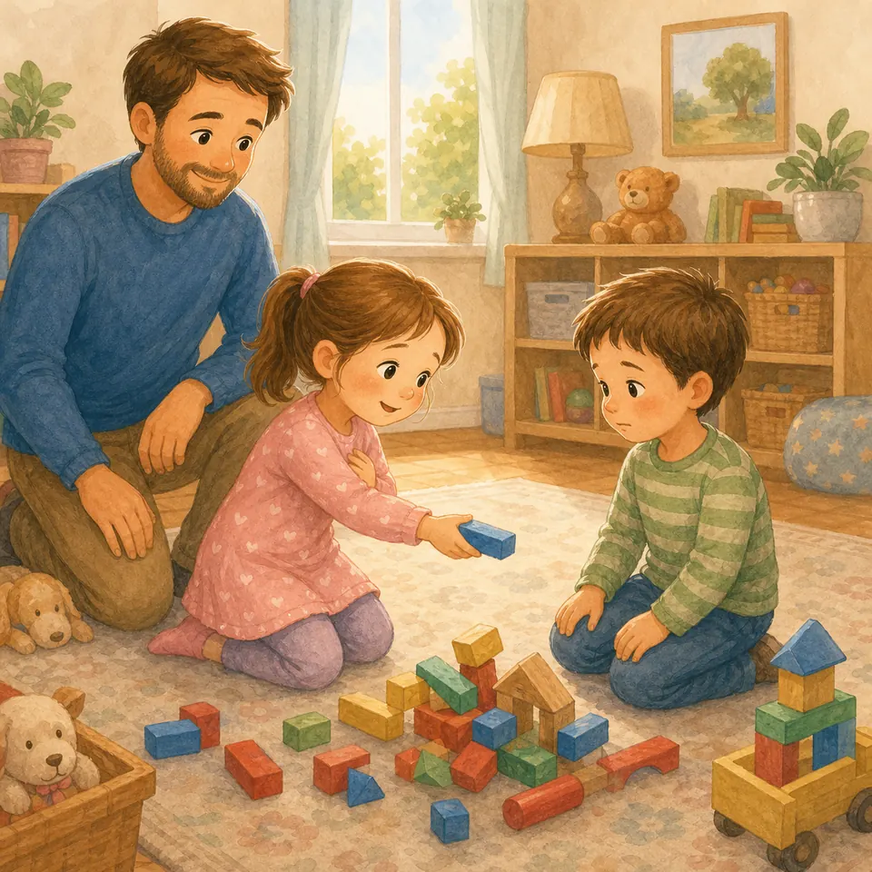
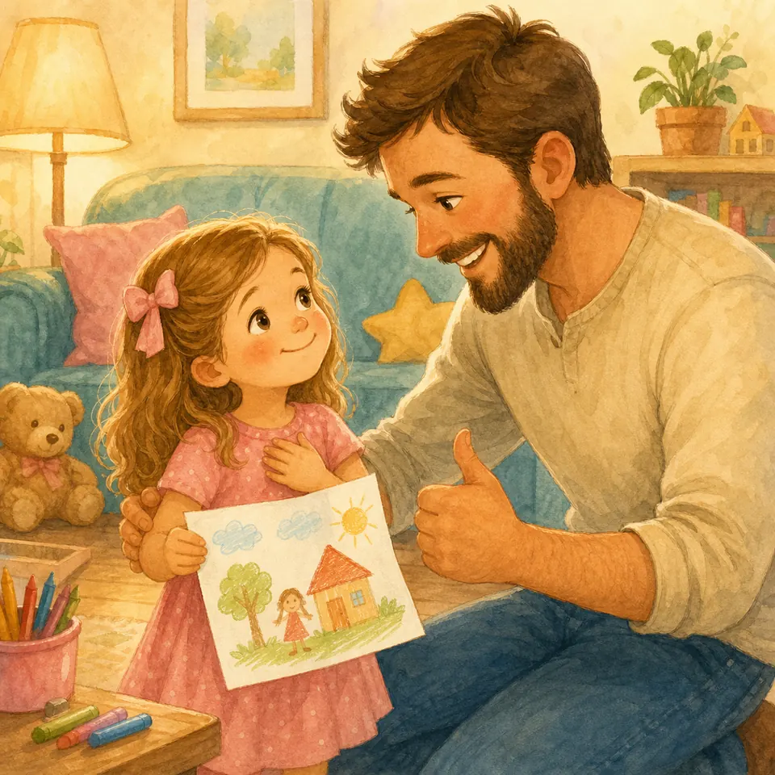
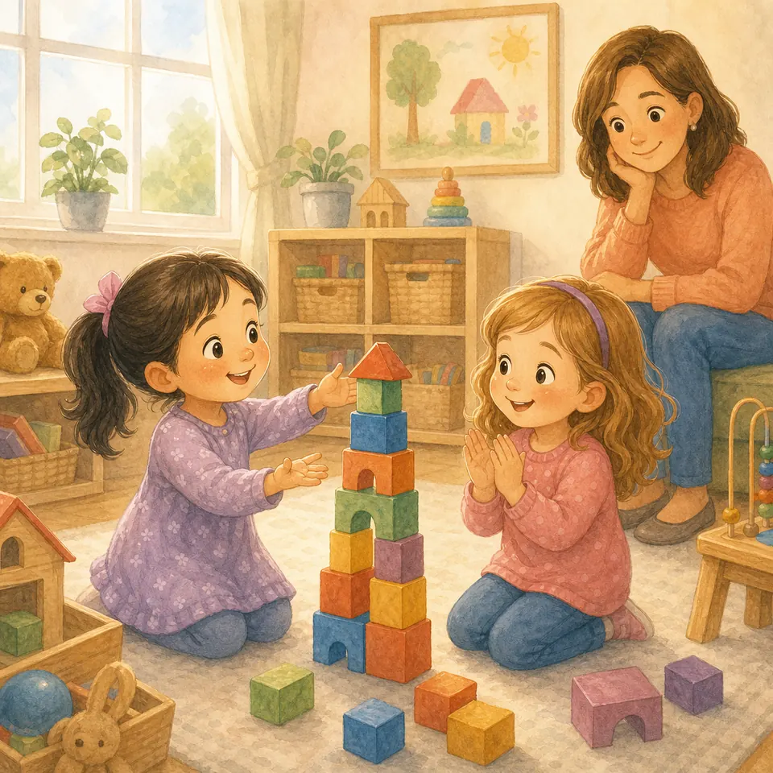
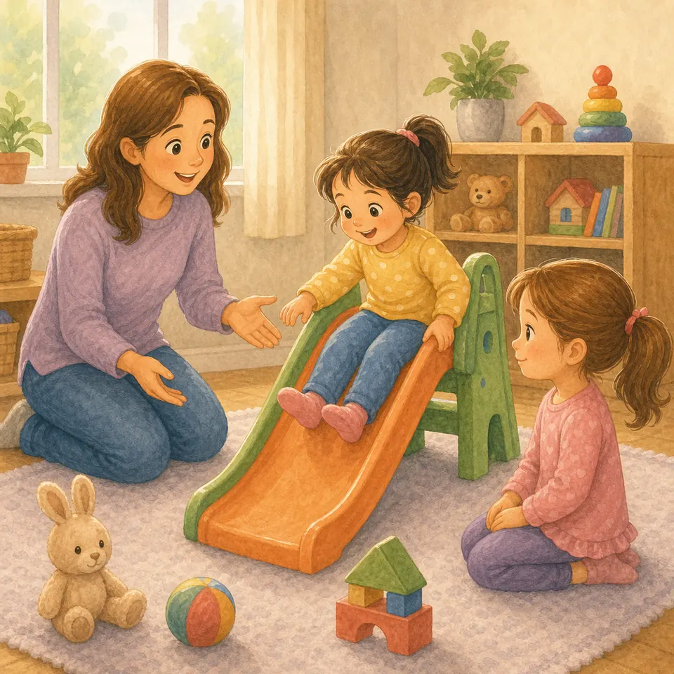
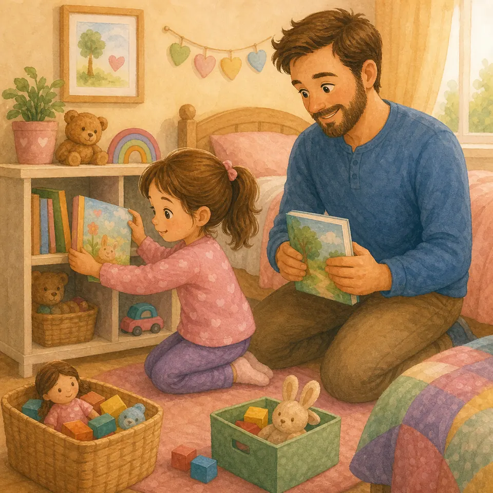
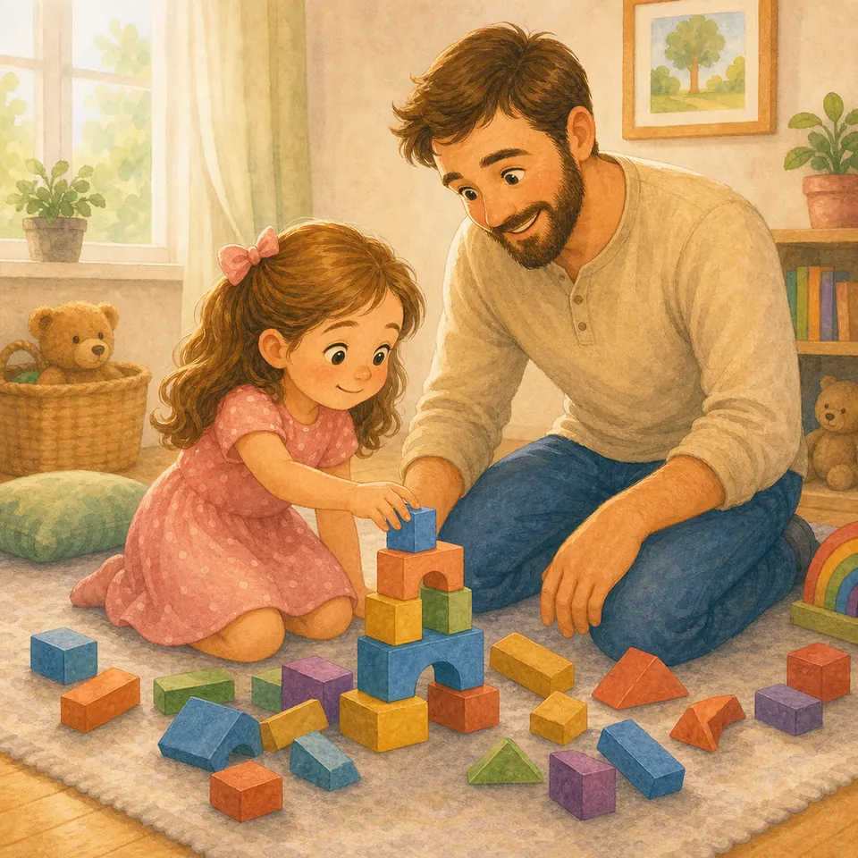
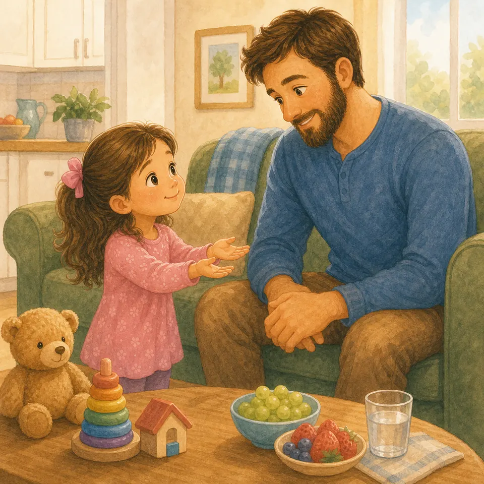
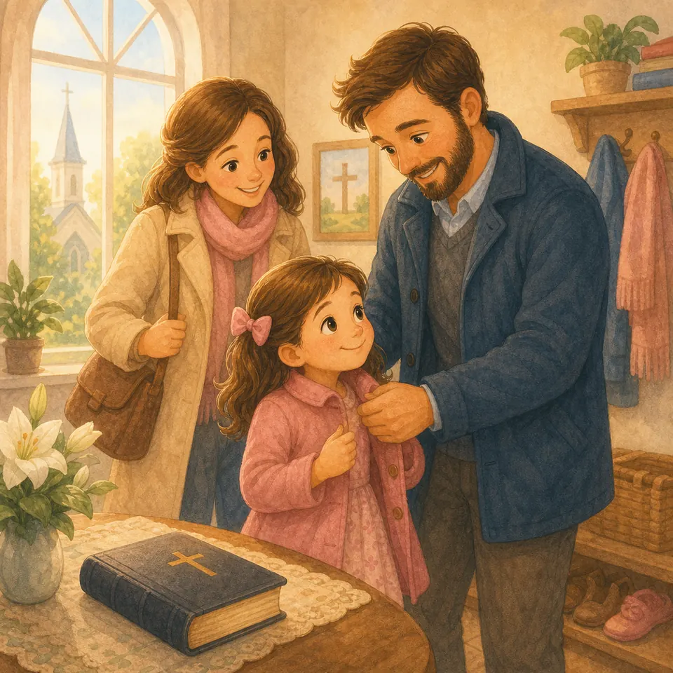

## В этой части

- [Глава 127. Когда мама или папа уходят и возвращаются](#ch-127)
- [Глава 128. Можно ли не обниматься?](#ch-128)
- [Глава 129. Туалет, стыд и чистота](#ch-129)
- [Глава 130. Как просить прощения по-настоящему](#ch-130)
- [Глава 131. Когда тебя хвалят](#ch-131)
- [Глава 132. Когда другой лучше умеет](#ch-132)
- [Глава 133. Делиться и ждать своей очереди](#ch-133)
- [Глава 134. Бережность к вещам](#ch-134)
- [Глава 135. Когда что-то не получилось](#ch-135)
- [Глава 136. Как говорить «можно мне?»](#ch-136)
- [Глава 137. Маленькая тишина](#ch-137)
- [Глава 138. Воскресенье — особенный день](#ch-138)

## Глава 127. Когда мама или папа уходят и возвращаются

*(Папа показывает дверь и улыбается спокойно)*

Иногда мама уходит в магазин. Иногда папа идёт на работу. Иногда в садике надо сказать: «Пока-пока» — и сердечко вдруг сжимается, будто маленький кулачок.

Но любовь не остаётся только там, где видны лица. Мама любит тебя, когда она за дверью. Папа любит тебя, когда он далеко. Бог видит нас всех сразу и помогает ждать возвращения без паники.

Можно помахать рукой, обнять крепко, сказать: «Я буду ждать». А потом играть, кушать, спать, слушать воспитателя. Время пройдёт — и дверь снова откроется.

**📖 Стих из Библии:**
9. Вот Я повелеваю тебе: будь тверд и мужествен, не страшись и не ужасайся; ибо с тобою Господь Бог твой везде, куда ни пойдешь.
Иисус Навин 1:9 (Синодальный перевод)

**🗣 Поговорим:**
*Папа:* Что поможет тебе помнить: «меня любят и за мной вернутся»?
*(Дать дочке ответить)*

**🙏 Наша молитва:**
«Господь, помоги мне спокойно ждать маму и папу. Спасибо, что Ты рядом всегда. Аминь.»

---

{ loading=lazy }

## Глава 128. Можно ли не обниматься?

*(Папа раскрывает ладони, будто говорит: «можно выбрать»)*

Объятия бывают тёплыми, как плед. Но иногда тебе не хочется обниматься. И это можно сказать спокойно: «Я сейчас не хочу». Можно помахать рукой, улыбнуться, сказать «здравствуйте» или дать пять.

Твоё тело — Божий подарок. Мы не грубим людям, но и не отдаём объятия через силу. Даже если это знакомый взрослый или родственник, ты можешь быть вежливой и честной.

Добрая девочка не обязана всем нравиться своим телом. Добрая девочка учится уважать себя и других.

**📖 Стих из Библии:**
12. Итак во всем, как хотите, чтобы с вами поступали люди, так поступайте и вы с ними.
Матфея 7:12 (Синодальный перевод)

**🗣 Поговорим:**
*Папа:* Как можно вежливо поздороваться без объятия?
*(Дать дочке ответить)*

**🙏 Наша молитва:**
«Бог, спасибо за моё тело. Научи меня быть доброй и смелой говорить правду. Аминь.»

---

{ loading=lazy }

## Глава 129. Туалет, стыд и чистота

*(Папа говорит просто, без смущения)*

Туалет — обычная часть жизни. Бог создал тело мудро, и телу нужно освобождаться, мыться, переодеваться, быть чистым. В этом нет ничего смешного и ничего стыдного.

Но есть вещи личные. В туалете закрывают дверь. После туалета моют руки. Если нужна помощь — можно позвать маму или папу. Если одежда испачкалась, это не конец света: мы спокойно переоденемся и всё исправим.

Чистота — не повод бояться ошибки. Это тихая забота о теле, которое Бог подарил.

**📖 Стих из Библии:**
40. Только все должно быть благопристойно и чинно.
1 Коринфянам 14:40 (Синодальный перевод)

**🗣 Поговорим:**
*Папа:* Что мы делаем после туалета?
*(Дать дочке ответить)*

**🙏 Наша молитва:**
«Господь, спасибо за моё тело. Помоги мне заботиться о чистоте спокойно и без стыда. Аминь.»

---

{ loading=lazy }

## Глава 130. Как просить прощения по-настоящему

*(Папа кладёт руку на сердце)*

Иногда слово «прости» вылетает быстро-быстро, как мячик: «Прости!» — и сразу хочется бежать дальше. Но настоящее прощение не торопится.

Сначала мы замечаем: «Я сделала больно». Потом говорим: «Прости меня». Потом, если можно, исправляем: поднять игрушку, принести салфетку, вернуть место, обнять — если другой человек хочет объятие.

Бог учит нас не только говорить красивые слова, но и делать сердце мягким. Настоящее «прости» похоже на маленький мостик после ссоры.

**📖 Стих из Библии:**
32. Но будьте друг ко другу добры, сострадательны, прощайте друг друга, как и Бог во Христе простил вас.
Ефесянам 4:32 (Синодальный перевод)

**🗣 Поговорим:**
*Папа:* Что можно сделать после слова «прости», чтобы исправить ошибку?
*(Дать дочке ответить)*

**🙏 Наша молитва:**
«Иисус, научи меня просить прощения честно и исправлять то, что могу. Аминь.»

---

{ loading=lazy }

## Глава 131. Когда тебя хвалят

*(Папа хлопает тихо, как после маленького концерта)*

Когда тебя хвалят, сердечко радуется: «У меня получилось!» Это хорошая радость. Не надо прятать улыбку и говорить: «Ой, нет, я совсем не умею». Можно просто сказать: «Спасибо».

Но похвала — не корона, чтобы смотреть на других сверху. Всё хорошее в нас — подарок от Бога: умение рисовать, быстро бегать, красиво петь, помогать, быть внимательной.

Принимай похвалу как цветочек: понюхай, порадуйся и поблагодари. А потом неси радость дальше.

**📖 Стих из Библии:**
17. Всякое даяние доброе и всякий дар совершенный нисходит свыше, от Отца светов.
Иакова 1:17 (Синодальный перевод)

**🗣 Поговорим:**
*Папа:* Что можно ответить, когда тебя похвалили?
*(Дать дочке ответить)*

**🙏 Наша молитва:**
«Бог, спасибо за мои дары. Помоги мне радоваться без гордости. Аминь.»

---

{ loading=lazy }

## Глава 132. Когда другой лучше умеет

*(Папа рисует две разные звёздочки в воздухе)*

Одна девочка быстрее бегает. Другая ровнее раскрашивает. Кто-то уже складывает буквы, а кто-то красиво танцует. И сердце иногда шепчет: «А я хуже?»

Нет, родная. Ты не хуже. Вы разные. Бог даёт людям разные дары, как разные цветы в саду. Роза не сердится, что ромашка другая. Ромашка не грустит, что она не роза.

Можно сказать: «У тебя красиво получилось!» А потом учиться маленькими шагами. Чужой дар не забирает твой.

**📖 Стих из Библии:**
15. Радуйтесь с радующимися и плачьте с плачущими.
Римлянам 12:15 (Синодальный перевод)

**🗣 Поговорим:**
*Папа:* Кого ты можешь похвалить за то, что у него хорошо получается?
*(Дать дочке ответить)*

**🙏 Наша молитва:**
«Господь, научи меня радоваться чужим дарам и спокойно растить свои. Аминь.»

---

{ loading=lazy }

## Глава 133. Делиться и ждать своей очереди

*(Папа показывает две ладошки: «сейчас ты, потом я»)*

Качели одни, а детей двое. Любимая игрушка одна, а поиграть хотят все. Вот тут и начинается маленькая школа любви.

Делиться — не значит всё всегда отдавать и грустить в углу. Делиться — значит помнить: рядом тоже человек. Можно договориться: «Пять минут ты, потом я». Можно дать другую игрушку. Можно подождать, хотя ждать непросто.

Очередь учит сердце: мир не ломается, если я не первая. Бог помогает быть терпеливой и справедливой.

**📖 Стих из Библии:**
31. И как хотите, чтобы с вами поступали люди, так и вы поступайте с ними.
Луки 6:31 (Синодальный перевод)

**🗣 Поговорим:**
*Папа:* Где тебе труднее всего ждать очередь?
*(Дать дочке ответить)*

**🙏 Наша молитва:**
«Бог, помоги мне делиться с любовью и ждать без капризов. Аминь.»

---

{ loading=lazy }

## Глава 134. Бережность к вещам

*(Папа берёт книгу двумя руками)*

Игрушки, книжки, платье, чашка, карандаши — это не просто «штуки». Через них кто-то позаботился о тебе: купил, подарил, сделал, принёс, постирал.

Бережность говорит без слов: «Спасибо». Мы не бросаем книгу на пол, не наступаем на игрушки, не мнём чужой рисунок. Если вещь сломалась — говорим правду и просим помочь.

Бог учит нас быть верными в малом. Маленькая аккуратность сегодня растит большое ответственное сердце.

**📖 Стих из Библии:**
10. Верный в малом и во многом верен, а неверный в малом неверен и во многом.
Луки 16:10 (Синодальный перевод)

**🗣 Поговорим:**
*Папа:* Какая твоя вещь просит сегодня бережной заботы?
*(Дать дочке ответить)*

**🙏 Наша молитва:**
«Господь, научи меня беречь вещи и быть благодарной за заботу. Аминь.»

---

{ loading=lazy }

## Глава 135. Когда что-то не получилось

*(Папа показывает помятый лист и новый карандаш)*

Башня упала. Буква вышла кривой. Пуговица не застегнулась. И сразу хочется топнуть ножкой: «Я не умею!»

Но «не получилось» не значит «никогда не получится». Это значит: сердце встретило трудную ступеньку. Можно поплакать, попросить помощи, отдохнуть и попробовать ещё раз.

Бог не смеётся над нашими ошибками. Он поднимает. Ошибка — не яма навсегда, а место, где мы учимся.

**📖 Стих из Библии:**
16. Ибо семь раз упадет праведник, и встанет.
Притчи 24:16 (Синодальный перевод)

**🗣 Поговорим:**
*Папа:* Что у тебя сначала не получалось, а потом стало лучше?
*(Дать дочке ответить)*

**🙏 Наша молитва:**
«Бог, дай мне терпение учиться и смелость пробовать снова. Аминь.»

---

{ loading=lazy }

## Глава 136. Как говорить «можно мне?»

*(Папа говорит очень мягким голосом)*

Есть просьба, а есть требование. Просьба звучит тихо: «Можно мне, пожалуйста?» Требование топает ногами: «Дай! Сейчас же!»

Когда мы просим, мы оставляем другому человеку место ответить. Иногда ответ будет «да». Иногда — «позже». Иногда — «нет». Это трудно, но любовь не превращает просьбу в крик.

Мягкие слова похожи на тёплый ключик: они открывают разговор. А крик часто закрывает дверь.

**📖 Стих из Библии:**
1. Кроткий ответ отвращает гнев, а оскорбительное слово возбуждает ярость.
Притчи 15:1 (Синодальный перевод)

**🗣 Поговорим:**
*Папа:* Как можно попросить конфету, игрушку или помощь красиво?
*(Дать дочке ответить)*

**🙏 Наша молитва:**
«Господь, помоги мне просить мягко и принимать ответ спокойно. Аминь.»

---

{ loading=lazy }

## Глава 137. Маленькая тишина

*(Папа прикладывает палец к губам и улыбается)*

Тишина — это не наказание. Тишина — как мягкая подушка для уставшего сердца. Иногда в храме тихо. Иногда взрослые разговаривают. Иногда малыш спит. Иногда папе нужно услышать важные слова.

Пяти минут тишины уже достаточно, чтобы сердце потренировалось. Можно смотреть в окно, держать папу за руку, дышать медленно, слушать, как стучит дождик.

Бог умеет говорить тихо. И мы учимся не бояться маленькой тишины.

**📖 Стих из Библии:**
11. Остановитесь и познайте, что Я - Бог.
Псалом 45:11 (Синодальный перевод)

**🗣 Поговорим:**
*Папа:* Где нам иногда нужна добрая тишина?
*(Дать дочке ответить)*

**🙏 Наша молитва:**
«Бог, научи моё сердце быть спокойным и слышать доброе в тишине. Аминь.»

---

{ loading=lazy }

## Глава 138. Воскресенье — особенный день

*(Папа показывает календарь и маленькое солнышко)*

Воскресенье похоже на золотую пуговку на неделе. Мы вспоминаем, что Иисус жив, благодарим Бога, идём в церковь или молимся дома, замедляемся и снова собираемся сердцем.

В этот день не обязательно всё делать идеально. Можно устать, опоздать, забыть бантик. Главное — помнить: Бог зовёт нас не на строгий экзамен, а к Себе.

Воскресенье учит нас: мы не только работаем, покупаем и спешим. Мы любим, молимся, отдыхаем и радуемся Божьей семье.

**📖 Стих из Библии:**
24. Сей день сотворил Господь: возрадуемся и возвеселимся в оный!
Псалом 117:24 (Синодальный перевод)

**🗣 Поговорим:**
*Папа:* Что тебе нравится в воскресенье?
*(Дать дочке ответить)*

**🙏 Наша молитва:**
«Иисус, спасибо за воскресенье. Помоги нам радоваться Тебе всей семьёй. Аминь.»
