## В этой части

- [Глава 139. Когда дома младший ребёнок или малыш](#ch-139)
- [Глава 140. Помогать без команды](#ch-140)
- [Глава 141. Почему нельзя брать без спроса](#ch-141)
- [Глава 142. Секреты хорошие и плохие](#ch-142)
- [Глава 143. Когда взрослый неправ](#ch-143)
- [Глава 144. Как выбирать игру](#ch-144)
- [Глава 145. Добрые слова дома](#ch-145)
- [Глава 146. Бог слышит даже короткую молитву](#ch-146)
- [Глава 147. Когда я злюсь на маму или папу](#ch-147)
- [Глава 148. Книги, Библия и святые вещи](#ch-148)
- [Глава 149. Моя комната — маленькое царство порядка](#ch-149)
- [Глава 150. Когда хочется командовать всеми](#ch-150)
- [Глава 151. Слёзы — это не стыдно](#ch-151)

## Глава 139. Когда дома младший ребёнок или малыш

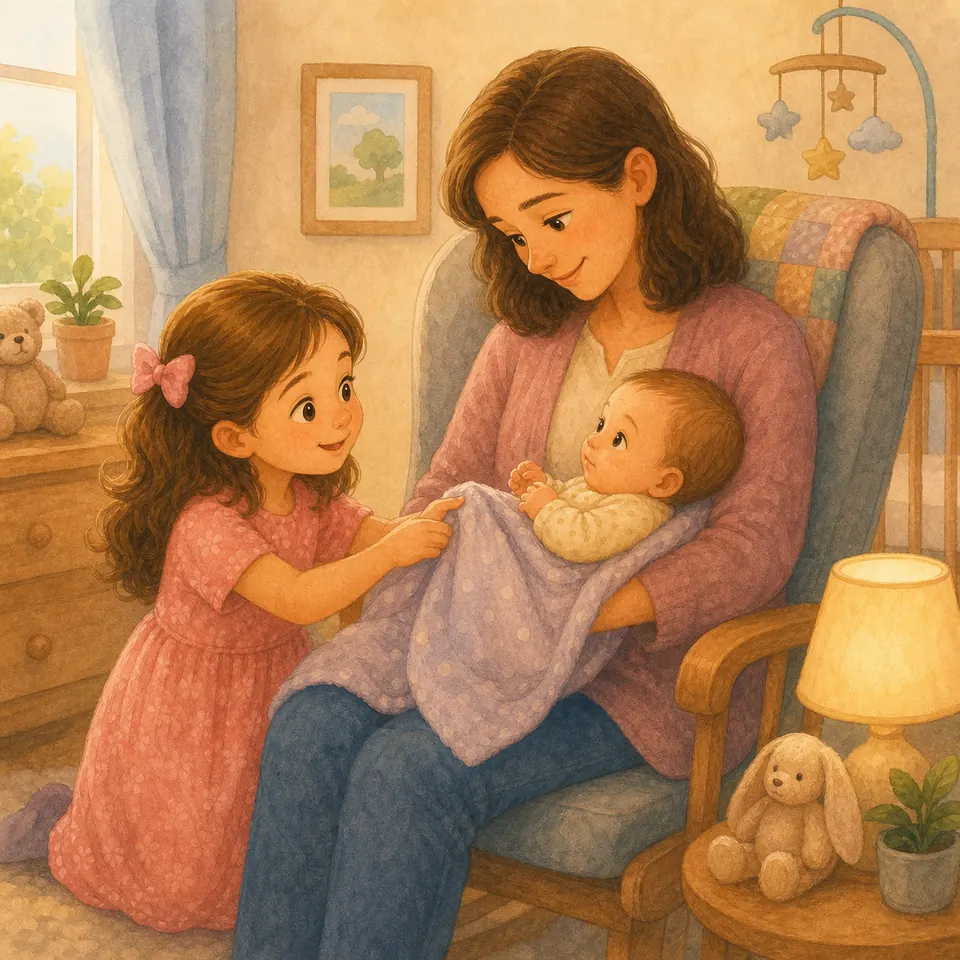{ loading=lazy }

*(Папа показывает, как держать ладошку мягко)*

Малыш маленький: он плачет, много спит, не умеет ждать и не понимает правил. Иногда кажется, что все смотрят только на него. Сердечко может ревновать.

Но любовь в семье не делится, как последний кусочек пирога. Любовь растёт. Папина любовь к малышу не забирает любовь к тебе. Мамина забота о малыше не делает тебя невидимой.

Ты можешь быть старшей помощницей: принести пелёнку, спеть тихую песенку, погладить ножку одним пальчиком. А когда тебе тоже нужны руки — скажи нам.

**📖 Стих из Библии:**
14. Пустите детей приходить ко Мне и не препятствуйте им, ибо таковых есть Царствие Божие.
Марка 10:14 (Синодальный перевод)

**🗣 Поговорим:**
*Папа:* Как можно помогать малышу нежно и безопасно?
*(Дать дочке ответить)*

**🙏 Наша молитва:**
«Господь, дай мне нежное сердце к маленьким и уверенность, что меня тоже любят. Аминь.»

---

## Глава 140. Помогать без команды

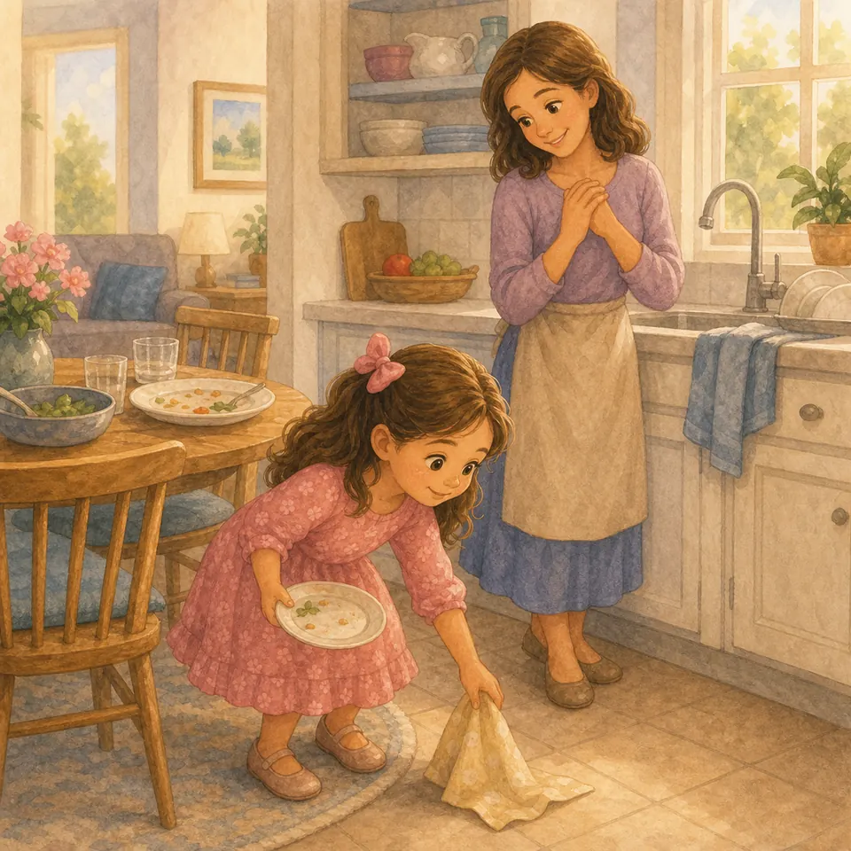{ loading=lazy }

*(Папа будто замечает упавшую салфетку)*

Иногда помощь зовёт тихо. Не голосом, а видом: ботинки стоят криво, ложка упала, мама несёт сумку, папа ищет очки.

Можно ждать, пока скажут: «Помоги». А можно заметить самой: поднять, принести, придержать дверь, убрать свою тарелку. Такая помощь похожа на маленький огонёк любви.

Мы служим не чтобы нас обязательно похвалили. Мы служим, потому что Иисус любит людей через наши руки.

**📖 Стих из Библии:**
13. Любовью служите друг другу.
Галатам 5:13 (Синодальный перевод)

**🗣 Поговорим:**
*Папа:* Какую маленькую помощь ты можешь заметить сама?
*(Дать дочке ответить)*

**🙏 Наша молитва:**
«Иисус, сделай мои глаза внимательными, а руки готовыми помогать. Аминь.»

---

## Глава 141. Почему нельзя брать без спроса

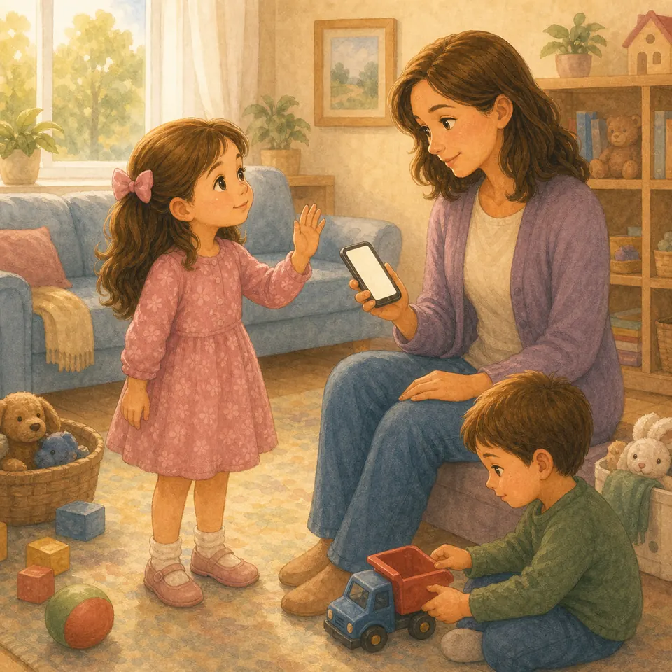{ loading=lazy }

*(Папа кладёт ладонь рядом с игрушкой, но не берёт её)*

Иногда вещь лежит совсем рядом: конфета, мамина помада, папин телефон, чужая машинка. Рука уже тянется. Но важный вопрос звучит раньше руки: «Можно взять?»

Если вещь не твоя, её нельзя брать тайком. Даже если очень хочется. Даже если «только посмотреть». Спросить — значит уважать человека.

Если взяла без спроса, можно остановиться, вернуть и сказать правду. Бог помогает нам выбирать честность раньше хитрости.

**📖 Стих из Библии:**
28. Кто крал, вперед не кради, а лучше трудись, делая своими руками полезное.
Ефесянам 4:28 (Синодальный перевод)

**🗣 Поговорим:**
*Папа:* Какие вещи дома нужно брать только с разрешения?
*(Дать дочке ответить)*

**🙏 Наша молитва:**
«Бог, помоги мне спрашивать и уважать чужое. Аминь.»

---

## Глава 142. Секреты хорошие и плохие

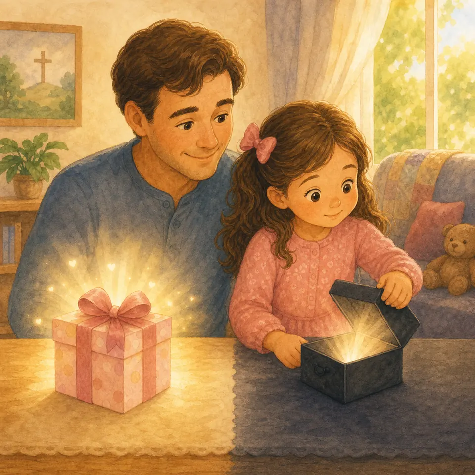{ loading=lazy }

*(Папа говорит серьёзно и очень спокойно)*

Есть хорошие секреты: подарок маме, сюрприз на день рождения, рисунок, который мы покажем вечером. От такого секрета внутри светло и радостно.

А есть плохие секреты. Если кто-то говорит: «Никому не рассказывай», а тебе страшно, стыдно, неприятно или тревожно — это не секрет для хранения. Это надо рассказать маме или папе. Сразу.

Ты не будешь виновата за правду. В нашей семье можно говорить о трудном. Свет сильнее тайной темноты.

**📖 Стих из Библии:**
32. И познаете истину, и истина сделает вас свободными.
Иоанна 8:32 (Синодальный перевод)

**🗣 Поговорим:**
*Папа:* Чем хороший секрет отличается от плохого?
*(Дать дочке ответить)*

**🙏 Наша молитва:**
«Господь, дай мне смелость рассказывать маме и папе всё, что пугает моё сердце. Аминь.»

---

## Глава 143. Когда взрослый неправ

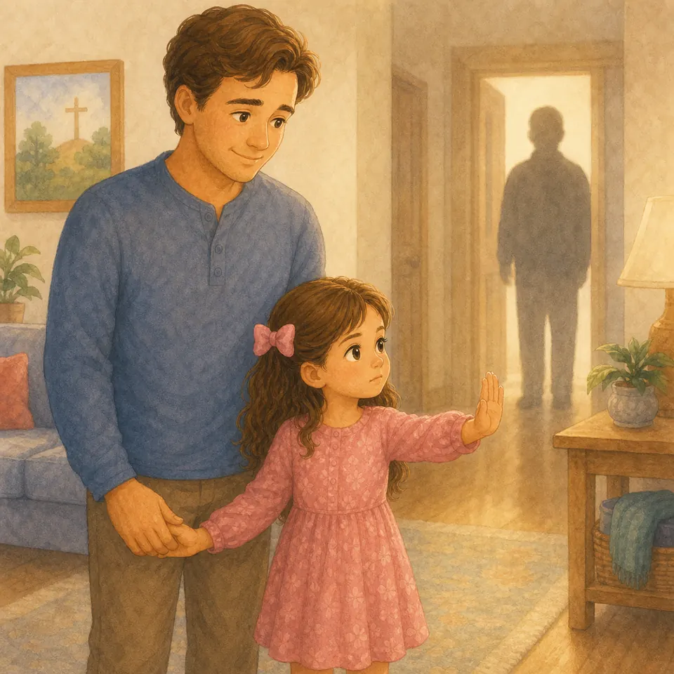{ loading=lazy }

*(Папа говорит уверенно, чтобы дочке было спокойно)*

Мы уважаем взрослых: слушаем воспитателя, здороваемся, не грубим. Но взрослый тоже может ошибиться. Если взрослый просит сделать плохое, скрыть опасное, уйти куда-то без разрешения родителей или нарушает твои границы — слушаться нельзя.

Можно громко сказать: «Нет!» Можно уйти к безопасному взрослому. Можно рассказать маме или папе, даже если тот человек сказал не рассказывать.

Послушание Богу и защита правды важнее страха перед человеком.

**📖 Стих из Библии:**
29. Должно повиноваться больше Богу, нежели человекам.
Деяния 5:29 (Синодальный перевод)

**🗣 Поговорим:**
*Папа:* К кому ты пойдёшь, если взрослый попросит странное или плохое?
*(Дать дочке ответить)*

**🙏 Наша молитва:**
«Бог, дай мне смелость говорить “нет” плохому и сразу идти к маме или папе. Аминь.»

---

## Глава 144. Как выбирать игру

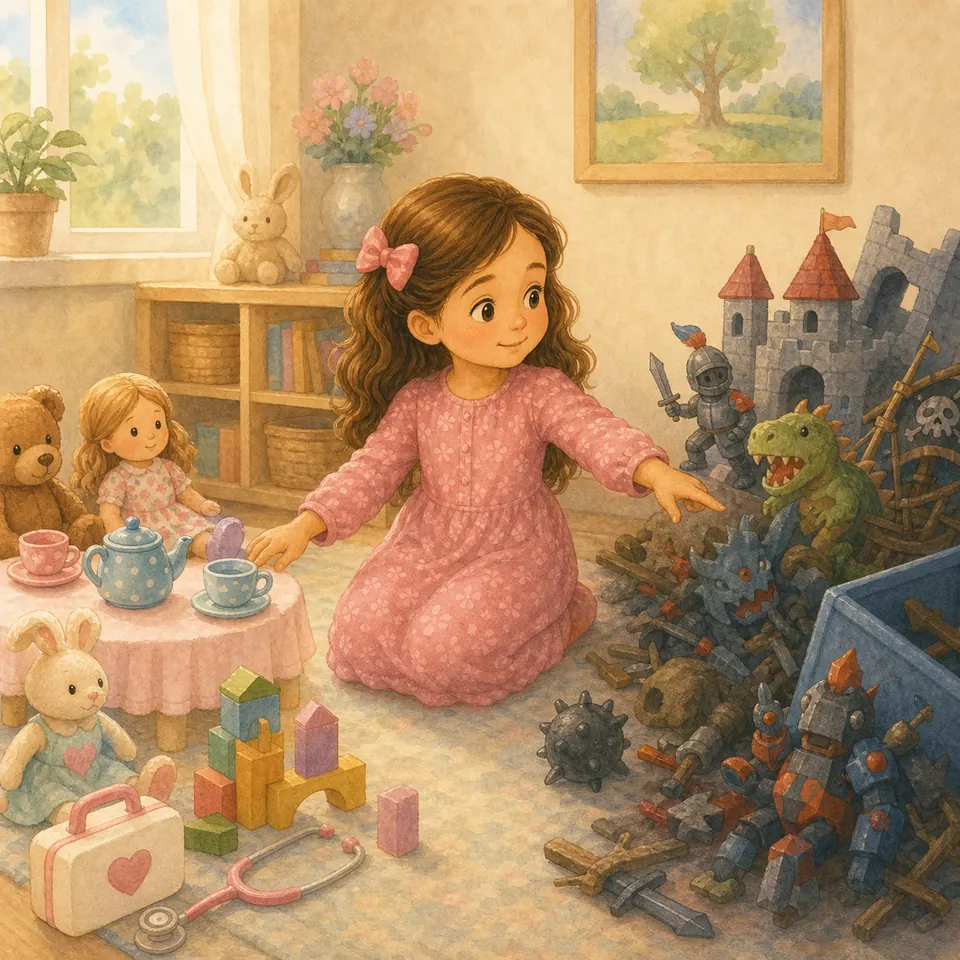{ loading=lazy }

*(Папа раскладывает воображаемые игрушки)*

Игры бывают разными. Одни делают сердце весёлым и добрым: строить дом, лечить кукол, готовить чай, спасать, мастерить, придумывать истории. Другие учат командовать, пугать, смеяться над слабым или делать вид, что плохое — это хорошо.

Перед игрой можно спросить: «После этой игры я стану добрее? Мне будет спокойно? Другим будет хорошо?» Если игра делает сердце грубым, можно выбрать другую.

Бог любит радость. Игра — тоже место, где сердце учится добру.

**📖 Стих из Библии:**
8. Что только истинно, что честно, что справедливо, что чисто, что любезно, что достославно, что только добродетель и похвала, о том помышляйте.
Филиппийцам 4:8 (Синодальный перевод)

**🗣 Поговорим:**
*Папа:* Какая игра делает тебя добрее и радостнее?
*(Дать дочке ответить)*

**🙏 Наша молитва:**
«Господь, помоги мне выбирать игры, после которых сердце остаётся светлым. Аминь.»

---

## Глава 145. Добрые слова дома

{ loading=lazy }

*(Папа смотрит вокруг комнаты)*

Иногда мы бережём самые красивые слова для гостей, а дома говорим резко: «Дай!», «Уйди!», «Не мешай!» Но дом — первое место, где любовь должна звучать вслух.

Маме приятно слышать «спасибо». Папе приятно слышать «пожалуйста». Брату или сестре важно слышать «прости». Близкие люди не становятся менее важными только потому, что они всегда рядом.

Добрые слова дома — как чистый воздух. С ними легче жить, мириться, смеяться и молиться.

**📖 Стих из Библии:**
6. Слово ваше да будет всегда с благодатию, приправлено солью.
Колоссянам 4:6 (Синодальный перевод)

**🗣 Поговорим:**
*Папа:* Кому дома ты сегодня скажешь доброе слово?
*(Дать дочке ответить)*

**🙏 Наша молитва:**
«Иисус, положи добрые слова на мой язычок, особенно дома. Аминь.»

---

## Глава 146. Бог слышит даже короткую молитву

{ loading=lazy }

*(Папа складывает ладони на одну секунду)*

Молитва не обязана быть длинной, как дорога до моря. Иногда молитва совсем короткая: «Господи, помоги». «Спасибо». «Прости». «Мне страшно». «Будь рядом».

Бог не считает слова, будто бусинки. Он слышит сердце. Можно молиться в кроватке, в машине, в садике, перед супом, перед трудным разговором.

Короткая молитва — как маленький звонок Небесному Отцу. И Он не говорит: «Слишком мало слов». Он слышит тебя.

**📖 Стих из Библии:**
13. Ибо всякий, кто призовет имя Господне, спасется.
Римлянам 10:13 (Синодальный перевод)

**🗣 Поговорим:**
*Папа:* Какую короткую молитву ты можешь сказать сегодня?
*(Дать дочке ответить)*

**🙏 Наша молитва:**
«Господи, помоги мне помнить: Ты слышишь даже самые короткие слова. Аминь.»

---

## Глава 147. Когда я злюсь на маму или папу

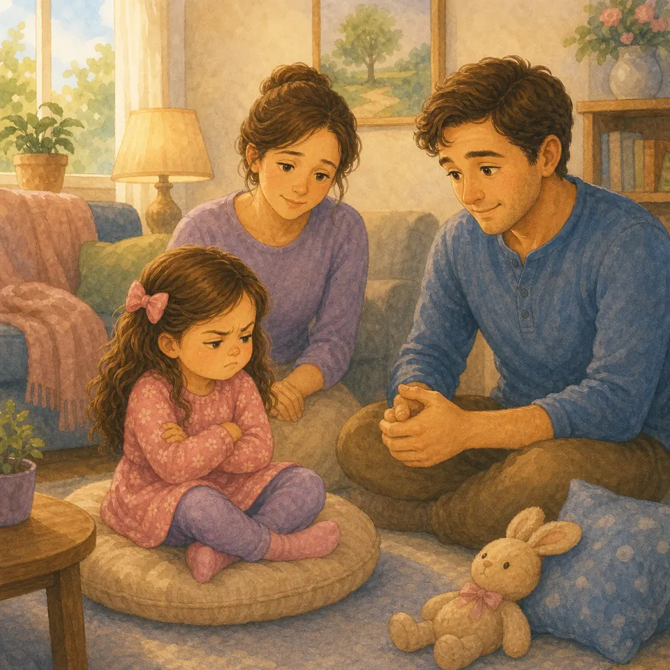{ loading=lazy }

*(Папа говорит спокойно, не сердясь на само чувство)*

Иногда мама говорит «нельзя». Иногда папа выключает мультик. И внутри поднимается горячая злость: «Не хочу! Вы плохие!» Но злость — это чувство, а не командир.

Можно злиться и всё равно не бить, не кричать обидные слова, не бросать вещи. Можно сказать: «Я злюсь». Можно топнуть подушку, подышать, поплакать, попросить обнять, когда сердце остынет.

Мама и папа не становятся врагами, когда ставят границу. Любовь остаётся даже в трудном «нет».

**📖 Стих из Библии:**
26. Гневаясь, не согрешайте: солнце да не зайдет во гневе вашем.
Ефесянам 4:26 (Синодальный перевод)

**🗣 Поговорим:**
*Папа:* Что можно сделать со злостью, чтобы никого не ранить?
*(Дать дочке ответить)*

**🙏 Наша молитва:**
«Бог, помоги мне говорить о злости честно и не делать больно тем, кого люблю. Аминь.»

---

## Глава 148. Книги, Библия и святые вещи

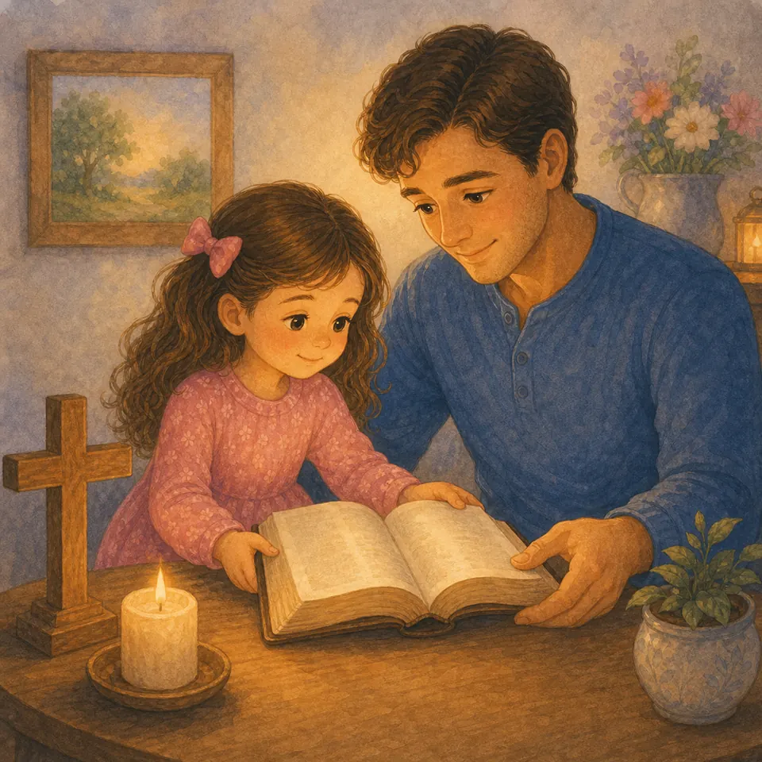{ loading=lazy }

*(Папа осторожно открывает книгу)*

Книги любят чистые руки и спокойные страницы. А Библия — особенная книга: через неё мы слушаем Божье слово. Её не бросают, не рисуют в ней просто так, не ставят на неё чашку.

В храме или дома бывают вещи, к которым относятся бережно: крестик, свеча, икона, хлеб для причастия, молитвенник. Мы не боимся их, но уважаем.

Бережность помогает сердцу помнить: есть вещи не для шума и игры, а для молитвы, памяти и любви к Богу.

**📖 Стих из Библии:**
105. Слово Твое - светильник ноге моей и свет стезе моей.
Псалом 118:105 (Синодальный перевод)

**🗣 Поговорим:**
*Папа:* Как мы можем бережно обращаться с Библией?
*(Дать дочке ответить)*

**🙏 Наша молитва:**
«Господь, научи меня уважать Твоё слово и всё, что помогает нам молиться. Аминь.»

---

## Глава 149. Моя комната — маленькое царство порядка

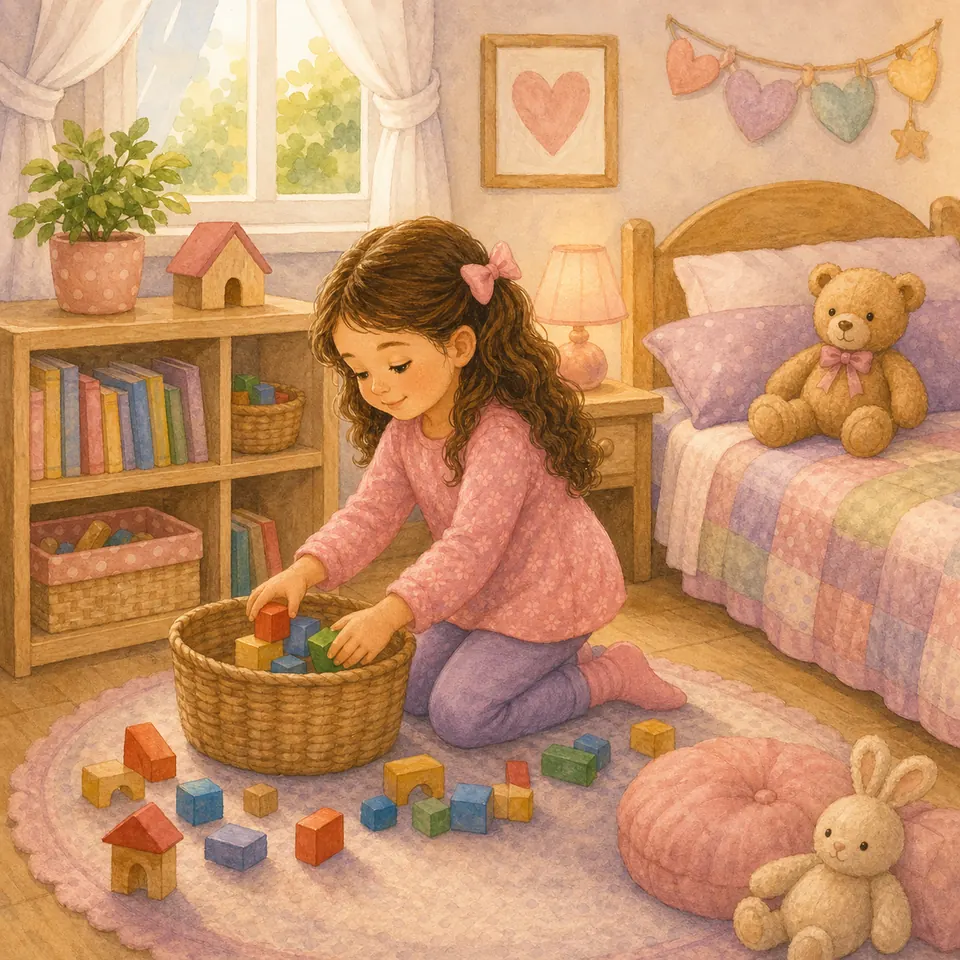{ loading=lazy }

*(Папа показывает на пол, полку и кроватку)*

Твоя комната — маленькое царство. В нём живут куклы, кубики, книжки, носочки и одеяло. Если всё лежит где попало, царство начинает спотыкаться.

Порядок не значит, что играть нельзя. Играть можно! Но после игры вещи возвращаются домой: кубики в коробку, книжки на полку, одежда в корзину, мишка на кроватку.

Когда ты наводишь порядок, ты не просто убираешь. Ты учишься заботиться о месте, которое Бог дал нашей семье.

**📖 Стих из Библии:**
23. И все, что делаете, делайте от души, как для Господа.
Колоссянам 3:23 (Синодальный перевод)

**🗣 Поговорим:**
*Папа:* У какой вещи в твоей комнате есть свой «домик»?
*(Дать дочке ответить)*

**🙏 Наша молитва:**
«Бог, помоги мне любить порядок и убирать без ворчания. Аминь.»

---

## Глава 150. Когда хочется командовать всеми

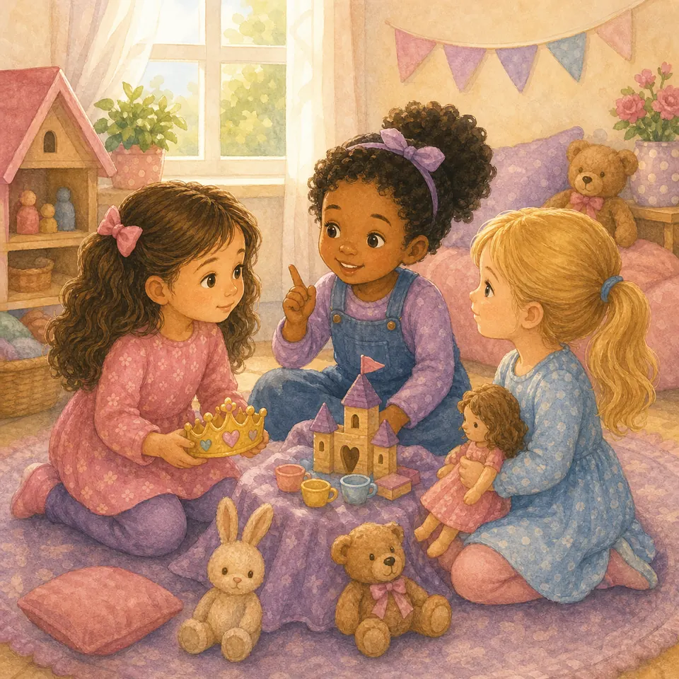{ loading=lazy }

*(Папа изображает маленькую корону и снимает её с улыбкой)*

Иногда хочется сказать всем: «Ты будешь мамой, ты будешь ребёнком, ты стой тут, а ты играй только так!» Кажется, если все послушаются, игра станет идеальной.

Но друзья — не игрушки на верёвочках. Можно предлагать, можно договариваться, можно быть ведущей. Но нельзя давить, обижаться каждый раз и заставлять всех играть только по-твоему.

Настоящая старшая или главная умеет служить: замечать других, слушать, уступать, помогать. Иисус был самым главным — и всё равно служил людям.

**📖 Стих из Библии:**
45. Ибо и Сын Человеческий не для того пришел, чтобы Ему служили, но чтобы послужить.
Марка 10:45 (Синодальный перевод)

**🗣 Поговорим:**
*Папа:* Как можно предложить игру так, чтобы другим тоже было хорошо?
*(Дать дочке ответить)*

**🙏 Наша молитва:**
«Иисус, научи меня быть не командиром капризов, а доброй помощницей в игре. Аминь.»

---

## Глава 151. Слёзы — это не стыдно

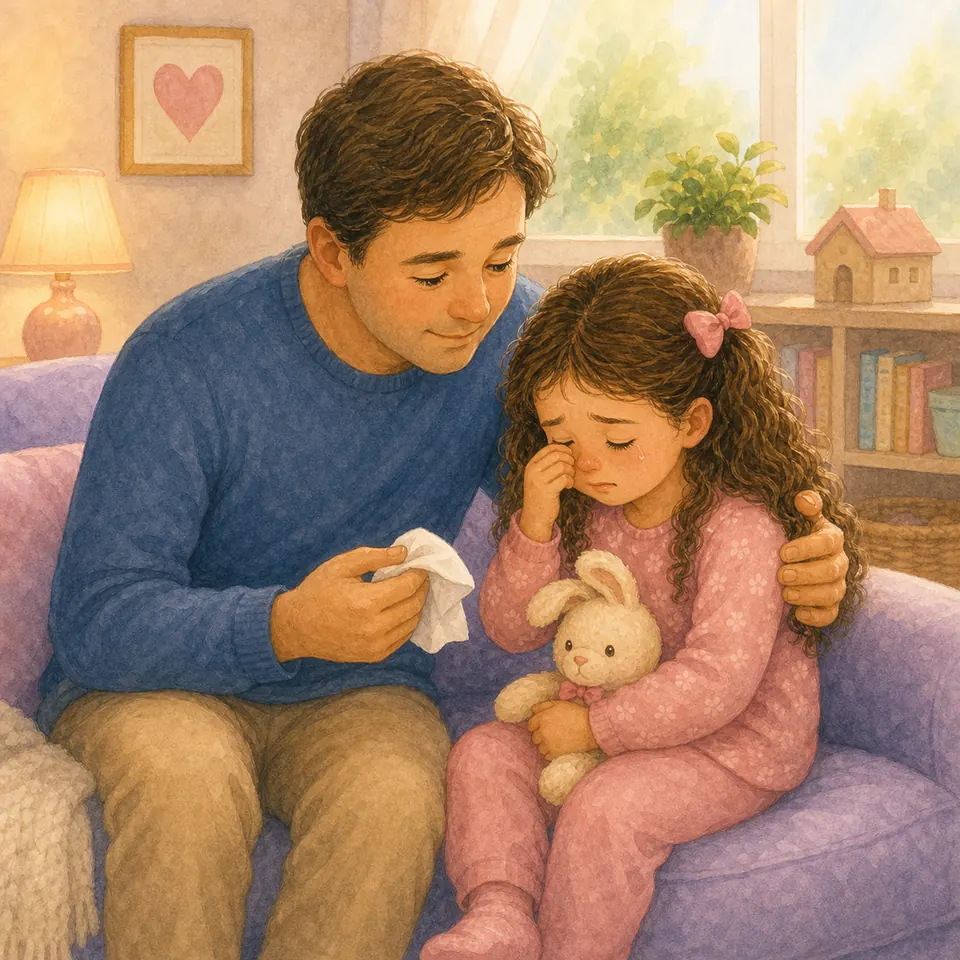{ loading=lazy }

*(Папа протягивает платочек)*

Слёзы приходят, когда больно, обидно, страшно, устало или слишком много всего сразу. Слёзы не делают тебя плохой или маленькой «неправильно». Они говорят: сердцу нужна помощь.

Не надо смеяться над чужими слезами. И не надо прятать свои, будто это грязная тайна. Можно сказать: «Мне грустно». Можно попросить воды, обнять, посидеть тихо.

Бог близко к сердцу, которое плачет. А папа и мама рядом, чтобы утешить и помочь снова подняться.

**📖 Стих из Библии:**
19. Близок Господь к сокрушенным сердцем и смиренных духом спасет.
Псалом 33:19 (Синодальный перевод)

**🗣 Поговорим:**
*Папа:* Что помогает тебе, когда хочется плакать?
*(Дать дочке ответить)*

**🙏 Наша молитва:**
«Господь, спасибо, что Ты не стыдишь мои слёзы. Утешь моё сердце. Аминь.»

---

**Навигация по частям:**

[<- Предыдущая часть](https://msadakov.github.io/book-for-5-year-old-daughter/part-12-granitsy/) | [Следующая часть ->](https://msadakov.github.io/book-for-5-year-old-daughter/part-14-den/)
_Часть 12. Близость и границы | Часть 14. Каждый день_
