## В этой части

- [Глава 152. Когда планы поменялись](#ch-152)
- [Глава 153. Как принимать подарки](#ch-153)
- [Глава 154. Когда тебе сказали «нет»](#ch-154)
- [Глава 155. Двери, окна и лифт](#ch-155)
- [Глава 156. Переход через дорогу](#ch-156)
- [Глава 157. Когда в комнате слишком шумно](#ch-157)
- [Глава 158. Фантазия и правда](#ch-158)
- [Глава 159. Фото и видео: можно попросить не снимать](#ch-159)
- [Глава 160. Бережность к животным и растениям](#ch-160)
- [Глава 161. Когда болеешь дома](#ch-161)
- [Глава 162. Утренние сборы без войны](#ch-162)
- [Глава 163. «Купи!» и витрины в магазине](#ch-163)

## Глава 152. Когда планы поменялись

*(Папа переворачивает воображаемый лист календаря)*

Иногда мы собирались гулять — а пошёл дождь. Ждали гостей — а они заболели. Хотели в парк — а машина не завелась. Сердце сразу говорит: «Но я же ждала!»

Грустить можно. Планы правда бывают дорогими. Но если план поменялся, любовь не поменялась. Бог всё ещё рядом, мама и папа всё ещё любят тебя, а день всё ещё может стать добрым по-другому.

Можно сказать: «Мне жалко». Потом выдохнуть и спросить: «А что мы можем сделать теперь?» Гибкое сердце не ломается, как сухая веточка. Оно сгибается и снова поднимается.

**📖 Стих из Библии:**
9. Сердце человека обдумывает свой путь, но Господь управляет шествием его.
Притчи 16:9 (Синодальный перевод)

**🗣 Поговорим:**
*Папа:* Что можно сделать хорошего, если наш первый план не получился?
*(Дать дочке ответить)*

**🙏 Наша молитва:**
«Господь, помоги мне не сердиться долго, когда планы меняются. Научи меня доверять Тебе. Аминь.»

---

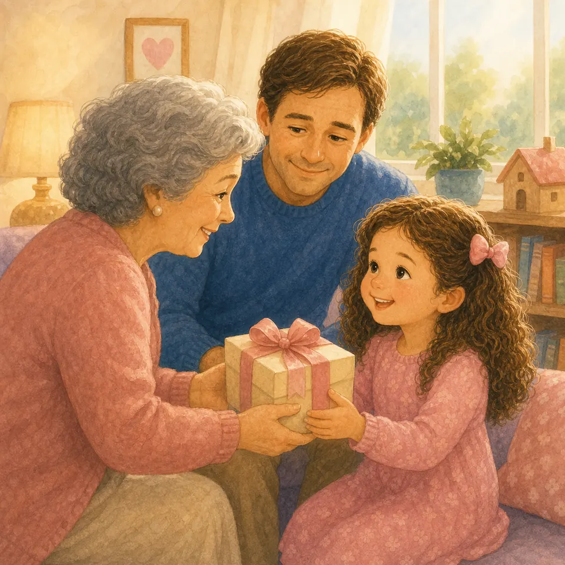{ loading=lazy }

## Глава 153. Как принимать подарки

*(Папа протягивает воображаемую коробочку)*

Подарок — это не только вещь. Это чья-то мысль о тебе: «Я хочу тебя порадовать». Поэтому подарок берут двумя руками и говорят: «Спасибо».

Иногда подарок не такой, как ты мечтала. Не та кукла, не тот цвет, не самая большая коробка. Но доброе сердце сначала замечает любовь человека, а уже потом рассматривает ленточку.

Не надо говорить: «А ещё есть?» или «Я такое не хотела». Можно улыбнуться, поблагодарить и помнить: благодарность делает подарок красивее.

**📖 Стих из Библии:**
18. За все благодарите: ибо такова о вас воля Божия во Христе Иисусе.
1 Фессалоникийцам 5:18 (Синодальный перевод)

**🗣 Поговорим:**
*Папа:* Какие слова мы говорим, когда нам дарят подарок?
*(Дать дочке ответить)*

**🙏 Наша молитва:**
«Бог, научи меня видеть любовь за подарком и благодарить от сердца. Аминь.»

---

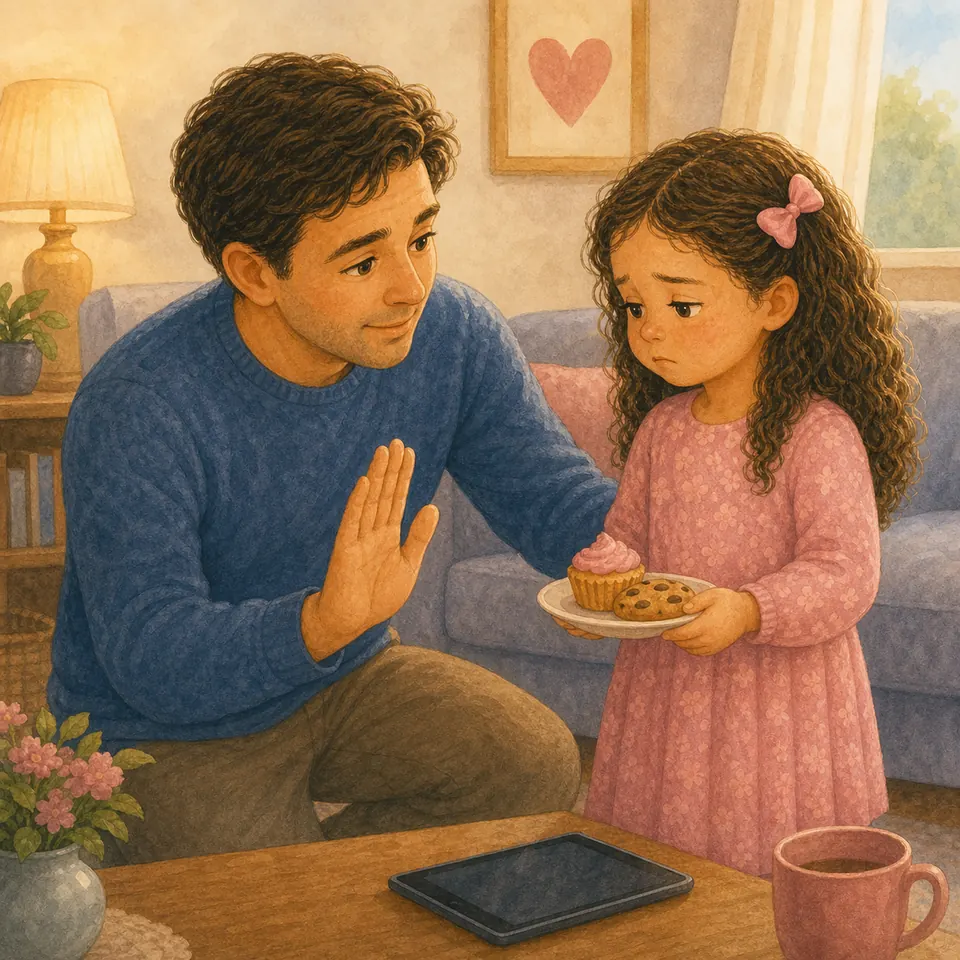{ loading=lazy }

## Глава 154. Когда тебе сказали «нет»

*(Папа мягко качает головой и держит дочку за руку)*

Слово «нет» иногда колется. Ты просишь ещё мультик, конфету, игрушку, пойти туда, куда нельзя, а взрослый отвечает: «Нет». И внутри сразу поднимается буря.

Но «нет» не всегда значит «тебя не любят». Часто «нет» — это заборчик безопасности. Или забота о здоровье. Или помощь сердцу, чтобы оно не стало командиром всего дома.

Можно расстроиться и всё равно не кричать. Можно спросить: «Почему?» Можно услышать ответ. Сердце растёт, когда учится принимать добрую границу.

**📖 Стих из Библии:**
1. Дети, повинуйтесь своим родителям в Господе, ибо сего требует справедливость.
Ефесянам 6:1 (Синодальный перевод)

**🗣 Поговорим:**
*Папа:* Как можно ответить спокойно, когда тебе сказали «нет»?
*(Дать дочке ответить)*

**🙏 Наша молитва:**
«Иисус, помоги мне принимать доброе “нет” без крика и помнить, что меня любят. Аминь.»

---

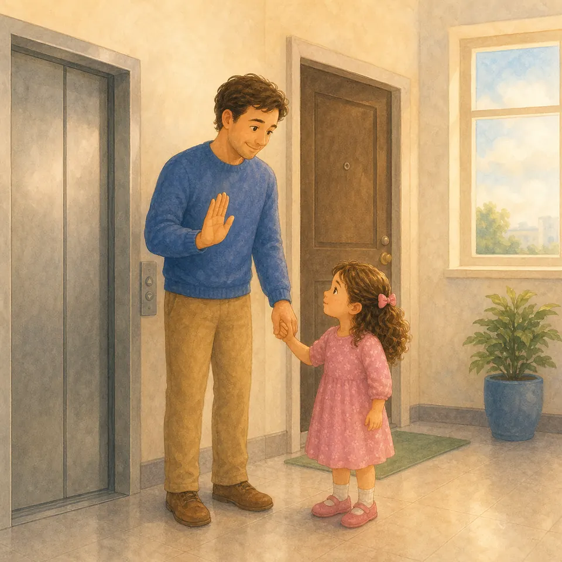{ loading=lazy }

## Глава 155. Двери, окна и лифт

*(Папа показывает: стоп, рука взрослого, ждать)*

Двери умеют щёлкать, окна высокие, а лифт ездит сам. Это не игрушки для маленьких ручек без взрослого рядом.

Мы не открываем входную дверь незнакомым. Не залезаем на подоконник. Не нажимаем кнопки лифта и не заходим в лифт одни. Если дверь закрывается — ручки держим подальше, чтобы пальчики были целы.

Безопасность не делает жизнь скучной. Она хранит радость, чтобы мы могли играть, бегать и смеяться дальше.

**📖 Стих из Библии:**
3. Благоразумный видит беду и укрывается; а неопытные идут вперед и наказываются.
Притчи 22:3 (Синодальный перевод)

**🗣 Поговорим:**
*Папа:* Что мы делаем, если нужно ехать в лифте?
*(Дать дочке ответить)*

**🙏 Наша молитва:**
«Господь, дай мне внимательность у дверей, окон и лифта. Храни мои ручки и ножки. Аминь.»

---

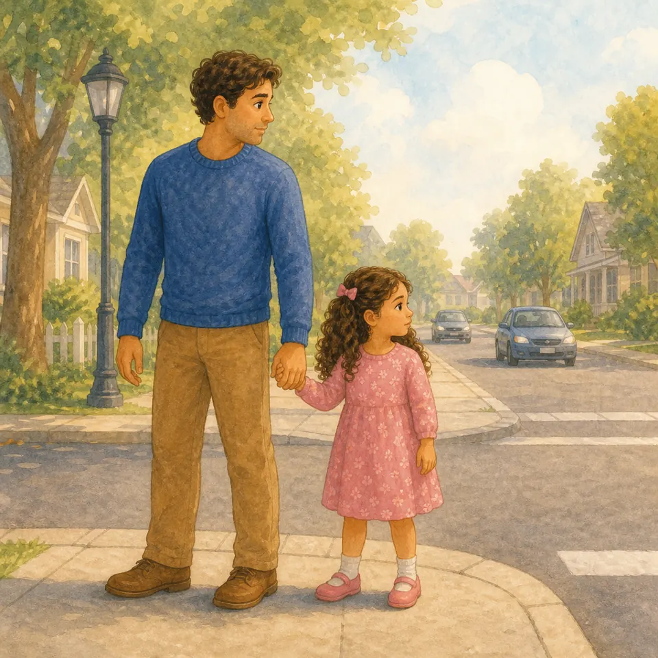{ loading=lazy }

## Глава 156. Переход через дорогу

*(Папа крепко берёт дочкину руку)*

Дорога — место для машин, автобусов и больших колёс. Даже если ты очень быстро бегаешь, на дороге мы не бегаем. Мы держим взрослого за руку.

Перед переходом останавливаемся. Смотрим. Слушаем. Ждём разрешения взрослого. Даже если светофор зелёный, мы всё равно идём внимательно, не прыгаем и не вырываемся.

Храбрая девочка — не та, которая мчится первой. Храбрая девочка умеет остановиться вовремя.

**📖 Стих из Библии:**
3. Благоразумный видит беду и укрывается; а неопытные идут вперед и наказываются.
Притчи 22:3 (Синодальный перевод)

**🗣 Поговорим:**
*Папа:* Чью руку ты держишь, когда переходишь дорогу?
*(Дать дочке ответить)*

**🙏 Наша молитва:**
«Бог, помоги мне быть внимательной у дороги и слушаться взрослых. Аминь.»

---

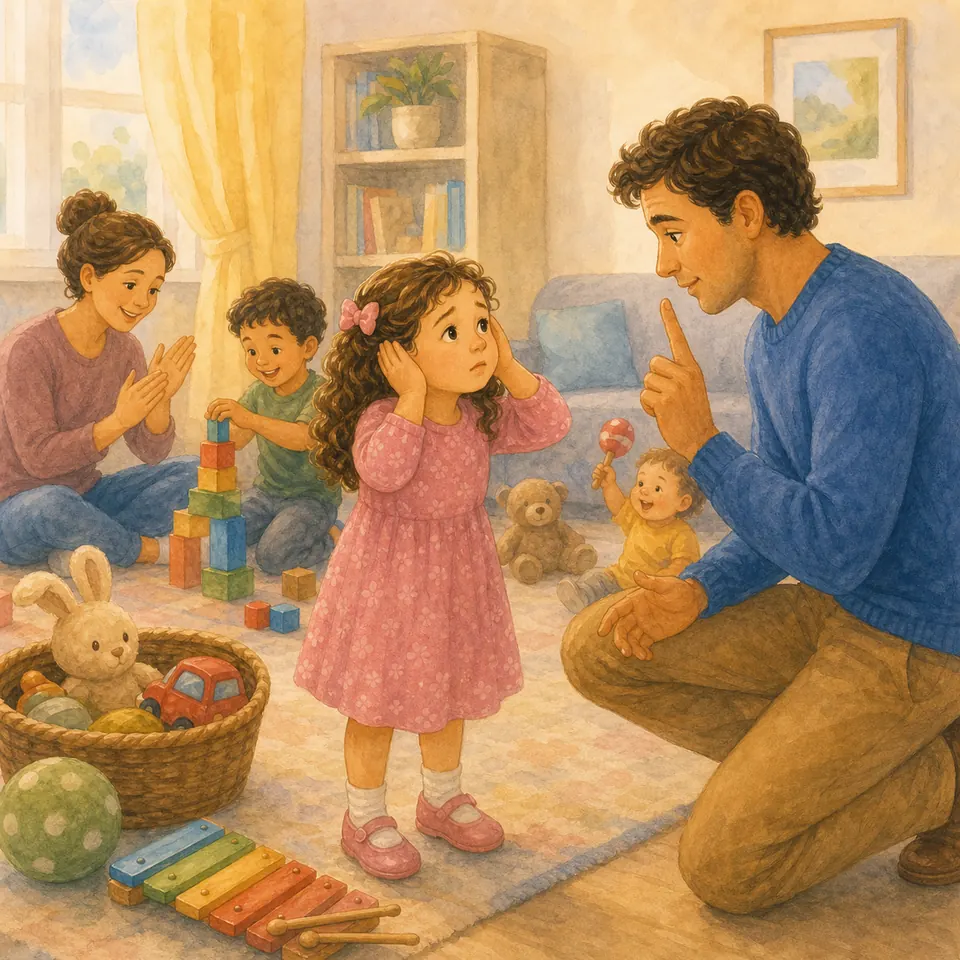{ loading=lazy }

## Глава 157. Когда в комнате слишком шумно

*(Папа прикрывает уши ладонями и улыбается)*

Иногда вокруг слишком много звуков: кто-то смеётся, кто-то поёт, игрушки стучат, музыка играет, взрослые говорят. Голова устает, и сердцу хочется спрятаться.

Можно не кричать громче всех. Можно подойти к взрослому и сказать: «Мне слишком шумно». Можно попросить тише, выйти на минутку, попить воды, посидеть рядом.

Бог знает, что мы не железные. Тишина иногда помогает любви вернуться в голос.

**📖 Стих из Библии:**
15. Отвращайся от зла и делай добро; ищи мира и следуй за ним.
Псалом 33:15 (Синодальный перевод)

**🗣 Поговорим:**
*Папа:* Что ты можешь сказать, если тебе стало слишком шумно?
*(Дать дочке ответить)*

**🙏 Наша молитва:**
«Господь, помоги мне просить тишины спокойно и беречь мир в доме. Аминь.»

---

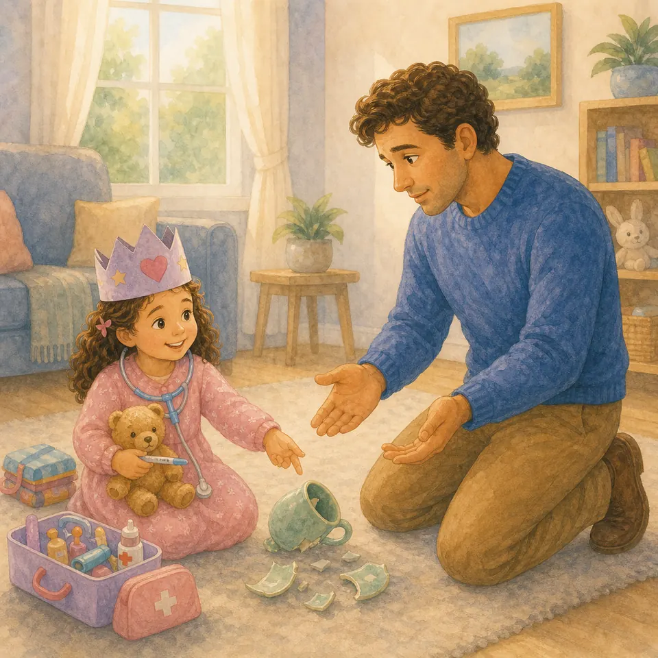{ loading=lazy }

## Глава 158. Фантазия и правда

*(Папа надевает воображаемую корону и смеётся)*

В игре можно быть принцессой, доктором, мамой, путешественницей, строителем корабля. Фантазия — чудесный подарок. Она помогает играть и придумывать.

Но есть разница между «понарошку» и правдой. Если ты говоришь: «Я лечу на Луну» во время игры — это фантазия. А если разбила чашку и сказала: «Это не я» — это уже неправда.

Доброе сердце умеет играть смело и говорить честно. В игре — сказка. В жизни — правда.

**📖 Стих из Библии:**
25. Посему, отвергнув ложь, говорите истину каждый ближнему своему.
Ефесянам 4:25 (Синодальный перевод)

**🗣 Поговорим:**
*Папа:* Чем игра «понарошку» отличается от обмана?
*(Дать дочке ответить)*

**🙏 Наша молитва:**
«Бог, спасибо за фантазию. Помоги мне играть радостно и говорить правду. Аминь.»

---

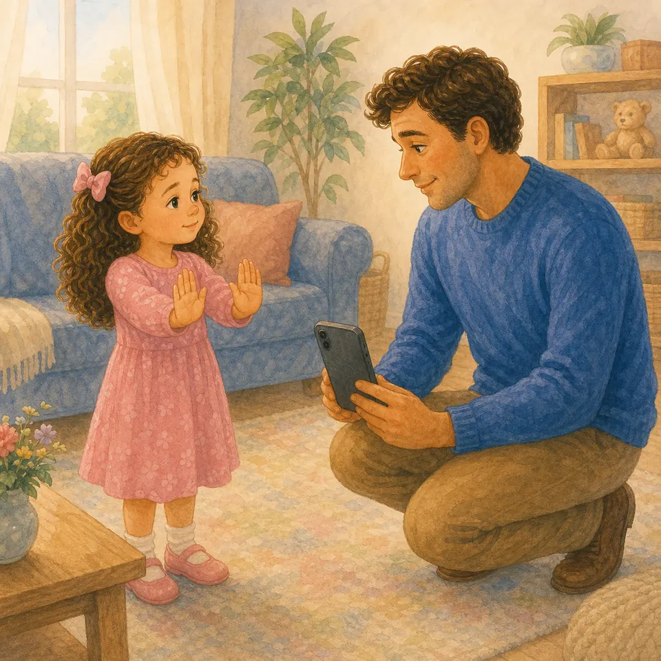{ loading=lazy }

## Глава 159. Фото и видео: можно попросить не снимать

*(Папа показывает телефон и опускает его вниз)*

Фото помогают помнить радостные дни. Но иногда ты не хочешь, чтобы тебя снимали: устала, плачешь, переодеваешься, кушаешь или просто не хочешь сейчас.

Можно сказать: «Не снимай меня, пожалуйста». Можно закрыться ладошкой и пойти к маме или папе. Мы уважаем людей не только рядом, но и на фотографиях.

Твоё лицо, тело и грустные минуты — не игрушка для чужого смеха. Любовь умеет отложить телефон.

**📖 Стих из Библии:**
12. Итак во всем, как хотите, чтобы с вами поступали люди, так поступайте и вы с ними.
Матфея 7:12 (Синодальный перевод)

**🗣 Поговорим:**
*Папа:* Как можно вежливо попросить не снимать тебя?
*(Дать дочке ответить)*

**🙏 Наша молитва:**
«Господь, научи нас уважать друг друга и быть добрыми даже с телефоном в руках. Аминь.»

---

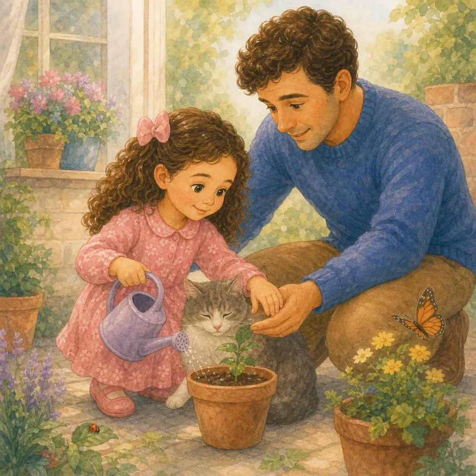{ loading=lazy }

## Глава 160. Бережность к животным и растениям

*(Папа показывает мягкую ладошку)*

Живое не любит грубых рук. Цветок нельзя рвать просто так. Кошку нельзя тянуть за хвост. Жучка не надо давить от скуки. Маленькое живое тоже чувствует Божью заботу.

Можно гладить мягко, поливать аккуратно, смотреть внимательно, не пугать и не ломать. Если животное уходит — значит ему нужно место. Если растение тонкое — значит его трогают нежно.

Бог доверил нам мир не для того, чтобы мы были хозяевами-ломателями, а чтобы были заботливыми хранителями.

**📖 Стих из Библии:**
15. И взял Господь Бог человека, и поселил его в саду Едемском, чтобы возделывать его и хранить его.
Бытие 2:15 (Синодальный перевод)

**🗣 Поговорим:**
*Папа:* Как выглядит мягкая рука для животного или цветка?
*(Дать дочке ответить)*

**🙏 Наша молитва:**
«Бог, научи меня беречь всё живое, что Ты создал. Аминь.»

---

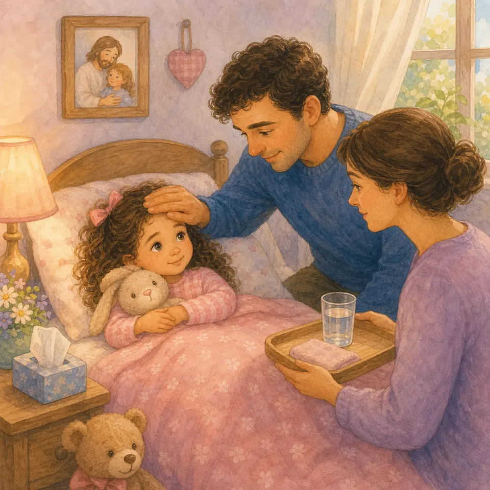{ loading=lazy }

## Глава 161. Когда болеешь дома

*(Папа поправляет одеяло)*

Когда болеешь, тело просит заботы: поспать, попить воды, измерить температуру, принять лекарство от взрослого. Болеть неприятно, но это не значит, что Бог забыл о тебе.

Иногда нельзя бежать, есть сладкое или идти гулять. Это не наказание. Это помощь телу выздоравливать. Можно скучать и всё равно лечиться спокойно.

Мама, папа, врач и лекарства — как маленькая команда заботы. А Бог даёт терпение и мир сердцу.

**📖 Стих из Библии:**
10. Не бойся, ибо Я с тобою; не смущайся, ибо Я Бог твой; Я укреплю тебя и помогу тебе.
Исаия 41:10 (Синодальный перевод)

**🗣 Поговорим:**
*Папа:* Что помогает телу выздоравливать?
*(Дать дочке ответить)*

**🙏 Наша молитва:**
«Господь, будь рядом, когда я болею. Дай мне терпение и помоги выздороветь. Аминь.»

---

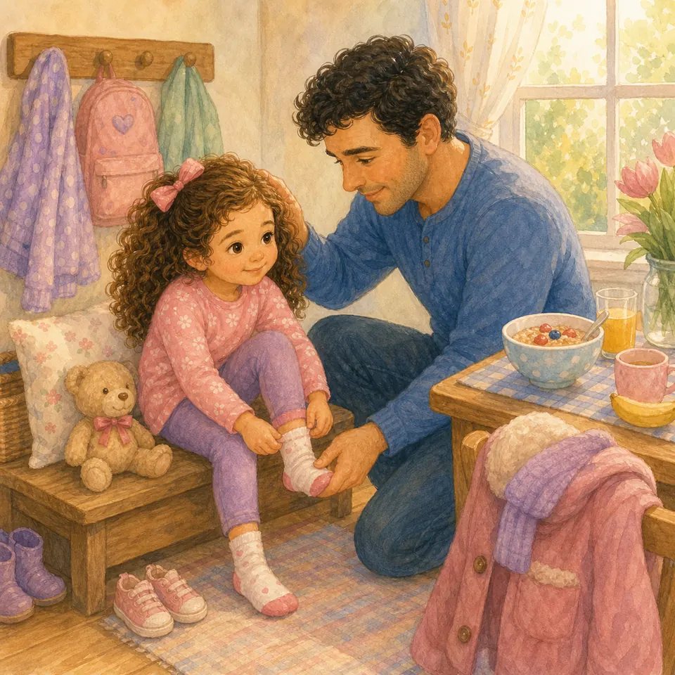{ loading=lazy }

## Глава 162. Утренние сборы без войны

*(Папа показывает носочки, расчёску и курточку)*

Утром всё будто спешит: носочки прячутся, волосы путаются, завтрак ждёт, дверь зовёт. И очень легко начать ворчать ещё до солнца.

Но утро может быть не войной, а маленьким порядком. Сначала встать. Потом умыться. Потом одеться. Потом поесть. Если трудно — попросить помощи словами, а не плачем-командиром.

Когда мы собираемся мирно, день начинает идти мягче. Не идеально, но добрее.

**📖 Стих из Библии:**
24. Сей день сотворил Господь: возрадуемся и возвеселимся в оный!
Псалом 117:24 (Синодальный перевод)

**🗣 Поговорим:**
*Папа:* Что утром можно сделать первым, чтобы стало легче собираться?
*(Дать дочке ответить)*

**🙏 Наша молитва:**
«Господь, благослови наше утро. Помоги нам собираться без крика и с любовью. Аминь.»

---

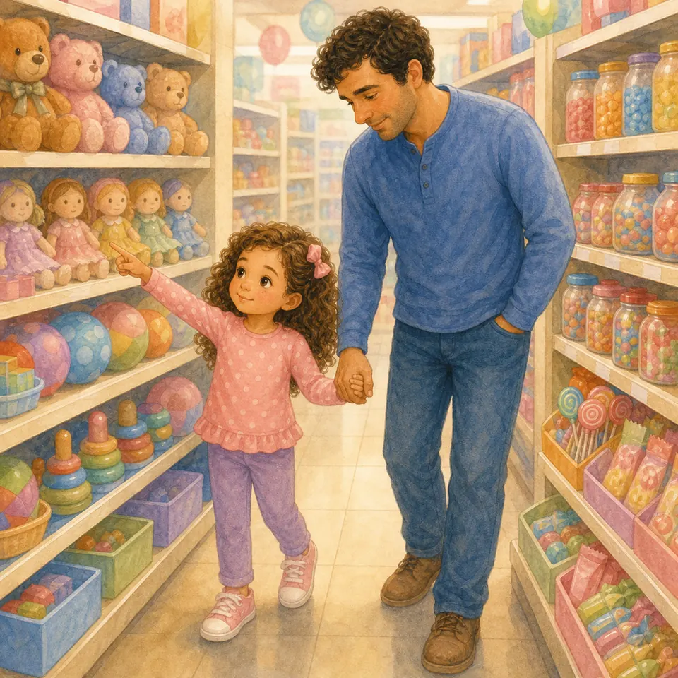{ loading=lazy }

## Глава 163. «Купи!» и витрины в магазине

*(Папа показывает на воображаемую полку и потом на сердце)*

Магазин умеет шептать: «Посмотри! Возьми! Купи! Ещё!» Игрушки блестят, конфеты улыбаются обёртками, и сердце начинает тянуть папу за руку.

Но не всё красивое нужно покупать. Иногда мы просто смотрим. Иногда выбираем одно. Иногда говорим: «Не сегодня». Это не беда. Дом не должен слушаться каждой витрины.

Можно сказать: «Мне понравилось». Можно сфотографировать в памяти. Можно поблагодарить и идти дальше. Радость живёт не только в пакетах из магазина.

**📖 Стих из Библии:**
15. Жизнь человека не зависит от изобилия его имения.
Луки 12:15 (Синодальный перевод)

**🗣 Поговорим:**
*Папа:* Что можно сказать в магазине вместо крика «купи»?
*(Дать дочке ответить)*

**🙏 Наша молитва:**
«Бог, научи моё сердце быть довольным и не командовать через “купи”. Аминь.»
