## В этой части

- [В этой части](#в-этой-части)
- [Глава 164. Когда мама или папа устали](#глава-164-когда-мама-или-папа-устали)
- [Глава 165. Как не перебивать](#глава-165-как-не-перебивать)
- [Глава 166. Когда хочется внимания прямо сейчас](#глава-166-когда-хочется-внимания-прямо-сейчас)
- [Глава 167. В гостях другие правила](#глава-167-в-гостях-другие-правила)
- [Глава 168. Когда приснился плохой сон](#глава-168-когда-приснился-плохой-сон)
- [Глава 169. Одежда по погоде](#глава-169-одежда-по-погоде)
- [Глава 170. Когда кто-то смеётся над ошибкой](#глава-170-когда-кто-то-смеётся-над-ошибкой)
- [Глава 171. День рождения без капризов](#глава-171-день-рождения-без-капризов)
- [Глава 172. Когда нужно подождать взрослого разговора](#глава-172-когда-нужно-подождать-взрослого-разговора)
- [Глава 173. Если увидела опасную вещь на полу](#глава-173-если-увидела-опасную-вещь-на-полу)
- [Глава 174. Как быть с угощениями от других людей](#глава-174-как-быть-с-угощениями-от-других-людей)
- [Глава 175. Семейные традиции](#глава-175-семейные-традиции)

## Глава 164. Когда мама или папа устали

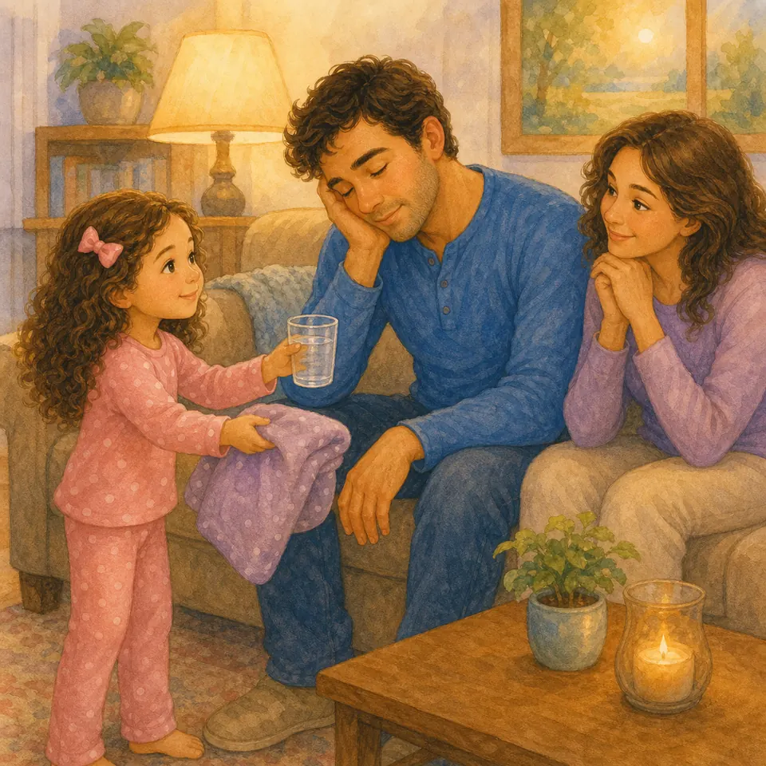{ loading=lazy }

*(Папа садится рядом и говорит мягче обычного)*

Иногда мама устала. Иногда папа устал. Голос становится тише, шаги медленнее, глаза хотят закрыться. Это не значит, что любовь ушла спать.

Усталый взрослый всё равно любит тебя. Просто его тело просит отдыха, как телефон просит зарядку. В такие минуты можно говорить тише, принести воды, поиграть рядом спокойно или подождать объятия чуть-чуть.

Любовь умеет быть не только весёлой и громкой. Иногда любовь — это плед, стакан воды и маленькая тишина для того, кто устал.

**📖 Стих из Библии:**
28. Придите ко Мне все труждающиеся и обремененные, и Я успокою вас.
Матфея 11:28 (Синодальный перевод)

**🗣 Поговорим:**
*Папа:* Как ты можешь помочь, если видишь, что мама или папа устали?
*(Дать дочке ответить)*

**🙏 Наша молитва:**
«Господь, дай нашей семье отдых и добрые сердца, когда мы устаём. Аминь.»

---

## Глава 165. Как не перебивать

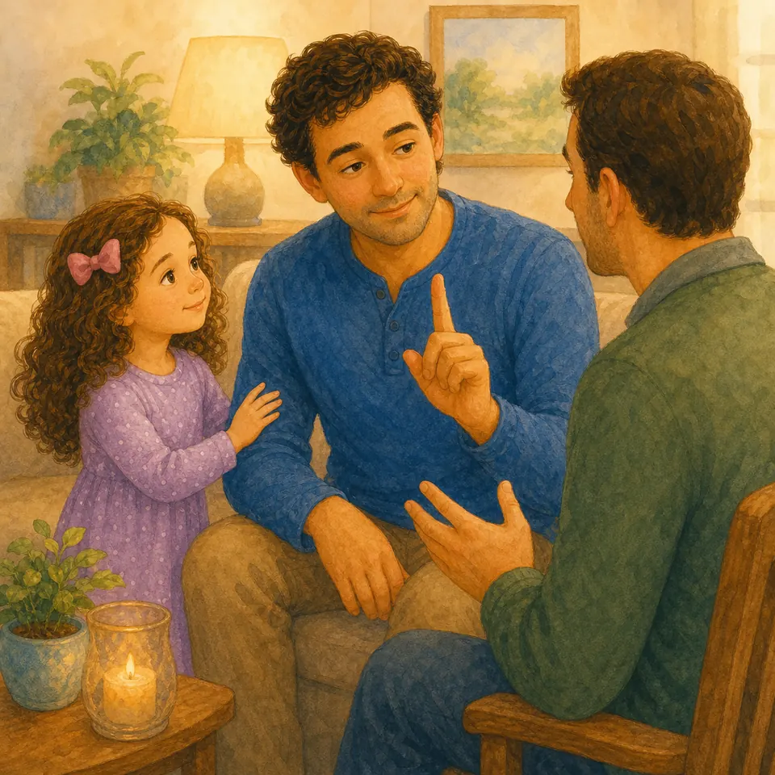{ loading=lazy }

*(Папа поднимает палец: «секундочку», но улыбается)*

Иногда мысль прыгает в голове, как мячик: «Папа! Папа! Папа!» И хочется сказать её сразу, даже если взрослые разговаривают.

Но перебивать — это как открыть дверь без стука. Можно подойти, положить руку папе на плечо или на ладонь и подождать. Папа заметит: «Ты хочешь мне сказать». А потом даст тебе место для слов.

Терпеливое сердце учится: мои слова важные, но слова другого человека тоже важные.

**📖 Стих из Библии:**
13. Кто дает ответ не выслушав, тот глуп, и стыд ему.
Притчи 18:13 (Синодальный перевод)

**🗣 Поговорим:**
*Папа:* Как можно показать, что ты хочешь сказать, не перебивая?
*(Дать дочке ответить)*

**🙏 Наша молитва:**
«Бог, помоги мне слушать и ждать своей очереди говорить. Аминь.»

---

## Глава 166. Когда хочется внимания прямо сейчас

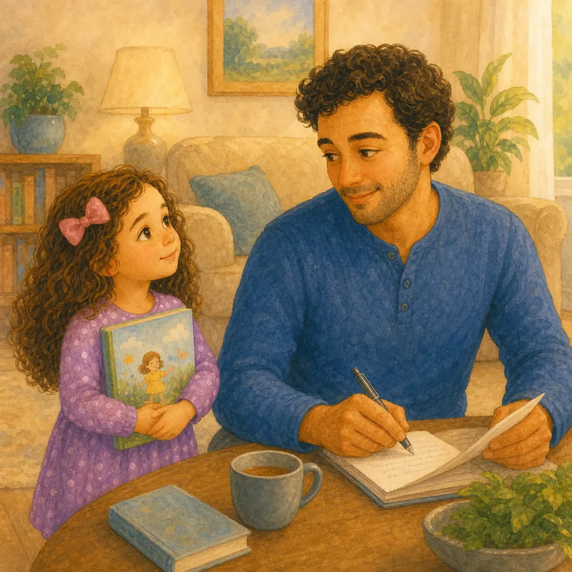{ loading=lazy }

*(Папа прикладывает руку к сердцу)*

Иногда хочется, чтобы мама или папа посмотрели только на тебя. Прямо сейчас. Не через минутку. Не после звонка. Сейчас-сейчас!

Просить внимания можно. Но требовать криком — трудно для всех. Можно сказать: «Папа, мне нужно твоё внимание». Можно обнять за ногу, подождать рядом, принести книжку и спросить: «Когда ты сможешь?»

Ты не становишься менее любимой, если взрослый заканчивает дело. Любовь не исчезает в паузе. Она возвращается к тебе руками, глазами и объятием.

**📖 Стих из Библии:**
4. Любовь долготерпит, милосердствует.
1 Коринфянам 13:4 (Синодальный перевод)

**🗣 Поговорим:**
*Папа:* Как можно попросить внимания без крика?
*(Дать дочке ответить)*

**🙏 Наша молитва:**
«Господь, помоги мне просить любви спокойно и помнить, что я любима. Аминь.»

---

## Глава 167. В гостях другие правила

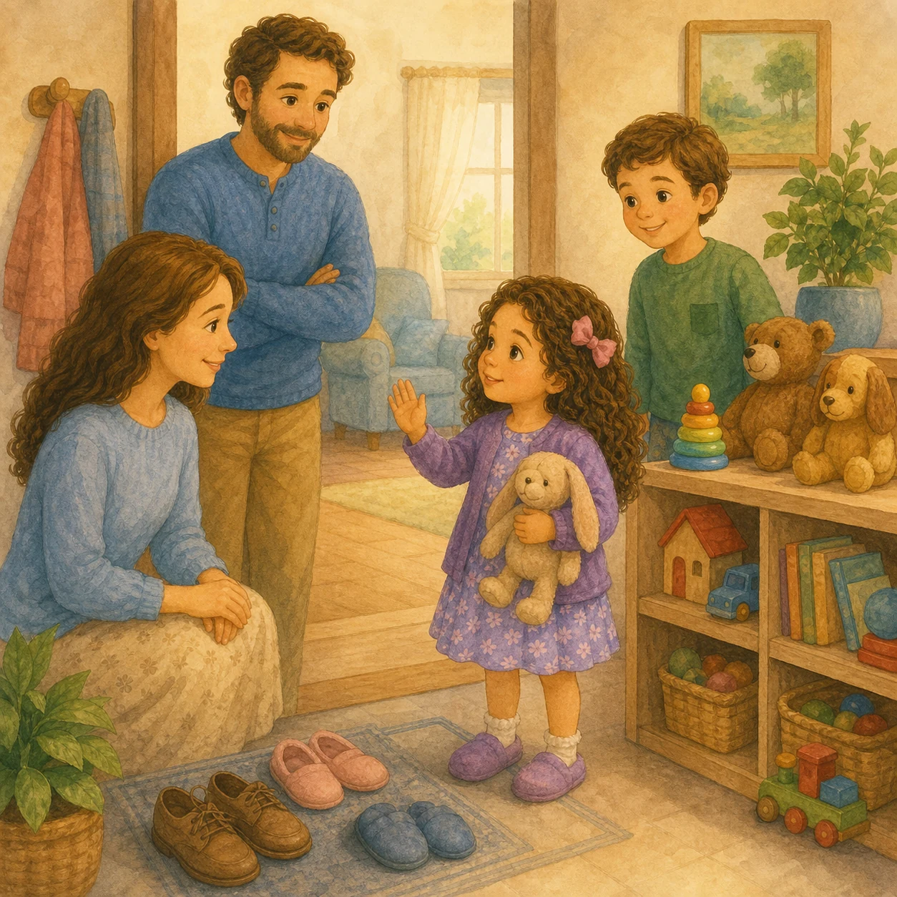{ loading=lazy }

*(Папа будто стучит в чужую дверь)*

В гостях дом не наш. Там могут быть другие тапочки, другие игрушки, другой порядок и другие правила. У кого-то нельзя прыгать на диване. У кого-то игрушки берут только с разрешения.

Когда мы приходим в гости, мы не становимся главными хозяевами. Мы здороваемся, спрашиваем, где можно играть, благодарим за еду и убираем за собой.

Уважение к чужому дому — это любовь в красивых тапочках. Оно говорит: «Мне важны люди, к которым я пришла».

**📖 Стих из Библии:**
10. Будьте братолюбивы друг к другу с нежностью; в почтительности друг друга предупреждайте.
Римлянам 12:10 (Синодальный перевод)

**🗣 Поговорим:**
*Папа:* Что нужно спросить, когда хочешь взять игрушку в гостях?
*(Дать дочке ответить)*

**🙏 Наша молитва:**
«Бог, помоги мне быть доброй гостьей и уважать чужой дом. Аминь.»

---

## Глава 168. Когда приснился плохой сон

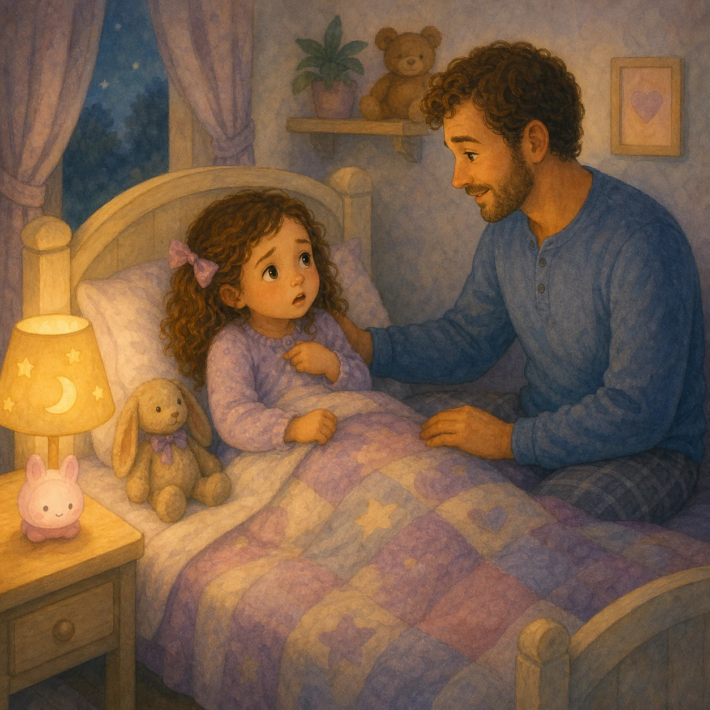{ loading=lazy }

*(Папа говорит тихо, как ночью)*

Иногда ночью приходит плохой сон. Он может быть страшным, громким, странным. Ты просыпаешься, а сердце стучит: «Это правда?»

Сон — это картинка во сне. Он не командует домом. Можно позвать маму или папу, попить воды, включить ночник и помолиться коротко: «Иисус, будь рядом».

Бог не спит, когда мы спим. Он видит темноту, кроватку, твоё сердечко и наши шаги к тебе.

**📖 Стих из Библии:**
9. Спокойно ложусь я и сплю, ибо Ты, Господи, един даешь мне жить в безопасности.
Псалом 4:9 (Синодальный перевод)

**🗣 Поговорим:**
*Папа:* Что можно сделать, если приснился плохой сон?
*(Дать дочке ответить)*

**🙏 Наша молитва:**
«Господь, храни мой сон и напомни мне, что Ты рядом даже ночью. Аминь.»

---

## Глава 169. Одежда по погоде

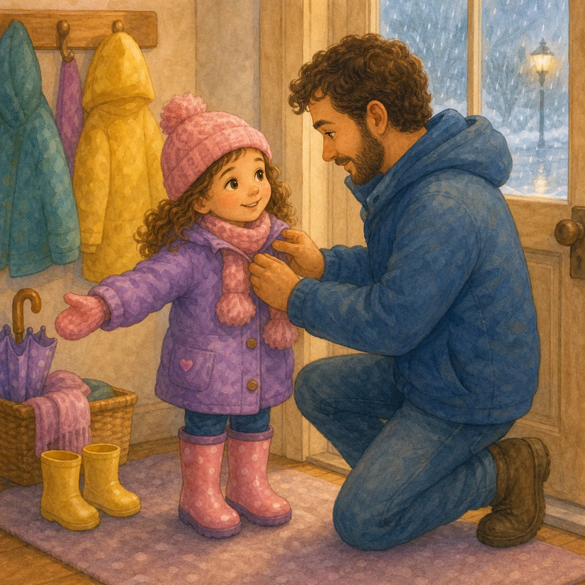{ loading=lazy }

*(Папа показывает шапку, сапожки и лёгкое платье)*

Иногда хочется надеть красивое платье, а на улице холодный ветер. Иногда хочется бежать без куртки, а дождь уже стучит по окну. Одежда по погоде — это забота, а не наказание.

Шапка не враг причёски. Сапоги не враги красоты. Куртка не прячет радость. Они помогают телу быть в тепле, сухости и здоровье.

Мудрая девочка умеет быть красивой и разумной. Красота сердца не боится варежек.

**📖 Стих из Библии:**
21. Не боится стужи для семьи своей, потому что вся семья ее одета в двойные одежды.
Притчи 31:21 (Синодальный перевод)

**🗣 Поговорим:**
*Папа:* Что мы надеваем, когда на улице холодно или дождливо?
*(Дать дочке ответить)*

**🙏 Наша молитва:**
«Бог, помоги мне принимать заботу и одеваться мудро по погоде. Аминь.»

---

## Глава 170. Когда кто-то смеётся над ошибкой

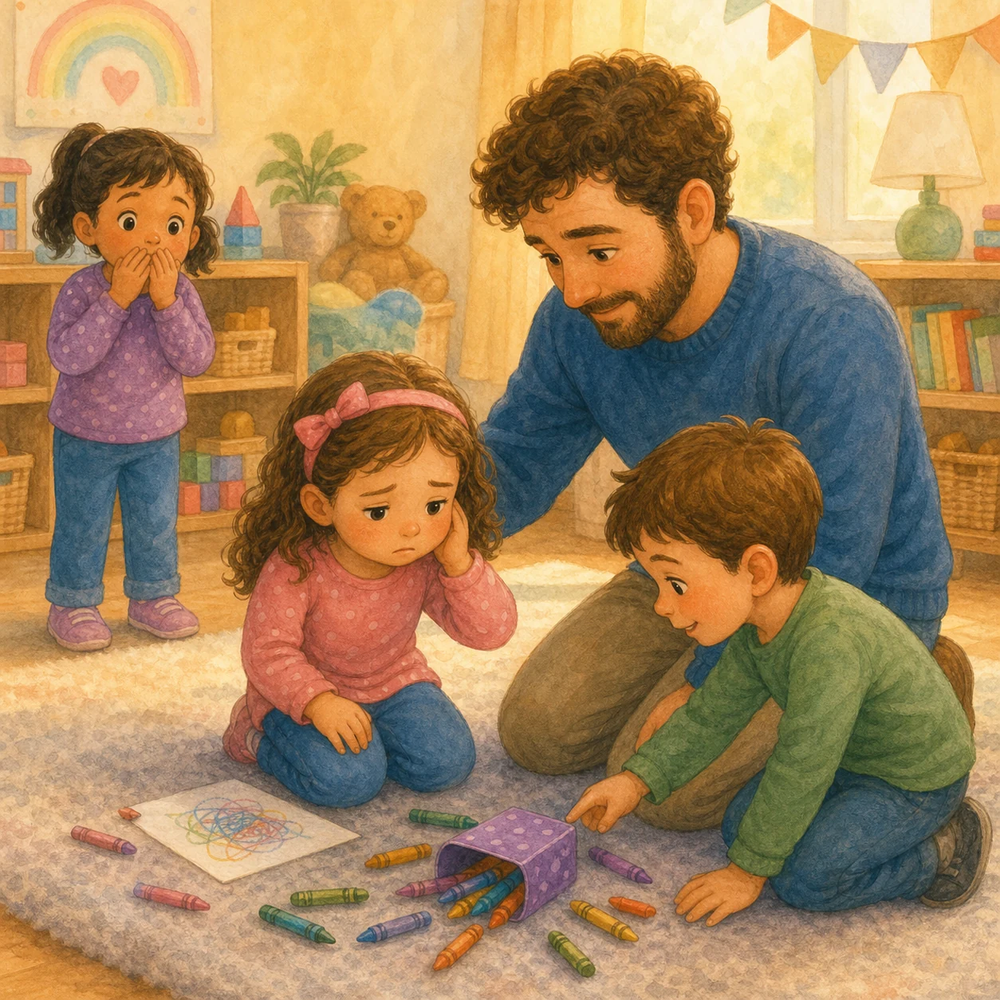{ loading=lazy }

*(Папа берёт дочку за руку)*

Ты сказала слово неправильно, уронила карандаш, не так нарисовала круг — и кто-то засмеялся. Сердцу сразу больно, будто его ткнули пальчиком.

Ошибки бывают у всех. Мы учимся через них. Если над тобой смеются, можно сказать: «Мне неприятно». Можно подойти к взрослому. Можно вспомнить: ошибка не делает тебя смешной или плохой.

И мы сами не смеёмся над чужой ошибкой. Мы помогаем подняться, потому что Иисус поднимает нас.

**📖 Стих из Библии:**
12. Итак во всем, как хотите, чтобы с вами поступали люди, так поступайте и вы с ними.
Матфея 7:12 (Синодальный перевод)

**🗣 Поговорим:**
*Папа:* Что можно сказать, если кто-то смеётся над твоей ошибкой?
*(Дать дочке ответить)*

**🙏 Наша молитва:**
«Иисус, утешь меня, когда мне стыдно, и научи меня не смеяться над другими. Аминь.»

---

## Глава 171. День рождения без капризов

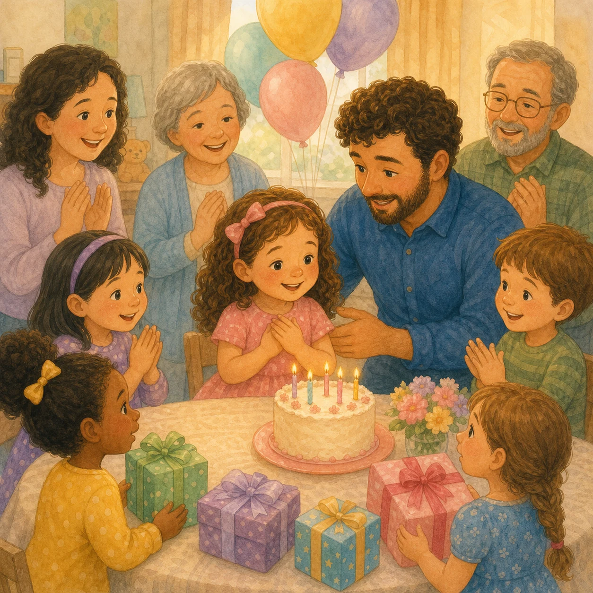{ loading=lazy }

*(Папа будто зажигает свечку на торте)*

День рождения — радостный день. Подарки, гости, торт, шарики, поздравления. Но даже в самый радостный день сердце может захотеть командовать: «Мне! Сейчас! Не так! Ещё!»

Праздник становится красивее, когда в нём есть благодарность. Спасибо за гостей. Спасибо за помощь. Спасибо за подарок. Спасибо за торт. Спасибо Богу за ещё один год жизни.

Именинница — не маленькая царица капризов. Она радостная девочка, которая умеет принимать любовь и делиться радостью.

**📖 Стих из Библии:**
24. Сей день сотворил Господь: возрадуемся и возвеселимся в оный!
Псалом 117:24 (Синодальный перевод)

**🗣 Поговорим:**
*Папа:* За что можно благодарить Бога в день рождения?
*(Дать дочке ответить)*

**🙏 Наша молитва:**
«Бог, спасибо за мою жизнь, семью и радость праздника. Помоги мне праздновать без капризов. Аминь.»

---

## Глава 172. Когда нужно подождать взрослого разговора

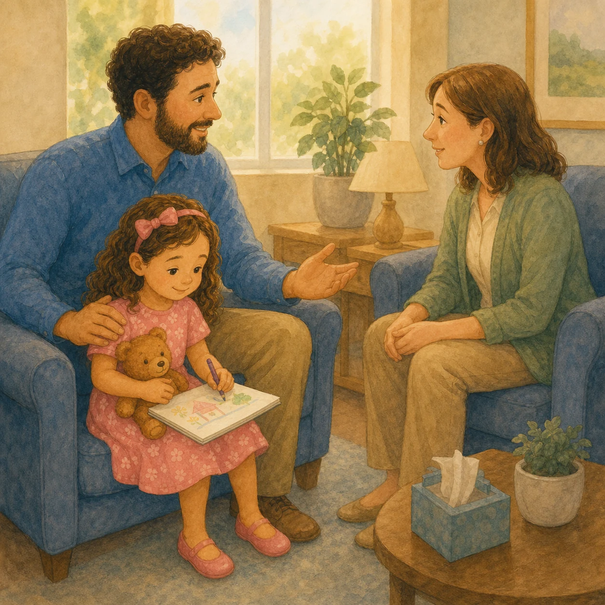{ loading=lazy }

*(Папа показывает ладонью маленькую паузу)*

Иногда взрослые говорят о важном: врач, дорога, деньги, работа, семейное дело. Тебе может быть скучно, и очень хочется забраться в середину разговора.

Но можно подождать. Можно сидеть рядом, держать игрушку, рисовать, положить руку папе на руку и показать: «Я жду». Взрослый разговор не значит, что тебя забыли.

Подождать — это маленькая сила. Она растёт в сердце незаметно, как росточек в земле.

**📖 Стих из Библии:**
1. Всему свое время, и время всякой вещи под небом.
Екклесиаст 3:1 (Синодальный перевод)

**🗣 Поговорим:**
*Папа:* Что можно делать тихо, пока взрослые заканчивают разговор?
*(Дать дочке ответить)*

**🙏 Наша молитва:**
«Господь, дай мне терпение ждать и верить, что меня услышат. Аминь.»

---

## Глава 173. Если увидела опасную вещь на полу

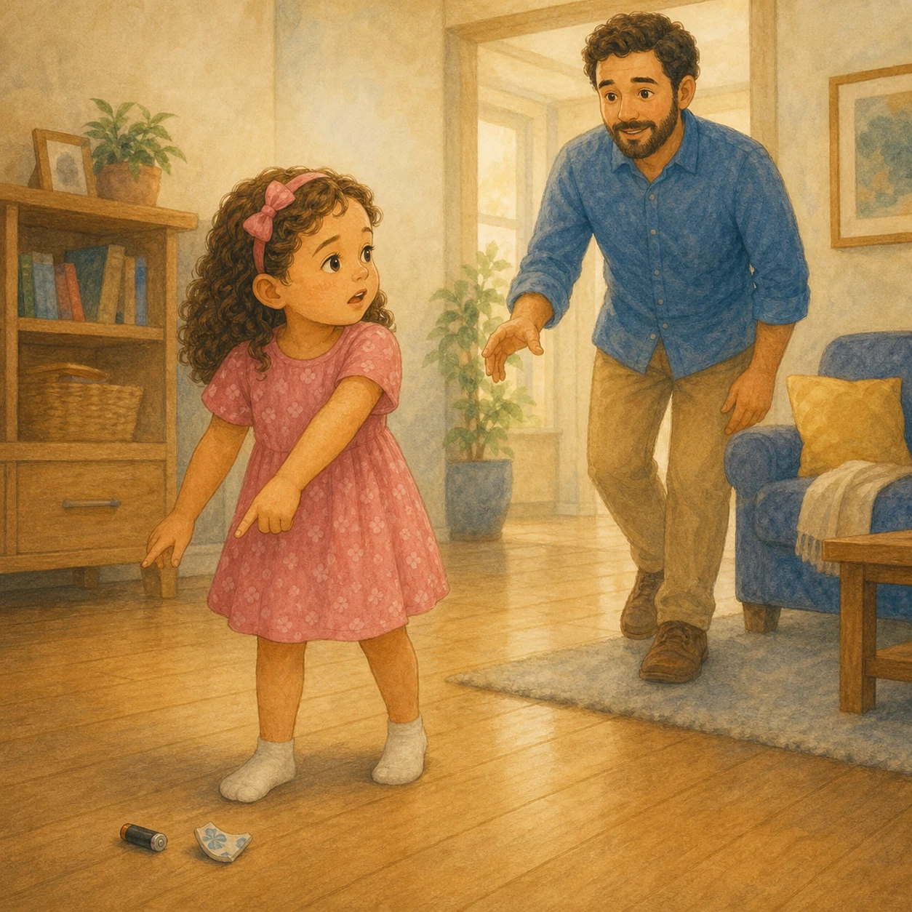{ loading=lazy }

*(Папа показывает: не трогать, позвать)*

На полу иногда может лежать что-то опасное: стекло, иголка, таблетка, острый кусочек, батарейка или неизвестная вещь. Даже если интересно, руками не трогаем.

Правило простое: остановись, отойди, позови взрослого. Не прячь, не пробуй, не клади в рот, не несёшь младшему. Твоя работа — заметить и сказать.

Так ты становишься маленькой хранительницей безопасности. Не героиней, которая всё хватает, а мудрой девочкой, которая зовёт помощь.

**📖 Стих из Библии:**
3. Благоразумный видит беду и укрывается; а неопытные идут вперед и наказываются.
Притчи 22:3 (Синодальный перевод)

**🗣 Поговорим:**
*Папа:* Что ты сделаешь, если увидишь на полу таблетку или стекло?
*(Дать дочке ответить)*

**🙏 Наша молитва:**
«Господь, помоги мне замечать опасное и сразу звать взрослых. Аминь.»

---

## Глава 174. Как быть с угощениями от других людей

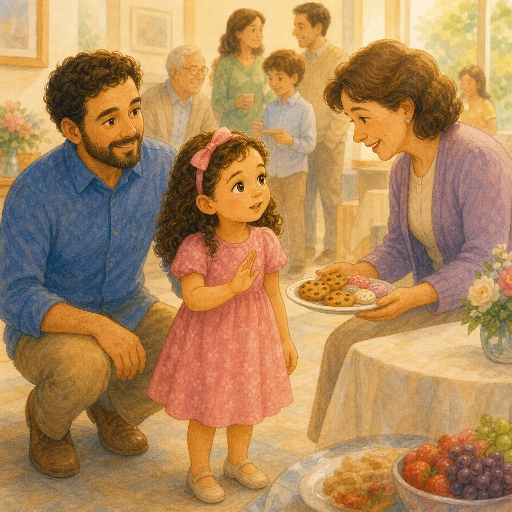{ loading=lazy }

*(Папа показывает конфетку на ладони, но ждёт)*

Иногда кто-то предлагает конфету, печенье, сок или ягодку. Может быть вкусно и красиво. Но сначала мы спрашиваем маму или папу.

Почему? Потому что взрослые знают, что тебе можно, а что нельзя. Может быть аллергия, грязные руки, неподходящее время или просто незнакомый человек.

Вежливая девочка может сказать: «Спасибо, я спрошу у мамы». Это не грубость. Это мудрость и безопасность.

**📖 Стих из Библии:**
15. Благоразумный внимателен к путям своим.
Притчи 14:15 (Синодальный перевод)

**🗣 Поговорим:**
*Папа:* Что нужно сделать, прежде чем взять угощение?
*(Дать дочке ответить)*

**🙏 Наша молитва:**
«Бог, помоги мне быть вежливой и осторожной с угощениями. Аминь.»

---

## Глава 175. Семейные традиции

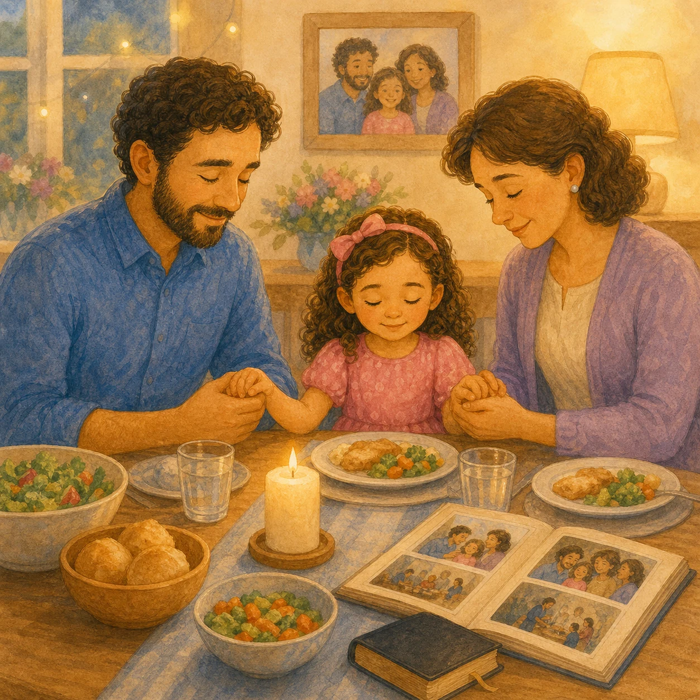{ loading=lazy }

*(Папа обводит рукой всех за столом)*

В нашей семье есть маленькие огоньки, которые повторяются: молитва перед едой, сказка на ночь, воскресный день, звонок бабушке, семейный обед, песня, объятие перед сном.

Традиции говорят сердцу: «Ты дома. Ты принадлежишь семье. Мы помним друг друга». Они не должны быть идеальными. Иногда суп простой, песня тихая, кто-то устал. Но любовь всё равно собирает нас вместе.

Когда мы повторяем доброе, оно становится дорожкой. По этой дорожке сердце легче идёт к Богу и к семье.

**📖 Стих из Библии:**
7. И внушай их детям твоим и говори о них, сидя в доме твоем и идя дорогою, и ложась и вставая.
Второзаконие 6:7 (Синодальный перевод)

**🗣 Поговорим:**
*Папа:* Какая семейная традиция тебе особенно нравится?
*(Дать дочке ответить)*

**🙏 Наша молитва:**
«Господь, благослови наши семейные традиции и сделай наш дом местом любви. Аминь.»
