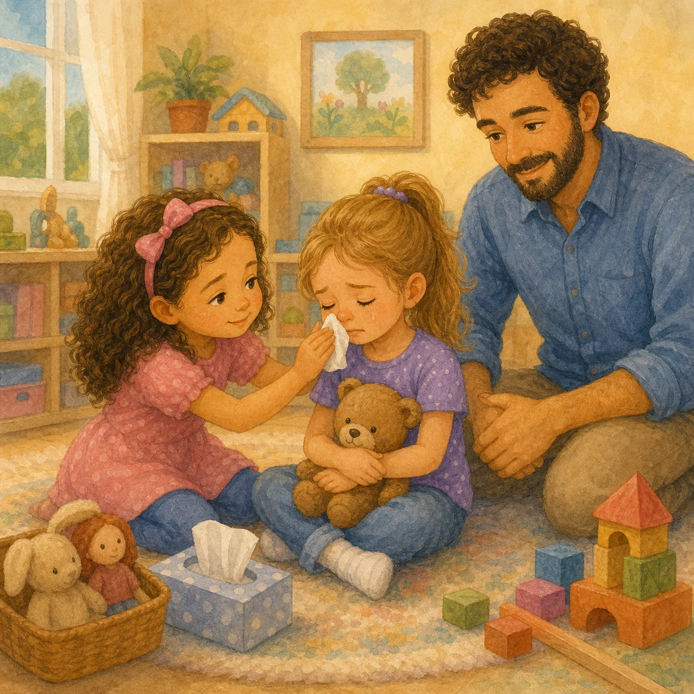
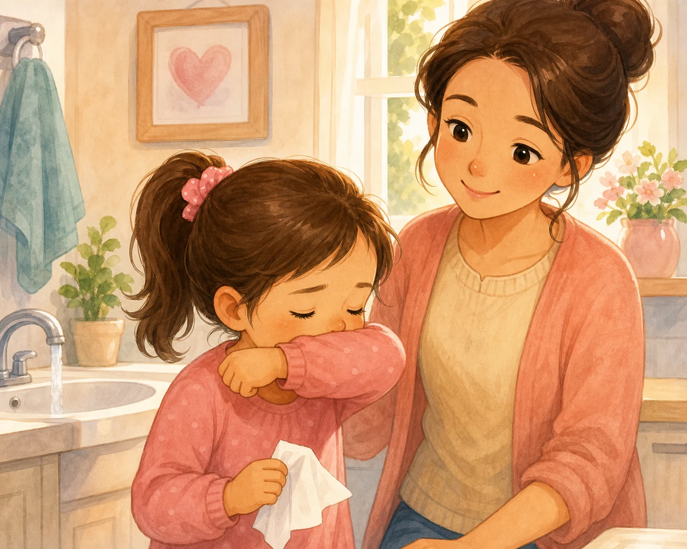
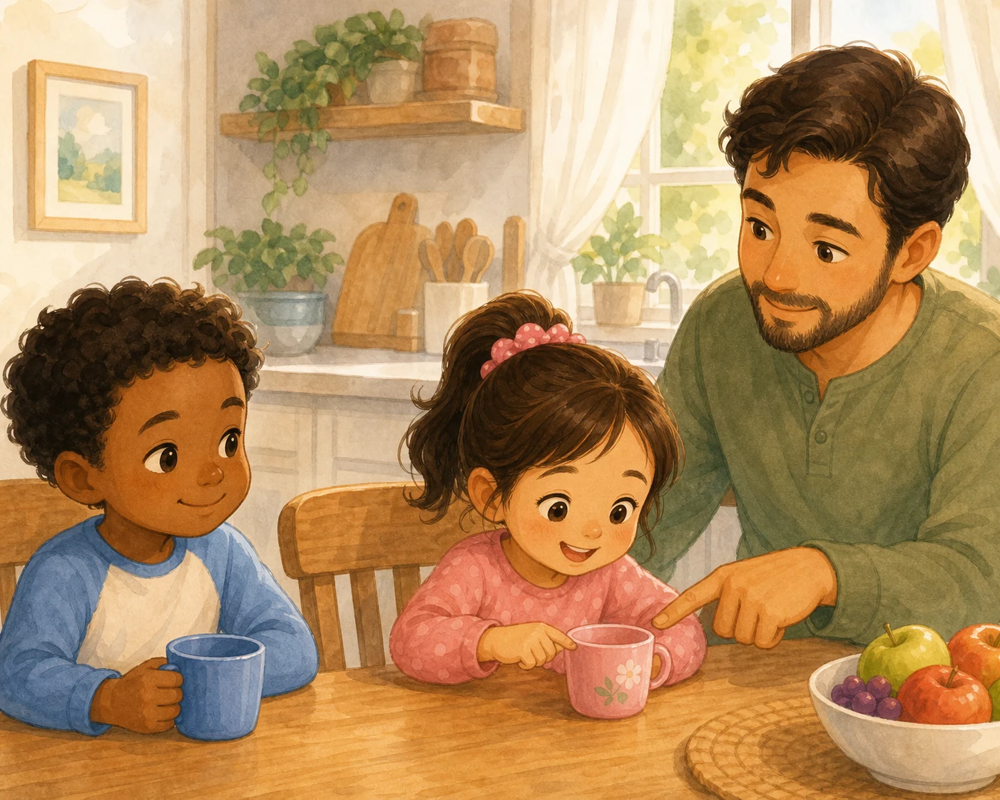
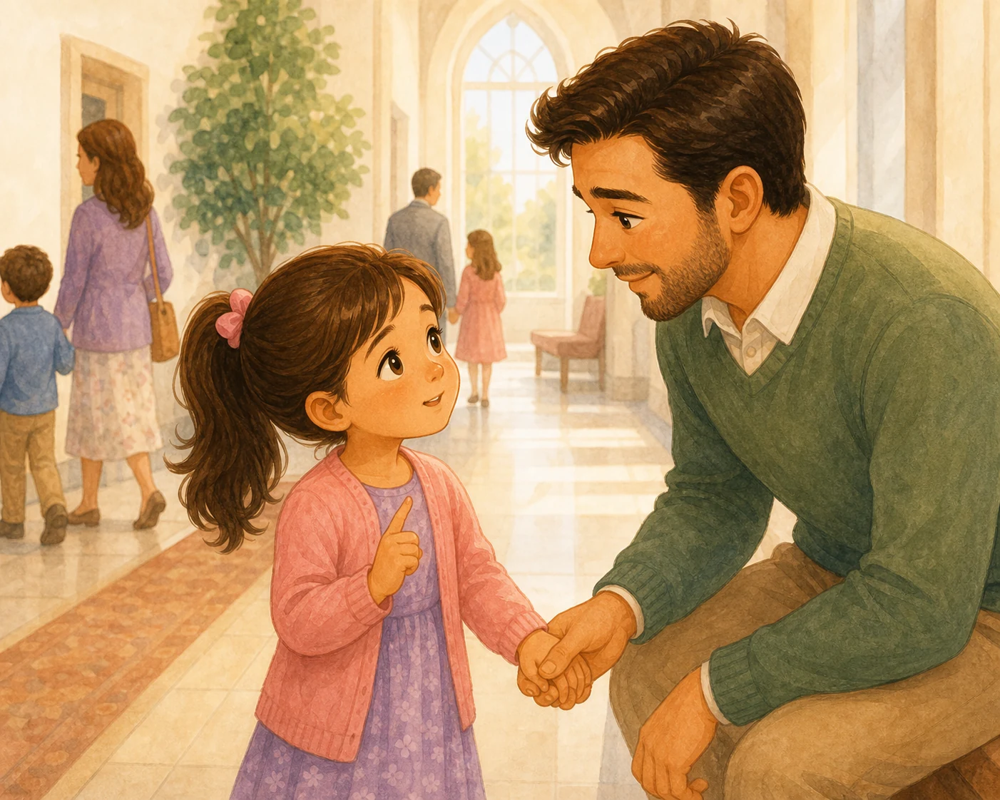
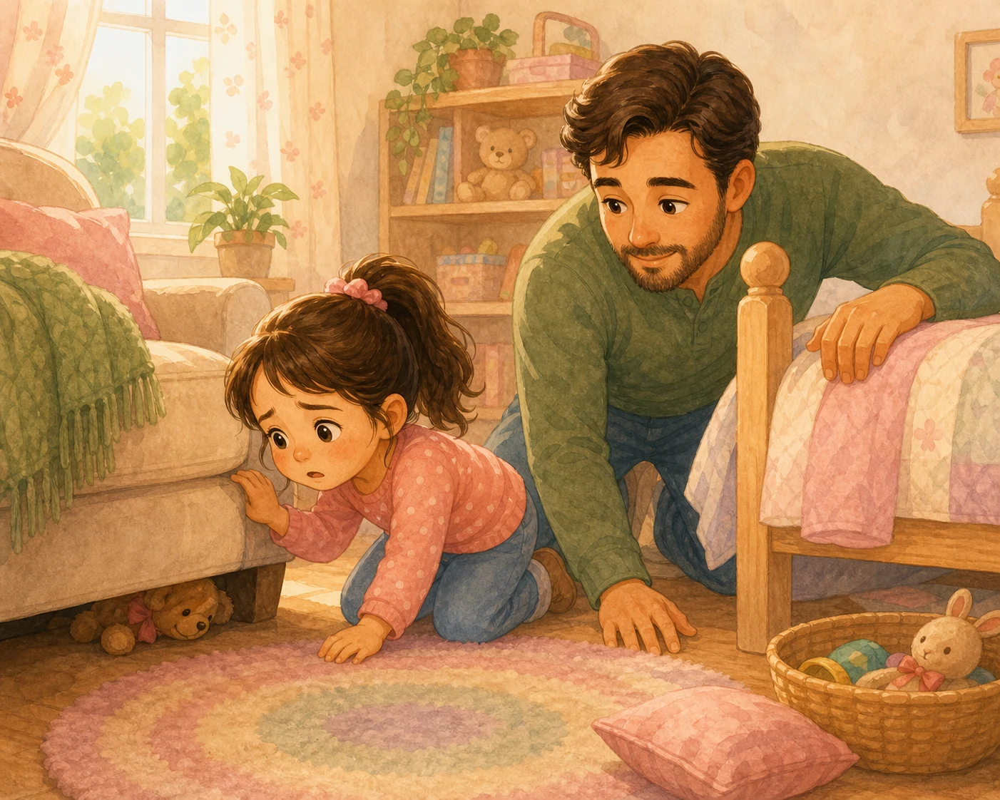
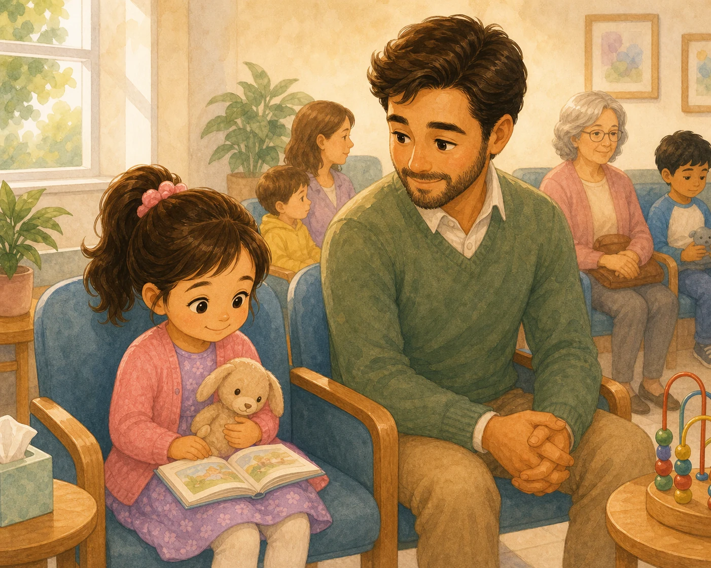
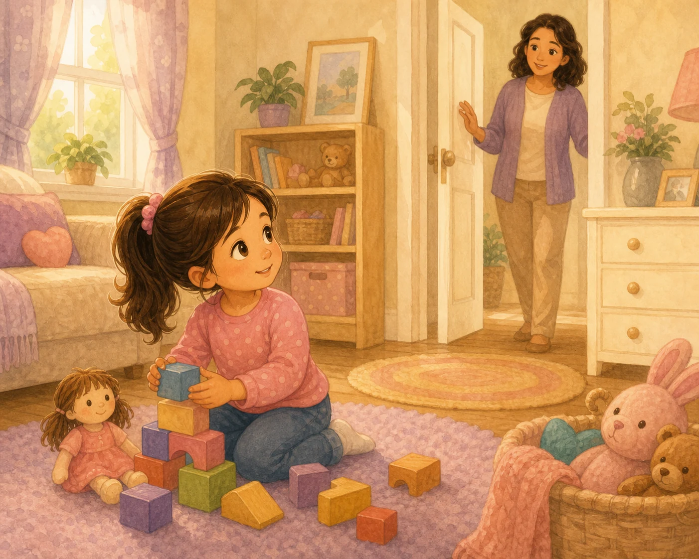
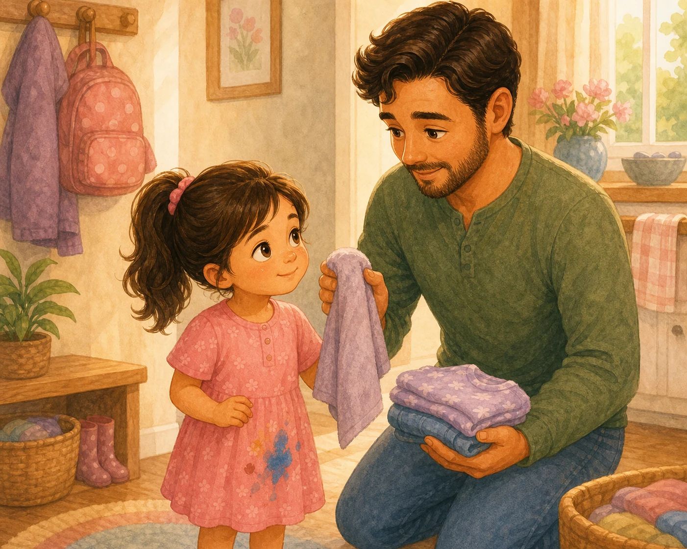
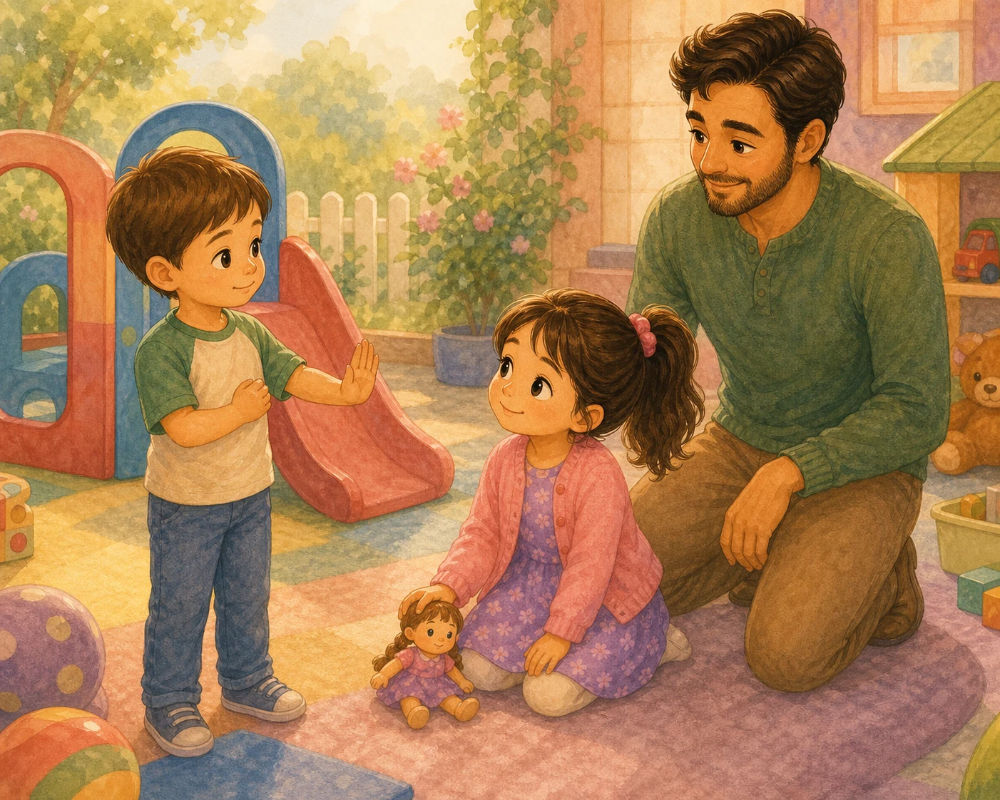

# Часть 16. Маленькая забота

## В этой части

- [Глава 176. Когда другой ребёнок плачет](#ch-176)
- [Глава 177. Кашель, сопли и чистый нос](#ch-177)
- [Глава 178. Не пить из чужого стакана](#ch-178)
- [Глава 179. Если нужно в туалет вне дома](#ch-179)
- [Глава 180. Когда потерялась любимая игрушка](#ch-180)
- [Глава 181. Как ждать в поликлинике или очереди](#ch-181)
- [Глава 182. Когда тебя зовут, а ты играешь](#ch-182)
- [Глава 183. Почему нельзя прятаться от родителей в магазине или гостях](#ch-183)
- [Глава 184. Как быть, если одежда испачкалась](#ch-184)
- [Глава 185. Когда кто-то не хочет с тобой играть](#ch-185)

{ loading=lazy }

## Глава 176. Когда другой ребёнок плачет {#ch-176}

*(Папа говорит тихо, будто рядом кто-то грустит)*

Иногда рядом плачет другой ребёнок. Может быть, он упал, потерял игрушку, испугался или просто очень устал. В такие минуты не надо смеяться, показывать пальцем или громко спрашивать: «Почему ты ревёшь?»

Можно стать мягче. Можно сказать: «Тебе больно?» Можно позвать взрослого. Можно принести салфетку или просто постоять рядом спокойно. Утешать — это не всегда сразу чинить всё. Иногда утешать — значит быть доброй рядом.

Иисус замечал плачущих людей. Когда мы не смеёмся над чужими слезами, а помогаем, наше сердце становится похожим на Его сердце.

**📖 Стих из Библии:**
15. Радуйтесь с радующимися и плачьте с плачущими.
Римлянам 12:15 (Синодальный перевод)

**🗣 Поговорим:**
*Папа:* Что можно сделать, если рядом плачет ребёнок?
*(Дать дочке ответить)*

**🙏 Наша молитва:**
«Иисус, дай мне нежное сердце к тем, кто плачет. Научи меня утешать, а не смеяться. Аминь.»

---

{ loading=lazy }

## Глава 177. Кашель, сопли и чистый нос {#ch-177}

*(Папа показывает салфетку и локоток)*

Когда носик течёт, он просит салфетку. Когда хочется кашлянуть или чихнуть, ротик прикрывают локтем или салфеткой. Это не просто «правило для красоты». Это забота о людях рядом.

Микробы маленькие, их не видно, но они любят путешествовать на грязных руках. Поэтому мы вытираем нос, выбрасываем салфетку и моем руки. Не размазываем по рукаву, не трогаем лицо друга, не дуем кашлем в чужую сторону.

Чистый нос и чистые руки — маленькое служение любви. Так мы бережём себя и ближних.

**📖 Стих из Библии:**
31. Возлюби ближнего твоего, как самого себя.
Марка 12:31 (Синодальный перевод)

**🗣 Поговорим:**
*Папа:* Чем прикрываем рот, когда кашляем или чихаем?
*(Дать дочке ответить)*

**🙏 Наша молитва:**
«Бог, помоги мне заботиться о чистоте и беречь людей рядом. Аминь.»

---

{ loading=lazy }

## Глава 178. Не пить из чужого стакана {#ch-178}

*(Папа ставит два воображаемых стаканчика рядом)*

У каждого человека может быть свой стакан, своя бутылочка, своя ложка. Даже если у подружки сок вкуснее, не нужно пить из её стакана. И свою бутылочку не надо передавать всем по кругу.

Это не жадность. Это забота о здоровье. Иногда человек ещё не знает, что заболевает, а микробы уже готовы переселиться. Поэтому мы спрашиваем взрослого и пьём из своего.

Любовь — это не только делиться игрушкой. Любовь иногда говорит: «Я берегу тебя и себя».

**📖 Стих из Библии:**
24. Никто не ищи своего, но каждый пользы другого.
1 Коринфянам 10:24 (Синодальный перевод)

**🗣 Поговорим:**
*Папа:* Почему у каждого должен быть свой стакан?
*(Дать дочке ответить)*

**🙏 Наша молитва:**
«Господь, научи меня быть заботливой и внимательной даже в маленьких вещах. Аминь.»

---

{ loading=lazy }

## Глава 179. Если нужно в туалет вне дома {#ch-179}

*(Папа говорит спокойно, без смешка)*

Иногда животик или мочевой пузырь говорят: «Мне нужно!» — а вы не дома. В магазине, церкви, гостях, машине или поликлинике тоже можно попросить взрослого о помощи.

Не надо терпеть до слёз и не надо стыдиться. Можно подойти и тихо сказать: «Папа, мне нужно в туалет». Взрослый поможет найти безопасное место, подождёт рядом и даст салфетку или воду для рук.

Тело говорит важные сигналы. Мудрая девочка учится слышать их заранее.

**📖 Стих из Библии:**
40. Только все должно быть благопристойно и чинно.
1 Коринфянам 14:40 (Синодальный перевод)

**🗣 Поговорим:**
*Папа:* Как можно тихо сказать взрослому, что тебе нужен туалет?
*(Дать дочке ответить)*

**🙏 Наша молитва:**
«Бог, помоги мне не стыдиться просить помощи и заботиться о теле вовремя. Аминь.»

---

{ loading=lazy }

## Глава 180. Когда потерялась любимая игрушка {#ch-180}

*(Папа заглядывает под воображаемую подушку)*

Любимая игрушка может исчезнуть: под кроватью, в машине, у бабушки, в садике, под одеялом. Сердце сразу тревожится: «Где она? Я без неё не могу!»

Можно грустить. Любимая вещь правда дорогая. Но сначала мы дышим, потом ищем: где играли, где спали, куда ходили. Можно попросить взрослого помочь. А если игрушка не нашлась сразу, мы всё равно не одни.

Бог заботится даже о наших маленьких печалях. И папа рядом, чтобы искать, утешать и ждать вместе.

**📖 Стих из Библии:**
7. Все заботы ваши возложите на Него, ибо Он печется о вас.
1 Петра 5:7 (Синодальный перевод)

**🗣 Поговорим:**
*Папа:* Где сначала стоит искать потерянную игрушку?
*(Дать дочке ответить)*

**🙏 Наша молитва:**
«Господь, помоги мне спокойно искать и помнить, что Ты заботишься обо мне. Аминь.»

---

{ loading=lazy }

## Глава 181. Как ждать в поликлинике или очереди {#ch-181}

*(Папа показывает маленькую сумку с книжкой)*

В поликлинике, банке, магазине или очереди время тянется медленно-медленно. Ноги хотят бегать, рот хочет громко говорить, руки хотят трогать всё вокруг.

Но очередь — место для терпения. Можно взять книжку, маленькую игрушку, тихо рассматривать картинки, сидеть рядом с папой, шептать вопрос на ушко. Не бегать между людьми и не трогать чужие вещи.

Ждать трудно даже большим. Поэтому мы учимся по чуть-чуть. Терпение растёт не сразу, а маленькими минутками.

**📖 Стих из Библии:**
7. Будь покорен Господу и надейся на Него.
Псалом 36:7 (Синодальный перевод)

**🗣 Поговорим:**
*Папа:* Что можно делать тихо, когда мы ждём очередь?
*(Дать дочке ответить)*

**🙏 Наша молитва:**
«Господь, дай мне терпение ждать спокойно и не мешать людям рядом. Аминь.»

---

{ loading=lazy }

## Глава 182. Когда тебя зовут, а ты играешь {#ch-182}

*(Папа зовёт ласково, не крича)*

Игра бывает такая интересная, что ушки будто закрываются: кукла заболела, башня почти готова, машинка едет в дальнюю страну. А мама зовёт. Или папа зовёт.

Когда тебя зовут, важно откликнуться. Можно сказать: «Я слышу!» Можно подойти. Можно попросить: «Можно я дострою один кубик?» Но молчать, прятаться и делать вид, что не слышишь, — не честно.

Откликаться — это маленькое послушание. Оно говорит: «Я уважаю тех, кто меня любит».

**📖 Стих из Библии:**
8. Слушай, сын мой, наставление отца твоего и не отвергай завета матери твоей.
Притчи 1:8 (Синодальный перевод)

**🗣 Поговорим:**
*Папа:* Что можно ответить, когда тебя позвали?
*(Дать дочке ответить)*

**🙏 Наша молитва:**
«Бог, помоги мне слышать маму и папу и откликаться с добрым сердцем. Аминь.»

---

{ loading=lazy }

## Глава 183. Почему нельзя прятаться от родителей в магазине или гостях {#ch-183}

*(Папа крепко держит дочку за руку)*

Прятки — хорошая игра дома, когда все знают, что мы играем. Но в магазине, на улице, в гостях или церкви нельзя прятаться от родителей. Даже на секундочку.

Когда ребёнка не видно, сердце мамы и папы пугается. А вокруг могут быть двери, лестницы, незнакомые люди и места, где легко потеряться. Поэтому правило простое: остаёмся рядом и говорим, куда идём.

Быть рядом — не значит быть маленькой навсегда. Это значит быть мудрой и безопасной сейчас.

**📖 Стих из Библии:**
3. Благоразумный видит беду и укрывается; а неопытные идут вперед и наказываются.
Притчи 22:3 (Синодальный перевод)

**🗣 Поговорим:**
*Папа:* Где можно играть в прятки, а где нельзя?
*(Дать дочке ответить)*

**🙏 Наша молитва:**
«Господь, помоги мне держаться рядом с родителями и не пугать их прятками. Аминь.»

---

{ loading=lazy }

## Глава 184. Как быть, если одежда испачкалась {#ch-184}

*(Папа показывает пятнышко и улыбается спокойно)*

Одежда может испачкаться: суп капнул, краска попала, лужа прыгнула на колготки, трава оставила зелёный след. Это неприятно, но это не страшная беда.

Не надо прятать мокрые рукава или плакать от стыда. Можно сказать взрослому: «Я испачкалась». Мы вытрем, постираем, переоденемся, а если нужно — посмеёмся мягко и пойдём дальше.

Чистая одежда хороша, но чистое сердце важнее. Ошибка с пятном не делает тебя плохой.

**📖 Стих из Библии:**
8. Но Бог Свою любовь к нам доказывает тем, что Христос умер за нас, когда мы были еще грешниками.
Римлянам 5:8 (Синодальный перевод)

**🗣 Поговорим:**
*Папа:* Что нужно сказать, если одежда стала мокрой или грязной?
*(Дать дочке ответить)*

**🙏 Наша молитва:**
«Бог, помоги мне не стыдиться маленьких неприятностей и говорить правду. Аминь.»

---

{ loading=lazy }

## Глава 185. Когда кто-то не хочет с тобой играть {#ch-185}

*(Папа разводит ладони: «бывает и так»)*

Иногда ты зовёшь: «Поиграй со мной!» — а другой ребёнок говорит: «Не хочу». Или играет с кем-то ещё. Сердцу обидно, будто дверь тихо закрылась.

Но «не хочу играть» не значит «ты плохая». У другого человека тоже есть желания, усталость, настроение и выбор. Можно спросить один раз. Можно предложить позже. Можно найти другую игру или другого друга.

Любовь не заставляет дружить силой. Доброе сердце умеет принимать отказ и всё равно не злиться навсегда.

**📖 Стих из Библии:**
12. Итак во всем, как хотите, чтобы с вами поступали люди, так поступайте и вы с ними.
Матфея 7:12 (Синодальный перевод)

**🗣 Поговорим:**
*Папа:* Что можно сделать, если друг сейчас не хочет играть?
*(Дать дочке ответить)*

**🙏 Наша молитва:**
«Иисус, помоги мне принимать чужое “нет” и не думать, что я нелюбима. Аминь.»
