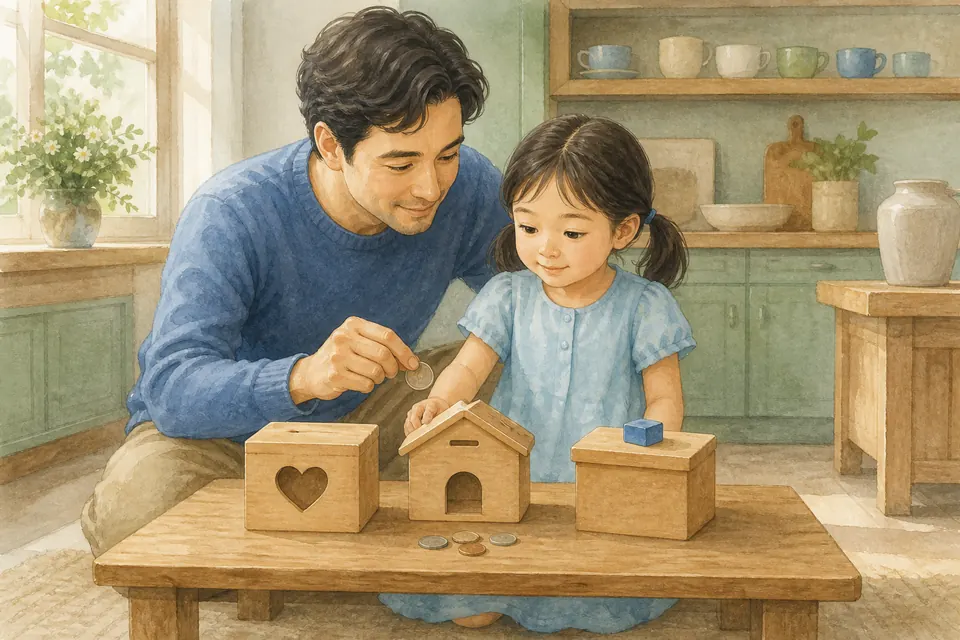
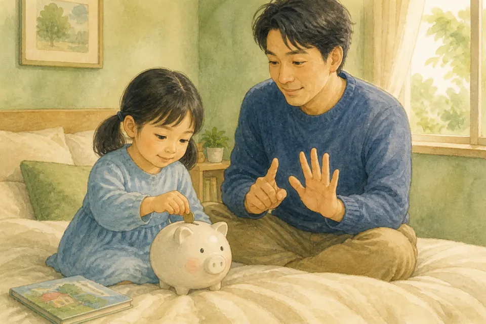
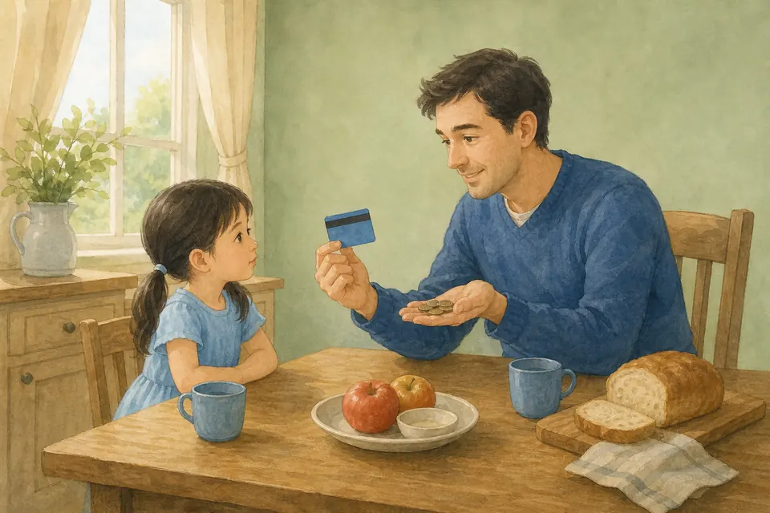
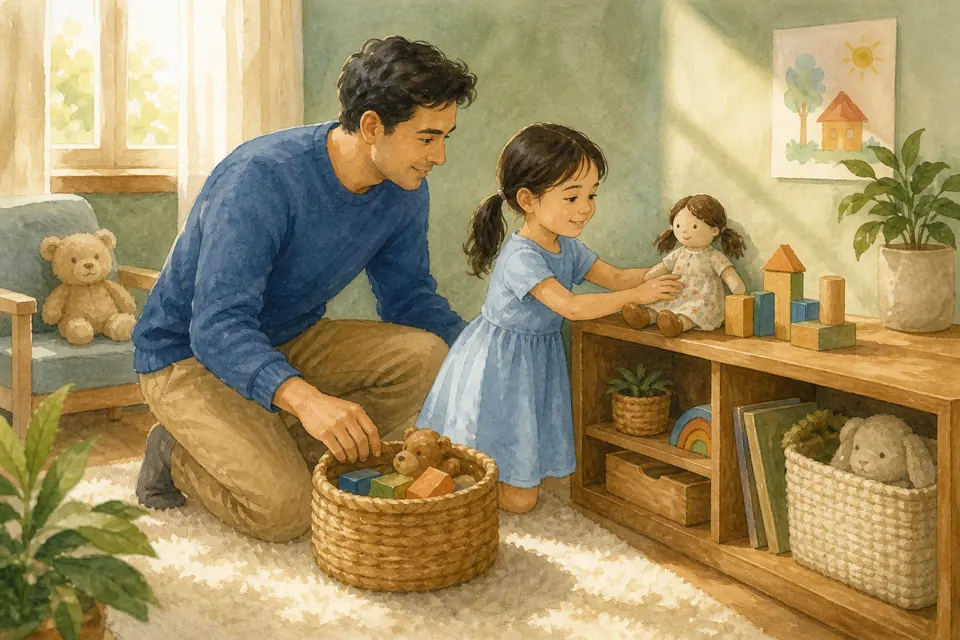
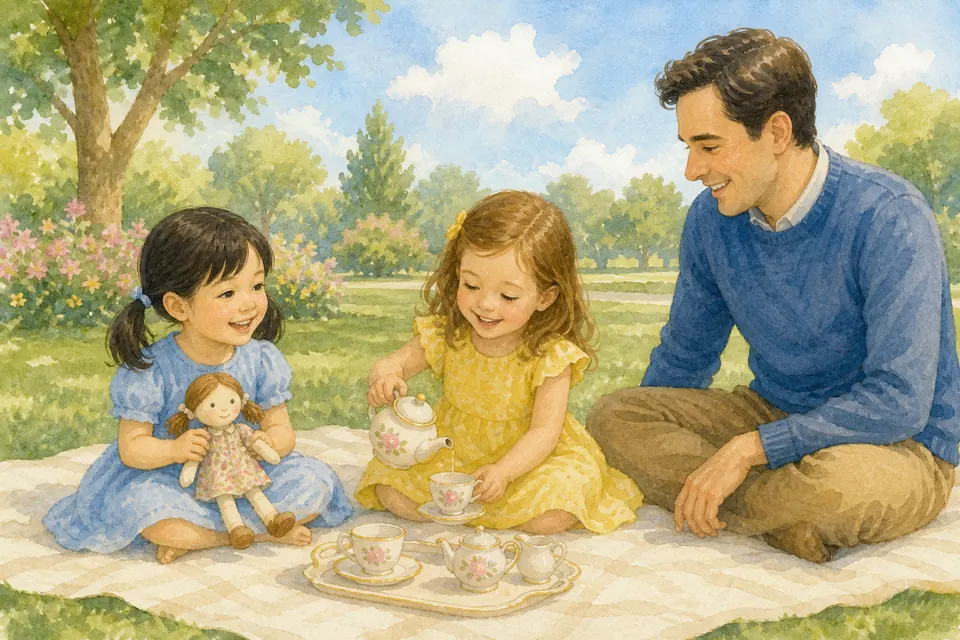
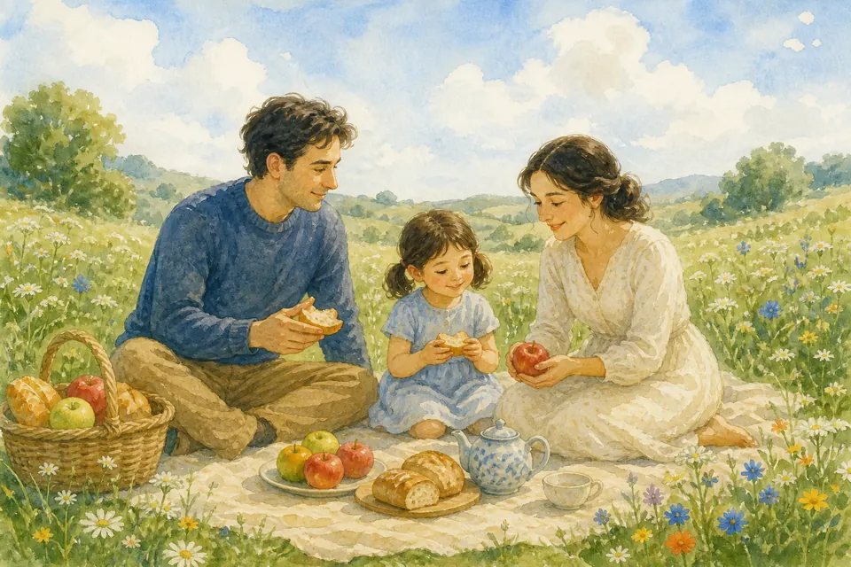

## В этой части

- [Глава 198. Деньги — помощник, не царь](#ch-198)
- [Глава 199. Папа и мама работают](#ch-199)
- [Глава 200. Три коробочки: отдать, сохранить, потратить](#ch-200)
- [Глава 201. Сначала поделиться](#ch-201)
- [Глава 202. Копилка учит ждать](#ch-202)
- [Глава 203. Карточка — тоже настоящие деньги](#ch-203)
- [Глава 204. Беречь то, что уже есть](#ch-204)
- [Глава 205. У разных семей разное](#ch-205)
- [Глава 206. Честность с деньгами](#ch-206)
- [Глава 207. Довольно — тоже богатство](#ch-207)

В пять лет мы не учим «зарабатывать миллион». Мы учим сердце: деньги — слуга, а не хозяин. Бог даёт нам труд, дом и хлеб. Мы учимся ждать, делиться, беречь и быть честными — маленькими шагами, которые потом вырастут в мудрость.

## Глава 198. Деньги — помощник, не царь

{ loading=lazy }

*(Мама или папа кладёт на ладонь монетку — и тут же улыбается дочке)*

Деньги похожи на лопатку: ими удобно копать грядку, но лопаткой нельзя обнять. Монетки и бумажки помогают купить хлеб, сапоги, лекарство, билет к бабушке. Они не умеют любить. Они не делают тебя лучше других девочек.

Бог больше денег. Мама и папа любят тебя не потому, что у нас полная копилка, и не меньше, если полка в магазине осталась без новой игрушки. Деньги — помощник в доме. Царь у нас другой: Господь.

Когда сердце говорит: «Если купим — я буду счастлива навсегда», можно тихо ответить: «Счастье живёт не в пакете». Счастье — в Боге, в объятии, в мире дома.

**📖 Стих из Библии:**
1. Господня земля и что наполняет ее, вселенная и все живущее в ней.
Псалом 23:1 (Синодальный перевод)

**🗣 Поговорим:**
*Родитель:* Что деньги умеют купить — и чего они купить не умеют?
*(Дать дочке ответить)*

**🙏 Наша молитва:**
«Бог, Ты хозяин всего. Научи меня не кланяться деньгам, а пользоваться ими с мудростью. Аминь.»

---

## Глава 199. Папа и мама работают

{ loading=lazy }

*(Мама или папа надевает воображаемую куртку, потом садится рядом)*

Утром папа или мама уходят на работу. Это не «бросают тебя». Это забота: кто-то честно трудится, чтобы дома был хлеб, свет, крыша и возможность помочь другим.

Деньги не падают с неба и не живут в стенке банкомата, как конфеты. Сначала человек работает. Потом получает плату. Потом семья решает: еда, дом, церковь, сбережение, радость. Ты тоже трудишься — маленькими делами: убрать игрушки, накрыть стол, полить цветок. Это не «зарплата за каждый шаг». Это наша общая семья. Иногда за особое старание можно положить монетку в коробочки — как праздник труда, а не как торг.

Работа — дар Бога. Ленивое «пусть другие» крадёт радость. Честный труд делает сердце крепче.

**📖 Стих из Библии:**
23. От всякого труда есть прибыль, а от пустословия только ущерб.
Притчи 14:23 (Синодальный перевод)

**🗣 Поговорим:**
*Родитель:* Какое маленькое дело сегодня будет твоей «работой» для нашей семьи?
*(Дать дочке ответить)*

**🙏 Наша молитва:**
«Господь, благослови руки мамы и папы. Научи и меня трудиться с радостью. Аминь.»

---

## Глава 200. Три коробочки: отдать, сохранить, потратить

{ loading=lazy }

*(Мама или папа рисует в воздухе три квадратика)*

Когда у тебя появляется монетка — подарок, или плата за особое дело, — мы не бросаем её сразу в витрину. Мы учимся трём коробочкам.

Первая: **отдать**. Чуть-чуть Богу и людям: в церковь, в помощь, в подарок тому, кому нужно.
Вторая: **сохранить**. Подождать большой радости: книжка, конструктор, поездка.
Третья: **потратить**. Маленькая радость сейчас: наклейка, мороженое, открытка.

Три коробочки учат сердце не быть жадным и не быть расточительным. Даже одна монетка может разделиться. Если монетка одна — можно выбрать коробочку вместе. Главное не скорость траты, а мудрость.

**📖 Стих из Библии:**
10. Верный в малом и во многом верен, а неверный в малом неверен и во многом.
Луки 16:10 (Синодальный перевод)

**🗣 Поговорим:**
*Родитель:* Если бы у тебя сейчас была одна монетка — в какую коробочку положишь первой?
*(Дать дочке ответить)*

**🙏 Наша молитва:**
«Иисус, научи меня делить даже малое: отдавать, ждать и радоваться без жадности. Аминь.»

---

## Глава 201. Сначала поделиться

{ loading=lazy }

*(Мама или папа кладёт монетку в раскрытую ладонь — и мягко направляет её «к Богу»)*

Щедрость начинается не с «когда у меня будет много». Она начинается с малого сегодня. Сначала поделиться — значит не доедать всё самой и не оставлять Богу крошки с пола.

В церкви мы кладём пожертвование. Дома можем отложить монетку для нуждающихся, нарисовать открытку, отнести банку в сбор помощи, угостить гостя. Мы отдаём не чтобы Бог «заплатил больше». Мы отдаём, потому что Он уже щедр к нам.

Маленькая монетка из детской ладошки драгоценна, если сердце открыто. Бог любит доброхотного дающего — не того, кого заставили, а того, кто отдаёт с миром.

**📖 Стих из Библии:**
35. ...блаженнее давать, нежели принимать.
Деяния 20:35 (Синодальный перевод)

**🗣 Поговорим:**
*Родитель:* Кому на этой неделе мы можем отдать немного — монетку, время или заботу?
*(Дать дочке ответить)*

**🙏 Наша молитва:**
«Бог, Ты щедр ко мне. Научи отдавать первым, без обиды и без хвастовства. Аминь.»

---

## Глава 202. Копилка учит ждать

{ loading=lazy }

*(Мама или папа медленно опускает монетку в воображаемую щёлку)*

Копилка — не жадный дракон, который всё прячет навсегда. Это учитель ожидания. Сегодня хочется купить сразу. Завтра, если подождать, можно купить то, о чём мечтала дольше — и радость будет глубже.

Мы можем выбрать одну цель: «копим на книжку» или «копим на набор для рисования». Каждый раз, когда кладёшь монетку, сердце учится: не всё бывает в ту же минуту. Это не наказание. Это сила.

Если очень трудно ждать — скажи маме или папе. Можно посмотреть, сколько уже есть, поблагодарить Бога за то, что есть, и сделать маленький шаг дальше. Ждать вместе легче, чем ждать одной.

**📖 Стих из Библии:**
20. Дорогая вещь и елей - в жилище мудрого, а глупый человек расточает их.
Притчи 21:20 (Синодальный перевод)

**🗣 Поговорим:**
*Родитель:* На какую одну радость тебе хочется копить — и сколько терпения для этого нужно?
*(Дать дочке ответить)*

**🙏 Наша молитва:**
«Господь, научи меня ждать. Пусть копилка растит во мне терпение, а не жадность. Аминь.»

---

## Глава 203. Карточка — тоже настоящие деньги

{ loading=lazy }

*(Мама или папа показывает воображаемую карточку, потом качает головой: «не волшебство»)*

В магазине папа иногда не достаёт монетки, а прикладывает карточку или телефон. Кажется: чик — и всё наше. Как будто деньги не кончаются.

Но карточка — это не волшебная палочка. За ней стоят те же деньги, которые мама и папа заработали трудом. Если прикладывать без ума, коробочка семьи пустеет так же, как если бы мы сыпали монетки на пол.

Поэтому в магазине мы спрашиваем: «Это в нашем списке? Это нужно? Это мудро?» Карточка послушна мудрости. Она не хозяин. И телефон с оплатой — тоже не игра.

**📖 Стих из Библии:**
5. Имейте нрав несребролюбивый, довольствуясь тем, что есть. Ибо Сам сказал: не оставлю тебя и не покину тебя.
Евреям 13:5 (Синодальный перевод)

**🗣 Поговорим:**
*Родитель:* Почему «чик» карточкой — это всё равно настоящая плата, а не подарок магазина?
*(Дать дочке ответить)*

**🙏 Наша молитва:**
«Бог, научи нашу семью платить мудро — и монетками, и карточкой. Аминь.»

---

## Глава 204. Беречь то, что уже есть

{ loading=lazy }

*(Мама или папа аккуратно ставит игрушку на полку)*

Новая вещь блестит. Старая вещь иногда кажется «уже неинтересной». Но Бог учит беречь: куклу не бросать под ноги, карандаши не ломать «просто так», куртку вешать, еду не раскидывать.

Бережливость — это любовь к дару. Если сломалось — чиним, если можно. Если выросло — отдаём младшим. Если ещё служит — не бежим сразу за новой «такой же, только ярче».

Чем лучше мы храним, тем меньше сердцу нужно кричать «купи ещё». Руки, которые берегут, становятся мудрыми руками.

**📖 Стих из Библии:**
2. От домостроителей же требуется, чтобы каждый оказался верным.
1 Коринфянам 4:2 (Синодальный перевод)

**🗣 Поговорим:**
*Родитель:* Какую свою вещь ты хочешь беречь лучше на этой неделе?
*(Дать дочке ответить)*

**🙏 Наша молитва:**
«Творец, спасибо за то, что у меня уже есть. Научи беречь дары, а не ломать их от скуки. Аминь.»

---

## Глава 205. У разных семей разное

{ loading=lazy }

*(Мама или папа широко разводит руками, потом складывает их на сердце)*

У одной подруги много игрушек. У другой — мало. У кого-то большая квартира, у кого-то маленькая. Это не оценка человека. Бог не вешает на детей ценник.

Мы не смеёмся над тем, у кого меньше. Не хвастаемся, если у нас больше. Не говорим: «А вот у нас…» — чтобы уколоть. Можно порадоваться чужой радости и поблагодарить Бога за свою.

Иногда мы можем поделиться. Иногда — просто играть вместе без сравнения. Человек дороже любой витрины. И ты, и подруга — Божьи девочки, даже если полки у вас разные.

**📖 Стих из Библии:**
1. Доброе имя лучше большого богатства, и добрая слава лучше серебра и золота.
Притчи 22:1 (Синодальный перевод)

**🗣 Поговорим:**
*Родитель:* Что сказать, если у подруги игрушка «круче» — и остаться доброй?
*(Дать дочке ответить)*

**🙏 Наша молитва:**
«Бог, избавь меня от сравнения. Научи уважать разные семьи и радоваться без зависти. Аминь.»

---

## Глава 206. Честность с деньгами

{ loading=lazy }

*(Мама или папа серьёзно, но тепло поднимает палец)*

Деньги легко спрятать в кулачок. Поэтому с ними нужна особая честность.

Если нашла монетку дома — не «это теперь моё». Покажи маме или папе. Если чужой кошелёк, сумка, касса, копилка сестры — не берём. Даже «на минутку поиграть». Даже «я потом верну». Без спроса — это не игра, это чужое.

Если продавец дал лишнего — говорим. Если взяла без спроса — возвращаем и говорим правду. Ошибку можно исправить. Тайный кулачок делает сердце тяжёлым. Бог любит свет.

**📖 Стих из Библии:**
15. Не кради.
Исход 20:15 (Синодальный перевод)

**🗣 Поговорим:**
*Родитель:* Что сделать, если нашла деньги или очень хочется взять без спроса?
*(Дать дочке ответить)*

**🙏 Наша молитва:**
«Иисус, сделай мои руки честными. Помоги возвращать чужое и говорить правду. Аминь.»

---

## Глава 207. Довольно — тоже богатство

{ loading=lazy }

*(Мама или папа обнимает и смотрит вокруг комнаты с благодарностью)*

Самое тихое богатство называется **довольно**. Это когда можно сказать: «Спасибо, мне хватает». Хватает еды. Хватает кроватки. Хватает мамы и папы. Хватает Бога.

Мир шепчет: «Ещё. Больше. Как у всех. Сейчас же». Довольство отвечает: «У меня уже есть добро». Можно радоваться простому дню: суп, прогулка, книжка, молитва. Можно копить и дарить — и всё равно не делать из желаний царя.

Когда вырастешь, денег станет больше и выборов тоже. Но корень мудрости сажается сейчас: сердце, которое умеет остановиться и сказать «довольно». Это свобода. Это мир. Это Божий дар.

**📖 Стих из Библии:**
6. Великое приобретение - быть благочестивым и довольным. 7. Ибо мы ничего не принесли в мир; явно, что ничего не можем и вынести из него.
1 Тимофею 6:6-7 (Синодальный перевод)

**🗣 Поговорим:**
*Родитель:* За что сегодня можно сказать «мне довольно» — без новой покупки?
*(Дать дочке ответить)*

**🙏 Наша молитва:**
«Господь, научи моё сердце слову “довольно”. Спасибо за то, что у нас уже есть. Аминь.»
